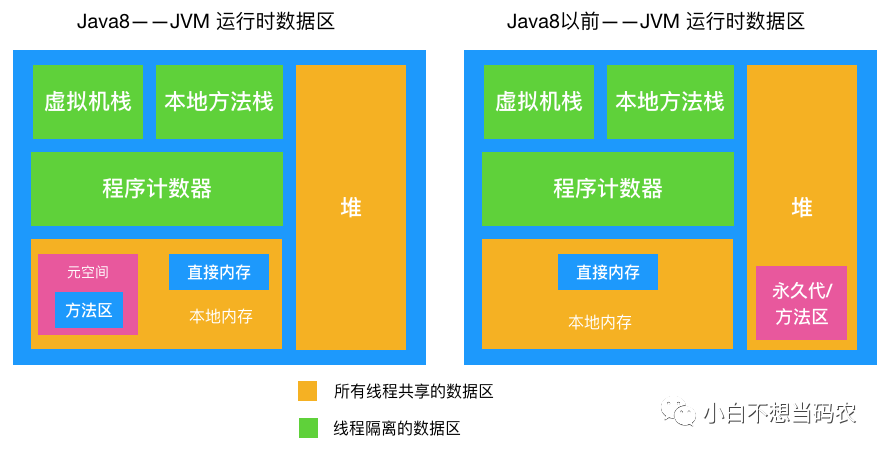
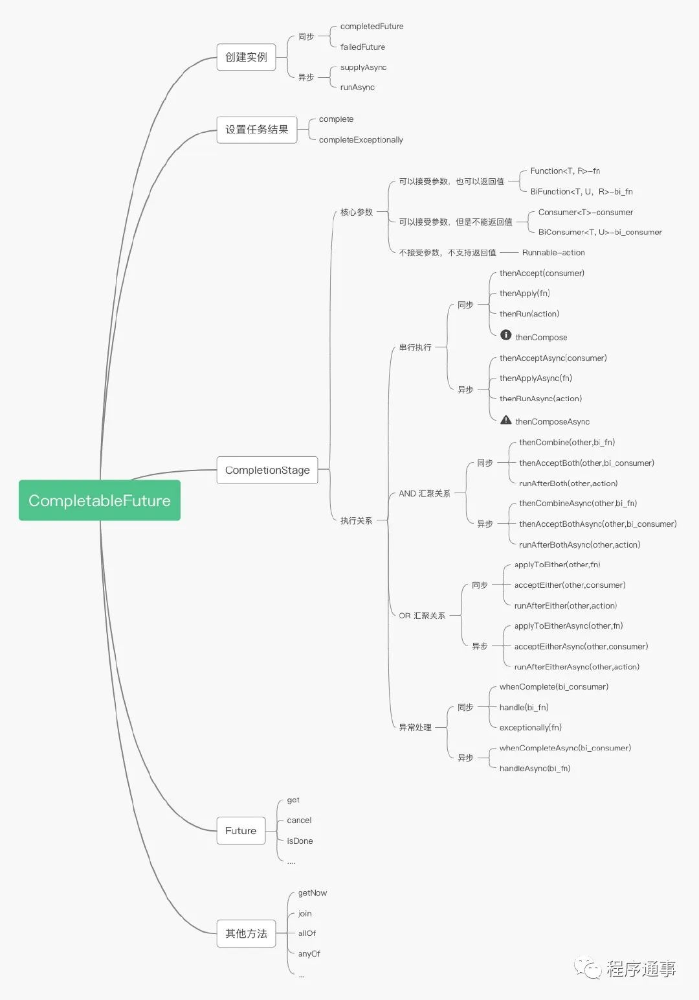
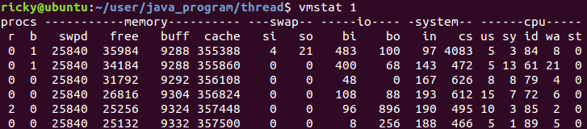
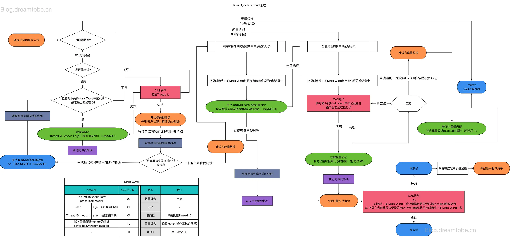

# 0 内存模型


还有 原数据区，直接内存，都是堆外内存。

  


# 1.Lock，tryLock，lockInterruptibly区别

https://blog.csdn.net/u013851082/article/details/70140223


# 2.Condition

见博客


# 3.Unsafe类

见博客


# 5..Fork/Join框架与窃取

见博客

# 6 ThreadLocal

见博客

# 7.线程的状态

1. new ：创建尚未启动的线程

2. 运行：包括了runing和ready状态

  3.无期限等待：需要其他线程唤醒。不会被分配时间片。无参数的object.await(),Thread.join()。LockSupport.part()方法。一个线程进入了锁，但是需要等待其他线程执行某些操作。时间不确定 当wait，join，park方法调用时，进入waiting状态。前提是这个线程已经拥有锁了

   4.期限等待：不会分配cpu执行时间，不需要其他线程显示唤醒。Thread.sleep()。设置了Timeout的object.await(),Thread.join()方法，LockSupport.parkNaos()、LockSupport.parkUntil()。一个线程进入了锁，但是需要等待其他线程执行某些操作。时间确定 通过sleep或wait timeout方法进入的限期等待的状态

  5.阻塞：争用排他锁synchornized。与等待的区别是等其他线程唤醒。

  6.结束。


# 8 thread类

1. 成员

**name**是表示Thread的名字，可以通过Thread类的构造器中的参数来指定线程名字，

**priority**表示线程的优先级（最大值为10，最小值为1，默认值为5），

**daemon**表示线程是否是守护线程

**target**表示要执行的任务。

2. 方法

   ### （1）start方法：start方法后，系统才会开启一个新的线程来执行用户定义的子任务，在这个过程中，会为相应的线程分配需要的资源

   ### （2）run方法：

   ### （3）sleep方法：进入阻塞状态，不会分cpu时间片，不会释放锁

   （4）**yield()方法**：和sleep()方法有点相似，使线程进入就绪状态，让出时间片，线程优先更高或等于。当前线程放弃CPU，但不会释放锁。**不同操作系统行为不一样，线程优先级也不确定**

   ###     (5) join方法：与 *wait（）\*和*notify（）方法一样*，*join（）*是另一种线程间同步机制。**如果引用的线程被中断，join()方法也可能返回**。在这种情况下，该方法抛出 *InterruptedException*

   public final void join(long millis,int nanos) throws InterruptedException
   最多等待 *millis* 毫秒加上 *nanos* 纳秒该线程死亡。

   除了等到终止之外，调用 *join（）*方法还具有同步效果。**join（）创建一个[before-before](https://docs.oracle.com/javase/specs/jls/se8/html/jls-17.html#jls-17.4.5)关系：这意味着当线程t1调用t2.join（）时，t2完成的所有更改在返回时在t1中可见**

​    （6）interrupt方法：单独调用interrupt方法可以使得处于阻塞状态的线程抛出一个异常，也就说，它可以用来中断一个正处于阻塞状态的线程；另外，通过interrupt方法和isInterrupted()方法来停止正在运行的线程。不能中断没有阻塞的线程，除非主动使用通过调用isInterrupted()判断中断标志是否被置位来，是否主动结束进程。


- 本线程中断自身是被允许的，且"中断标记"设置为true
- 其它线程调用本线程的interrupt()方法时，会通过checkAccess()检查权限。这有可能抛出SecurityException异常。
  - 若线程在阻塞状态时，调用了它的interrupt()方法，那么它的“中断状态”会被清除并且会收到一个InterruptedException异常。
    - 例如，线程通过wait()进入阻塞状态，此时通过interrupt()中断该线程；调用interrupt()会立即将线程的中断标记设为“true”，但是由于线程处于阻塞状态，所以该“中断标记”会立即被清除为“false”，同时，会产生一个InterruptedException的异常。
  - 如果线程被阻塞在一个Selector选择器中，那么通过interrupt()中断它时；线程的中断标记会被设置为true，并且它会立即从选择操作中返回。
  - 如果不属于前面所说的情况，那么通过interrupt()中断线程时，它的中断标记会被设置为“true”。

   （7）interrupted方法:判断的是当前线程是否处于中断状态。是类的静态方法，同时会清除线程的中断状态。

​     (8) isInterrupted()方法,判断调用线程是否处于中断状态,不会清除中断状态。 

  （9）stop方法：stop方法已经是一个废弃的方法，它是一个不安全的方法。因为调用stop方法会直接终止run方法的调用，并且会抛出一个ThreadDeath错误，如果线程持有某个对象锁的话，会完全释放锁，导致对象状态不一致

​    (10) destroy方法也是废弃的方法。基本不会被使用到。

​    (11)suspend()和resume()
suspend()方法在线程挂起时，并不释放对象锁，因此可能会导致死锁。resume该方法很功能很简单，就是恢复 因suspend()方法挂起的线程，使之重新能够获得CPU执行

```
SecurityException  if the current thread is not allowed taccess this threa
```

（12）public static native boolean holdsLock(Object obj);

# 9 停止一个线程

1.不安全的做法  stop 、suspend

2。 （1） 使用共享变量的方式，（2）中断、（3）使用Feature取消。（4）正常运行结束退出

# 10 乐观锁和悲观锁

**（1）乐观锁：**乐观锁(Optimistic Lock), 顾名思义，就是很乐观，每次去拿数据的时候都认为别人不会修改，所以不会上锁，但是在更新的时候会判断一下在此期间别人有没有去更新这个数据，可以使用版本号等机制。乐观锁适用于多读的应用类型，这样可以提高吞吐量，像数据库如果提供类似于write_condition机制的其实都是提供的乐观锁。自旋锁。

**（2）悲观锁：**对于并发间操作产生的线程安全问题持悲观状态，悲观锁认为竞争总是会发生，因此每次对某资源进行操作时，都会持有一个独占的锁，就像synchronized，不管三七二十一，直接上了锁就操作资源了。

# 11 实现线程的方式

第一种：继承Thread
第二种：实现Runnable接口，这种方式使用较多，面向接口编程一直是被推崇的开发原则。
第三种：实现Callable接口用来实现返回结果的线程

第四种； lambda表达式

# 12  怎么唤醒一个阻塞的线程？
1.如果线程是因为调用了wait()、sleep()或者join()方法而导致的阻塞，可以中断线程，并且通过抛出InterruptedException来唤醒它；

2.如果线程遇到了IO阻塞，无能为力，因为IO是操作系统实现的，Java代码并没有办法直接接触到操作系统。

# 13  volatile关键字的作用（必考）

https://cloud.tencent.com/developer/article/1446555

https://cloud.tencent.com/developer/article/1142546

"**volatile关键字只能修饰类变量和实例变量。方法参数、局部变量、实例常量以及类常量都是不能用volatile关键字进行修饰的**"。

volatile 提供 happens-before 的保证，确保一个线程的修改能对其他线程是可见的。某些情况下，volatile 还能提供原子性，如读 64 位数据类型，像 long 和 double 都不是原子的(低32位和高32位)，但 volatile 类型的 double 和 long 就是原子的.

1.保证此变量对所有的线程的可见性，当一个线程修改了这个变量的值，volatile 保证了新值能立即同步到主内存，其它线程每次使用前立即从主内存刷新
但普通变量做不到这点，普通变量的值在线程间传递均需要通过主内存来完成
2.禁止指令重排序。有volatile修饰的变量，赋值后多执行了一个“load addl $0x0, (%esp)”操作，这个操作相当于一个内存屏障（指令重排序时不能把后面的指令重排序到内存屏障之前的位置）
这些操作的目的是用线程中的局部变量维护对该域的精确同步。通过对OpenJDK中的unsafe.cpp源码的分析，会发现被volatile关键字修饰的变量会存在一个“lock:”的前缀。


这个实际上相当于是一个内存屏障，该内存屏障会为指令的执行提供如下保障：

确保指令重排序时不会将其后面的代码排到内存屏障之前。

同样也会确保重排序是不会将其前面的代码排到内存屏障之后。

确保在执行到内存屏障修饰的指令时前面的代码全部执行完成。

强制将线程的工作内存中值的修改刷新至主内存中。


**volatile写-读建立的happens before关系** ，volatile对线程的内存可见性的影响比volatile自身的特性更为重要，也更需要我们去关注。


volatile 的 happens-before 原则其实就是依赖的 StoreLoad 内存屏障


3.重排序

JMM为volatile定制的重排序规则


（1）当第一个操作是 volatile读时,不管第二个操作是什么,都不能重排序.确保volatile读之后的操作不会被重排序到 volatile读之前.

（2）当第二个操作是 volatile写时,不管第一个操作是什么,都不能重排序.确保volatile写之前的操作不会被重排序到volatile写之后.

（3）当第一个操作是 volatile写,第二个操作是 volatile读时,不能重排序.


#### volatile写内存屏障


`StoreStore屏障` 可以保证在volatile写之前，其前面的所有普通写操作已经对任
 意处理器可见了。

`StoreLoad屏障` 将 volatile写操作刷新到内存.

由此达到, volatile写 立马刷新到主内存的效果.

#### volatile读内存屏障


`LoadLoad屏障` 保障后续是读操作时, volatile读装载到内存数据.
 `LoadStore屏障` 保障后续是写操作时, volatile读装载到内存数据.


# 14 释放锁和不释放锁

1.释放锁：

（1）执行完同步代码块，就会释放锁。（synchronized）
（2）在执行同步代码块的过程中，遇到异常而导致线程终止，锁也会被释放。（exception）
（3）在执行同步代码块的过程中，执行了锁所属对象的wait()方法，这个线程会释放锁，进
    入对象的等待池。(wait)

 （4）Thread。stop

​    5）LOCK.lockInterruptibly可以使用interrupt

2.不会释放锁

（1）Thread.sleep()

  （2）Thread.yield()

 （3）Thread.suspend()

  # 15 **synchronized 的实现原理以及锁优化**(必考)


https://www.jianshu.com/p/e62fa839aa41

Java 虚拟机中的同步(Synchronization)基于进入和退出Monitor对象实现， 无论是显式同步(有明确的 monitorenter 和 monitorexit 指令,即同步代码块)还是隐式同步都是如此。在 Java 语言中，同步用的最多的地方可能是被 synchronized 修饰的同步方法。同步方法 并不是由 monitorenter 和 monitorexit 指令来实现同步的，而是由方法调用指令读取运行时常量池中方法表结构的 ACC_SYNCHRONIZED 标志来隐式实现的


# 16 指令重排序（必考）

# 17 happens-before（必考）  

在Java内存模型中，如果不存在happens-beforejvm可以随意排序。JSR-133S使用happens-before概念阐述了两个操作之间的内存可见性。在JMM中，如果一个操作的结果需要对另一个操作可见，那么这两个操作则存在happens-before关系。

那什么是happens-before呢？在JSR-133中，happens-before关系定义如下：

1. 如果一个操作happens-before另一个操作，那么意味着第一个操作的结果对第二个操作可见，而且第一个操作的执行顺序将排在第二个操作的前面。
2. 两个操作之间存在happens-before关系，并不意味着Java平台的具体实现必须按照happens-before关系指定的顺序来执行。如果重排序之后的结果，与按照happens-before关系来执行的结果一致，那么这种重排序并不非法（也就是说，JMM允许这种重排序）

java天然满足happens-before规则的情况：

1. 程序顺序规则：一个线程中的每一个操作，happens-before于该线程中的任意后续操作。
2. 监视器规则：对一个锁的解锁，happens-before于随后对这个锁的加锁。
3. volatile规则：对一个volatile变量的写，happens-before于任意后续对一个volatile变量的读。
4. 传递性：若果A happens-before B，B happens-before C，那么A happens-before C。
5. 线程启动规则：Thread对象的start()方法，happens-before于这个线程的任意后续操作。
6. 线程终止规则：线程中的任意操作，happens-before于该线程的终止监测。我们可以通过Thread.join()方法结束、Thread.isAlive()的返回值等手段检测到线程已经终止执行。
7. 线程中断操作：对线程interrupt()方法的调用，happens-before于被中断线程的代码检测到中断事件的发生，可以通过Thread.interrupted()方法检测到线程是否有中断发生。
8. 对象终结规则：一个对象的初始化完成，happens-before于这个对象的finalize()方法的开始。

扩展：

任何并发集合的写操作与该集合的后续访问或者删除操作存在happens-before关系；
线程中提交Runnable到Executor之前的代码与Runnable中的代码存在happens-before关系。对提交Callable到ExecutorService也一样；
一个Future代表的异步计算和另一个线程中Future.get()的后续操作存在happens-before关系；
释放同步方法（比如Lock.unlock，Semaphore.release和 CountDownLatch.countDown）之前的代码和随后的在相同对象上的获得方法（比如Lock.lock, Semaphore.acquire, Condition.await和 CountDownLatch.await）存在happens-before关系；
通过Exchanger成功交换对象的线程对，exchange()之前的代码和exchange()之后的代码存在happens-before关系；
调用CyclicBarrier.await和Phaser.awaitAdvance之前的代码和执行barrier操作存在happens-before关系；执行barrier操作和其他线程中对应await返回后的代码存在happens-before关系。


# 18  CompletableFuture

https://mp.weixin.qq.com/s/d_TzKlyxD0RoWb8-UPimSQ




# 19 什么是多线程上下文切换

多线程的上下文切换是指CPU控制权由一个已经正在运行的线程切换到另外一个就绪并等待获取CPU执行权的线程的过程。CPU通过时间片分配算法来循环执行任务，当前任务执行一个时间片后会切换到下一个任务。但是，**在切换前会保存上一个任务的状态，以便下次切换回这个任务时，可以再次加载这个任务的状**态。


**1 引起线程上下文切换的原因？**

对于我们经常使用的抢占式操作系统而言，引起线程上下文切换的原因大概有以下几种：

1. 当前执行任务的时间片用完之后，系统CPU正常调度下一个任务
2. 当前执行任务碰到IO阻塞，调度器将此任务挂起，继续下一任务
3. 多个任务抢占锁资源，当前任务没有抢到锁资源，被调度器挂起，继续下一任务
4. 用户代码挂起当前任务，让出CPU时间
5. 硬件中断

2.**上下文切换次数查看**

在Linux系统下可以使用vmstat命令来查看上下文切换的次数，下面是利用vmstat查看上下文切换次数的示例：



CS（Context Switch）表示上下文切换的次数，从图中可以看到，上下文每秒钟切换500~600次左右。

如果要查看上下文切换的时长，可以利用Lmbench3，这是一个性能分析工具。

3 **如何减少上下文切换**

既然上下文切换会导致额外的开销，因此减少上下文切换次数便可以提高多线程程序的运行效率。减少上下文切换的方法有无锁并发编程、CAS算法、使用最少线程和使用协程。

- **无锁并发编程**。多线程竞争时，会引起上下文切换，所以多线程处理数据时，可以用一些办法来避免使用锁，如将数据的ID按照Hash取模分段，不同的线程处理不同段的数据
- **CAS算法**。Java的Atomic包使用CAS算法来更新数据，而不需要加锁
- **使用最少线程**。避免创建不需要的线程，比如任务很少，但是创建了很多线程来处理，这样会造成大量线程都处于等待状态
- **协程**。在单线程里实现多任务的调度，并在单线程里维持多个任务间的切换

# 20 Java当中有哪几种锁

- 自旋锁: 自旋锁在JDK1.6之后就默认开启了。基于之前的观察，共享数据的锁定状态只会持续很短的时间，为了这一小段时间而去挂起和恢复线程有点浪费，所以这里就做了一个处理，让后面请求锁的那个线程在稍等一会，但是不放弃处理器的执行时间，看看持有锁的线程能否快速释放。为了让线程等待，所以需要让线程执行一个忙循环也就是自旋操作。在jdk6之后，引入了自适应的自旋锁，也就是等待的时间不再固定了，而是由上一次在同一个锁上的自旋时间及锁的拥有者状态来决定
- 偏向锁: 在JDK1.之后引入的一项锁优化，目的是消除数据在无竞争情况下的同步原语。进一步提升程序的运行性能。 偏向锁就是偏心的偏，意思是这个锁会偏向第一个获得他的线程，如果接下来的执行过程中，改锁没有被其他线程获取，则持有偏向锁的线程将永远不需要再进行同步。偏向锁可以提高带有同步但无竞争的程序性能，也就是说他并不一定总是对程序运行有利，如果程序中大多数的锁都是被多个不同的线程访问，那偏向模式就是多余的，在具体问题具体分析的前提下，可以考虑是否使用偏向锁。
- 轻量级锁: 为了减少获得锁和释放锁所带来的性能消耗，引入了“偏向锁”和“轻量级锁”，所以在Java SE1.6里锁一共有四种状态，无锁状态，偏向锁状态，轻量级锁状态和重量级锁状态，它会随着竞争情况逐渐升级。锁可以升级但不能降级，意味着偏向锁升级成轻量级锁后不能降级成偏向锁

# 21 提交任务时，线程池队列已满


如果你使用的LinkedBlockingQueue，也就是×××队列的话，没关系，继续添加任务到阻塞队列中等待执行，因为LinkedBlockingQueue可以近乎认为是一个无穷大的队列，可以无限存放任务；如果你使用的是有界队列比方说ArrayBlockingQueue的话，任务首先会被添加到ArrayBlockingQueue中，ArrayBlockingQueue满了，则会使用拒绝策略RejectedExecutionHandler处理满了的任务，默认是AbortPolicy。

# 22 CyclicBarrier和CountDownLatch区别


# 23 atomic包

atomic包里面一共提供了13个类，分为4种类型，分别是：原子更新基本类型，原子更新数组，原子更新引用，原子更新属性，这13个类都是使用Unsafe实现的包装类。

- 标量类：AtomicBoolean，AtomicInteger，AtomicLong，AtomicReference
- 数组类：AtomicIntegerArray，AtomicLongArray，AtomicReferenceArray
- 更新器类：AtomicLongFieldUpdater，AtomicIntegerFieldUpdater，AtomicReferenceFieldUpdater
- 复合变量类：AtomicMarkableReference，AtomicStampedReference

**1.原子更新基本类型**

addAndGet(int delta) ：以原子方式将输入的数值与实例中原本的值相加，并返回最后的结果；

incrementAndGet() ：以原子的方式将实例中的原值进行加1操作，并返回最终相加后的结果；

getAndSet(int newValue)：将实例中的值更新为新值，并返回旧值；

getAndIncrement()：以原子的方式将实例中的原值加1，返回的是自增前的旧值；

**2.原子更新数组类型**

`int base = unsafe.arrayBaseOffset(int[].class);`
Unsafe类的**arraBaseOffset**方法：返回指定类型数组的第一个元素地址相对于数组起始地址的偏移值。

`int scale = unsafe.arrayIndexScale(int[].class);`
Unsafe类的**arrayIndexScale**方法：返回指定类型数组的元素所占用的字节数。比如int[]数组中的每个int元素占用4个字节，就返回4。

那么，通过`base + i * sacle` 其实就可以知道 索引**i**的元素在数组中的内存起始地址。
但是，观察**AtomicIntegerArray**的**byteOffset**方法，是通过`i << shift + base` 的公式计算元素的起始地址的：


地址的：

这里，

其实就等于**scale**。

`shift = 31 - Integer.numberOfLeadingZeros(scale)`，`Integer.numberOfLeadingZeros(scale)`是将**scale**转换为2进制，然后从左往右数连续0的个数。

读者可以自己计算下：
`shift = 31 - Integer.numberOfLeadingZeros(4) = 31 - 29 =2`

之所以要这么绕一圈，其实是处于性能的考虑，通过移位计算乘法的效率往往更高。

**3.AtomicReference AtomicStampedReference AtomicMarkableReference**

**4.LongAdder，LongAccumulator DoubleAdder和DoubleAccumulator**

https://segmentfault.com/a/1190000015865714?utm_source=tag-newest

**AtomicLong**是利用了底层的CAS操作来提供并发性的，比如**addAndGet**方法。在并发量较低的环境下，线程冲突的概率比较小，自旋的次数不会很多。但是，高并发环境下，N个线程同时进行自旋操作，会出现大量失败并不断自旋的情况，此时**AtomicLong**的自旋会成为瓶颈。

**AtomicLong**中有个内部变量**value**保存着实际的long值，所有的操作都是针对该变量进行。也就是说，高并发环境下，value变量其实是一个热点，也就是N个线程竞争一个热点。

**LongAdder**的基本思路就是***分散热点\***，将value值分散到一个数组中，不同线程会命中到数组的不同槽中，各个线程只对自己槽中的那个值进行CAS操作，这样热点就被分散了，冲突的概率就小很多。如果要获取真正的long值，只要将各个槽中的变量值累加返回。

但是**AtomicLong**提供的功能其实更丰富，尤其是**addAndGet**、**decrementAndGet**、**compareAndSet**这些方法。

**addAndGet**、**decrementAndGet**除了单纯的做自增自减外，还可以立即获取增减后的值，而**LongAdder**则需要做同步控制才能精确获取增减后的值。如果业务需求需要精确的控制计数，做计数比较，**AtomicLong**也更合适。


比如有三个ThreadA、ThreadB、ThreadC，每个线程对value增加10。


对于**AtomicLong**，最终结果的计算始终是下面这个形式：

但是对于**LongAdder**来说，内部有一个`base`变量，一个`Cell[]`数组。
`base`变量：非竞态条件下，直接累加到该变量上
`Cell[]`数组：竞态条件下，累加个各个线程自己的槽`Cell[i]`中
最终结果的计算是下面这个形式：


# 24 locks包


# 25 Lock接口.

实现类主要有reentrantLock. WriteLock，WriteLockView


# 26 LockSupport

https://www.iteye.com/blog/agapple-970055


LockSupport定义了一组以park开头的方法用来阻塞当前线程，以及unpark(Thread)方法来唤醒一个被阻塞的线程，这些方法描述如下：

```java
// 返回提供给最近一次尚未解除阻塞的 park 方法调用的 blocker 对象，如果该调用不受阻塞，则返回 null。
static Object getBlocker(Thread t)
// 为了线程调度，禁用当前线程，除非许可可用。
static void park()
// 为了线程调度，在许可可用之前禁用当前线程。
static void park(Object blocker)
// 为了线程调度禁用当前线程，最多等待指定的等待时间，除非许可可用。
static void parkNanos(long nanos)
// 为了线程调度，在许可可用前禁用当前线程，并最多等待指定的等待时间。
static void parkNanos(Object blocker, long nanos)
// 为了线程调度，在指定的时限前禁用当前线程，除非许可可用。
static void parkUntil(long deadline)
// 为了线程调度，在指定的时限前禁用当前线程，除非许可可用。
static void parkUntil(Object blocker, long deadline)
// 如果给定线程的许可尚不可用，则使其可用。
static void unpark(Thread thread)
```

# 27 AbstractOwnableSynchronizer

该类为创建可能涉及所有权概念的锁和相关同步器提供了基础。`AbstractOwnableSynchronizer`类本身不管理或使用此信息。但是，子类和工具可以使用适当维护的值来帮助控制和监视访问并提供诊断。

```java
private transient Thread exclusiveOwnerThread;

protected final void setExclusiveOwnerThread(Thread thread) {
    exclusiveOwnerThread = thread;
}
protected final Thread getExclusiveOwnerThread() {
    return exclusiveOwnerThread;
}
```

# 28 AbstractQueuedLongSynchronizer

```
this class may be useful when creating synchronizers such as multilevel locks and barriers that require 64 bits of state.
```

# 29 AbstractQueuedSynchronizer（AQS必考）

见博客

# 30  ReentrantLock（必考）

https://blog.csdn.net/fuyuwei2015/article/details/83719444

见博客

# 31 ReadWriteLock

https://www.jianshu.com/p/4a624281235e

见博客

# 32 StampedLock

见博客

# 33 CountDownLatch

见博客

# 34 CyclicBarrier

见博客


# 35 Semaphore

见博客


# 36 Exchanger  

可用于两个线程之间交换信息。可简单地将Exchanger对象理解为一个包含两个格子的容器，通过exchanger方法可以向两个格子中填充信息。当两个格子中的均被填充时，该对象会自动将两个格子的信息交换，然后返回给线程，从而实现两个线程的信息交换，**Exchanger类仅可用作两个线程的信息交换，当超过两个线程调用同一个exchanger对象时，得到的结果是随机的**，**exchanger对象仅关心其包含的两个“格子”是否已被填充数据，当两个格子都填充数据完成时（调用exchange方法），该对象就认为线程之间已经配对成功，然后开始执行数据交换操作**


# 37 Phaser

https://www.jianshu.com/p/a9a713cba61a

  1）两个计数器：分别表示parties个数和当前phase。register和deregister会触发parties变更（CAS），全部parties到达（arrive）会触发phase变更。

  2）一个主要的阻塞队列：非AQS实现，对于arriveAndWait的线程，会被添加到队列中并被park阻塞，知道当前phase中最后一个party到达后触发唤醒。


# 40 线程池体系

见博客


# 41 自旋锁、排队自旋锁、MCS锁、CLH锁

https://blog.csdn.net/fei33423/article/details/30316377

# 42 ForkJoinPool

见博客


# 43 wait() & notify()

Object 类中的 wait&notify 这两个方法，其实包括他们的重载方法一共有 5 个，而 Object 类中一共才 12 个方法，可见这 2 个方法的重要性。

我们先看看 JDK 中的定义：


```java
public final native void notify();
```

其中有 3 个方法是 native 的，也就是由虚拟机本地的 c 代码执行的。

> ps:  native 即 JNI,Java Native Interface,
>
> Java平台提供的用户和本地C代码进行互操作的API

有 2 个 wait 重载方法最终还是调用了 wait（long）方法。

wait方法

> wait是要释放对象锁，进入等待池。
>  既然是释放对象锁，那么肯定是先要获得锁。
>  所以wait必须要写在synchronized代码块中，否则会报异常。

notify方法

> 也需要写在synchronized代码块中,
>  调用对象的这两个方法也需要先获得该对象的锁.
>  notify,notifyAll, 唤醒等待该对象同步锁的线程,并放入该对象的锁池中.
>  对象的锁池中线程可以去竞争得到对象锁,然后开始执行.
>  ​
>  如果是通过notify来唤起的线程,
>  那进入wait的线程会被随机唤醒;
>  (注意: 实际上, hotspot是顺序唤醒的!! 这是个重点! 有疑惑的点击传送[大佬问我: notify()是随机唤醒线程么?](https://www.jianshu.com/p/99f73827c616)

)


> 如果是通过notifyAll唤起的线程,
>  默认情况是最后进入的会先被唤起来,即LIFO的策略;

比较重要的是:

**notify()或者notifyAll()调用时并不会真正释放对象锁, 必须等到synchronized方法或者语法块执行完才真正释放锁.**

举个例子:


```csharp
public void test()
{
    Object object = new Object();
    synchronized (object){
        object.notifyAll();
        while (true){
        }
    }
}
```

如上, 虽然调用了notifyAll, 但是紧接着进入了一个死循环。

这会导致一直不能出临界区, 一直不能释放对象锁。

所以，即使它把所有在等待池中的线程都唤醒放到了对象的锁池中，

但是锁池中的所有线程都不会运行，因为他们始终拿不到锁。

## 案例分析

为了说明wait() 和notify()方法的功能,

我们举个例子


```csharp
public class WaitNotifyCase {

public static void main(String[] args) {
  final Object lock = new Object();

  new Thread(new Runnable() {
      @Override
      public void run() {
          System.out.println("线程 A 等待 获得 锁");
          synchronized (lock) {
              try {
                  System.out.println("线程 A 获得 锁");
                  TimeUnit.SECONDS.sleep(1);
                  System.out.println("线程 A 开始 执行 wait() ");
                  lock.wait();
                  System.out.println("线程 A 结束 执行 wait()");
              } catch (InterruptedException e) {
                  e.printStackTrace();
              }
          }
      }
  }).start();

  new Thread(new Runnable() {
      @Override
      public void run() {
          System.out.println("线程 B 等待 获得 锁");
          synchronized (lock) {
              System.out.println("线程 B 获得 锁");
              try {
                  TimeUnit.SECONDS.sleep(5);
              } catch (InterruptedException e) {
                  e.printStackTrace();
              }
              lock.notify();
              System.out.println("线程 B 执行 notify()");
          }
      }
  }).start();
}
}
```

执行结果：


```bash
线程 A 等待 获得 锁
线程 A 获得 锁

线程 B 等待 获得 锁

线程 A 开始 执行 wait()

线程 B 获得 锁
线程 B 执行 notify()

线程 A 结束 执行 wait()
```

使用时切记：**必须由同一个lock对象调用wait、notify方法**

- 当线程A执行wait方法时，该线程会被挂起；
- 当线程B执行notify方法时，会唤醒一个被挂起的线程A；

**lock对象、线程A和线程B三者是一种什么关系？**

根据上面的案例，可以想象一个场景：

- lock对象维护了一个等待队列list；
- 线程A中执行lock的wait方法，把线程A保存到list中；
- 线程B中执行lock的notify方法，从等待队列中取出线程A继续执行；

## 几个疑问

#### 问题一: 为何wait&notify必须要加synchronized锁?

从实现上来说，这个synchronized锁至关重要!

正因为这把锁，才能让整个wait/notify运转起来.

当然我觉得其实通过其他的方式也可以实现类似的机制,

不过hotspot至少是完全依赖这把锁来实现wait/notify的.


```cpp
static void Sort(int [] array) {
    // synchronize this operation so that some other thread can't
    // manipulate the array while we are sorting it. This assumes that other
    // threads also synchronize their accesses to the array.
    synchronized(array) {
        // now sort elements in array
    }
}
```

synchronized代码块通过javap生成的字节码中包含monitorenter 和 monitorexit 指令

如下图所示：


image

执行monitorenter指令可以获取对象的monitor，

而lock.wait()方法通过调用native方法wait(0)实现，其中接口注释中有这么一句：

> The current thread must own this object's monitor.

表示线程执行 lock.wait() 方法时，必须持有该lock对象的monitor.

#### 问题二: 为什么wait方法可能抛出InterruptedException异常?

这个异常大家应该都知道，当我们调用了某个线程的interrupt方法时，对应的线程会抛出这个异常;

wait方法也不希望破坏这种规则，

因此就算当前线程因为wait一直在阻塞，当某个线程希望它起来继续执行的时候，它还是得从阻塞态恢复过来;

而wait方法被唤醒起来的时候会去检测这个状态，当有线程interrupt了，它就会抛出这个异常从阻塞状态恢复过来。

这里有两点要注意：

1. 如果被interrupt的线程只是创建了，并没有start，那等他start之后进入wait态之后也是不能会恢复的；
2. 如果被interrupt的线程已经start了，在进入wait之前，如果有线程调用了其interrupt方法，那这个wait等于什么都没做，会直接跳出来，不会阻塞；

#### 问题三: notify执行之后立马唤醒线程吗?

其实hotspot里真正的实现是: 退出同步块的时候才会去真正唤醒对应的线程; 不过这个也是个默认策略，也可以改的，在notify之后立马唤醒相关线程。

#### 问题四: notifyAll是怎么实现全唤起所有线程?

或许大家立马就能想到一个for循环就搞定了，不过在JVM里没实现这么简单，而是借助了monitorexit.

上面提到了当某个线程从wait状态恢复出来的时候，要先获取锁，然后再退出同步块;

所以notifyAll的实现是调用notify的线程在退出其同步块的时候唤醒起最后一个进入wait状态的线程;

然后这个线程退出同步块的时候继续唤醒其倒数第二个进入wait状态的线程，依次类推.

同样这这是一个策略的问题，JVM里提供了挨个直接唤醒线程的参数，不过很少使用, 这里就不提了。

#### 问题五: wait的线程是否会影响性能?

这是个大家比较关心的话题.

wait/nofity 是通过JVM里的 park/unpark 机制来实现的，在Linux下这种机制又是通过pthread_cond_wait/pthread_cond_signal 来实现的;

因此当线程进入到wait状态的时候其实是会放弃cpu的，也就是说这类线程是不会占用cpu资源。


# 101并发良好的实践?

- 给线程命名
- 最小化同步范围
- 优先使用volatile
- 尽可能使用更高层次的并发工具而非wait和notify()来实现线程通信,如BlockingQueue,Semeaphore
- 优先使用并发容器而非同步容器.
- 考虑使用线程池
- 不使用Executors
- 不使用Timer
- ThreadLocal 清空


# 102如何合理配置线程池大小
首先，需要考虑到线程池所进行的工作的性质：IO密集型？CPU密集型？
简单的分析来看，如果是CPU密集型的任务，我们应该设置数目较小的线程数，比如CPU数目加1。如果是IO密集型的任务，则应该设置可能多的线程数，由于IO操作不占用CPU，所以，不能让CPU闲下来。当然，如果线程数目太多，那么线程切换所带来的开销又会对系统的响应时间带来影响。
在《linux多线程服务器端编程》中有一个思路，CPU计算和IO的阻抗匹配原则。如果线程池中的线程在执行任务时，密集计算所占的时间比重为P(0 下面验证一下边界条件的正确性：

假设C = 8，P = 1.0，线程池的任务完全是密集计算，那么T = 8。只要8个活动线程就能让8个CPU饱和，再多也没用了，因为CPU资源已经耗光了。
假设C = 8，P = 0.5，线程池的任务有一半是计算，有一半在等IO上，那么T = 16.考虑操作系统能灵活，合理调度sleeping/writing/running线程，那么大概16个“50%繁忙的线程”能让8个CPU忙个不停。启动更多的线程并不能提高吞吐量，反而因为增加上下文切换的开销而降低性能。


如果P < 0.2，这个公式就不适用了，T可以取一个固定值，比如 5*C。另外公式里的C不一定是CPU总数，可以是“分配给这项任务的CPU数目”，比如在8核机器上分出4个核来做一项任务，那么C=4
文章如何合理设置线程池大小里面提到了一个公式：
最佳线程数目 = （（线程等待时间+线程CPU时间）/线程CPU时间 ）* CPU数目


比如平均每个线程CPU运行时间为0.5s，而线程等待时间（非CPU运行时间，比如IO）为1.5s，CPU核心数为8，那么根据上面这个公式估算得到：((0.5+1.5)/0.5)*8=32。这个公式进一步转化为：

最佳线程数目 = （线程等待时间与线程CPU时间之比 + 1）* CPU数目
可以得出一个结论：
线程等待时间所占比例越高，需要越多线程。线程CPU时间所占比例越高，需要越少线程。
以上公式与之前的CPU和IO密集型任务设置线程数基本吻合。


# 103 线程池8大参数 ?

```java

```

## 拒绝策略

```java


    

    
    
```


```java

    
```


**线程池按以下行为执行任务：**
（1）当线程数小于核心线程数时，创建线程。
（2）当线程数大于等于核心线程数，且任务队列未满时，将任务放入任务队列。
（3）当线程数大于等于核心线程数，且任务队列已满
     若线程数小于最大线程数，创建线程
     若线程数等于最大线程数，抛出异常，拒绝任务


# 104 使用ScheduledExecutorService代替Timer

1、管理并发任务的缺陷

timer有且仅有一个线程去执行定时任务，如果存在多个任务，且任务时间过长，会导致执行效果与预期不符。

2、当任务抛出异常时的缺陷

如果TimerTask抛出RuntimeException,Timer会停止所有任务的运行

3、不能满足对时效性要求较高的多任务并发作业，Timer背后只有一个线程串行的执行任务调度

4、不能满足对复杂任务的调度

5 Timer 是基于绝对时间的，对系统时间比较敏感，而 ScheduledThreadPoolExecutor 则是基于相对时间；

Timer 是内部是单一线程，而 ScheduledThreadPoolExecutor 内部是个线程池，所以可以支持多个任务并发执行。

6 。Timer 运行多个 TimeTask 时，只要其中之一没有捕获抛出的异常，其它任务便会自动终止运行，使用 ScheduledExecutorService 则没有这个问题。

使用 ScheduledExecutorService 更容易明确任务实际执行策略，更方便自行控制。

7。 默认 Timer 执行线程不是 daemon 线程, 任务执行完，主线程（或其他启动定时器的线程）结束时，task 线程并没有结束。需要注意潜在内存泄漏问题。

# 105 线程优先级

1-10，默认为5

# 106 Executors弊端

Executors返回的线程池对象的弊端如下：

​    1）FixedThreadPool 和 SingleThreadPool：

​      允许的请求队列长度为Integer.MAX_VALUE，可能会堆积大量的请求，从而导致OOM。

​    2）CachedThreadPool 和 ScheduledThreadPool :

​     允许创建的线程数量为Integer.MAX_VALUE，可能会创建大量的线程，从而导致OOM。

 # 107 ReentrantLock 保证可见性？

http://ifeve.com/java%E9%94%81%E6%98%AF%E5%A6%82%E4%BD%95%E4%BF%9D%E8%AF%81%E6%95%B0%E6%8D%AE%E5%8F%AF%E8%A7%81%E6%80%A7%E7%9A%84/

# 108 CyclicBarrier与CountDownLatch的区别
至此我们难免会将CyclicBarrier与CountDownLatch进行一番比较。这两个类都可以实现一组线程在到达某个条件之前进行等待，它们内部都有一个计数器，当计数器的值不断的减为0的时候所有阻塞的线程将会被唤醒。

有区别的是CyclicBarrier的计数器由自己控制，而CountDownLatch的计数器则由使用者来控制，在CyclicBarrier中线程调用await方法不仅会将自己阻塞还会将计数器减1，而在CountDownLatch中线程调用await方法只是将自己阻塞而不会减少计数器的值。

另外，CountDownLatch只能拦截一轮，而CyclicBarrier可以实现循环拦截。一般来说用CyclicBarrier可以实现CountDownLatch的功能，而反之则不能，例如上面的赛马程序就只能使用CyclicBarrier来实现。总之，这两个类的异同点大致如此，至于何时使用CyclicBarrier，何时使用CountDownLatch，还需要读者自己去拿捏。

除此之外，CyclicBarrier还提供了：resert()、getNumberWaiting()、isBroken()等比较有用的方法。

# 109 Thread.sleep()和Object.wait()的区别

（1）Thread.sleep()不会释放占有的锁，Object.wait()会释放占有的锁；

（2）Thread.sleep()必须传入时间，Object.wait()可传可不传，不传表示一直阻塞下去；

（3）Thread.sleep()到时间了会自动唤醒，然后继续执行；

（4）Object.wait()不带时间的，需要另一个线程使用Object.notify()唤醒；

（5）Object.wait()带时间的，假如没有被notify，到时间了会自动唤醒，这时又分好两种情况，一是立即获取到了锁，线程自然会继续执行；二是没有立即获取锁，线程进入同步队列等待获取锁；

其实，他们俩最大的区别就是Thread.sleep()不会释放锁资源，Object.wait()会释放锁资源。

# 110 Thread.sleep()和Condition.await()的区别


这个题目的回答思路跟Object.wait()是基本一致的，不同的是Condition.await()底层是调用LockSupport.park()来实现阻塞当前线程的。

实际上，它在阻塞当前线程之前还干了两件事，一是把当前线程添加到条件队列中，二是“完全”释放锁，也就是让state状态变量变为0，然后才是调用LockSupport.park()阻塞当前线程，可以参考之前彤哥写的《死磕 java同步系列之ReentrantLock源码解析（二）——条件锁》这篇文章。

看到这里，今天开篇提的那个问题是不是就有答案了呢【本文由公从号“彤哥读源码”原创】？

# 111 Thread.sleep()和LockSupport.park()的区别


LockSupport.park()还有几个兄弟方法——parkNanos()、parkUtil()等，我们这里说的park()方法统称这一类方法。

（1）从功能上来说，Thread.sleep()和LockSupport.park()方法类似，都是阻塞当前线程的执行，且**都不会释放当前线程占有的锁资源**；

（2）Thread.sleep()没法从外部唤醒，只能自己醒过来；

（3）LockSupport.park()方法可以被另一个线程调用LockSupport.unpark()方法唤醒；

（4）Thread.sleep()方法声明上抛出了InterruptedException中断异常，所以调用者需要捕获这个异常或者再抛出；

（5）LockSupport.park()方法不需要捕获中断异常；

（6）Thread.sleep()本身就是一个native方法；

（7）LockSupport.park()底层是调用的Unsafe的native方法；

#  112 Object.wait()和LockSupport.park()的区别


二者都会阻塞当前线程的运行，他们有什么区别呢？经过上面的分析相信你一定很清楚了，真的吗？往下看！

（1）Object.wait()方法需要在synchronized块中执行；

（2）LockSupport.park()可以在任意地方执行；

（3）Object.wait()方法声明抛出了中断异常，调用者需要捕获或者再抛出；

（4）LockSupport.park()不需要捕获中断异常【本文由公从号“彤哥读源码”原创】；

（5）Object.wait()不带超时的，需要另一个线程执行notify()来唤醒，但不一定继续执行后续内容；

（6）LockSupport.park()不带超时的，需要另一个线程执行unpark()来唤醒，一定会继续执行后续内容；

（7）**如果在wait()之前执行了notify()会怎样？抛出IllegalMonitorStateException异常**；

（8）**如果在park()之前执行了unpark()会怎样？线程不会被阻塞，直接跳过park()，继续执行后续内容；**


# 113 CAS同时具有Volatile读写的语义？

JAVA实现CAS的原理：

compareAndSwapInt是借助C来调用CPU底层指令实现的。下面从分析比较常用的CPU（intel x86）来解释CAS的实现原理。下面是sun.misc.Unsafe类的compareAndSwapInt()方法的源代码：

```c++
public final native boolean compareAndSwapInt(Object o, long offset,
                                               int expected, int x);
再看下在JDK中依次调用的C++代码为：

#define LOCK_IF_MP(mp) __asm cmp mp, 0  \
                       __asm je L0      \
                       __asm _emit 0xF0 \
                       __asm L0:

inline jint     Atomic::cmpxchg    (jint     exchange_value, volatile jint*     dest, jint     compare_value) {
  // alternative for InterlockedCompareExchange
  int mp = os::is_MP();
  __asm {
    mov edx, dest
    mov ecx, exchange_value
    mov eax, compare_value
    LOCK_IF_MP(mp)
    cmpxchg dword ptr [edx], ecx
  }
}
```


如上面源代码所示，**程序会根据当前处理器的类型来决定是否为cmpxchg指令添加lock前缀。如果程序是在多处理器上运行，就为cmpxchg指令加上lock前缀（lock cmpxchg）**。反之，如果程序是在单处理器上运行，就省略lock前缀（单处理器自身会维护单处理器内的顺序一致性，不需要lock前缀提供的内存屏障效果）。

# 114 concurrent包的实现?


由于java的CAS同时具有 volatile 读和volatile写的内存语义，因此Java线程之间的通信现在有了下面四种方式：

1. A线程写volatile变量，随后B线程读这个volatile变量。
2. A线程写volatile变量，随后B线程用CAS更新这个volatile变量。
3. A线程用CAS更新一个volatile变量，随后B线程用CAS更新这个volatile变量。
4. A线程用CAS更新一个volatile变量，随后B线程读这个volatile变量。

Java的CAS会使用现代处理器上提供的高效机器级别原子指令，这些原子指令以原子方式对内存执行读-改-写操作，这是在多处理器中实现同步的关键（从本质上来说，能够支持原子性读-改-写指令的计算机器，是顺序计算图灵机的异步等价机器，因此任何现代的多处理器都会去支持某种能对内存执行原子性读-改-写操作的原子指令）。同时，volatile变量的读/写和CAS可以实现线程之间的通信。把这些特性整合在一起，就形成了整个concurrent包得以实现的基石。如果我们仔细分析concurrent包的源代码实现，会发现一个通用化的实现模式：

1. 首先，声明共享变量为volatile；
2. 然后，使用CAS的原子条件更新来实现线程之间的同步；
3. 同时，配合以volatile的读/写和CAS所具有的volatile读和写的内存语义来实现线程之间的通信

# 115 final重排序规则

为何引入final重排序？为了是final域成为同步一种手段。final修饰的字段与不能幸免于对象溢出。

1. `在构造方法内对一个final字段的写入，与随后把这个被构造对象的引用赋值给一个引用变量，这两个操作之间不能重排序。`
2. `初次读一个包含final字段对象的引用，与随后初次读这个final字段，这两个操作不能重排序。`

# 116 安全的发布对象

1. 使用volatile或原子引用
2. 静态初始化初始化一个对象引用
3. 正确构造的final域中
4. 将对象引用保存在一个锁保护的域中。

# 117 动态线程池


## 1 整体设计

动态化线程池的核心设计包括以下三个方面：

1. 简化线程池配置：线程池构造参数有8个，但是最核心的是3个：corePoolSize、maximumPoolSize，workQueue，它们最大程度地决定了线程池的任务分配和线程分配策略。考虑到在实际应用中我们获取并发性的场景主要是两种：（1）并行执行子任务，提高响应速度。这种情况下，应该使用同步队列，没有什么任务应该被缓存下来，而是应该立即执行。（2）并行执行大批次任务，提升吞吐量。这种情况下，应该使用有界队列，使用队列去缓冲大批量的任务，队列容量必须声明，防止任务无限制堆积。所以线程池只需要提供这三个关键参数的配置，并且提供两种队列的选择，就可以满足绝大多数的业务需求，Less is More。
2. 参数可动态修改：为了解决参数不好配，修改参数成本高等问题。在Java线程池留有高扩展性的基础上，封装线程池，允许线程池监听同步外部的消息，根据消息进行修改配置。将线程池的配置放置在平台侧，允许开发同学简单的查看、修改线程池配置。
3. 增加线程池监控：对某事物缺乏状态的观测，就对其改进无从下手。在线程池执行任务的生命周期添加监控能力，帮助开发同学了解线程池状态。


图17 动态化线程池整体设计


## 2 功能架构


动态化线程池提供如下功能：

**动态调参**：支持线程池参数动态调整、界面化操作；包括修改线程池核心大小、最大核心大小、队列长度等；参数修改后及时生效。 **任务监控**：支持应用粒度、线程池粒度、任务粒度的Transaction监控；可以看到线程池的任务执行情况、最大任务执行时间、平均任务执行时间、95/99线等。 **负载告警**：线程池队列任务积压到一定值的时候会通过大象（美团内部通讯工具）告知应用开发负责人；当线程池负载数达到一定阈值的时候会通过大象告知应用开发负责人。 **操作监控**：创建/修改和删除线程池都会通知到应用的开发负责人。 **操作日志**：可以查看线程池参数的修改记录，谁在什么时候修改了线程池参数、修改前的参数值是什么。 **权限校验**：只有应用开发负责人才能够修改应用的线程池参数。


图18 动态化线程池功能架构


**参数动态化**

JDK原生线程池ThreadPoolExecutor提供了如下几个public的setter方法，如下图所示：


图19 JDK 线程池参数设置接口


JDK允许线程池使用方通过ThreadPoolExecutor的实例来动态设置线程池的核心策略，以**setCorePoolSize为方法例，在运行期线程池使用方调用此方法设置corePoolSize之后，线程池会直接覆盖原来的corePoolSize值，并且基于当前值和原始值的比较结果采取不同的处理策略。对于当前值小于当前工作线程数的情况，说明有多余的worker线程，此时会向当前idle的worker线程发起中断请求以实现回收**，多余的worker在下次idel的时候也会被回收；对于当前值大于原始值且当前队列中有待执行任务，则线程池会创建新的worker线程来执行队列任务，setCorePoolSize具体流程如下：


图20 setCorePoolSize方法执行流程


线程池内部会处理好当前状态做到平滑修改，其他几个方法限于篇幅，这里不一一介绍。重点是基于这几个public方法，我们只需要维护ThreadPoolExecutor的实例，并且在需要修改的时候拿到实例修改其参数即可。基于以上的思路，我们实现了线程池参数的动态化、线程池参数在管理平台可配置可修改，其效果图如下图所示：


图21 可动态修改线程池参数


用户可以在管理平台上通过线程池的名字找到指定的线程池，然后对其参数进行修改，保存后会实时生效。目前支持的动态参数包括核心数、最大值、队列长度等。除此之外，在界面中，我们还能看到用户可以配置是否开启告警、队列等待任务告警阈值、活跃度告警等等。关于监控和告警，我们下面一节会对齐进行介绍。

**线程池监控**

除了参数动态化之外，为了更好地使用线程池，我们需要对线程池的运行状况有感知，比如当前线程池的负载是怎么样的？分配的资源够不够用？任务的执行情况是怎么样的？是长任务还是短任务？基于对这些问题的思考，动态化线程池提供了多个维度的监控和告警能力，包括：线程池活跃度、任务的执行Transaction（频率、耗时）、Reject异常、线程池内部统计信息等等，既能帮助用户从多个维度分析线程池的使用情况，又能在出现问题第一时间通知到用户，从而避免故障或加速故障恢复。

#### 1. 负载监控和告警

线程池负载关注的核心问题是：基于当前线程池参数分配的资源够不够。对于这个问题，我们可以从事前和事中两个角度来看。事前，线程池定义了“活跃度”这个概念，来让用户在发生Reject异常之前能够感知线程池负载问题，线程池活跃度计算公式为：线程池活跃度 = activeCount/maximumPoolSize。这个公式代表当活跃线程数趋向于maximumPoolSize的时候，代表线程负载趋高。事中，也可以从两方面来看线程池的过载判定条件，一个是发生了Reject异常，一个是队列中有等待任务（支持定制阈值）。以上两种情况发生了都会触发告警，告警信息会通过大象推送给服务所关联的负责人。


图22 大象告警通知


#### 2. 任务级精细化监控

在传统的线程池应用场景中，线程池中的任务执行情况对于用户来说是透明的。比如在一个具体的业务场景中，业务开发申请了一个线程池同时用于执行两种任务，一个是发消息任务、一个是发短信任务，这两类任务实际执行的频率和时长对于用户来说没有一个直观的感受，很可能这两类任务不适合共享一个线程池，但是由于用户无法感知，因此也无从优化。动态化线程池内部实现了任务级别的埋点，且允许为不同的业务任务指定具有业务含义的名称，线程池内部基于这个名称做Transaction打点，基于这个功能，用户可以看到线程池内部任务级别的执行情况，且区分业务，任务监控示意图如下图所示：


图23 线程池任务执行监控


#### 3. 运行时状态实时查看

用户基于JDK原生线程池ThreadPoolExecutor提供的几个public的getter方法，可以读取到当前线程池的运行状态以及参数，如下图所示：


图24 线程池实时运行情况


动态化线程池基于这几个接口封装了运行时状态实时查看的功能，用户基于这个功能可以了解线程池的实时状态，比如当前有多少个工作线程，执行了多少个任务，队列中等待的任务数等等。效果如下图所示：


# 118 ThreadLocal泄漏？线程池里的线程用ThreadLocal

每个Thread线程内部都有一个Map。
 Map里面存储线程本地对象（key）和线程的变量副本（value）
 但是，Thread内部的Map是由ThreadLocal维护的，由ThreadLocal负责向map获取和设置线程的变量值。
 所以对于不同的线程，每次获取副本值时，别的线程并不能获取到当前线程的副本值，形成了副本的隔离，互不干扰。

 Entry继承自WeakReference（弱引用，生命周期只能存活到下次GC前），但只有Key是弱引用类型的，Value并非弱引用。（问题马上就来了） 

缺陷:可能会引起内存泄漏;ThreadLocalMap中key维护着一个weakReference,它在下次GC之前会被清理,如果Value仍然保持着外部的强引用,该ThreadLocal没有再进行set,get或者remove操作,时间长了就可能导致OutOfMemoryError 

**如何避免泄漏:**

1、使用完线程共享变量后，显示调用ThreadLocalMap.remove方法清除线程共享变量；
 既然Key是弱引用，那么我们要做的事，就是在调用ThreadLocal的get()、set()方法时完成后再调用remove方法，将Entry节点和Map的引用关系移除，这样整个Entry对象在GC Roots分析后就变成不可达了，下次GC的时候就可以被回收。

2、JDK建议ThreadLocal定义为private static（只有一个实例不会反复创建对象），这样ThreadLocal的弱引用问题则不存在了。


# 120   sleep、wait、yield、join区别

1.sleep 方法是属于 Thread 类中的，sleep 过程中线程不会释放锁，只会阻塞线程，让出cpu给其他线程，但是他的监控状态依然保持着，当指定的时间到了又会自动恢复运行状态，可中断，sleep 给其他线程运行机会时不考虑线程的优先级，因此会给低优先级的线程以运行的机

2 wait 方法是属于 Object 类中的，wait 过程中线程会释放对象锁，只有当其他线程调用 notify 才能唤醒此线程。wait 使用时必须先获取对象锁，即必须在 synchronized 修饰的代码块中使用，那么相应的 notify 方法同样必须在 synchronized 修饰的代码块中使用，如果没有在synchronized 修饰的代码块中使用时运行时会抛出IllegalMonitorStateException的异常

3 yield暂停当前正在执行的线程对象，不会释放资源锁，和 sleep 不同的是 **yield方法并不会让线程进入阻塞状态，而是让线程重回就绪状态，它只需要等待重新获取CPU执行时间**，所以执行yield()的线程有可能在进入到可执行状态后马上又被执行。还有一点和 sleep 不同的是 **yield 方法只能使同优先级或更高优先级的线程有执行的机会**

4.join  等待调用join方法的线程结束之后，程序再继续执行，一般用于***\*等待异步线程执行完结果之后才能继续运行的场景\****。例如：主线程创建并启动了子线程，如果子线程中药进行大量耗时运算计算某个数据值，而主线程要取得这个数据值才能运行，这时就要用到 join 方法了 


# 121  [Java对象的内存分配过程是如何保证线程安全的？](https://www.cnblogs.com/wyf0518/p/11461944.html) 

一般有两种解决方案：

- 1、对分配内存空间的动作做同步处理，采用CAS机制，配合失败重试的方式保证更新操作的线程安全性。
- 2、每个线程在Java堆中预先分配一小块内存，然后再给对象分配内存的时候，直接在自己这块"私有"内存中分配，当这部分区域用完之后，再分配新的"私有"内存。

方案1在每次分配时都需要进行同步控制，这种是比较低效的。

方案2是**HotSpot虚拟机中采用的，这种方案被称之为TLAB分配**，即Thread Local Allocation Buffer。这部分Buffer是从堆中划分出来的，但是是本地线程独享的。

这里值得注意的是，我们说TLAB时线程独享的，但是只是在“分配”这个动作上是线程独占的，至于在读取、垃圾回收等动作上都是线程共享的。而且在使用上也没有什么区别。

另外，**TLAB仅作用于新生代的Eden Space，对象被创建的时候首先放到这个区域，但是新生代分配不了内存的大对象会直接进入老年代。因此在编写Java程序时，通常多个小的对象比大的对象分配起来更加高效**。

所以，虽然对象刚开始可能通过TLAB分配内存，存放在Eden区，但是还是会被垃圾回收或者被移到Survivor Space、Old Gen等。

不知道大家有没有想过，我们使用了TLAB之后，在TLAB上给对象分配内存时线程独享的了，这就没有冲突了，但是，TLAB这块内存自身从堆中划分出来的过程也可能存在内存安全问题啊。

所以，**在对于TLAB的分配过程，还是需要进行同步控制的。但是这种开销相比于每次为单个对象划分内存时候对进行同步控制的要低的多**。

虚拟机是否使用TLAB是可以选择的，可以通过设置-XX:+/-UseTLAB参数来指定。


可以通过设置-XX:+/-UseTLAB参数来指定是否开启TLAB分配 


# 122 栈上分配对象

### **栈上分配**

在JVM中，堆是线程共享的，因此堆上的对象对于各个线程都是共享和可见的，只要持有对象的引用，就可以访问堆中存储的对象数据。虚拟机的垃圾收集系统可以回收堆中不再使用的对象，但对于垃圾收集器来说，无论筛选可回收对象，还是回收和整理内存都需要耗费时间。

如果确定一个对象的作用域不会逃逸出方法之外，那可以将这个对象分配在栈上，这样，对象所占用的内存空间就可以随栈帧出栈而销毁。在一般应用中，不会逃逸的局部对象所占的比例很大，如果能使用栈上分配，那大量的对象就会随着方法的结束而自动销毁了，无须通过垃圾收集器回收，可以减小垃圾收集器的负载。

JVM允许将线程私有的对象打散分配在栈上，而不是分配在堆上。分配在栈上的好处是可以在函数调用结束后自行销毁，而不需要垃圾回收器的介入，从而提高系统性能。 
**栈上分配的技术基础：** 
**一是逃逸分析：**逃逸分析的目的是判断对象的作用域是否有可能逃逸出函数体。关于逃逸分析的问题可以看我另一篇文章：

**二是标量替换：**允许将对象打散分配在栈上，比如若一个对象拥有两个字段，会将这两个字段视作局部变量进行分配。

只能在server模式下才能启用逃逸分析，参数-XX:DoEscapeAnalysis启用逃逸分析，参数-XX:+EliminateAllocations开启标量替换（默认打开）。Java SE 6u23版本之后，HotSpot中默认就开启了逃逸分析，可以通过选项-XX:+PrintEscapeAnalysis查看逃逸分析的筛选结果。

### **TLAB**

TLAB的全称是Thread Local Allocation Buffer，即线程本地分配缓存区，这是一个线程专用的内存分配区域。 
由于对象一般会分配在堆上，而堆是全局共享的。因此在同一时间，可能会有多个线程在堆上申请空间。因此，每次对象分配都必须要进行同步（虚拟机采用CAS配上失败重试的方式保证更新操作的原子性），而在竞争激烈的场合分配的效率又会进一步下降。

1 JVM使用TLAB来避免多线程冲突，在给对象分配内存时，每个线程使用自己的TLAB，这样可以避免线程同步，提高了对象分配的效率。 
2 TLAB本身占用eEden区空间，在开启TLAB的情况下，虚拟机会为**每个Java线程分配一块TLAB空间**。参数-XX:+UseTLAB开启TLAB，默认是开启的。

3 TLAB空间的内存非常小，缺省情况下仅占有整个Eden空间的1%，当然可以通过选项-XX:TLABWasteTargetPercent设置TLAB空间所占用Eden空间的百分比大小。 

4 由于TLAB空间一般不会很大，因此大对象无法在TLAB上进行分配，总是会直接分配在堆上。TLAB空间由于比较小，因此很容易装满。比如，一个100K的空间，已经使用了80KB，当需要再分配一个30KB的对象时，肯定就无能为力了。这时虚拟机会有两种选择，**第一，废弃当前TLAB**，这样就会浪费20KB空间；第二，**将这30KB的对象直接分配在堆上，保留当前的TLAB**，这样可以希望将来有小于20KB的对象分配请求可以直接使用这块空间。实际上虚拟机内部会**维护一个叫作refill_waste的值，当请求对象大于refill_waste时，会选择在堆中分配，若小于该值，则会废弃当前TLAB，新建TLAB来分配对象。这个阈值可以使用TLABRefillWasteFraction来调整，它表示TLAB中允许产生这种浪费的比例。默认值为64，即表示使用约为1/64的TLAB空间作为refill_waste。默认情况下，TLAB和refill_waste都会在运行时不断调整的，使系统的运行状态达到最优**。如果想要禁用自动调整TLAB的大小，可以使用-XX:-ResizeTLAB禁用ResizeTLAB，并使用-XX:TLABSize手工指定一个TLAB的大小。 
-XX:+PrintTLAB可以跟踪TLAB的使用情况。一般不建议手工修改TLAB相关参数，推荐使用虚拟机默认行为。

### **对象内存分配的两种方法**

为对象分配空间的任务等同于把一块确定大小的内存从Java堆中划分出来。

**指针碰撞**(Serial、ParNew等带Compact过程的收集器) 
假设Java堆中内存是绝对规整的，所有用过的内存都放在一边，空闲的内存放在另一边，中间放着一个指针作为分界点的指示器，那所分配内存就仅仅是把那个指针向空闲空间那边挪动一段与对象大小相等的距离，这种分配方式称为“指针碰撞”（Bump the Pointer）。 
**空闲列表**(CMS这种基于Mark-Sweep算法的收集器) 
如果Java堆中的内存并不是规整的，已使用的内存和空闲的内存相互交错，那就没有办法简单地进行指针碰撞了，虚拟机就必须维护一个列表，记录上哪些内存块是可用的，在分配的时候从列表中找到一块足够大的空间划分给对象实例，并更新列表上的记录，这种分配方式称为“空闲列表”（Free List）。 
  

### **总结**

**总体流程** 


**对象分配流程** 
 
如果开启栈上分配，JVM会先进行栈上分配，如果没有开启栈上分配或则不符合条件的则会进行TLAB分配，如果TLAB分配不成功，再尝试在eden区分配，如果对象满足了直接进入老年代的条件，那就直接分配在老年代。

**对象在内存的引用方式** 


**对象在内存中的结构** 


# 123 锁升级过程

### 1. 重量级锁

monitor 监视器锁本质上是依赖操作系统的 Mutex Lock 互斥量 来实现的，我们一般称之为重量级锁。因为 OS 实现线程间的切换需要从用户态转换到核心态，这个转换过程成本较高，耗时相对较长，因此 synchronized 效率会比较低。

### 2. 轻量级锁

轻量级锁，其性能提升的依据是`对于绝大部分的锁，在整个生命周期内都是不会存在竞争的`，如果没有竞争，轻量级锁就可以使用 CAS 操作避免互斥量的开销，从而提升效率。
 如果打破这个依据则除了互斥的开销外，还有额外的CAS操作，因此在有多线程竞争的情况下，轻量级锁比重量级锁更慢。

- 轻量级锁的加锁过程： 

  1. 线程在进入到同步代码块的时候，JVM 会先在当前线程的栈帧中建立一个名为锁记录（Lock Record）的空间，用于存储锁对象当前 Mark Word 的拷贝（官方称为 Displaced Mark Word），owner 指针指向对象的 Mark Word。此时堆栈与对象头的状态如图所示：

     

     image.png

  2. JVM 使用 CAS 操作尝试将对象头中的 Mark Word 更新为指向 Lock Record 的指针。如果更新成功，则执行步骤3；更新失败，则执行步骤4

  3. 如果更新成功，那么这个线程就拥有了该对象的锁，对象的 Mark Word 的锁状态为轻量级锁（标志位转变为'00'）。此时线程堆栈与对象头的状态如图所示：

     

     轻量级锁

  4. 如果更新失败，JVM 首先检查对象的 Mark Word 是否指向当前线程的栈帧
      如果是，就说明当前线程已经拥有了该对象的锁，那就可以直接进入同步代码块继续执行
      如果不是，就说明这个锁对象已经被其他的线程抢占了，当前线程会尝试自旋一定次数来获取锁。如果自旋一定次数 CAS 操作仍没有成功，那么轻量级锁就要升级为重量级锁（锁的标志位转变为'10'），Mark Word 中存储的就是指向重量级锁的指针，后面等待锁的线程也就进入阻塞状态

- 轻量级锁的解锁过程： 
  1. 通过 CAS 操作用线程中复制的 Displaced Mark Word 中的数据替换对象当前的 Mark Word
  2. 如果替换成功，整个同步过程就完成了
  3. 如果替换失败，说明有其他线程尝试过获取该锁，那就在释放锁的同时，唤醒被挂起的线程

### 3. 偏向锁

依据：`对于绝大部分锁，在整个同步周期内不仅不存在竞争，而且总由同一线程多次获得。`
 在一些情况下总是同一线程多次获得锁，此时第二次再重新做CAS修改对象头中的Mark Word这样的操作，有些多余。所以就有了偏向锁，只需要检查是否为偏向锁、锁标识为以及ThreadID即可，只要是同一线程就不再修改对象头。其目的为了在无多线程竞争的情况下尽量减少不必要的轻量级锁执行路径。

- 偏向锁枷锁过程：
  1. 检测Mark Word是否为可偏向状态，即是否为偏向锁1，锁标识位为01；
  2. 若为可偏向状态，则测试线程ID是否为当前线程ID，如果是，则执行步骤（5），否则执行步骤（3）；
  3. 如果线程ID不为当前线程ID，则通过CAS操作竞争锁，竞争成功，则将Mark Word的线程ID替换为当前线程ID，否则执行线程（4）；
  4. 通过CAS竞争锁失败，证明当前存在多线程竞争情况，当到达全局安全点，获得偏向锁的线程被挂起，偏向锁升级为轻量级锁，然后被阻塞在安全点的线程继续往下执行同步代码块；
  5. 执行同步代码块
- 偏向锁释放过程：
  1. 当一个线程已经持有偏向锁，而另外一个线程尝试竞争偏向锁时，CAS 替换 ThreadID 操作失败，则开始撤销偏向锁。偏向锁的撤销，需要等待原持有偏向锁的线程到达全局安全点（在这个时间点上没有字节码正在执行），暂停该线程，并检查其状态
  2. 如果原持有偏向锁的线程不处于活动状态或已退出同步代码块，则该线程释放锁。将对象头设置为无锁状态（锁标志位为'01'，是否偏向标志位为'0'）
  3. 如果原持有偏向锁的线程未退出同步代码块，则升级为轻量级锁（锁标志位为'00'）

## 其他优化

- 自旋锁：
   互斥同步时，挂起和恢复线程都需要切换到内核态完成，这对性能并发带来了不少的压力。同时在许多应用上，共享数据的锁定状态只会持续很短的一段时间，为了这段较短的时间而去挂起和恢复线程并不值得。那么如果有多个线程同时并行执行，可以让后面请求锁的线程通过自旋（CPU忙循环执行空指令）的方式稍等一会儿，看看持有锁的线程是否会很快的释放锁，这样就不需要放弃 CPU 的执行时间了。
- 适应性自旋：
   自旋时如果锁被占用的时间比较短，那么自旋等待的效果就会比较好，而如果锁占用的时间很长，自旋的线程则会白白浪费 CPU 资源。解决这个问题的最简答的办法就是：指定自旋的次数，如果在限定次数内还没获取到锁（例如10次），就按传统的方式挂起线程进入阻塞状态。
   JDK1.6 之后引入了自适应性自旋的方式，如果在同一锁对象上，一线程自旋等待刚刚成功获得锁，并且持有锁的线程正在运行中，那么 JVM 会认为这次自旋也有可能再次成功获得锁，进而允许自旋等待相对更长的时间（例如100次）。另一方面，如果某个锁自旋很少成功获得，那么以后要获得这个锁时将省略自旋过程，以避免浪费 CPU。
- 锁消除
   虚拟机即时编译器(JIT)运行时，依据逃逸分析的数据检测到不可能存在竞争的锁，就自动将该锁消除)。锁消除的依据是逃逸分析的数据支持。
   如果判断一段代码中，堆上的数据不会逃逸出去从而被其他线程访问到，则可以把他们当做栈上的数据对待，认为它们是线程私有的，不必要加锁。
   如下所示，在 StringBuffer.append() 方法中有一个同步代码块，锁就是sb对象，但 sb 的所有引用不会逃逸到 concatString() 方法外部，其他线程无法访问它。因此这里有锁，但是在即时编译之后，会被安全的消除掉，忽略掉同步而直接执行了。

- 锁粗化
   锁粗化就是 JVM 检测到一串零碎的操作都对同一个对象加锁，则会把加锁同步的范围粗化到整个操作序列的外部。
   以上述 concatString() 方法为例，内部的 StringBuffer.append() 每次都会加锁，将会锁粗化，在第一次 append() 前至 最后一个 append() 后只需要加一次锁就可以了





# 125 线程与进程的区别

 1调度

2 并发

3 拥有资源

4系统开销


- 进程是资源的分配和调度的一个独立单元，而线程是CPU调度的基本单元
- 同一个进程中可以包括多个线程，并且线程共享整个进程的资源（寄存器、堆栈、上下文），一个进行至少包括一个线程。
- 进程的创建调用fork或者vfork，而线程的创建调用pthread_create，进程结束后它拥有的所有线程都将销毁，而线程的结束不会影响同个进程中的其他线程的结束
- 线程是轻量级的进程，它的创建和销毁所需要的时间比进程小很多，所有操作系统中的执行功能都是创建线程去完成的
- 线程中执行时一般都要进行同步和互斥，因为他们共享同一进程的所有资源
- 线程有自己的私有属性TCB，线程id，寄存器、硬件上下文，而进程也有自己的私有属性进程控制块PCB，这些私有属性是不被共享的，用来标示一个进程或一个线程的标志
- 进程是具有一定独立功能的程序关于某个数据集合上的一次运行活动
- 线程是进程的一个实体, 是CPU调度和分派的基本单位,它是比进程更小的能独立运行的基本单位.线程自己基本上不拥有系统资源,只拥有一点在运行中必不可少的资源(如程序计数器,一组寄存器和栈),但是它可与同属一个进程的其他的线程共享进程所拥有的全部资源
- 一个线程可以创建和撤销另一个线程，同一个进程中的多个线程之间可以并发执行

进程和线程的主要差别在于它们是不同的操作系统资源管理方式。进程有独立的地址空间，一个进程崩溃后，在保护模式下不会对其它进程产生影响，而线程只是一个进程中的不同执行路径。线程有自己的堆栈和局部变量，但线程之间没有单独的地址空间，一个线程死掉就等于整个进程死掉，所以多进程的程序要比多线程的程序 健壮，但在进程切换时，耗费资源较大，效率要差一些。但对于一些要求同时进行并且又要共享某些变量的并发操作，只能用线程，不能用进程。


# 126 线程池以及调优

见博客


# 128  给定一个进程，有多个线程，其中一个线程出现OOM异常，判断所有线程的状态 

# 129、原子类实现

# 130、volatile实现原理 


# 131死锁的四个条件？

1互斥使用，即当资源被一个线程使用(占有)时，别的线程不能使用

2 不可强行抢占，资源请求者不能强制从资源占有者手中夺取资源，资源只能由资源占用者，主动释放。

3 请求和保持，即当资源的请求者在请求其他的资源的同时保持对原有资源的占有

4 循环等待，即存在一个等待队列: P1占有P2的资源，P2占有P3的资源，P3占有P1的资源。


# 132、什么是多线程中的上下文切换 

# 133、死锁与活锁的区别，死锁与饥饿的区别 

 **死锁**：是指两个或两个以上的进程（或线程）在执行过程中，因争夺资源而造成的一种互相等待的现象，若无外力作用，它们都将无法推进下去。此时称系统处于死锁状态或系统产生了死锁，这些永远在互相等待的进程称为死锁进程。
死锁发生的四个条件
1、互斥条件：线程对资源的访问是排他性的，如果一个线程对占用了某资源，那么其他线程必须处于等待状态，直到资源被释放。
2、请求和保持条件：线程T1至少已经保持了一个资源R1占用,但又提出对另一个资源R2请求，而此时，资源R2被其他线程T2占用，于是该线程T1也必须等待，但又对自己保持的资源R1不释放。
3、不剥夺条件：线程已获得的资源，在未使用完之前，不能被其他线程剥夺，只能在使用完以后由自己释放。
4、环路等待条件：在死锁发生时，必然存在一个“进程-资源环形链”，即：{p0,p1,p2,...pn},进程p0（或线程）等待p1占用的资源，p1等待p2占用的资源，pn等待p0占用的资源。（最直观的理解是，p0等待p1占用的资源，而p1而在等待p0占用的资源，于是两个进程就相互等待）

**活锁**：是指线程1可以使用资源，但它很礼貌，让其他线程先使用资源，线程2也可以使用资源，但它很绅士，也让其他线程先使用资源。这样你让我，我让你，最后两个线程都无法使用资源。

关于“死锁与活锁”的比喻：
死锁：迎面开来的汽车A和汽车B过马路，汽车A得到了半条路的资源（满足死锁发生条件1：资源访问是排他性的，我占了路你就不能上来，除非你爬我头上去），汽车B占了汽车A的另外半条路的资源，A想过去必须请求另一半被B占用的道路（死锁发生条件2：必须整条车身的空间才能开过去，我已经占了一半，尼玛另一半的路被B占用了），B若想过去也必须等待A让路，A是辆兰博基尼，B是开奇瑞QQ的屌丝，A素质比较低开窗对B狂骂：快给老子让开，B很生气，你妈逼的，老子就不让（死锁发生条件3：在未使用完资源前，不能被其他线程剥夺），于是两者相互僵持一个都走不了（死锁发生条件4：环路等待条件），而且导致整条道上的后续车辆也走不了。
例如：马路中间有条小桥，只能容纳一辆车经过，桥两头开来两辆车A和B，A比较礼貌，示意B先过，B也比较礼貌，示意A先过，结果两人一直谦让谁也过不去。

**饥饿：**是指如果线程T1占用了资源R，线程T2又请求封锁R，于是T2等待。T3也请求资源R，当T1释放了R上的封锁后，系统首先批准了T3的请求，T2仍然等待。然后T4又请求封锁R，当T3释放了R上的封锁之后，系统又批准了T4的请求......，T2可能永远等待。

关于”饥饿“的比喻：
在“首堵”北京的某一天，天气阴沉，空气中充斥着雾霾和地沟油的味道，某个苦逼的临时工交警正在处理塞车，有两条道A和B上都堵满了车辆，其中A道堵的时间最长，B相对相对堵的时间较短，这时，前面道路已疏通，交警按照最佳分配原则，示意B道上车辆先过，B道路上过了一辆又一辆，A道上排队时间最长的确没法通过，只能等B道上没有车辆通过的时候再等交警发指令让A道依次通过，这也就是ReentrantLock显示锁里提供的不公平锁机制（当然了，ReentrantLock也提供了公平锁的机制，由用户根据具体的使用场景而决定到底使用哪种锁策略），不公平锁能够提高吞吐量但不可避免的会造成某些线程的饥饿。 

# 134JMM模型是什么

  https://zhuanlan.zhihu.com/p/258393139 

#  13 5、Java中用到的线程调度[算法]()是什么 


抢占式。一个线程用完CPU之后，操作系统会根据线程优先级、线程饥饿情况等数据算出一个总的优先级并分配下一个时间片给某个线程执行。

操作系统中可能会出现某条线程常常获取到VPU控制权的情况，为了让某些优先级比较低的线程也能获取到CPU控制权，可以使用Thread.sleep(0)手动触发一次操作系统分配时间片的操作，这也是平衡CPU控制权的一种操作。

抢占式调度：
抢占式调度指的是每条线程执行的时间、线程的切换都由系统控制，系统控制指的是在系统某种
运行机制下，可能每条线程都分同样的执行时间片，也可能是某些线程执行的时间片较长，甚至
某些线程得不到执行的时间片。在这种机制下，一个线程的堵塞不会导致整个进程堵塞。

协同式调度：
协同式调度指某一线程执行完后主动通知系统切换到另一线程上执行，这种模式就像接力赛一样，
一个人跑完自己的路程就把接力棒交接给下一个人，下个人继续往下跑。线程的执行时间由线程
本身控制，线程切换可以预知，不存在多线程同步问题，但它有一个致命弱点：如果一个线程编
写有问题，运行到一半就一直堵塞，那么可能导致整个系统崩溃。


**JVM 的线程调度实现（抢占式调度）**
java 使用的线程调使用抢占式调度，Java 中线程会按优先级分配 CPU 时间片运行，且优先级越高
越优先执行，但优先级高并不代表能独自占用执行时间片，可能是优先级高得到越多的执行时间
片，反之，优先级低的分到的执行时间少但不会分配不到执行时间。

线程让出 cpu 的情况：
\1.  当前运行线程主动放弃 CPU，JVM 暂时放弃 CPU 操作（基于时间片轮转调度的 JVM 操作系
统不会让线程永久放弃 CPU，或者说放弃本次时间片的执行权），例如调用 yield()方法。
\2.  当前运行线程因为某些原因进入阻塞状态，例如阻塞在 I/O 上。
\3.  当前运行线程结束，即运行完 run()方法里面的任务。

# 13 6、什么是线程组，为什么在Java中不推荐使用


- 线程组ThreadGroup对象中的stop，resume，suspend会导致安全问题，主要是死锁问题，已经被官方废弃，多以价值已经大不如以前。
- 线程组ThreadGroup不是线程安全的，在使用过程中不能及时获取安全的信息。

来自


# 137 什么状态下的线程可以中断

## 1. 线程中断的方法

| 方法名                              | 描述                             |
| ----------------------------------- | -------------------------------- |
| public boolean isInterrupted()      | 返回是否中断，不做其他事情       |
| public void interrupt()             | 设置中断标志位                   |
| public static boolean interrupted() | 返回中断标志位，并清除中断标志位 |

## 2. Java线程不同状态下中断机制的效果

| 状态          | 中断效果                                     | 描述                                                       |
| ------------- | -------------------------------------------- | ---------------------------------------------------------- |
| NEW           | 无                                           |                                                            |
| RUNNABLE      | 设置中断标志位                               | 用户自己判断是否中断，以及如何处理，调用的方法能否相应异常 |
| BLOCKED       | 设置中断标志位                               | 用户自己判断是否中断，以及如何处理 调用的方法能否相应异常  |
| WAITING       | 抛InterruptedException异常，并清空中断标志位 |                                                            |
| TIMED_WAITING | 抛InterruptedException异常，并清空中断标志位 |                                                            |
| TERMINATED    | 无                                           |                                                            |

 Object.wait, Thread.join和Thread.sleep 会抛出异常。


一些的方法的拥塞是不能响应中断请求的，这类操作以I/O操作居多，但是可以让其抛出类似的异常，来停止任务：

Socket I/O: 关闭底层socket，所有因执行读写操作而拥塞的线程会抛出SocketException；

同步 I/O：大部分Channel都实现了InterruptiableChannel接口，**可以响应中断请求，抛出异常ClosedByInterruptException**;

Selector的异步 I/O：Selector执行select方法之后，再执行close和wakeUp方法就会抛出异常ClosedSelectorException

## 3 可中断阻塞与不可中断阻塞

 https://blog.csdn.net/johnf_nash/article/details/81104863 


1 对于处于sleep，join等操作的线程，如果被调用interrupt()后，会抛出InterruptedException，然后线程的中断标志位会由true重置为false，因为线程为了处理异常已经重新处于就绪状态。

2 不可中断的操作，包括获取锁（进入synchronized段）以及Lock.lock()，Java.io 包中的同步 I/O，Java.io 包中的同步 Socket IO （对套接字进行读取和写入的操作：InputStream 和 OutputStream 中的read和write等），Java.nio包中的Selector的异步I/O 等。调用interrupt()对于这几个问题无效，因为它们都不抛出中断异常。如果拿不到资源，它们会无限期阻塞下去。

3 对于Lock.lock()，可以改用Lock.lockInterruptibly()，可被中断的加锁操作，它可以抛出中断异常。等同于等待时间无限长的Lock.tryLock(long time, TimeUnit unit)。

4 对于inputStream等资源，有些(**实现了interruptibleChannel接口)可以通过close()方法将资源关闭，对应的阻塞也会被放开**。

5使用Java1.0之前就存在的传统的I/O，Thread.interrupt()将不起作用，因为线程将不会退出被阻塞状态。

6 很幸运，对于 Socket 同步 I/O，Java平台为这种情形提供了一项解决方案，即调用阻塞该线程的套接字的close()方法。在这种情形下，如果**线程被I/O操作阻塞，当调用该套接字的close方法时，该线程在调用accept地方法将接收到一个SocketException（SocketException为IOException的子异常）异常**，这与使用interrupt()方法引起一个InterruptedException异常被抛出非常相似。

7 **java.nio类库提供了更加人性化的I/O中断，被阻塞的nio通道会自动地响应中断**，不需要关闭底层资源；

对于非标准的取消操作，我们可以一些方法来对它进行封装（如通过改写interrupt方法来将它封装在 Thread 中，通过 newTaskFor 等）。


# 138 Thread.sleep实现原理

sleep()：进程、线程或任务(Linux中不区分进程与线程，都称为task)可以sleep，这会导致它们暂停执行一段时间，直到等待的时间结束才恢复执行或在这段时间内被中断。
sleep()在OS中的实现的大概流程：

- 挂起进程（或线程）并修改其运行状态
- 用sleep()提供的参数来设置一个定时器。
- 当时间结束，定时器会触发，内核收到中断后修改进程（或线程）的运行状态。例如线程会被标志为就绪而进入就绪队列等待调度。

可变定时器(variable timer)一般在硬件层面是通过一个固定的时钟和计数器来实现的，每经过一个时钟周期将计数器递减，当计数器的值为0时产生中断。内核注册一个定时器后可以在一段时间后收到中断


# 139 协程与纤程


# 141 实现阻塞队列（必考）

# 

# 143 将一个任务拆分成多个

# 144  生产者与消费者模型


一段苹果的广告语，致疯狂的人 

      他们特立独行。他们桀骜不驯。他们惹是生非。他们格格不入。他们用与众不同的眼光看待事物。他们不喜欢墨守成规。他们也不愿安于现状。你可以认同他们，反对他们，颂扬或是诋毁他们。但唯独不能漠视他们。因为他们改变了寻常事物。他们推动人类向前迈进。或许他们是别人眼里的疯子，但他们却是我们眼中的天才。因为只有那些疯狂到以为自己能够改变世界的人，才能真正改变世界。


