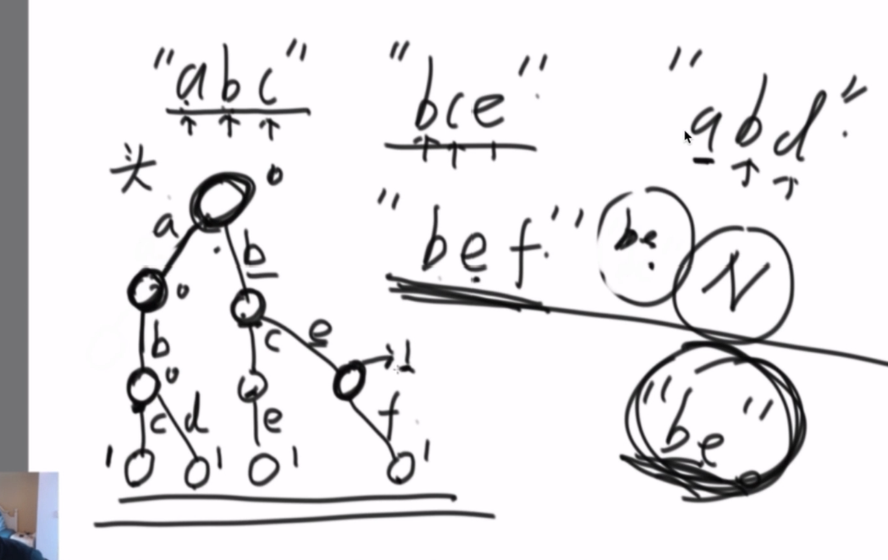

# 一 . 二叉树

# 1 [226. 翻转二叉树](https://leetcode-cn.com/problems/invert-binary-tree/)

翻转一棵二叉树。

示例：

输入：

​    4

   /   \
  2     7
 / \   / \
1   3 6   9
输出：

​    4

   /   \
  7     2
 / \   / \
9   6 3   1


```java
/**
 * Definition for a binary tree node.
 * public class TreeNode {
 *     int val;
 *     TreeNode left;
 *     TreeNode right;
 *     TreeNode(int x) { val = x; }
 * }
 */
class Solution {
    public TreeNode invertTree(TreeNode root) {

     if(root ==null){
        return root;
     }

     TreeNode temp = root.left;
     root.left = root.right;
     root.right = temp;
     
     invertTree(root.left);
     invertTree(root.right);


     return root;

    }
}
```


# 2 [437. 路径总和 III](https://leetcode-cn.com/problems/path-sum-iii/)

给定一个二叉树，它的每个结点都存放着一个整数值。

找出路径和等于给定数值的路径总数。

路径不需要从根节点开始，也不需要在叶子节点结束，但是路径方向必须是向下的（只能从父节点到子节点）。

二叉树不超过1000个节点，且节点数值范围是 [-1000000,1000000] 的整数。

示例：

root = [10,5,-3,3,2,null,11,3,-2,null,1], sum = 8

      10
     /  \
    5   -3
   / \    \
  3   2   11
 / \   \
3  -2   1

返回 3。和等于 8 的路径有:

1.  5 -> 3
2.  5 -> 2 -> 1
3.  -3 -> 11

```java
class Solution {
    public int pathSum(TreeNode root, int sum) {

      int i = dfs(root,sum); 
      if(root != null){
        i += pathSum(root.left,sum);
        i += pathSum(root.right,sum);
      }
       return i;  
    }

    private int dfs(TreeNode root,int sum){

         if(root == null) return 0;

         int left = dfs(root.left,sum-root.val);
         int right = dfs(root.right,sum-root.val);
         if(sum == root.val){
             //不直接返回1，有可能出现 1 =1 或者 1 -1 -1 = 1 所以继续
             return 1 + left +right;
         }
         return left +right;
    }
}
```

# 3 [297. 二叉树的序列化与反序列化](https://leetcode-cn.com/problems/serialize-and-deserialize-binary-tree/)（必考）


```java
dfs
public class Codec {

    // Encodes a tree to a single string.
    public String serialize(TreeNode root) {

        if(root ==null){
            return "NULL,";
        }
        String s ="";
        s = s+ root.val +",";
        s = s+ serialize(root.left);
        s = s+ serialize(root.right);

        return s;
    }

    // Decodes your encoded data to tree.
    public TreeNode rdeserialize(List<String> l) {
         if(l.get(0).equals("NULL")){
             l.remove(0);
             return null;
         }

         TreeNode root = new TreeNode(Integer.parseInt(l.remove(0)));

         root.left = rdeserialize(l);
         root.right = rdeserialize(l);

         return root;
    }
  
    public TreeNode deserialize(String data) {
        String[] data_array = data.split(",");
        List<String> data_list = new LinkedList<String>(Arrays.asList(data_array));
        return rdeserialize(data_list);
    }


}


//要点 序列化时，空的也加入队列，poll（）时候判断为空就加入#，不空加入值，和左右节点


bfs
    
class Solution2 {
    // Encodes a tree to a single string.
    public String serialize(TreeNode root) {
        if (root == null) return "";
        StringBuilder sb = new StringBuilder();
        bfs(root, sb);
        return sb.substring(0, sb.length() - 1);
    }

    private void bfs(TreeNode root, StringBuilder sb) {
        Queue<TreeNode> queue = new LinkedList<>();
        queue.offer(root);
        while (!queue.isEmpty()) {
            TreeNode node = queue.poll();
            if (node != null) {
                sb.append(node.val + ",");
                queue.add(node.left);
                queue.add(node.right);
            } else {
                sb.append("#,");
            }
        }
    }

    // Decodes your encoded data to tree.
    public TreeNode deserialize(String data) {
        if (data == null || data.length() == 0) return null;
        String[] strings = data.split(",");
        return buildTree(strings);
    }

    private TreeNode buildTree(String[] strings) {
        TreeNode root = new TreeNode(Integer.parseInt(strings[0]));
        Queue<TreeNode> queue = new LinkedList<>();
        queue.offer(root);
        int index = 1;
        while (!queue.isEmpty()) {
            TreeNode node = queue.poll();
            if (strings[index].equals("#")) {
                node.left = null;
            } else {
                node.left = new TreeNode(Integer.parseInt(strings[index]));
                queue.offer(node.left);
            }
            index++;
            if (strings[index].equals("#")) {
                node.right = null;
            } else {
                node.right = new TreeNode(Integer.parseInt(strings[index]));
                queue.offer(node.right);
            }
            index++;
        }
        return root;
    }
}
```

# 4 [114. 二叉树展开为链表](https://leetcode-cn.com/problems/flatten-binary-tree-to-linked-list/)(必考)

给定一个二叉树，原地将它展开为一个单链表。

例如，给定二叉树

   1

   / \
  2   5
 / \   \
3   4   6
将其展开为：

1
 \
  2
   \
    3
     \
      4
       \
        5
         \
          6

```java
//方法1 递归
class Solution {
    public void flatten(TreeNode root) {
        if(root ==null) {
            return; 
        }
        flatten(root.left);
        flatten(root.right);
        TreeNode tem = root.right;  
        root.right = root.left;
        root.left = null;

        while(root.right!=null){
            root = root.right;
        }
        root.right = tem;
    }
}
//方法2 前序遍历，记录前缀，让前缀 left =null，right = current节点。
class Solution {
    public void flatten(TreeNode root) {
        if(root ==null) {
            return; 
        }
        Deque<TreeNode> stack = new LinkedList<>();
        stack.push(root);
        TreeNode pre = null;
        while(!stack.isEmpty()) {
           TreeNode node = stack.pop();
           if(pre!=null) {
               pre.left =null;
               pre.right = node;
           }

           if(node.right!=null) {
               stack.push(node.right);
           }
           if(node.left!=null) {
               stack.push(node.left);
           }
           pre = node;
        }
    }
}

```


# 5 [230. 二叉搜索树中第K小的元素](https://leetcode-cn.com/problems/kth-smallest-element-in-a-bst/)


给定一个二叉搜索树，编写一个函数 `kthSmallest` 来查找其中第 **k** 个最小的元素。

**说明：**
你可以假设 k 总是有效的，1 ≤ k ≤ 二叉搜索树元素个数。

**示例 1:**

```
输入: root = [3,1,4,null,2], k = 1
   3
  / \
 1   4
  \
   2
输出: 1
```

**示例 2:**

```
输入: root = [5,3,6,2,4,null,null,1], k = 3
       5
      / \
     3   6
    / \
   2   4
  /
 1
输出: 3
```

中序遍历，

```java
class Solution {
    public int kthSmallest(TreeNode root, int k) {

     int kMin = -1;

    if(root ==null){
        return -1;
    }
     Deque<TreeNode> stack = new LinkedList<>();
     stack.push(root);
     while(!stack.isEmpty()||root!=null){
         if(root!=null) {
             stack.push(root);
             root = root.left;
         } else{
             root = stack.pop();
             k--;
             if(k==0){
                 return root.val;
             }
             root = root.right;
         }
     }
     return -1;
    }
}
```


# 6 [99. 恢复二叉搜索树](https://leetcode-cn.com/problems/recover-binary-search-tree/)


# 9 二叉树的 前中后遍历  非递归（必会  必考）

结构用栈（能回到父节点）

#### [144. 二叉树的前序遍历](https://leetcode-cn.com/problems/binary-tree-preorder-traversal/)

输入: [1,null,2,3]  
   1
    \
     2
    /
   3 

输出: [1,2,3]

有点像bfs，结构用栈（能回到父节点），先有后左，

```java
class Solution {
    public List<Integer> preorderTraversal(TreeNode root) {
        if (root == null) return Collections.emptyList();
        Deque<TreeNode> stack = new LinkedList<TreeNode>();
        List<Integer> res = new ArrayList<>();
        stack.push(root);
        while (!stack.isEmpty()){
            TreeNode corrennt =  stack.pop();
            res.add(corrennt.val);
            //先压右
            if (corrennt.right!=null){
                stack.push(corrennt.right);
            }
            if (corrennt.left!=null){
                stack.push(corrennt.left);
            }
        }
        return res;
    }
}
```

#### [94. 二叉树的中序遍历](https://leetcode-cn.com/problems/binary-tree-inorder-traversal/)

```java
输入: [1,null,2,3]
   1
    \
     2
    /
   3

输出: [1,3,2]

class Solution {
    public List<Integer> inorderTraversal(TreeNode root) {   
    List<Integer> res = new ArrayList<>();

    if(root ==null) {
        return res;
    }
    Deque<TreeNode> stack = new LinkedList<>();
    //栈或当前节点不为空
    while(!stack.isEmpty()||root!=null) {
         //不为空就压 左边界
         if(root!=null){
             stack.push(root);
             root = root.left;
         }
         //为空 就出栈，root被置为右指针 
         else{
             root = stack.pop();
             res.add(root.val);
             root = root.right;
         }
    }

     return res;
    }
}


```

#### [145. 二叉树的后序遍历](https://leetcode-cn.com/problems/binary-tree-postorder-traversal/)

先搞定 中左右(dfs)，后序就是他的逆序

```java
输入: [1,null,2,3]  
   1
    \
     2
    /
   3 

输出: [3,2,1]


```

# 10 重建二叉树（必会 必考）

## 10.1  [105. 从前序与中序遍历序列构造二叉树](https://leetcode-cn.com/problems/construct-binary-tree-from-preorder-and-inorder-traversal/)

https://www.nowcoder.com/practice/8a19cbe657394eeaac2f6ea9b0f6fcf6?tpId=190&tqId=35426&rp=1&ru=%2Factivity%2Foj&qru=%2Fta%2Fjob-code-high-rd%2Fquestion-ranking&tab=answerKey

根据一棵树的前序遍历与中序遍历构造二叉树。

**注意:**
你可以假设树中没有重复的元素。

例如，给出

```
前序遍历 preorder = [3,9,20,15,7]
中序遍历 inorder = [9,3,15,20,7]
```

返回如下的二叉树：

```
    3
   / \
  9  20
    /  \
   15   7
```


**关键点： 1 使用中序，二分构建二叉树。**

​                **2 使用前序数组，找到二分的mid指针，一般需要map先缓存中序，在用前序的值，在中序找到索引**


```java


import java.util.*;

public class Solution {
    
    int index =0;
    Map<Integer,Integer> map = new HashMap<>(); 
    
    public TreeNode reConstructBinaryTree(int [] pre,int [] in) {
        if (pre.length ==0) {
            return null;
        }
        for(int i=0;i<in.length;i++) {
            map.put(in[i],i);
        }
        
        
        return help(pre,0,in.length-1);
        
        
        
    }
    
    private TreeNode help(int [] pre,int left ,int right) {
 
        if(left>right) {
            return null;
        }
        int val = pre[index];
        index++;
        
        TreeNode root= new TreeNode(val); 
        
        int mid = map.get(val);
        
        root.left= help(pre,left,mid-1);
        root.right= help(pre,mid+1,right);
        
        
        return root;
    }
    
    
}
```


## 10.2 106. 从中序与后序遍历序列构造二叉树]


根据一棵树的中序遍历与后序遍历构造二叉树。

**注意:**
你可以假设树中没有重复的元素。

例如，给出

```
中序遍历 inorder = [9,3,15,20,7]
后序遍历 postorder = [9,15,7,20,3]
```

返回如下的二叉树：

```
    3
   / \
  9  20
    /  \
   15   7
```

**关键点 ：1 postIndex = inorder.length-1  postIndex--；**

​                **2 先右子树先左子树**


```java
class Solution {

    int in[];
    int post[];
    int postIndex;
    Map<Integer,Integer> map = new HashMap<>();
    public TreeNode buildTree(int[] inorder, int[] postorder) {

        in = inorder;
        post = postorder;
        postIndex = inorder.length-1;
        int index =0;
        for (int x:inorder){

            map.put(x,index++);

        }
        return help(0,inorder.length-1);


    }

    private TreeNode help(int start, int end) {

        if (start>end){
            return null;
        }
        TreeNode root = new TreeNode(post[postIndex]);

        int roorIndex = map.get(root.val);

        postIndex--;
        root.right= help(roorIndex+1,end);
        root.left = help(start,roorIndex-1);
        


        return root;
    }
}

```


# 11 后继节点  285  [面试题 04.06. 后继者](https://leetcode-cn.com/problems/successor-lcci/)

设计一个算法，找出二叉搜索树中指定节点的“下一个”节点（也即中序后继）。

如果指定节点没有对应的“下一个”节点，则返回null。

```java
示例 1:

输入: root = [2,1,3], p = 1

  2
 / \
1   3

输出: 2
示例 2:

输入: root = [5,3,6,2,4,null,null,1], p = 6

      5
     / \
    3   6
   / \
  2   4
 /   
1

输出: null


class Solution {
    public TreeNode inorderSuccessor(TreeNode root, TreeNode p) {
          if(root == null) {
              return root;
          }
           Deque<TreeNode> stack = new LinkedList<>();
           boolean flag = false;
           while(!stack.isEmpty() || root !=null) {
               if(root !=null){
                   stack.push(root);
                   root  = root.left;
               } else{
                   root = stack.pop();
                   if(flag) {
                     return root;
                   }
                   if(root ==p) {
                      if(!flag){
                          flag =true;
                      }
                   }
                   root = root.right;  
               }
           }
         return null;
    }
}

```

# 12 [114. 二叉树展开为链表](https://leetcode-cn.com/problems/flatten-binary-tree-to-linked-list/)（必考）

给定一个二叉树，原地将它展开为一个单链表。

 

例如，给定二叉树

    1
   / \
  2   5
 / \   \
3   4   6
将其展开为：

1
 \
  2
   \
    3
     \
      4
       \
        5
         \
          6

```java

//方法一 递归
class Solution {
    public void flatten(TreeNode root) {
        
        if(root ==null){
            return ;
        }

        flatten(root.left);
        flatten(root.right);
         
        TreeNode temp = root.right;
        root.right = root.left;
        root.left =null;

        while(root.right!=null){
            root = root.right;
        }

        root.right = temp;

    }
}
//按层处理
class Solution {
    public void flatten(TreeNode root) {
        if (root == null) {
            return;
        }
        Deque<TreeNode> stack = new LinkedList<TreeNode>();
        stack.push(root);
        TreeNode prev = null;
        while (!stack.isEmpty()) {
            TreeNode curr = stack.pop();
            if (prev != null) {
                prev.left = null;
                prev.right = curr;
            }
            TreeNode left = curr.left, right = curr.right;
            if (right != null) {
                stack.push(right);
            }
            if (left != null) {
                stack.push(left);
            }
            prev = curr;
        }
    }
}
```

# 13  [95. 不同的二叉搜索树 II](https://leetcode-cn.com/problems/unique-binary-search-trees-ii/)

给定一个整数 *n*，生成所有由 1 ... *n* 为节点所组成的 **二叉搜索树** 。

 

**示例：**

```java
输入：3
输出：
[
  [1,null,3,2],
  [3,2,null,1],
  [3,1,null,null,2],
  [2,1,3],
  [1,null,2,null,3]
]
解释：
以上的输出对应以下 5 种不同结构的二叉搜索树：

   1         3     3      2      1
    \       /     /      / \      \
     3     2     1      1   3      2
    /     /       \                 \
   2     1         2                 3
   
   
   
   /**
 * Definition for a binary tree node.
 * public class TreeNode {
 *     int val;
 *     TreeNode left;
 *     TreeNode right;
 *     TreeNode() {}
 *     TreeNode(int val) { this.val = val; }
 *     TreeNode(int val, TreeNode left, TreeNode right) {
 *         this.val = val;
 *         this.left = left;
 *         this.right = right;
 *     }
 * }
 */
class Solution {
public List<TreeNode> generateTrees(int n) {
    List<TreeNode> ans = new ArrayList<TreeNode>();
    if (n == 0) {
        return ans;
    }
    return getAns(1, n);

}

private List<TreeNode> getAns(int start, int end) { 
    List<TreeNode> ans = new ArrayList<TreeNode>();
    //此时没有数字，将 null 加入结果中
    if (start > end) {
        ans.add(null);
        return ans;
    }
    //只有一个数字，当前数字作为一棵树加入结果中
    if (start == end) {
        TreeNode tree = new TreeNode(start);
        ans.add(tree);
        return ans;
    }
    //尝试每个数字作为根节点
    for (int i = start; i <= end; i++) {
        //得到所有可能的左子树
        List<TreeNode> leftTrees = getAns(start, i - 1);
         //得到所有可能的右子树
        List<TreeNode> rightTrees = getAns(i + 1, end);
        //左子树右子树两两组合
        for (TreeNode leftTree : leftTrees) {
            for (TreeNode rightTree : rightTrees) {
                TreeNode root = new TreeNode(i);
                root.left = leftTree;
                root.right = rightTree;
                //加入到最终结果中
                ans.add(root);
            }
        }
    }
    return ans;
}
}
   
   
```

# 14  96. 不同的二叉搜索树

给定一个整数 *n*，求以 1 ... *n* 为节点组成的二叉搜索树有多少种？

**示例:**

```java
输入: 3
输出: 5
解释:
给定 n = 3, 一共有 5 种不同结构的二叉搜索树:

   1         3     3      2      1
    \       /     /      / \      \
     3     2     1      1   3      2
    /     /       \                 \
   2     1         2                 3
   
   
   class Solution {
    public int numTrees(int n) {
        int G[] = new int[n+1];
        G[0] =1;
        G[1] =1;
        for (int  i=2;i<=n;i++){
            for (int j =1;j<=i;j++){
                G[i] +=G[j-1]*G[i-j];
            }
        }
        return G[n];
    }
}
```

  

# 15 [98. 验证二叉搜索树](https://leetcode-cn.com/problems/validate-binary-search-tree/) [面试题 04.05. 合法二叉搜索树](https://leetcode-cn.com/problems/legal-binary-search-tree-lcci/)

https://www.nowcoder.com/practice/f31fc6d3caf24e7f8b4deb5cd9b5fa97?tpId=190&tqId=35223&rp=1&ru=%2Factivity%2Foj&qru=%2Fta%2Fjob-code-high-rd%2Fquestion-ranking&tab=answerKey

给定一个二叉树，判断其是否是一个有效的二叉搜索树。

假设一个二叉搜索树具有如下特征：

节点的左子树只包含小于当前节点的数。
节点的右子树只包含大于当前节点的数。
所有左子树和右子树自身必须也是二叉搜索树。
示例 1:

输入:
    2
   / \
  1   3
输出: true
示例 2:

输入:
    5
   / \
  1   4
     / \
    3   6
输出: false
解释: 输入为: [5,1,4,null,null,3,6]。
     根节点的值为 5 ，但是其右子节点值为 4 。

```java
方法一中序遍历
方法二 递归
class Solution {
    public boolean isValidBST(TreeNode root) {

     return dfs(root,null,null);   

    }
    private boolean dfs(TreeNode root,Integer less,Integer more) {
     if(root == null){
         return true;
     } 
     int val = root.val;
     if(more !=null && val>=more) {
         return false;
     }
     if(less !=null && val<=less) {
         return false;
     }
     return dfs(root.left,less,val)&&dfs(root.right,val,more);
    }
}
```

# 16 [99. 恢复二叉搜索树](https://leetcode-cn.com/problems/recover-binary-search-tree/)

二叉搜索树中的两个节点被错误地交换。

请在不改变其结构的情况下，恢复这棵树。

示例 1:

输入: [1,3,null,null,2]

   1
  /
 3
  \
   2

输出: [3,1,null,null,2]

   3
  /
 1
  \
   2
示例 2:

输入: [3,1,4,null,null,2]

  3
 / \
1   4
   /
  2

输出: [2,1,4,null,null,3]

  2
 / \
1   4
   /
  3
进阶:

使用 O(n) 空间复杂度的解法很容易实现。
你能想出一个只使用常数空间的解决方案吗？

```java
class Solution {
    public void recoverTree(TreeNode root) {
        List<Integer> nums = new ArrayList<Integer>();
        inorder(root, nums);
        int[] swapped = findTwoSwapped(nums);
        recover(root, 2, swapped[0], swapped[1]);
    }

    public void inorder(TreeNode root, List<Integer> nums) {
        if (root == null) {
            return;
        }
        inorder(root.left, nums);
        nums.add(root.val);
        inorder(root.right, nums);
    }

    public int[] findTwoSwapped(List<Integer> nums) {
        int n = nums.size();
        int x = -1, y = -1;
        for (int i = 0; i < n - 1; ++i) {
            if (nums.get(i + 1) < nums.get(i)) {
                y = nums.get(i + 1);
                if (x == -1) {
                    x = nums.get(i);
                } else {
                    break;
                }
            }
        }
        return new int[]{x, y};
    }

    public void recover(TreeNode root, int count, int x, int y) {
        if (root != null) {
            if (root.val == x || root.val == y) {
                root.val = root.val == x ? y : x;
                if (--count == 0) {
                    return;
                }
            }
            recover(root.right, count, x, y);
            recover(root.left, count, x, y);
        }
    }
}
```

# 17 [235. 二叉搜索树的最近公共祖先](https://leetcode-cn.com/problems/lowest-common-ancestor-of-a-binary-search-tree/)


给定一个二叉搜索树, 找到该树中两个指定节点的最近公共祖先。

[百度百科](https://baike.baidu.com/item/最近公共祖先/8918834?fr=aladdin)中最近公共祖先的定义为：“对于有根树 T 的两个结点 p、q，最近公共祖先表示为一个结点 x，满足 x 是 p、q 的祖先且 x 的深度尽可能大（**一个节点也可以是它自己的祖先**）。”

例如，给定如下二叉搜索树: root = [6,2,8,0,4,7,9,null,null,3,5]


 

**示例 1:**

```
输入: root = [6,2,8,0,4,7,9,null,null,3,5], p = 2, q = 8
输出: 6 
解释: 节点 2 和节点 8 的最近公共祖先是 6。
```

**示例 2:**

```
输入: root = [6,2,8,0,4,7,9,null,null,3,5], p = 2, q = 4
输出: 2
解释: 节点 2 和节点 4 的最近公共祖先是 2, 因为根据定义最近公共祖先节点可以为节点本身。
```

```java
/**
     * Definition for a binary tree node.
     * public class TreeNode {
     * int val;
     * TreeNode left;
     * TreeNode right;
     * TreeNode(int x) { val = x; }
     * }
     */
    class Solution {

        TreeNode treeNode = null;

        public TreeNode lowestCommonAncestor(TreeNode root, TreeNode p, TreeNode q) {

            if (root == null) return null;

            int rootVal = root.val;
            int pVal = p.val;
            int qVal = q.val;

            if(pVal>rootVal&& q.val>rootVal) {
                return lowestCommonAncestor(root.right,p,q);
            } else if (pVal<rootVal&& q.val<rootVal) {
                return lowestCommonAncestor(root.left,p,q);
            }else {
                return root;
            }

        }


    }
```

# 18 [236. 二叉树的最近公共祖先](https://leetcode-cn.com/problems/lowest-common-ancestor-of-a-binary-tree/)  [面试题 04.08. 首个共同祖先](https://leetcode-cn.com/problems/first-common-ancestor-lcci/)（必考）

https://www.nowcoder.com/practice/e0cc33a83afe4530bcec46eba3325116?tpId=190&tqId=35225&rp=1&ru=%2Factivity%2Foj&qru=%2Fta%2Fjob-code-high-rd%2Fquestion-ranking&tab=answerKey

给定一个二叉树, 找到该树中两个指定节点的最近公共祖先。

百度百科中最近公共祖先的定义为：“对于有根树 T 的两个结点 p、q，最近公共祖先表示为一个结点 x，满足 x 是 p、q 的祖先且 x 的深度尽可能大（一个节点也可以是它自己的祖先）。”

例如，给定如下二叉树:  root = [3,5,1,6,2,0,8,null,null,7,4]

示例 1:

输入: root = [3,5,1,6,2,0,8,null,null,7,4], p = 5, q = 1
输出: 3
解释: 节点 5 和节点 1 的最近公共祖先是节点 3。
示例 2:

输入: root = [3,5,1,6,2,0,8,null,null,7,4], p = 5, q = 4
输出: 5
解释: 节点 5 和节点 4 的最近公共祖先是节点 5。因为根据定义最近公共祖先节点可以为节点本身。

**关键点： dfs 记录 满足 2个条件 ， 考虑4个条件**


      boolean rootp = root.val == p.val;
      boolean rootq = root.val== q.val;
      boolean l = dfs(root.left,p,q);
      boolean r = dfs(root.right,p,q);
    
      int cunt = (rootp ? 1:0)+(rootq ? 1:0) +(l ? 1:0)+(r ? 1:0);
      if (cunt== 2) {
          res = root;
          return false;
      } 


```java

    /**
     * Definition for a binary tree node.
     * public class TreeNode {
     * int val;
     * TreeNode left;
     * TreeNode right;
     * TreeNode(int x) { val = x; }
     * }
     */
class Solution {
    TreeNode res = null;
    public TreeNode lowestCommonAncestor(TreeNode root, TreeNode p, TreeNode q) {
         dfs(root,p,q);    
         return res;     
    }
    private boolean dfs(TreeNode root, TreeNode p, TreeNode q) {
      if(root==null) {
          return false;
      }
      boolean rootp = root.val == p.val;
      boolean rootq = root.val== q.val;
      boolean l = dfs(root.left,p,q);
      boolean r = dfs(root.right,p,q);

      int cunt = (rootp ? 1:0)+(rootq ? 1:0) +(l ? 1:0)+(r ? 1:0);
      if (cunt== 2) {
          res = root;
          return false;
      } 
      return rootp||rootq || l||r;
    }
}

//解法2 找到链路 ，双重循环对比
```

# 19 [117. 填充每个节点的下一个右侧节点指针 II](https://leetcode-cn.com/problems/populating-next-right-pointers-in-each-node-ii/)

给定一个二叉树

struct Node {
  int val;
  Node *left;
  Node *right;
  Node *next;
}
填充它的每个 next 指针，让这个指针指向其下一个右侧节点。如果找不到下一个右侧节点，则将 next 指针设置为 NULL。

初始状态下，所有 next 指针都被设置为 NULL。

进阶：

**你只能使用常量级额外空间。**
**使用递归解题也符合要求，本题中递归程序占用的栈空间不算做额外的空间复杂度。**


示例：


输入：root = [1,2,3,4,5,null,7]
输出：[1,#,2,3,#,4,5,7,#]
解释：给定二叉树如图 A 所示，你的函数应该填充它的每个 next 指针，以指向其下一个右侧节点，如图 B 所示。

  


```java
//核心思想 遍历第 i层，连接第i+1层，利用next特性。   
public Node connect(Node root) {
        if (root == null)
            return root;
        Queue<Node> queue = new LinkedList<>();
        queue.add(root);
        while (!queue.isEmpty()) {
            //每一层的数量
            int levelCount = queue.size();
            //前一个节点
            Node pre = null;
            for (int i = 0; i < levelCount; i++) {
                //出队
                Node node = queue.poll();
                //如果pre为空就表示node节点是这一行的第一个，
                //没有前一个节点指向他，否则就让前一个节点指向他
                if (pre != null) {
                    pre.next = node;
                }
                //然后再让当前节点成为前一个节点
                pre = node;
                //左右子节点如果不为空就入队
                if (node.left != null)
                    queue.add(node.left);
                if (node.right != null)
                    queue.add(node.right);
            }
        }
        return root;
    }
```

# 20 [701. 二叉搜索树中的插入操作](https://leetcode-cn.com/problems/insert-into-a-binary-search-tree/)

给定二叉搜索树（BST）的根节点和要插入树中的值，将值插入二叉搜索树。 返回插入后二叉搜索树的根节点。 输入数据保证，新值和原始二叉搜索树中的任意节点值都不同。

注意，可能存在多种有效的插入方式，只要树在插入后仍保持为二叉搜索树即可。 你可以返回任意有效的结果。

 

例如, 

给定二叉搜索树:

        4
       / \
      2   7
     / \
    1   3

和 插入的值: 5
你可以返回这个二叉搜索树:

         4
       /   \
      2     7
     / \   /
    1   3 5
或者这个树也是有效的:

         5
       /   \
      2     7
     / \   
    1   3
         \
          4


提示：

给定的树上的节点数介于 0 和 10^4 之间
每个节点都有一个唯一整数值，取值范围从 0 到 10^8
-10^8 <= val <= 10^8
新值和原始二叉搜索树中的任意节点值都不同

# 21 [222. 完全二叉树的节点个数](https://leetcode-cn.com/problems/count-complete-tree-nodes/)（高频）

https://www.nowcoder.com/practice/512688d2ecf54414826f52df4e4b5693?tpId=190&tqId=35379&rp=1&ru=%2Factivity%2Foj&qru=%2Fta%2Fjob-code-high-rd%2Fquestion-ranking&tab=answerKey


给出一个完全二叉树，求出该树的节点个数。

说明：

完全二叉树的定义如下：在完全二叉树中，除了最底层节点可能没填满外，其余每层节点数都达到最大值，并且最下面一层的节点都集中在该层最左边的若干位置。若最底层为第 h 层，则该层包含 1~ 2h 个节点。

示例:

输入: 
    1
   / \
  2   3
 / \  /
4  5 6

输出: 6


**关键点**

**1 计算左右节点层数**

**2 相等左子树是满的， 直接返回(1<<left)加上，右子树。若不相等，说明右子树为空，(1<<right) + countNodes(root.left);**

        // 左子树满，递归右子树
        if(left == right) {
            return (1<<left) + countNodes(root.right);
        }
        // 右子树空，递归左子树
        else {
          return (1<<right) + countNodes(root.left);
        }
```java
//方法1 递归
class Solution {
    public int countNodes(TreeNode root) {
        if(root ==null) {
            return 0;
        }  
        return 1+ countNodes(root.left) + countNodes(root.right);

    }
}
//方法2 二分法
class Solution {
    public int countNodes(TreeNode root) {
        if(root ==null) {
            return 0;
        }
        int left = countLevel(root.left);
        int right = countLevel(root.right);
        // 左子树满，递归右子树
        if(left == right) {
            return (1<<left) + countNodes(root.right);
        }
        // 右子树空，递归左子树
        else {
          return (1<<right) + countNodes(root.left);
        }
    }
    private int countLevel(TreeNode root) {
        int cunt =0;
        while(root!=null) {
            cunt++;
            root = root.left;
        }
        return cunt;
    } 
```

#  22 331. 验证二叉树的前序序列化（技巧）

序列化二叉树的一种方法是使用前序遍历。当我们遇到一个非空节点时，我们可以记录下这个节点的值。如果它是一个空节点，我们可以使用一个标记值记录，例如 `#`。

```
     _9_
    /   \
   3     2
  / \   / \
 4   1  #  6
/ \ / \   / \
# # # #   # #
```

例如，上面的二叉树可以被序列化为字符串 `"9,3,4,#,#,1,#,#,2,#,6,#,#"`，其中 `#` 代表一个空节点。

给定一串以逗号分隔的序列，验证它是否是正确的二叉树的前序序列化。编写一个在不重构树的条件下的可行算法。

每个以逗号分隔的字符或为一个整数或为一个表示 `null` 指针的 `'#'` 。

你可以认为输入格式总是有效的，例如它永远不会包含两个连续的逗号，比如 `"1,,3"` 。

**示例 1:**

```
输入: "9,3,4,#,#,1,#,#,2,#,6,#,#"
输出: true
```

**示例 2:**

```
输入: "1,#"
输出: false
```

**示例 3:**

```
输入: "9,#,#,1"
输出: false
```

我们可以定义一个概念，叫做槽位，二叉树中任意一个节点或者空孩子节点都要占据一个槽位。二叉树的建立也伴随着槽位数量的变化。开始时只有一个槽位，如果根节点是空节点，就只消耗掉一个槽位，如果根节点不是空节点，除了消耗一个槽位，还要为孩子节点增加两个新的槽位。之后的节点也是同理。

有了上面的讨论，方法就很简单了。依次遍历前序序列化，根据节点是否为空，按照规则消耗/增加槽位。如果最后可以将所有的槽位消耗完，那么这个前序序列化就是合法的。

开始时只有一个可用槽位。

空节点和非空节点都消耗一个槽位。

空节点不增加槽位，非空节点增加两个槽位。


算法

初始化可用槽位：slots = 1。

根据逗号分隔前序序列化，将结果数组存储，随后遍历该数组：

空节点和非空节点都消耗一个槽位：slots = slot - 1.

如果当前的可用槽位是负数，那么这个前序序列化是非法的，返回 False。

非空节点（node != '#'）新增两个可用槽位：slots = slots + 2.

如果所有的槽位都消耗完，那么这个前序序列化就是合法的：返回 slots == 0。

  
链接：https://leetcode-cn.com/problems/verify-preorder-serialization-of-a-binary-tree/solution/yan-zheng-er-cha-shu-de-qian-xu-xu-lie-hua-by-leet/

```java
class Solution {
    public boolean isValidSerialization(String preorder) {
        int slot =1;
        for(String node : preorder.split("\\,")) {
            slot--;
            if(slot<0) {
                return false;
                }
            if (!node.equals("#")) {
                slot += 2;
            } 

        }
        return slot == 0; 
    }
}
```

# 23 652. 寻找重复的子树

给定一棵二叉树，返回所有重复的子树。对于同一类的重复子树，你只需要返回其中任意**一棵**的根结点即可。

两棵树重复是指它们具有相同的结构以及相同的结点值。

**示例 1：**

```
        1
       / \
      2   3
     /   / \
    4   2   4
       /
      4
```

下面是两个重复的子树：

```
      2
     /
    4
```

和

```
    4
```

因此，你需要以列表的形式返回上述重复子树的根结点。

```java
// 方法1 暴力法
把每个节点的序列化，看是否有重复。
/**
 * Definition for a binary tree node.
 * public class TreeNode {
 *     int val;
 *     TreeNode left;
 *     TreeNode right;
 *     TreeNode() {}
 *     TreeNode(int val) { this.val = val; }
 *     TreeNode(int val, TreeNode left, TreeNode right) {
 *         this.val = val;
 *         this.left = left;
 *         this.right = right;
 *     }
 * }
 */
class Solution {
    Map<String,Integer> map = new HashMap<>();
    List<TreeNode> res = new ArrayList<>();
    public List<TreeNode> findDuplicateSubtrees(TreeNode root) {
        
     dfs(root);
     return res;
    }

    private String dfs(TreeNode treeNode) {
        if(treeNode==null) {
            return "#";
        } 
        String key = treeNode.val+","+ dfs(treeNode.left)+","+dfs(treeNode.right);
        map.put(key,map.getOrDefault(key,0)+1);
        if(map.get(key)==2) {
            res.add(treeNode);
        }
        return key;
    }
}    
    
    
    
    
//    
    


```

# 24 98[验证二叉搜索树](https://leetcode-cn.com/problems/validate-binary-search-tree) 

给定一个二叉树，判断其是否是一个有效的二叉搜索树。

假设一个二叉搜索树具有如下特征：

节点的左子树只包含小于当前节点的数。
节点的右子树只包含大于当前节点的数。
所有左子树和右子树自身必须也是二叉搜索树。
示例 1:

输入:
    2
   / \
  1   3
输出: true
示例 2:

输入:
    5
   / \
  1   4
     / \
    3   6
输出: false
解释: 输入为: [5,1,4,null,null,3,6]。
     根节点的值为 5 ，但是其右子节点值为 4 

 


**关键点： 每个节点比较less 和more   左子节点 less 和val 右子节点 val和more**

```java
class Solution {
    public boolean isValidBST(TreeNode root) {

     return dfs(root,null,null);   

    }
    private boolean dfs(TreeNode root,Integer less,Integer more) {
     if(root == null){
         return true;
     } 
     int val = root.val;
     if(more !=null && val>=more) {
         return false;
     }
     if(less !=null && val<=less) {
         return false;
     }
 

     return dfs(root.left,less,val) && dfs(root.right,val,more);

    }


}
```


# 25 [101. 对称二叉树](https://leetcode-cn.com/problems/symmetric-tree/)

https://www.nowcoder.com/practice/1b0b7f371eae4204bc4a7570c84c2de1?tpId=190&tqId=35338&rp=1&ru=%2Fta%2Fjob-code-high-rd&qru=%2Fta%2Fjob-code-high-rd%2Fquestion-ranking&tab=answerKey


给定一个二叉树，检查它是否是镜像对称的。

 

例如，二叉树 [1,2,2,3,4,4,3] 是对称的。

    1
   / \
  2   2
 / \ / \
3  4 4  3


但是下面这个 [1,2,2,null,3,null,3] 则不是镜像对称的:

    1
   / \
  2   2
   \   \
   3    3


**关键点  化为两个子节点比较，dfs(left.right,right.left) &&dfs(left.left,right.right)**

 ```java
public class Solution {
    /**
     * 
     * @param root TreeNode类 
     * @return bool布尔型
     */
    public boolean isSymmetric (TreeNode root) {
        // write code here
        if(root ==null) {
            return true;
        }
        
        return dfs(root.left,root.right);
        
    }
    public boolean dfs(TreeNode left,TreeNode right) {
        
        if(left ==null && right==null ) {
            return true;
        } else if (left !=null && right!=null && left.val == right.val){
            return dfs(left.right,right.left) &&dfs(left.left,right.right);
        } else{
            return false;
        }   
    }
}
 ```

# 26 [面试题 04.10. 检查子树](https://leetcode-cn.com/problems/check-subtree-lcci/)

https://www.nowcoder.com/practice/4eaccec5ee8f4fe8a4309463b807a542?tpId=190&tqId=35222&rp=1&ru=%2Fta%2Fjob-code-high-rd&qru=%2Fta%2Fjob-code-high-rd%2Fquestion-ranking&tab=answerKey


```java
public class Solution {
    /**
     * 
     * @param root1 TreeNode类 
     * @param root2 TreeNode类 
     * @return bool布尔型
     */
    public boolean isContains (TreeNode root1, TreeNode root2) {
        // write code here
         if(root1 == null&& root2!=null ||root1!=null &&root2==null ) {
            return false;
        } 
        if(dfs(root1,root2)) {
            return true;
        }
        if (isContains(root1.left,root2)||isContains(root1.right,root2)) {
            return true;
        }     
        return false;
    }
    
    private boolean dfs (TreeNode root1, TreeNode root2) {
        
        if(root1 == null&& root2==null) {
            return true;
        } else if (root1!=null &&root2!=null && root1.val == root2.val){
            return dfs(root1.left,root2.left) && dfs(root1.right,root2.right);
        } else {
            return false;
        }
    }
    
    
}
```

# 27 108. 将有序数组转换为二叉搜索树


给你一个整数数组 `nums` ，其中元素已经按 **升序** 排列，请你将其转换为一棵 **高度平衡** 二叉搜索树。

**高度平衡** 二叉树是一棵满足「每个节点的左右两个子树的高度差的绝对值不超过 1 」的二叉树。

 

**示例 1：**


```
输入：nums = [-10,-3,0,5,9]
输出：[0,-3,9,-10,null,5]
解释：[0,-10,5,null,-3,null,9] 也将被视为正确答案：
```

**示例 2：**


```
输入：nums = [1,3]
输出：[3,1]
解释：[1,3] 和 [3,1] 都是高度平衡二叉搜索树。
```


```java
import java.util.*;

/*
 * public class TreeNode {
 *   int val = 0;
 *   TreeNode left = null;
 *   TreeNode right = null;
 * }
 */

public class Solution {
    /**
     * 
     * @param num int整型一维数组 
     * @return TreeNode类
     */
    public TreeNode sortedArrayToBST (int[] num) {
        // write code here
        
        return  BST(num,0,num.length-1);
    }
    
    private TreeNode BST(int[] num,int left,int right) {
        if(left>right) {
            return null;
        }
        
        int mid = left +(right-left+1)/2;
       
        TreeNode node = new TreeNode(num[mid]);
        node.left = BST(num,left,mid -1);
        node.right = BST(num,mid+1,right);
        return node; 
    }
    
    
}
```


# 28  [找到搜索二叉树中两个错误的节点](javascript:void(0);)

https://www.nowcoder.com/practice/4582efa5ffe949cc80c136eeb78795d6?tpId=190&tqId=35399&rp=1&ru=%2Factivity%2Foj&qru=%2Fta%2Fjob-code-high-rd%2Fquestion-ranking&tab=answerKey

 一棵二叉树原本是搜索二叉树，但是其中有两个节点调换了位置，使得这棵二叉树不再是搜索二叉树，请按升序输出这两个错误节点的值。(每个节点的值各不相同)

示例1

## 输入

[复制](javascript:void(0);)

```
{1,2,3}
```

## 返回值

[复制](javascript:void(0);)

```
[1,2]
```

```java
public class Solution {
    List<Integer> list = new ArrayList();
    public int[] findError (TreeNode root) {
        int[] result = new int[2];
        if(root == null) {
            return result;
        }
        findErrorHelper(root);
        int i, j;
        for(i = 0; i < list.size() - 1; i++) {
            if(list.get(i) > list.get(i + 1)) {
                result[1] = list.get(i);
                break;
            }
        }
        for(j = list.size() - 1; j > i; j--) {
            if(list.get(j) < list.get(j - 1)) {
                result[0] = list.get(j);
                break;
            }
        }
        return result;
    }
 
    private void findErrorHelper(TreeNode root) {
        if(root != null) {
            findErrorHelper(root.left);
            list.add(root.val);
            findErrorHelper(root.right);
        }
    }
}
 
 
 
// 2. 直接在递归的过程中求出异常值
import java.util.*;
/**
解题思路：
    因为二叉搜索树的中序遍历是正序数组，所以直接进行中序遍历，遍历的过程中直接找出异常值
    分析结果可得，必然是一个较大的异常值交换到了前面，较小的异常值数放到了后面，
    所以遍历的过程中出现的第一个当前值小于前一个值的情况时，前一个值即为要找的较大的异常值，
    而出现的最后一个 当前值小于前一个值的情况时，当前值才是我们要找的较小的异常值，
    所以在遍历过程中需要覆盖前面所求的较小值。
*/
public class Solution {
    int[] result = new int[2];
    int index = 1;
    TreeNode preNode;
    public int[] findError (TreeNode root) {
        if(root == null) {
            return result;
        }
        findError(root.left);
        if(preNode == null) {
            preNode = root;
        }
        if(index == 1 && root.val < preNode.val) {
            result[index] = preNode.val;
            index--;
        }
        if(index == 0 && root.val < preNode.val) {
            result[index] = root.val;
        }
        preNode = root;
        findError(root.right);
        return result;
    }
}
```


# 29 剑指 Offer 54	二叉搜索树的第k大节点

# 30 二叉树是完全二叉树

```java
public boolean isCompleteTree(TreeNode root) {
    Queue<TreeNode> queue = new LinkedList<TreeNode>();
    queue.offer(root);
    while (queue.peek() != null) {
        TreeNode node = queue.poll();
        queue.offer(node.left);
        queue.offer(node.right);
    }
 
    while (!queue.isEmpty() && queue.peek() == null) {
        queue.poll();
    }
    return queue.isEmpty();
}
```


# 31[剑指 Offer 36. 二叉搜索树与双向链表](https://leetcode-cn.com/problems/er-cha-sou-suo-shu-yu-shuang-xiang-lian-biao-lcof/)   426  

https://www.nowcoder.com/practice/947f6eb80d944a84850b0538bf0ec3a5?tpId=190&tqId=35363&rp=1&ru=%2Factivity%2Foj&qru=%2Fta%2Fjob-code-high-rd%2Fquestion-ranking&tab=answerKey

输入一棵二叉搜索树，将该二叉搜索树转换成一个排序的循环双向链表。要求不能创建任何新的节点，只能调整树中节点指针的指向。

 

为了让您更好地理解问题，以下面的二叉搜索树为例：

 

  

 

我们希望将这个二叉搜索树转化为双向循环链表。链表中的每个节点都有一个前驱和后继指针。对于双向循环链表，第一个节点的前驱是最后一个节点，最后一个节点的后继是第一个节点。

下图展示了上面的二叉搜索树转化成的链表。“head” 表示指向链表中有最小元素的节点。

 


 

特别地，我们希望可以就地完成转换操作。当转化完成以后，树中节点的左指针需要指向前驱，树中节点的右指针需要指向后继。还需要返回链表中的第一个节点的指针。

 

  

```java
/*
// Definition for a Node.
class Node {
    public int val;
    public Node left;
    public Node right;

    public Node() {}

    public Node(int _val) {
        val = _val;
    }

    public Node(int _val,Node _left,Node _right) {
        val = _val;
        left = _left;
        right = _right;
    }
};
*/
class Solution {
    public Node treeToDoublyList(Node root) {
           
                 
        Deque<Node> stack = new LinkedList<>();
        Node dump = new Node();
        Node pre = dump;

        while(!stack.isEmpty() || root !=null) {
           
           if(root!=null) {
              stack.push(root);
              root = root.left; 
           }else{
             root = stack.pop();
             pre.right = root;
             root.left = pre;
             pre = pre.right;

             root = root.right;  
           }

        }
        root= dump.right;
        if(root!=null) {

        pre.right = root;
        root.left = pre;
        }


        return dump.right;


    }
}


public class Solution {
    TreeNode head,pre;
    public TreeNode Convert(TreeNode pRootOfTree) {
        if(pRootOfTree == null) return null;
        dfs(pRootOfTree);
//         head.left = pre;
//         pre.right = head;
        return head;
    }
    public void dfs(TreeNode root){
        if(root.left != null)dfs(root.left);
        if(pre != null)pre.right = root;
        else head = root;
        root.left = pre;
        pre = root;
        if(root.right != null)dfs(root.right);
    }
}


```


# 二 路径问题

# 1 124. 二叉树中的最大路径和

 https://www.nowcoder.com/practice/da785ea0f64b442488c125b441a4ba4a?tpId=190&tqId=35180&rp=1&ru=%2Factivity%2Foj&qru=%2Fta%2Fjob-code-high-rd%2Fquestion-ranking&tab=answerKey

给定一个**非空**二叉树，返回其最大路径和。

本题中，路径被定义为一条从树中任意节点出发，沿父节点-子节点连接，达到任意节点的序列。该路径**至少包含一个**节点，且不一定经过根节点。

 

**示例 1：**

```
输入：[1,2,3]

       1
      / \
     2   3

输出：6
```

**示例 2：**

```
输入：[-10,9,20,null,null,15,7]

   -10
   / \
  9  20
    /  \
   15   7

输出：42
```

```java
public class Solution {
    /**
     * 
     * @param root TreeNode类 
     * @return int整型
     */
    
    int max = Integer.MIN_VALUE;
    public int maxPathSum (TreeNode root) {
        // write code here
        dfs(root);
        return max;
        
    }
    
    private int dfs(TreeNode root) {
        
        if(root==null) {
            return 0;
        }
        int left = dfs(root.left);
        int right = dfs(root.right);
        //必须选两条
        int val = root.val+(left>0?left:0) + (right>0?right:0);
        max = Math.max(max,val);
        //只能选一条
        int i =root.val +Math.max(left,right);

        return i>0?i:0;
    }
    
}

```


# 2  687. 最长同值路径 

给定一个二叉树，找到最长的路径，这个路径中的每个节点具有相同值。 这条路径可以经过也可以不经过根节点。

注意：两个节点之间的路径长度由它们之间的边数表示。

示例 1:

输入:

              5
             / \
            4   5
           / \   \
          1   1   5
输出:

2
示例 2:

输入:

              1
             / \
            4   5
           / \   \
          4   4   5
输出:

2

```java
/**
 * Definition for a binary tree node.
 * public class TreeNode {
 *     int val;
 *     TreeNode left;
 *     TreeNode right;
 *     TreeNode() {}
 *     TreeNode(int val) { this.val = val; }
 *     TreeNode(int val, TreeNode left, TreeNode right) {
 *         this.val = val;
 *         this.left = left;
 *         this.right = right;
 *     }
 * }
 */
class Solution {
    int max =0;
    public int longestUnivaluePath(TreeNode root) {
      if(root==null) {
          return 0;
      }
      dfs(root);
      return max;
    }
    // 左右子树最长的路径 
    private int dfs(TreeNode root) {
      if(root==null) {
          return 0;
      }
      int left = dfs(root.left);
      int right = dfs(root.right);

      int maxLeft =0;
      int maxRight = 0;
      if(root.left!=null && root.left.val==root.val) {
          maxLeft = 1+ left;
      } 
      if(root.right!=null && root.right.val==root.val) {
          maxRight = 1+ right;
      } 
      max = Math.max(max,maxLeft+maxRight);
      return Math.max(maxLeft,maxRight);
    }
}
```

# 3 [面试题 04.12. 求和路径](https://leetcode-cn.com/problems/paths-with-sum-lcci/)

#### [面试题 04.12. 求和路径](https://leetcode-cn.com/problems/paths-with-sum-lcci/)

难度中等65收藏分享切换为英文接收动态反馈

给定一棵二叉树，其中每个节点都含有一个整数数值(该值或正或负)。设计一个算法，打印节点数值总和等于某个给定值的所有路径的数量。注意，路径不一定非得从二叉树的根节点或叶节点开始或结束，但是其方向必须向下(只能从父节点指向子节点方向)。

**示例:**
给定如下二叉树，以及目标和 `sum = 22`，

```
              5
             / \
            4   8
           /   / \
          11  13  4
         /  \    / \
        7    2  5   1
```

返回:

```
3
解释：和为 22 的路径有：[5,4,11,2], [5,8,4,5], [4,11,7]
```

提示：

- `节点总数 <= 10000`


#### 998. 最大二叉树 II](https://leetcode-cn.com/problems/maximum-binary-tree-ii/)

难度中等39收藏分享切换为英文接收动态反馈

最大树定义：一个树，其中每个节点的值都大于其子树中的任何其他值。

给出最大树的根节点 `root`。

就像[之前的问题](https://leetcode-cn.com/problems/maximum-binary-tree/)那样，给定的树是从表 `A`（`root = Construct(A)`）递归地使用下述 `Construct(A)` 例程构造的：

- 如果 `A` 为空，返回 `null`
- 否则，令 `A[i]` 作为 A 的最大元素。创建一个值为 `A[i]` 的根节点 `root`
- `root` 的左子树将被构建为 `Construct([A[0], A[1], ..., A[i-1]])`
- `root` 的右子树将被构建为 `Construct([A[i+1], A[i+2], ..., A[A.length - 1]])`
- 返回 `root`

请注意，我们没有直接给定 A，只有一个根节点 `root = Construct(A)`.

假设 `B` 是 `A` 的副本，并附加值 `val`。保证 `B` 中的值是不同的。

返回 `Construct(B)`。

 

**示例 1：**

****

```
输入：root = [4,1,3,null,null,2], val = 5
输出：[5,4,null,1,3,null,null,2]
解释：A = [1,4,2,3], B = [1,4,2,3,5]
```

**示例 2：
**

```
输入：root = [5,2,4,null,1], val = 3
输出：[5,2,4,null,1,null,3]
解释：A = [2,1,5,4], B = [2,1,5,4,3]
```

**示例 3：
**

```
输入：root = [5,2,3,null,1], val = 4
输出：[5,2,4,null,1,3]
解释：A = [2,1,5,3], B = [2,1,5,3,4]
```

```java
    public TreeNode insertIntoMaxTree(TreeNode root, int val) {
           if(root ==null) {
               return null;
           }
           return dfs1(root,val);
    }
    private TreeNode dfs1(TreeNode root,int val) {
      if(root==null) {
          return new TreeNode(val);
      }
      if(root.val>val) {
         root.right = dfs1(root.right,val);
      } else{
          TreeNode tem = root;
          root = new TreeNode(val);
          root.left = tem;
          return root;
      }
      return  root; 
    }  

```


**提示：**

1. `1 <= B.length <= 100`

# 二 前缀树

 https://leetcode-cn.com/leetbook/read/trie/x75mhj/ 

1.快速查询已ab开头所有字符串

2.有几个ab元素加过

3 多少个已ab开头




#### [208. 实现 Trie (前缀树)](https://leetcode-cn.com/problems/implement-trie-prefix-tree/)

1. [添加与搜索单词](https://leetcode-cn.com/problems/add-and-search-word-data-structure-design/) - 一个 Trie 树的直接应用。
2. [单词搜索 II](https://leetcode-cn.com/problems/word-search-ii/) - 类似 Boggle 的游戏。

#### [212. 单词搜索 II](https://leetcode-cn.com/problems/word-search-ii/) 

给定一个二维网格 board 和一个字典中的单词列表 words，找出所有同时在二维网格和字典中出现的单词。

单词必须按照字母顺序，通过相邻的单元格内的字母构成，其中“相邻”单元格是那些水平相邻或垂直相邻的单元格。同一个单元格内的字母在一个单词中不允许被重复使用。

示例:

输入: 
words = ["oath","pea","eat","rain"] and board =
[
  ['o','a','a','n'],
  ['e','t','a','e'],
  ['i','h','k','r'],
  ['i','f','l','v']
]

输出: ["eat","oath"]

```java
class Solution {

    Trie trie;
    public List<String> findWords(char[][] board, String[] words) {
      trie = new Trie();
      for(String str : words) {
          trie.insert(str);
      }
      Set<String> res = new HashSet<>();   
      StringBuilder path= new StringBuilder();
      int m = board.length;
      if(m ==0) return new ArrayList<>(res);
      int n = board[0].length;
      for(int i =0;i<m;i++){
        for(int j=0;j<n;j++) { 
           dfs(board,res,path,i,j);
        }  
        
      }
      return new ArrayList<>(res);
    }
    private void dfs(char[][] board,Set<String> res, StringBuilder path,int i,int j) {
      int m = board.length;
      int n = board[0].length;
      
      if(i<0 ||j<0||i>=m||j>=n ||board[i][j] =='.'){
      
          return;
      }

     char temp = board[i][j];
     int len = path.length();
     path.append(temp); 
     String temp1 = path.toString();
      if(!trie.startWith(temp1)){
          path.deleteCharAt(path.length()-1);
          return;  
      }
      if(trie.search(temp1)) {
          res.add(temp1);
      } 
      board[i][j] ='.';
      dfs(board,res,path,i+1,j); 
      dfs(board,res,path,i-1,j); 
      dfs(board,res,path,i,j+1); 
      dfs(board,res,path,i,j-1);
      path.deleteCharAt(path.length()-1);
      board[i][j] =temp;
    } 
    public class Trie {

      private TrieNode root;
      public Trie() {
          root = new TrieNode();
      }
      public void insert(String word) {
       if(word==null){
           return;
       }
       char [] chars = word.toCharArray();
       int index =0;
       TrieNode node = root;
       for(char c:chars){
            index = c-'a';
            
            if(node.nexts[index] ==null){
                node.nexts[index] = new TrieNode();
            }
            node =  node.nexts[index];
            node.path++;
       }
       node.end++;
      }
       public boolean startWith(String prefix) {
       if(prefix==null){
           return false;
       }
       char [] chars = prefix.toCharArray();
       int index =0;
       TrieNode node = root;
       for(char c:chars){
            index = c-'a';
            node = node.nexts[index];
            if(node ==null){
                return false;
            } 
            
       }
       return node.path>0;
      }
      public boolean search(String word) {
          if(word==null) {
              return false;
          }
          char[] chars = word.toCharArray();
          TrieNode node = root;
          int index = 0;
          for(char c :chars) {
            index = c-'a';
            if(node.nexts[index]==null){
                return false;
            }
            node = node.nexts[index];
          }
          return node.end>0;
      }
    }

    public class TrieNode{
        public int path;
        public int end;
        public TrieNode nexts[];

        public TrieNode(){
            path =0;
            end =0;
            nexts = new TrieNode[26];
        } 
    }
}
```

## [140. 单词拆分 II](https://leetcode-cn.com/problems/word-break-ii/)

##  [421. 数组中两个数的最大异或值](https://leetcode-cn.com/problems/maximum-xor-of-two-numbers-in-an-array/)（进阶7）

## [336. 回文对](https://leetcode-cn.com/problems/palindrome-pairs/)

给定一组 互不相同 的单词， 找出所有不同 的索引对(i, j)，使得列表中的两个单词， words[i] + words[j] ，可拼接成回文串。

示例 1：

输入：["abcd","dcba","lls","s","sssll"]
输出：[[0,1],[1,0],[3,2],[2,4]] 
解释：可拼接成的回文串为 ["dcbaabcd","abcddcba","slls","llssssll"]
示例 2：

输入：["bat","tab","cat"]
输出：[[0,1],[1,0]] 
解释：可拼接成的回文串为 ["battab","tabbat"]


# 面试题 17.15. 最长单词


- [0208.实现 Trie (前缀树)](https://github.com/azl397985856/leetcode/blob/b8e8fa5f0554926efa9039495b25ed7fc158372a/problems/208.implement-trie-prefix-tree.md)
- [0211.添加与搜索单词 - 数据结构设计](https://github.com/azl397985856/leetcode/blob/b0b69f8f11dace3a9040b54532105d42e88e6599/problems/211.add-and-search-word-data-structure-design.md)
- [0212.单词搜索 II](https://github.com/azl397985856/leetcode/blob/b0b69f8f11dace3a9040b54532105d42e88e6599/problems/212.word-search-ii.md)
- [0472.连接词](https://github.com/azl397985856/leetcode/blob/master/problems/472.concatenated-words.md)
- [0820.单词的压缩编码](https://github.com/azl397985856/leetcode/blob/master/problems/820.short-encoding-of-words.md)
- [1032.字符流](https://github.com/azl397985856/leetcode/blob/master/problems/1032.stream-of-characters.md)

## 相关题目

- [648. 单词替换](https://leetcode-cn.com/problems/replace-words/) (换皮题)


# 三 10叉树

# 22 386 字典序排数

给定一个非负整数 n，计算各位数字都不同的数字 x 的个数，其中 0 ≤ x < 10n 。

示例:

输入: 2
输出: 91 
解释: 答案应为除去 11,22,33,44,55,66,77,88,99 外，在 [0,100) 区间内的所有数字。

```java
//排序nlogn 不使用
//1. dfs
class Solution {
    public List<Integer> lexicalOrder(int n) {
            List<Integer> res = new ArrayList<>();
            dfs(res,0,n,0);  
            return res;
        }
        private void dfs(List<Integer> res,int num,int n,int level) {
         if(num>n) {
             return;
         }
         if(num>0){
            res.add(num); 
         }
         for(int i = level > 0 ? 0 : 1;i<10;i++) {
              dfs(res,num*10+i,n,level+1);  
         } 
        } 
}

//2 先序遍历10叉树
class Solution {
    public List<Integer> lexicalOrder(int n) {
            List<Integer> res = new ArrayList<>();
            Deque<Integer> stack = new LinkedList<>();
            if(n<=9) {
               for(int i =n;i>0;i--){
                 stack.push(i);
               } 
            } else {
               for(int i =9;i>0;i--){
                 stack.push(i);
               }  
            }
            
            while(!stack.isEmpty()) {
                int tem = stack.pop();
                res.add(tem);
                if(tem*10>n) {
                    continue;
                }
                for(int i =Math.min(n,tem*10 +9);i>=tem*10;i--) {
                 stack.push(i);
                }
            }
            return res;
        }
    
}


```

# 22 440. 字典序的第K小数字（字节跳动常考） 

给定整数 n 和 k，找到 1 到 n 中字典序第 k 小的数字。

注意：1 ≤ k ≤ n ≤ 109。

示例 :

输入:
n: 13   k: 2

输出:
10

解释:
字典序的排列是 [1, 10, 11, 12, 13, 2, 3, 4, 5, 6, 7, 8, 9]，所以第二小的数字是 10。

```java
//方法一 ：堆排序//超时

class Solution {
    public int findKthNumber(int n, int k) {


            PriorityQueue<Integer> q = new PriorityQueue<>((a, b)->{
                String str1 = String.valueOf(a);
                String str2 = String.valueOf(b);
                return str2.compareTo(str1);
            });

            for(int i =1;i<=n;i++) {
                q.offer(i);
                if(q.size()>k) {
                    q.poll();
                }
            }
            return q.isEmpty()?-1:q.poll();
        }
}
//方法二 ：树形数组


```

 https://leetcode-cn.com/problems/k-th-smallest-in-lexicographical-order/solution/yi-tu-sheng-qian-yan-by-pianpianboy/ 

 https://leetcode-cn.com/problems/k-th-smallest-in-lexicographical-order/solution/ju-ran-shuang-100chu-hu-yi-liao-can-kao-liao-bie-r/ 

```java
class Solution {
    public int findKthNumber(int n, int k) {
        //把k看成还有多少距离可以“消耗”
        int rest = k-1;//倒数第1个，就是从1开始
        int result = 1;//从1开始
        while(rest>0){//消耗到0为止
            int branchLength=getBranch(n, result, result+1);//获取当前分支长度
            if(rest>=branchLength){
                //当前分支困不住
                //消耗当前分支距离
                rest-=branchLength;
                result+=1;//结果+1（隐含了后面应有的0）
            }else{
                //是当前分支了
                result*=10;//进入新分支，十叉树深度+1
                rest-=1;//进入新的节点
            }
        }
        return result;
    }

    /**
    * 求当前分支的数量
    * @param first 分支区间的第一个数[first, last).而且因为是*10，要考虑溢出
    * @param last 分支区间的最后一个数[first, last).而且因为是*10，要考虑溢出
    **/
    private int getBranch(int n, long first, long last){
        int count = 0;
        while(n>=first){//仍然大于first，first可以激进地进一位试试
            count+=Math.min(n+1, last)-first;//例如n=685，first传参为3，last为4。那么经过几轮十进，first会在3000时退出迭代，count经过三轮不同位的迭代，返回111，符合逻辑预期。如果first为6，last为7，那么count最后那一轮会额外+（n+1）即86，因为600到685有86个数。
            first*=10;//激进地进十。也就是十叉树深度+1
            last*=10;

        }
        return count;
    }
}

```


 


https://leetcode-cn.com/problems/k-th-smallest-in-lexicographical-order/solution/yi-tu-sheng-qian-yan-by-pianpianboy/ 

 https://leetcode-cn.com/problems/k-th-smallest-in-lexicographical-order/solution/ju-ran-shuang-100chu-hu-yi-liao-can-kao-liao-bie-r/ 

 

# 23 [662. 二叉树最大宽度](https://leetcode-cn.com/problems/maximum-width-of-binary-tree/)(技巧)

给定一个二叉树，编写一个函数来获取这个树的最大宽度。树的宽度是所有层中的最大宽度。这个二叉树与满二叉树（full binary tree）结构相同，但一些节点为空。

每一层的宽度被定义为两个端点（该层最左和最右的非空节点，两端点间的null节点也计入长度）之间的长度。

示例 1:

输入: 

           1
         /   \
        3     2
       / \     \  
      5   3     9 

输出: 4
解释: 最大值出现在树的第 3 层，宽度为 4 (5,3,null,9)。
示例 2:

输入: 

          1
         /  
        3    
       / \       
      5   3     

输出: 2
解释: 最大值出现在树的第 3 层，宽度为 2 (5,3)。
示例 3:

输入: 

          1
         / \
        3   2 
       /        
      5      

输出: 2
解释: 最大值出现在树的第 2 层，宽度为 2 (3,2)。
示例 4:

输入: 

          1
         / \
        3   2
       /     \  
      5       9 
     /         \
    6           7

输出: 8
解释: 最大值出现在树的第 4 层，宽度为 8 (6,null,null,null,null,null,null,7)。

```java
//解法一 dfs 用map记录每层最左出现的pos，下次遍历同一层时，求差值，取最大
class Solution {
    int max =0;
    private Map<Integer,Integer> map= new HashMap<>();
    public int widthOfBinaryTree(TreeNode root) {
       dfs(root,0,0);
       return  max;
    }

    private void dfs(TreeNode root,int deep,int pos) {

      if(root==null ) {
          return;
      }
      if(map.containsKey(deep)) {
         max = Math.max(pos -map.get(deep)+1 ,max);
      } else {
          map.put(deep,pos);
          max = Math.max(1 ,max);
      }
      if(root.left!=null ) {
        dfs(root.left,deep+1,pos*2);  
      }
      if(root.right!=null ) {
        dfs(root.right,deep+1,pos*2+1);;  
      }
      

    }
    
    
 //解法二 bfs
    
class Solution {
    public int widthOfBinaryTree(TreeNode root) {
        if(root == null) {
            return 0;
        }

        Deque<TreeNode> queue = new LinkedList<>();
        // 根节点编号为 0
        root.val = 0;
        queue.add(root);

        int sum;
        int ans = 0;
        while(!queue.isEmpty()) {
            sum = queue.size();
            // 队头和队尾的编号值求差用来更新宽度
            ans = Math.max(ans, queue.getLast().val - queue.getFirst().val + 1);
            // 一次处理一层，进入这个循环前队列中是一层的所有非空节点
            while(sum > 0) {
                TreeNode temp = queue.remove();

                // 子节点入队前修改 val, val = 满二叉树中节点编号
                if(temp.left != null) {
                    queue.add(temp.left);
                    temp.left.val = temp.val * 2 + 1;
                }
                if(temp.right != null) {
                    queue.add(temp.right);
                    temp.right.val = temp.val * 2 + 2;
                }
                sum--;
            }
        }
        return ans;
    }
}

```


