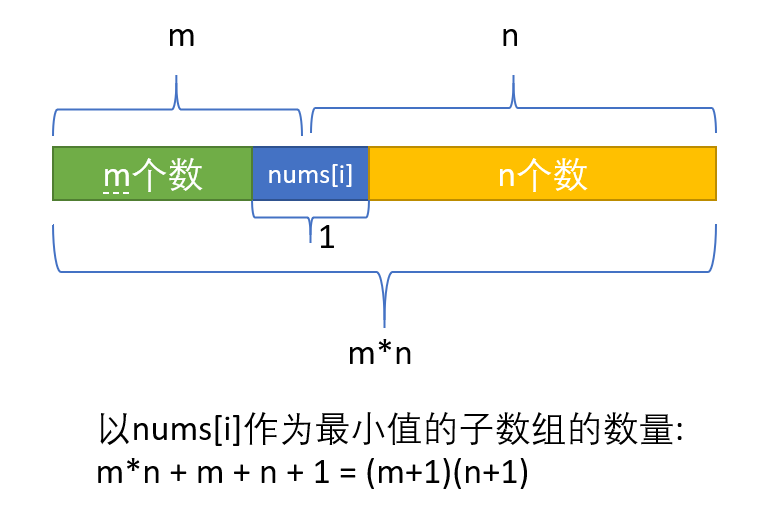

# 栈

# 1. 括号问题（必考）

## [20. 有效的括号](https://leetcode-cn.com/problems/valid-parentheses/)

给定一个只包括 '('，')'，'{'，'}'，'['，']' 的字符串，判断字符串是否有效。

有效字符串需满足：

左括号必须用相同类型的右括号闭合。
左括号必须以正确的顺序闭合。
注意空字符串可被认为是有效字符串。

示例 1:

输入: "()"
输出: true
示例 2:

输入: "()[]{}"
输出: true
示例 3:

输入: "(]"
输出: false
示例 4:

输入: "([)]"
输出: false
示例 5:

输入: "{[]}"
输出: true

```java
class Solution {
    public boolean isValid(String s) {
        int n = s.length();
        if (n % 2 == 1) {
            return false;
        }

        Map<Character, Character> pairs = new HashMap<Character, Character>() {{
            put(')', '(');
            put(']', '[');
            put('}', '{');
        }};
        Deque<Character> stack = new LinkedList<Character>();
        for (int i = 0; i < n; i++) {
            char ch = s.charAt(i);
            if (pairs.containsKey(ch)) {
                if (stack.isEmpty() || stack.peek() != pairs.get(ch)) {
                    return false;
                }
                stack.pop();
            } else {
                stack.push(ch);
            }
        }
        return stack.isEmpty();
    }
}
```


## [32. 最长有效括号](https://leetcode-cn.com/problems/longest-valid-parentheses/) (必考)

给定一个只包含 '(' 和 ')' 的字符串，找出最长的包含有效括号的子串的长度。

示例 1:

输入: "(()"
输出: 2
解释: 最长有效括号子串为 "()"
示例 2:

输入: ")()())"
输出: 4
解释: 最长有效括号子串为 "()()"

```java
class Solution {
    public int longestValidParentheses(String s) {

     if(s ==null || s.length()==0) {
         return 0;
     }

     int max =0;
     Deque<Integer> stack = new LinkedList<>();
     stack.push(-1);

     for(int i =0;i<s.length();i++) {
         if(s.charAt(i)=='(') {
             stack.push(i);
         } else {
             if(!stack.isEmpty()){
                 stack.pop();
             } 
             if(stack.isEmpty()) {
                 stack.push(i);
             } else {
                max = Math.max(max,i-stack.peek());
             }

         }

     }
     return max;
    }
}
```

 ## 301 删除无效的括号

#### [678. 有效的括号字符串](https://leetcode-cn.com/problems/valid-parenthesis-string/)

给定一个只包含三种字符的字符串：（ ，） 和 *，写一个函数来检验这个字符串是否为有效字符串。有效字符串具有如下规则：

任何左括号 ( 必须有相应的右括号 )。
任何右括号 ) 必须有相应的左括号 ( 。
左括号 ( 必须在对应的右括号之前 )。
* 可以被视为单个右括号 ) ，或单个左括号 ( ，或一个空字符串。
一个空字符串也被视为有效字符串。
示例 1:

输入: "()"
输出: True
示例 2:

输入: "(*)"
输出: True
示例 3:

输入: "(*))"
输出: True

```java

```

#### [856. 括号的分数

给定一个平衡括号字符串 `S`，按下述规则计算该字符串的分数：

- `()` 得 1 分。
- `AB` 得 `A + B` 分，其中 A 和 B 是平衡括号字符串。
- `(A)` 得 `2 * A` 分，其中 A 是平衡括号字符串。

 

**示例 1：**

```
输入： "()"
输出： 1
```

**示例 2：**

```
输入： "(())"
输出： 2
```

**示例 3：**

```
输入： "()()"
输出： 2
```

**示例 4：**

```
输入： "(()(()))"
输出： 6
```

```java
class Solution {
public int scoreOfParentheses(String S) {
    Stack<Integer> stack = new Stack();
    stack.push(0); // The score of the current frame

    for (char c: S.toCharArray()) {
        if (c == '(')
            stack.push(0);
        else {
            int v = stack.pop();
            int w = stack.pop();
            stack.push(w + Math.max(2 * v, 1));
        }
    }

    return stack.pop();
}
    
}
```


# 2.

```java

```

# 3 [334. 递增的三元子序列](https://leetcode-cn.com/problems/increasing-triplet-subsequence/)

给定一个未排序的数组，判断这个数组中是否存在长度为 3 的递增子序列。

数学表达式如下:

如果存在这样的 i, j, k,  且满足 0 ≤ i < j < k ≤ n-1，
使得 arr[i] < arr[j] < arr[k] ，返回 true ; 否则返回 false 。
说明: 要求算法的时间复杂度为 O(n)，空间复杂度为 O(1) 。

示例 1:

输入: [1,2,3,4,5]
输出: true
示例 2:

输入: [5,4,3,2,1]
输出: false

单调栈

```java
class Solution {
    public boolean increasingTriplet(int[] nums) {
       int small = Integer.MAX_VALUE;
       int big = Integer.MAX_VALUE;

       for(int i =0;i<nums.length;i++) {

        if(nums[i] <small){
            small = nums[i];
        }else if(nums[i]<big && nums[i]>small){
            big = nums[i];
        } else if(nums[i]>big){
           return true;
        }
       }
       return false;
    }
}
```

# 4 

# 8 

# 9 计算器问题（必考）

## 224. 基本计算器(有括号 +-)

实现一个基本的计算器来计算一个简单的字符串表达式的值。

字符串表达式可以包含左括号 ( ，右括号 )，加号 + ，减号 -，非负整数和空格  。

示例 1:

输入: "1 + 1"
输出: 2
示例 2:

输入: " 2-1 + 2 "
输出: 3
示例 3:

输入: "(1+(4+5+2)-3)+(6+8)"
输出: 23

```java
class Solution {
    public int calculate(String s) {
     
        if (s==null||s.length() == 0) return 0;
        Deque<Integer> stack = new LinkedList<>();//数据栈
        char sign = '+'; //符号
        int res = 0, pre = 0, i = 0;
        while (i < s.length()) {
            char ch = s.charAt(i);
            //处理两位数的问题
            if (Character.isDigit(ch)) {
                pre = pre*10+(ch-'0');
            }
           //碰到左括号 就把括号里面当成一个 新的被加数
            if (ch == '(') {
                int j = findClosing(s.substring(i));
                pre = calculate(s.substring(i+1, i+j));
                i += j;
            }
            if (i == s.length()-1 || !Character.isDigit(ch) && ch!= ' ') {
                //将所有的结果压栈 最后统一加起来
                switch (sign) {
                    case '+':
                        stack.push(pre); break;
                    case '-':
                        stack.push(-pre); break;
                    case '*':
                        stack.push(stack.pop()*pre); break;
                    case '/':
                        stack.push(stack.pop()/pre); break;
                }
                pre = 0;
                //记录当前的符号
                sign = ch;
            } 
            i++;
        }
        // 本质上说全都是加法
        while (!stack.isEmpty()) res += stack.pop();
        return res;
    }
    
    //删除所有的括号对，并返回右括号的位置 并不是最后一个）括号 "(1+(4+5+2)-3)+(6+8)"
    private int findClosing(String s) {
        int level = 0, i = 0;
        for (; i<s.length(); i++) {
            if (s.charAt(i) == '(') {
                level++;
            } else if (s.charAt(i) == ')'){
                level--;
                if(level==0) {
                    return i;
                }
            }
        }
        return 0;
    }
}
```


## [227. 基本计算器 II](https://leetcode-cn.com/problems/basic-calculator-ii/)(无括号 +-*/)

实现一个基本的计算器来计算一个简单的字符串表达式的值。

字符串表达式仅包含非负整数，+， - ，*，/ 四种运算符和空格  。 整数除法仅保留整数部分。

示例 1:

输入: "3+2*2"
输出: 7
示例 2:

输入: " 3/2 "
输出: 1
示例 3:

输入: " 3+5 / 2 "
输出: 5

```java
class Solution {
    public int calculate(String s) {
        if(s==null||s.length()==0) {
            return 0;
        }
        int num =0;
        //要点一 符号前缀
        char sgin = '+';
        //要点二 +num入栈，计算栈之和
        Deque<Integer> stack = new LinkedList<>();

        for(int i=0; i<s.length();i++) {
            char c =s.charAt(i);
            if(Character.isDigit(c)) {
              num = num*10 + c-'0';
            } 
            // 注意 处理最后一个数字
            if(!Character.isDigit(c) && c!=' '|| i==s.length()-1){
                if(sgin=='*') {
                    stack.push(num*stack.pop());

                } else if(sgin=='/') {
                 stack.push(stack.pop()/num);
                } else if(sgin=='-') {
                    stack.push(num*-1);
                }
                else if(sgin=='+') {
                    stack.push(num);
                } 
                sgin = c;  
                num =0;
            } 
        }
        int sum = 0;
        while(!stack.isEmpty()) {
            sum += stack.pop();
        }
        return sum;
    }
}
```


##   772  [基本计算器 III](https://leetcode-cn.com/problems/basic-calculator-iii)  (有括号 +-*/)(递归+基本计算器 II)

```java
class Solution {
    public int calculate(String s) {
     
        if (s==null||s.length() == 0) return 0;
        Deque<Integer> stack = new LinkedList<>();//数据栈
        char sign = '+'; //符号
        int res = 0, pre = 0, i = 0;
        while (i < s.length()) {
            char ch = s.charAt(i);
            //处理两位数的问题
            if (Character.isDigit(ch)) {
                pre = pre*10+(ch-'0');
            }
           //碰到左括号 就把括号里面当成一个 新的被加数
            if (ch == '(') {
                int j = findClosing(s.substring(i));
                pre = calculate(s.substring(i+1, i+j));
                i += j;
            }
            if (i == s.length()-1 || !Character.isDigit(ch) && ch!= ' ') {
                //将所有的结果压栈 最后统一加起来
                switch (sign) {
                    case '+':
                        stack.push(pre); break;
                    case '-':
                        stack.push(-pre); break;
                    case '*':
                        stack.push(stack.pop()*pre); break;
                    case '/':
                        stack.push(stack.pop()/pre); break;
                }
                pre = 0;
                //记录当前的符号
                sign = ch;
            } 
            i++;
        }
        // 本质上说全都是加法
        while (!stack.isEmpty()) res += stack.pop();
        return res;
    }
    
    //删除所有的括号对，并返回右括号的位置 并不是最后一个）括号 "(1+(4+5+2)-3)+(6+8)"
    private int findClosing(String s) {
        int level = 0, i = 0;
        for (; i<s.length(); i++) {
            if (s.charAt(i) == '(') {
                level++;
            } else if (s.charAt(i) == ')'){
                level--;
                if(level==0) {
                    return i;
                }
            }
        }
        return 0;
    }
}
```


##  770  [基本计算器 IV](https://leetcode-cn.com/problems/basic-calculator-iv)  

##  991  [坏了的计算器](https://leetcode-cn.com/problems/broken-calculator)  


# 10  [394. 字符串解码](https://leetcode-cn.com/problems/decode-string/)(必考)

给定一个经过编码的字符串，返回它解码后的字符串。

编码规则为: k[encoded_string]，表示其中方括号内部的 encoded_string 正好重复 k 次。注意 k 保证为正整数。

你可以认为输入字符串总是有效的；输入字符串中没有额外的空格，且输入的方括号总是符合格式要求的。

此外，你可以认为原始数据不包含数字，所有的数字只表示重复的次数 k ，例如不会出现像 3a 或 2[4] 的输入。

示例 1：

输入：s = "3[a]2[bc]"
输出："aaabcbc"
示例 2：

输入：s = "3[a2[c]]"
输出："accaccacc"
示例 3：

输入：s = "2[abc]3[cd]ef"
输出："abcabccdcdcdef"
示例 4：

输入：s = "abc3[cd]xyz"
输出："abccdcdcdxyz"

```java
class Solution {
    public String decodeString(String s) {

      int num =0;
      String res ="";
      String tem ="";
      Deque<Integer> numStack = new LinkedList<>();
      Deque<String> stringStack = new LinkedList<>();
      for(char c : s.toCharArray()) {
        if(Character.isLetter(c)) {
           tem = tem +c; 
        } else if(Character.isDigit(c)){
           num = num*10 +c -'0';
        } else if(c=='[') {
           numStack.push(num);
           stringStack.push(tem);
           tem ="";
           num =0;
        } else if(c==']') {
           int time = numStack.pop();
           String x =""; 
           for(int i =0;i<time;i++) {
             x += tem; 
           }
           tem = stringStack.pop() +x; 
        }
      }  

      return tem;
    }
}
```

# 11 [150. 逆波兰表达式求值](https://leetcode-cn.com/problems/evaluate-reverse-polish-notation/)

根据 逆波兰表示法，求表达式的值。

有效的运算符包括 +, -, *, / 。每个运算对象可以是整数，也可以是另一个逆波兰表达式。

 

说明：

整数除法只保留整数部分。
给定逆波兰表达式总是有效的。换句话说，表达式总会得出有效数值且不存在除数为 0 的情况。


示例 1：

输入: ["2", "1", "+", "3", "*"]
输出: 9
解释: 该算式转化为常见的中缀算术表达式为：((2 + 1) * 3) = 9
示例 2：

输入: ["4", "13", "5", "/", "+"]
输出: 6
解释: 该算式转化为常见的中缀算术表达式为：(4 + (13 / 5)) = 6

```java
class Solution {
    public int evalRPN(String[] tokens) {
     if(tokens==null || tokens.length==0) {
         return 0;
     }
     Deque<Integer> stack = new LinkedList<>();
     int a =0;
     int b =0;
     for(String str:tokens) {
         if(str.equals("*")) {
           a= stack.pop();
           b = stack.pop();   
           stack.push(a*b);  
         } else if(str.equals("/")){
           a= stack.pop();
           b = stack.pop();   
           stack.push(b/a);  
         } else if(str.equals("+")){
           a= stack.pop();
           b = stack.pop();   
           stack.push(a+b);    
         } else if(str.equals("-")){
           a= stack.pop();
           b = stack.pop();   
           stack.push(b-a);   
         } else{
             stack.push(Integer.parseInt(str));
         }  
     }
      return stack.isEmpty()?0:stack.pop();
    }
}
```

# 12

```java

```

# 13 [239. 滑动窗口最大值](https://leetcode-cn.com/problems/sliding-window-maximum/)  （必考 经典题）

给定一个数组 nums，有一个大小为 k 的滑动窗口从数组的最左侧移动到数组的最右侧。你只可以看到在滑动窗口内的 k 个数字。滑动窗口每次只向右移动一位。

返回滑动窗口中的最大值。

 

进阶：

你能在线性时间复杂度内解决此题吗？

 

示例:

输入: nums = [1,3,-1,-3,5,3,6,7], 和 k = 3
输出: [3,3,5,5,6,7] 
解释: 

  滑动窗口的位置                最大值
---------------               -----
[1  3  -1] -3  5  3  6  7       3
 1 [3  -1  -3] 5  3  6  7       3
 1  3 [-1  -3  5] 3  6  7       5
 1  3  -1 [-3  5  3] 6  7       5
 1  3  -1  -3 [5  3  6] 7       6
 1  3  -1  -3  5 [3  6  7]      7


提示：

1 <= nums.length <= 10^5
-10^4 <= nums[i] <= 10^4
1 <= k <= nums.length

```java
class Solution {
    public int[] maxSlidingWindow(int[] nums, int k) {
     if(nums.length -k+1 <=0){
         return new int[0];
     }
     int [] result = new int[nums.length -k+1]; 
     Deque<Integer> q = new LinkedList<>();

     for(int i =0;i<nums.length;i++){

         while(!q.isEmpty() && nums[q.peekLast()]<nums[i]){
            q.pollLast();
         }


         q.offerLast(i);

         while(!q.isEmpty() && q.peek()<=i-k){
             q.pollFirst();
         }
         if(i>=k-1){
             result[i-k+1] = nums[q.peek()];
         }
     }

      return result;


    }
}
```


# 13 下一个更大元素问题

## 496 下一个更大元素 I 

给定两个 没有重复元素 的数组 nums1 和 nums2 ，其中nums1 是 nums2 的子集。找到 nums1 中每个元素在 nums2 中的下一个比其大的值。

nums1 中数字 x 的下一个更大元素是指 x 在 nums2 中对应位置的右边的第一个比 x 大的元素。如果不存在，对应位置输出 -1 。

示例 1:

输入: nums1 = [4,1,2], nums2 = [1,3,4,2].
输出: [-1,3,-1]
解释:
    对于num1中的数字4，你无法在第二个数组中找到下一个更大的数字，因此输出 -1。
    对于num1中的数字1，第二个数组中数字1右边的下一个较大数字是 3。
    对于num1中的数字2，第二个数组中没有下一个更大的数字，因此输出 -1。
示例 2:

输入: nums1 = [2,4], nums2 = [1,2,3,4].
输出: [3,-1]
解释:
    对于 num1 中的数字 2 ，第二个数组中的下一个较大数字是 3 。
    对于 num1 中的数字 4 ，第二个数组中没有下一个更大的数字，因此输出 -1 。

```java
class Solution {
    public int[] nextGreaterElement(int[] nums1, int[] nums2) {
     
     int len1 = nums1.length;
     int len2 = nums2.length;

     if(len1>len2) {
         return new int[0];
     }
     Map<Integer,Integer> map = new HashMap<>();
     Deque<Integer> stack = new LinkedList<>();
     
     for(int i =0;i<len2;i++) {
         while(!stack.isEmpty() && stack.peek()<nums2[i]) {
          map.put(stack.pop(),nums2[i]);
         }
         stack.push(nums2[i]);
     }

     int ans[] = new int[len1];

     for(int i =0;i<len1;i++) {
         ans[i] = map.getOrDefault(nums1[i],-1);
     }
      return  ans;

    }
}

```

## 503下一个更大元素 II

给定一个循环数组（最后一个元素的下一个元素是数组的第一个元素），输出每个元素的下一个更大元素。数字 x 的下一个更大的元素是按数组遍历顺序，这个数字之后的第一个比它更大的数，这意味着你应该循环地搜索它的下一个更大的数。如果不存在，则输出 -1。

示例 1:

输入: [1,2,1]
输出: [2,-1,2]
解释: 第一个 1 的下一个更大的数是 2；
数字 2 找不到下一个更大的数； 
第二个 1 的下一个最大的数需要循环搜索，结果也是 2。

```java
 class Solution {
        public int[] nextGreaterElements(int[] nums) {
            int len = nums.length
            int index =0;
            int ans[] = new int [len];
            Arrays.fill(ans,-1);
            Deque<Integer> stack = new LinkedList<>();
            for(int i =0;i<(len+index) ;i++) {
                while(!stack.isEmpty()&& nums[i%len] >nums[stack.peek()%len]) {
                    ans[stack.pop()%len] = nums[i%len];
                }
                stack.push(i);
                if (index<len) {
                    index++;
                }
            }
            return ans;
        }
    }
```

## 556下一个更大元素 III  [31. 下一个排列](https://leetcode-cn.com/problems/next-permutation/)

给定一个32位正整数 n，你需要找到最小的32位整数，其与 n 中存在的位数完全相同，并且其值大于n。如果不存在这样的32位整数，则返回-1。

示例 1:

输入: 12
输出: 21
示例 2:

输入: 21
输出: -1

```java
class Solution {
    public int nextGreaterElement(int n) {
      char chars[] = (n+"").toCharArray();
      int len = chars.length;
      int i = len-2;
      while(i>=0 &&chars[i+1]<=chars[i]) {
          i--;
      }
      if(i==-1) {
          return -1;
      }
      int j =len-1;
      while(j>=0 &&chars[j]<=chars[i]) {
          j--;
      }
      swap(chars,i,j);
      reverse(chars,i+1);
        try {
            return Integer.parseInt(new String(chars));
        } catch (Exception e) {
            return -1;
        }
    }
    private void swap(char[] chars,int i ,int j) {
        char temp = chars[i];
        chars[i] = chars[j];;
        chars[j] = temp;
    }
    private void reverse(char [] chars,int index) {
        int i = index;
        int j = chars.length -1; 
        while(i<j) {
         swap(chars,i,j);
         i++;
         j--;
        } 
    }

}
```

# 14 中缀表达式转后缀表达式(字节)

https://www.cnblogs.com/menglong1108/p/11619896.html


# 15 单调栈问题（必考）

  从栈底到栈顶的 单调递增栈   268         遇见了7，8先出栈，栈内变为267     

  从栈底到栈顶的 单调递减栈 864  遇见了7  4先出栈，然后6出栈，再将7压入 ，栈变为87


## 1 42. 接雨水 

给定 n 个非负整数表示每个宽度为 1 的柱子的高度图，计算按此排列的柱子，下雨之后能接多少雨水。

示例 1：

  

输入：height = [0,1,0,2,1,0,1,3,2,1,2,1]
输出：6
解释：上面是由数组 [0,1,0,2,1,0,1,3,2,1,2,1] 表示的高度图，在这种情况下，可以接 6 个单位的雨水（蓝色部分表示雨水）。 
示例 2：

输入：height = [4,2,0,3,2,5]
输出：9

 单调递减栈 

```java
class Solution {
        //https://leetcode-cn.com/problems/trapping-rain-water/solution/xiang-xi-tong-su-de-si-lu-fen-xi-duo-jie-fa-by-w-8/
        public int trap(int[] height) {

            int sum = 0;
            Deque<Integer> stack = new LinkedList<>();

            for (int i=0;i<height.length;i++) {

                while(!stack.isEmpty() && height[stack.peek()]<height[i]){
                    int h = height[stack.peek()];
                    stack.pop();
                    if (stack.isEmpty()){
                        break;
                    }
                    int distance= i-stack.peek()-1;

                    int min = Math.min(height[stack.peek()], height[i]);
                    sum = sum + distance * (min - h);
                    
                }

                stack.push(i);

            }

            return sum;
        

        }
```

## 739. 每日温度

请根据每日 气温 列表，重新生成一个列表。对应位置的输出为：要想观测到更高的气温，至少需要等待的天数。如果气温在这之后都不会升高，请在该位置用 0 来代替。

例如，给定一个列表 temperatures = [73, 74, 75, 71, 69, 72, 76, 73]，你的输出应该是 [1, 1, 4, 2, 1, 1, 0, 0]。

提示：气温 列表长度的范围是 [1, 30000]。每个气温的值的均为华氏度，都是在 [30, 100] 范围内的整数。

  单调递减栈     从栈底到栈顶的下标对应的温度列表中的温度依次递减。如果一个下标在单调栈里，则表示尚未找到下一次温度更高的下标 

```java
class Solution {
    public int[] dailyTemperatures(int[] T) {
     Deque<Integer> stack = new LinkedList<>();
     int [] result = new int[T.length];
     for (int i =0;i<T.length;i++){
          while(!stack.isEmpty() && (T[stack.peek()]<T[i])){
           int h = stack.pop();  
           result[h] = i -h;
          }
          stack.push(i);
     }
      return result;
    }
}
```


##  907. 子数组的最小值之和 

给定一个整数数组 A，找到 min(B) 的总和，其中 B 的范围为 A 的每个（连续）子数组。

由于答案可能很大，因此返回答案模 10^9 + 7。

 

示例：

输入：[3,1,2,4]
输出：17
解释：
子数组为 [3]，[1]，[2]，[4]，[3,1]，[1,2]，[2,4]，[3,1,2]，[1,2,4]，[3,1,2,4]。 
最小值为 3，1，2，4，1，1，2，1，1，1，和为 17。


提示：

1 <= A <= 30000
1 <= A[i] <= 30000

这道题的本质在于找到数组中的每一个数作为最小值的范围，比如对于某个数nums[i]能够最小值以这种形式表示：左边连续m个数比nums[i]大，右边连续n个数比nums[i]大。

  

因此，当前目标是找到每一个数nums[i]的左右两边第一个小于等于的数nums[prev]，这两个数之间的数则均是大于nums[i]，这样便可以计算出m和n。在一个数组中找左右两边第一个大于、小于、等于的数这种问题可以使用单调栈来解决。类似于题目739. 每日温度，找到每日温度右边第一个比当前温度高的温度类似。在这里，单调栈的具体使用如下：

维护一个单调递增栈stk;
当当前数nums[i] <= nums[stk.top()]，触发计算；
因为此时栈顶比栈里栈顶下一个元素大，比当前数大，那么栈顶就是在这两个数之间作为最小值的一个范围
栈顶下一个元素就是前一个比栈顶小的数，当前数就是后一个比栈顶小的元素
分别计算栈顶元素到前一个小的元素和到后一个小的元素之间有多少元素，这些元素肯定都比栈顶大
那么栈顶元素作为最小值的子数组数量用上图表示，计算即可

```java
class Solution {
    int BASE = 1_000_000_007;  
    public int sumSubarrayMins(int[] A) {     
     int len = A.length;
     if (len ==0) {
         return 0;
     }
     int B[] = new int [len+1]; 

     System.arraycopy(A,0,B,0,len); 

     int sum = 0;
     Deque<Integer> q = new LinkedList<>();
     q.push(0);
     for(int i =0;i<=len;i++) {
       while (!q.isEmpty() && B[i]<=B[q.peek()]) {
           int index = q.pop();            
           int prev_index = -1;
           if ( !q.isEmpty() ) prev_index = q.peek();
           int prev_count = index - prev_index - 1; // 数量m
           int next_count = i - index - 1;          // 数量n
           sum += (long) (B[index]) * (prev_count + 1) * (next_count + 1) % BASE;
           sum %= BASE;
        }
        q.push(i); 
     }
     return sum;
    }

}
```


## 84 柱状图中最大的矩形

给定 *n* 个非负整数，用来表示柱状图中各个柱子的高度。每个柱子彼此相邻，且宽度为 1 。

求在该柱状图中，能够勾勒出来的矩形的最大面积。

 


以上是柱状图的示例，其中每个柱子的宽度为 1，给定的高度为 `[2,1,5,6,2,3]`。

 


图中阴影部分为所能勾勒出的最大矩形面积，其面积为 `10` 个单位。

 

**示例:**

```
输入: [2,1,5,6,2,3]
输出: 1
```


```java
class Solution {
    public int largestRectangleArea(int[] heights) {
            int max =0;
            int temp[] = new int[heights.length+2];
            Deque<Integer> stack = new LinkedList<>();
            System.arraycopy(heights, 0, temp, 1, heights.length);
            for(int i =0;i<temp.length;i++){
               while(!stack.isEmpty() && temp[stack.peek()]>temp[i]) {
                 int h = temp[stack.pop()];
                 max = Math.max(max,(i-1-stack.peek()) *h);   
                }
               stack.push(i);

            }
            return max;
    }
}
```


## 85. 最大矩形

给定一个仅包含 0 和 1 的二维二进制矩阵，找出只包含 1 的最大矩形，并返回其面积。

示例:

输入:
[
  ["1","0","1","0","0"],
  ["1","0","1","1","1"],
  ["1","1","1","1","1"],
  ["1","0","0","1","0"]
]
输出: 6

```java
class Solution {
    public int maximalRectangle(char[][] matrix) {

        int m = matrix.length;
        if(m==0){
            return 0;
        }
        int n = matrix[0].length;
        int max =0;
        int [][] newMatrix = new int[m][n+2];

        for(int i =0;i<m;i++) {
           for(int j =0;j<n;j++) {
             if(matrix[i][j]=='0'){
               newMatrix[i][j+1]= 0;
             }
             else
             {
               int row = i;
               int num =0;
               for(;row>=0;row--){
                 if(matrix[row][j]=='0'){
                   break;
                 }  
                 num = num + matrix[row][j]-'0'; 
               }
               newMatrix[i][j+1]= num; 
             }  
           } 
        }
        for(int i =0;i<m;i++) {
         max = Math.max(max,cuntMaxArea(newMatrix[i]));  
        }
        return max;
    }


    private int cuntMaxArea(int [] nums) {

       int max =0;
       Deque<Integer> stack = new LinkedList<>();
       for(int i =0;i<nums.length;i++) {
           while(!stack.isEmpty() && nums[i]<nums[stack.peek()]) {
              int index = stack.pop();
              max = Math.max((i-stack.peek()-1)*nums[index],max);
           }

           stack.push(i);
       }
       return max;
    } 

```

## 402. 移掉K位数字  栈+贪心


给定一个以字符串表示的非负整数 num，移除这个数中的 k 位数字，使得剩下的数字最小。

注意:

num 的长度小于 10002 且 ≥ k。
num 不会包含任何前导零。
示例 1 :

输入: num = "1432219", k = 3
输出: "1219"
解释: 移除掉三个数字 4, 3, 和 2 形成一个新的最小的数字 1219。
示例 2 :

输入: num = "10200", k = 1
输出: "200"
解释: 移掉首位的 1 剩下的数字为 200. 注意输出不能有任何前导零。
示例 3 :

输入: num = "10", k = 2
输出: "0"
解释: 从原数字移除所有的数字，剩余为空就是0。

单调递增栈

```java
class Solution {
    public String removeKdigits(String num, int k) {

      Deque<Character> stack = new LinkedList<>();

      for(char c : num.toCharArray()) {
        while(!stack.isEmpty() &&k >0 && stack.peekLast()>c) {
          stack.removeLast();
          k--;
        }
        stack.addLast(c);
      }
      //k不为零  
      for(int i =0;i<k;i++){
          stack.removeLast();
      }  
      //去除前面的0
      boolean isZero = true;
      StringBuilder sb = new StringBuilder();
      for(char c:stack){
          if(isZero && c=='0'){
              continue;
          }
        isZero =false;
        sb.append(c);
      }
      if(sb.length()==0){
          return "0";
      } 
      return sb.toString();
    }
}
```

## 316. 去除重复字母 与 1081相同（必考）

给你一个仅包含小写字母的字符串，请你去除字符串中重复的字母，使得每个字母只出现一次。需保证返回结果的字典序最小（要求不能打乱其他字符的相对位置）。

 

示例 1:

输入: "bcabc"
输出: "abc"
示例 2:

输入: "cbacdcbc"
输出: "acdb"

```java
class Solution {
        public String removeDuplicateLetters(String s) {

            int cunt [] = new int[26];
            char [] chars = s.toCharArray();
            for(char c : chars){
                cunt[c-'a']++;
            }
            Deque<Character> stack = new LinkedList<>();
            //必须用set 不然出现 aba场景 就只有a了应该是ab
            Set<Character> set = new HashSet<>();
            for(char c : chars){
                if(set.contains((Character)c)){
                    cunt[c-'a'] --;
                    continue;
                }
                while(!stack.isEmpty() && stack.peekLast()>c && cunt[stack.peekLast()-'a']>1){
                    cunt[stack.peekLast()-'a'] --;
                    set.remove((Character)stack.peekLast());
                    stack.removeLast();
                }
                stack.addLast(c);
                set.add(c);
            }
            StringBuilder ans = new StringBuilder() ;
            for(char c : stack) {
                ans.append(c);
            }
            if(ans.length()==0){
                return "";
            }
            return ans.toString();
        }
}
```

## 321. 拼接最大数

给定长度分别为 m 和 n 的两个数组，其元素由 0-9 构成，表示两个自然数各位上的数字。现在从这两个数组中选出 k (k <= m + n) 个数字拼接成一个新的数，要求从同一个数组中取出的数字保持其在原数组中的相对顺序。

求满足该条件的最大数。结果返回一个表示该最大数的长度为 k 的数组。

说明: 请尽可能地优化你算法的时间和空间复杂度。

示例 1:

输入:
nums1 = [3, 4, 6, 5]
nums2 = [9, 1, 2, 5, 8, 3]
k = 5
输出:
[9, 8, 6, 5, 3]
示例 2:

输入:
nums1 = [6, 7]
nums2 = [6, 0, 4]
k = 5
输出:
[6, 7, 6, 0, 4]
示例 3:

输入:
nums1 = [3, 9]
nums2 = [8, 9]
k = 3
输出:
[9, 8, 9]

```java
class Solution {
    public int[] maxNumber(int[] nums1, int[] nums2, int k) {


        List<List<Integer>> res = new ArrayList<>();
        int len1= nums1.length;
        int len2= nums2.length;
        for(int i =0; i<=len1;i++){
            //难点一 取前k个数子序列成为最大数 转换成 移除len1-k个元素 成为最大数
            List<Integer> l1 = removeK(nums1,len1-i);
            List<Integer> l2 = removeK(nums2,len2-k+i);
            if (l1.size() +l2.size() ==k){
                //难点二 排序无序数组成为最大值，比较数组i和j下标相等时不能判断，i++或j++
                //必须一直比较到尾 比如 10101020 10101024，必须比较到最后像String的compareTo方法
                res.add(mergeTwo(l1,l2));
            }

        }
        int [] ans = new int [k];
        res.sort(new Compare());
        for(int i = 0;i<res.get(0).size();i++){
            ans[i] = res.get(0).get(i);
        }
        return ans;
    }
    public class Compare implements Comparator<List<Integer>>{
        @Override
        public int compare(List<Integer> l1,List<Integer> l2){
            return com(l1, l2);
        }

        public int com(List<Integer> l1, List<Integer> l2) {
            int n = l1.size();
            int m = l2.size();
            int min = Math.min(n,m);
            for(int i=0;i<min ;i++){
                if(l2.get(i) -l1.get(i) !=0){
                    return l2.get(i) -l1.get(i);
                }
            }
            return m-n;
        }
    }

    private List<Integer> mergeTwo(List<Integer> l1,List<Integer> l2) {
        if(l1.isEmpty()){
            return l2;
        }
        if(l2.isEmpty()){
            return l1;
        }
        int i =0;
        int j =0;

        List<Integer> res = new ArrayList<>();

        while(i<l1.size()&&j<l2.size()){
            if(l1.get(i)>l2.get(j)){
                res.add(l1.get(i));
                i++;

            }else if (l1.get(i)<l2.get(j)){
                res.add(l2.get(j));
                j++;
            } else {
              if (new Compare().com(l1.subList(i,l1.size()),l2.subList(j,l2.size()))>=0){
                  res.add(l2.get(j));
                  j++;
              } else{
                  res.add(l1.get(i));
                  i++;
              }
            }
        }
        while(i<l1.size()){
            res.add(l1.get(i));
            i++;
        }
        while(j<l2.size()){
            res.add(l2.get(j));
            j++;
        }
        return res;

    }

    private List<Integer> removeK(int [] nums ,int k){

        Deque<Integer> stack = new LinkedList<>();
        for(int num :nums) {
            while(!stack.isEmpty() && k>0 && stack.peekLast()<num){
                stack.removeLast();
                k--;
            }
            stack.addLast(num);
        }
/*
        for(int i=0;i<k;i++){
            if(!stack.isEmpty()){
                stack.removeLast();
            }

        }
        return new ArrayList<>(stack);
    }


}
```


3	496. 下一个更大元素 I（简单）	暴力解法、单调栈
5	901. 股票价格跨度（中等）	

7	581. 最短无序连续子数组	

