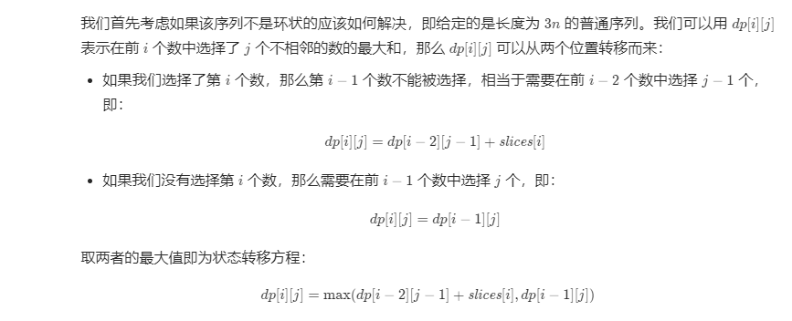
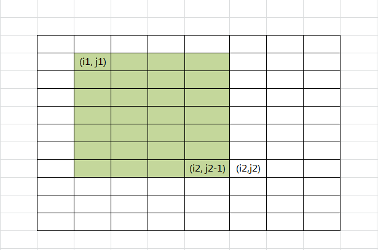
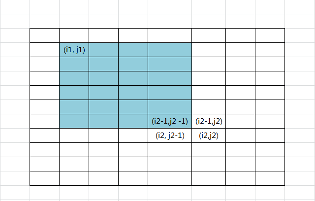
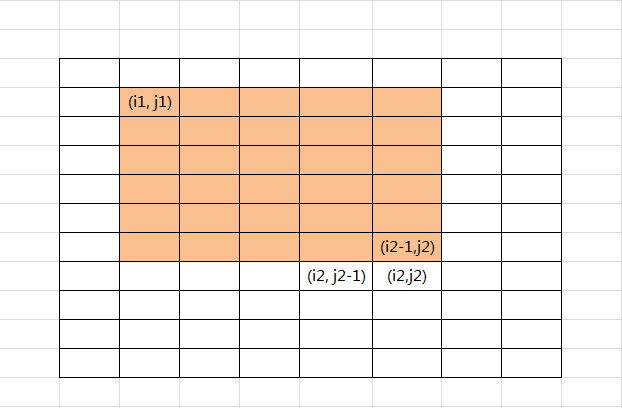
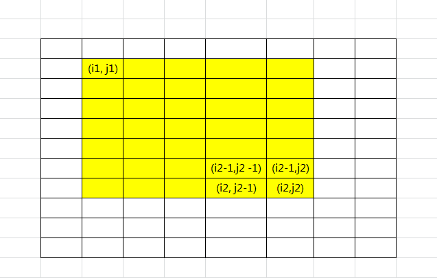
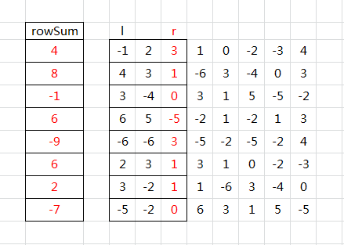
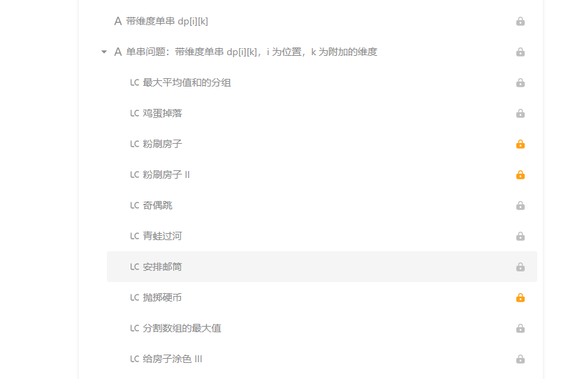
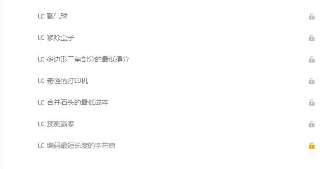
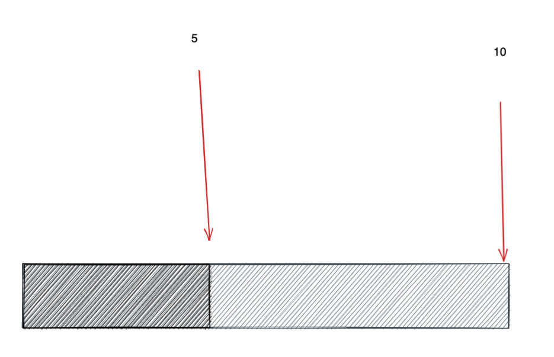
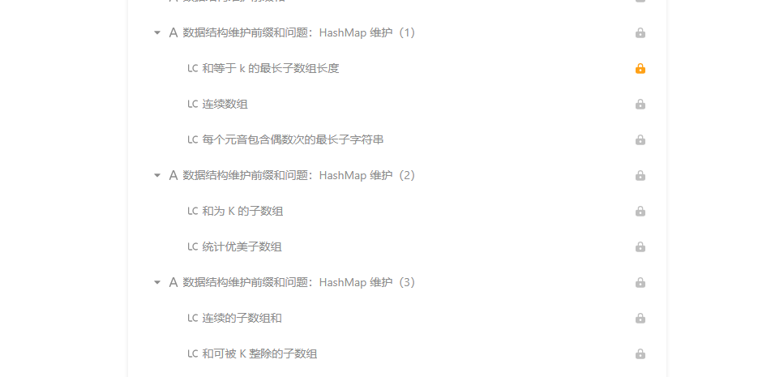

# https://leetcode-cn.com/leetbook/read/dynamic-programming-1-plus/5rjhmc/

https://leetcode-cn.com/leetbook/read/dynamic-programming-1-plus/5rjhmc/


# 2 石子游戏

不同顺序算一个

个排列问题怎么解决。比如nums=[1,2,3] target = 8，要计算能构成8的所有排列有几个，那就可以计算构成5的排列有几个，但是到这我想的是，这个3应该有几种方法插入到构成5的排列里呢？就卡在这了。然后看了别人的代码，一时又难以理解，想了半天想明白了。

在计算构成8的排列有几个时即dp[8]，我们只关注分别以1,2,3为“屁股”的所有排列的个数，这仨排列个数之和就是构成8的所有排列了。为什么这么说呢？因为所有排列一定一定是以1,2,3其中一个为结尾的（废话），那么对于8而言，以3为结尾的排列个数就是dp[5]，以2为结尾的排列个数就是dp[6]，同理以1为结尾的排列个数就是dp[7]，把它仨加起来，就是dp[8]了。

这道题要注意一下初始化和overflow问题，初始化是应该dp[0]=1，详见代码注释。

零钱兑换问题中dp[i]为dp[i-nums[j]]的最小值，而这道题中dp[i]为dp[i-nums[j]]之和，这是它们的区别。

# 

# 

# 23  [403. 青蛙过河](https://leetcode-cn.com/problems/frog-jump/)

一只青蛙想要过河。 假定河流被等分为 x 个单元格，并且在每一个单元格内都有可能放有一石子（也有可能没有）。 青蛙可以跳上石头，但是不可以跳入水中。

给定石子的位置列表（用单元格序号升序表示）， 请判定青蛙能否成功过河（即能否在最后一步跳至最后一个石子上）。 开始时， 青蛙默认已站在第一个石子上，并可以假定它第一步只能跳跃一个单位（即只能从单元格1跳至单元格2）。

如果青蛙上一步跳跃了 k 个单位，那么它接下来的跳跃距离只能选择为 k - 1、k 或 k + 1个单位。 另请注意，青蛙只能向前方（终点的方向）跳跃。

请注意：

石子的数量 ≥ 2 且 < 1100；
每一个石子的位置序号都是一个非负整数，且其 < 231；
第一个石子的位置永远是0。
示例 1:

[0,1,3,5,6,8,12,17]

总共有8个石子。
第一个石子处于序号为0的单元格的位置, 第二个石子处于序号为1的单元格的位置,
第三个石子在序号为3的单元格的位置， 以此定义整个数组...
最后一个石子处于序号为17的单元格的位置。

返回 true。即青蛙可以成功过河，按照如下方案跳跃： 
跳1个单位到第2块石子, 然后跳2个单位到第3块石子, 接着 
跳2个单位到第4块石子, 然后跳3个单位到第6块石子, 
跳4个单位到第7块石子, 最后，跳5个单位到第8个石子（即最后一块石子）。
示例 2:

[0,1,2,3,4,8,9,11]

返回 false。青蛙没有办法过河。 
这是因为第5和第6个石子之间的间距太大，没有可选的方案供青蛙跳跃过去。

```java
/*
思路①、使用二维数组的动态规划
         动态规划
         dp[i][k] 表示能否由前面的某一个石头 j 通过跳 k 步到达当前这个石头 i ，这个 j 的范围是 [1, i - 1]
         当然，这个 k 步是 i 石头 和 j 石头之间的距离
         那么对于 j 石头来说，跳到 j 石头的上一个石头的步数就必须是这个 k - 1 || k || k + 1
         由此可得状态转移方程：dp[i][k] = dp[j][k - 1] || dp[j][k] || dp[j][k + 1]
*/
class Solution {
    public boolean canCross(int[] stones) {
        
        int len = stones.length;

        if(stones[1] != 1){
            return false;
        }
        
        boolean[][] dp = new boolean[len][len + 1];
        dp[0][0] = true;
        for(int i = 1; i < len; i++){
            for(int j = 0; j < i; j++){
                int k = stones[i] - stones[j];
                /*
                	为什么有这么个判断？
                	因为其他石头跳到第 i 个石头跳的步数 k 必定满足 k <= i
                	这又是为什么？
                	1、比如 nums = [0,1,3,5,6,8,12,17]
                	   那么第 0 个石头跳到第 1 个石头，步数肯定为 1，然后由于后续最大的步数是 k + 1，因此第 1 个石头最大只能跳 2 个单位
                 	   因此如果逐个往上加，那么第 2 3 4 5 ... 个石头最多依次跳跃的步数是 3 4 5 6...
                	2、 第 i 个石头能跳的最大的步数是 i + 1，那么就意味着其他石头 j 跳到第 i 个石头的最大步数只能是 i 或者 j + 1
                	   而 这个 k 是其他石头跳到 i 石头上来的，因此 k 必须 <= i （或者是 k <= j + 1）
                */
                if(k <= i){
                    dp[i][k] = dp[j][k - 1] || dp[j][k] || dp[j][k + 1];
                    //提前结束循环直接返回结果
                    if(i == len - 1 && dp[i][k]){
                        return true;
                    }
                }
            }
        }
        return false;
    }
}
```


# 26 

# 27 [413. 等差数列划分](https://leetcode-cn.com/problems/arithmetic-slices/)

数组 A 包含 N 个数，且索引从0开始。数组 A 的一个子数组划分为数组 (P, Q)，P 与 Q 是整数且满足 0<=P<Q<N 。

如果满足以下条件，则称子数组(P, Q)为等差数组：

元素 A[P], A[p + 1], ..., A[Q - 1], A[Q] 是等差的。并且 P + 1 < Q 。

函数要返回数组 A 中所有为等差数组的子数组个数。

示例:

A = [1, 2, 3, 4]

返回: 3, A 中有三个子等差数组: [1, 2, 3], [2, 3, 4] 以及自身 [1, 2, 3, 4]。

```java
class Solution {
    public int numberOfArithmeticSlices(int[] A) {
       
       int len = A.length;
       if(len<3) {
           return 0;
       }
       boolean dp[][] = new boolean[len+1][len+1];

       for(int i=0;i<len-2;i++)  {
          for(int j=i+2;j<len;j++) {
              if(j-i==2){
                 dp[i][j] = A[j]-A[j-1]==A[j-1]-A[j-2]; 
              }
              if(dp[i][j-1]) {
                dp[i][j] = dp[i][j]||A[j]-A[j-1]==A[j-1]-A[j-2];
              }           
          } 
       }
       int cunt =0;
        for(int i=0;i<len-2;i++)  {
          for(int j=i+2;j<len;j++) {
              if(dp[i][j]){
                cunt++;  
              }
          } 
       }
       return cunt; 

    }
}
```

# 28 [517. 超级洗衣机](https://leetcode-cn.com/problems/super-washing-machines/)

假设有 n 台超级洗衣机放在同一排上。开始的时候，每台洗衣机内可能有一定量的衣服，也可能是空的。

在每一步操作中，你可以选择任意 m （1 ≤ m ≤ n） 台洗衣机，与此同时将每台洗衣机的一件衣服送到相邻的一台洗衣机。

给定一个非负整数数组代表从左至右每台洗衣机中的衣物数量，请给出能让所有洗衣机中剩下的衣物的数量相等的最少的操作步数。如果不能使每台洗衣机中衣物的数量相等，则返回 -1。

 

示例 1：

输入: [1,0,5]

输出: 3

解释: 
第一步:    1     0 <-- 5    =>    1     1     4
第二步:    1 <-- 1 <-- 4    =>    2     1     3    
第三步:    2     1 <-- 3    =>    2     2     2   
示例 2：

输入: [0,3,0]

输出: 2

解释: 
第一步:    0 <-- 3     0    =>    1     2     0    
第二步:    1     2 --> 0    =>    1     1     1     
示例 3:

输入: [0,2,0]

输出: -1

解释: 
不可能让所有三个洗衣机同时剩下相同数量的衣物。

```java
class Solution {
    public int findMinMoves(int[] machines) {

      int len = machines.length;
      if(len ==0) return 0;
      int sum =0;
      for(int i=0;i<len;i++) {
          sum += machines[i];
      }
      if(sum%len !=0) {
          return -1;
      }
      int mid = sum/len;

      //dp[][0]  多的的
      //dp[][1]   少的
      int dp[][] = new int[len+1][2]; 
      int cunt =0;

      for(int i=1;i<=len;i++) {
           int res =0;
           //往前移动和给后面移动
           int tem =0;
           if(machines[i-1]>mid){
               //一共多出来
              res = machines[i-1] - mid + dp[i-1][0];
              //还多
              if(res>=dp[i-1][1]) {
                 tem = res; 
                 dp[i][0] = res -dp[i-1][1];
                 dp[i][1] =0;
              }
              // 还欠一点 
              else{
                 tem = dp[i-1][1];
                 dp[i][0] =0;
                 dp[i][1]= dp[i-1][1] -res;
              }


           }else if (machines[i-1]<mid) {
               //一共欠
              res = mid -machines[i-1]+ dp[i-1][1];
              //还多
              if(res<=dp[i-1][0]) {
                    tem = dp[i - 1][0];
                    dp[i][1] = 0;
                    dp[i][0] = dp[i - 1][0] - res;
              }
              // 还欠一点 
              else{
                    dp[i][1] = res - dp[i - 1][0];
                    dp[i][0] = 0;
                    tem = dp[i][1];
 
              }

           } else{
               dp[i][0] = dp[i-1][0];
               dp[i][1] = dp[i-1][1];
           }  
           cunt = Math.max(cunt,tem);

      }
      
      return cunt;


    }
}
```

# 29 


# 30  [464. 我能赢吗](https://leetcode-cn.com/problems/can-i-win/)

在 "100 game" 这个游戏中，两名玩家轮流选择从 1 到 10 的任意整数，累计整数和，先使得累计整数和达到 100 的玩家，即为胜者。

如果我们将游戏规则改为 “玩家不能重复使用整数” 呢？

例如，两个玩家可以轮流从公共整数池中抽取从 1 到 15 的整数（不放回），直到累计整数和 >= 100。

给定一个整数 maxChoosableInteger （整数池中可选择的最大数）和另一个整数 desiredTotal（累计和），判断先出手的玩家是否能稳赢（假设两位玩家游戏时都表现最佳）？

你可以假设 maxChoosableInteger 不会大于 20， desiredTotal 不会大于 300。

示例：

输入：
maxChoosableInteger = 10
desiredTotal = 11

输出：
false

解释：
无论第一个玩家选择哪个整数，他都会失败。
第一个玩家可以选择从 1 到 10 的整数。
如果第一个玩家选择 1，那么第二个玩家只能选择从 2 到 10 的整数。
第二个玩家可以通过选择整数 10（那么累积和为 11 >= desiredTotal），从而取得胜利.
同样地，第一个玩家选择任意其他整数，第二个玩家都会赢。

```java

```


# 

# 37 数字拆分问题

## 279. 完全平方数

给定正整数 n，找到若干个完全平方数（比如 1, 4, 9, 16, ...）使得它们的和等于 n。你需要让组成和的完全平方数的个数最少。

示例 1:

输入: n = 12
输出: 3 
解释: 12 = 4 + 4 + 4.
示例 2:

输入: n = 13
输出: 2
解释: 13 = 4 + 9.

## 343. 整数拆分

给定一个正整数 n，将其拆分为至少两个正整数的和，并使这些整数的乘积最大化。 返回你可以获得的最大乘积。

示例 1:

输入: 2
输出: 1
解释: 2 = 1 + 1, 1 × 1 = 1。
示例 2:

输入: 10
输出: 36
解释: 10 = 3 + 3 + 4, 3 × 3 × 4 = 36。

##  [91. 解码方法](https://leetcode-cn.com/problems/decode-ways/)

一条包含字母 `A-Z` 的消息通过以下方式进行了编码：

```
'A' -> 1
'B' -> 2
...
'Z' -> 26
```

给定一个只包含数字的**非空**字符串，请计算解码方法的总数。

**示例 1:**

```
输入: "12"
输出: 2
解释: 它可以解码为 "AB"（1 2）或者 "L"（12）。
```

**示例 2:**

```
输入: "226"
输出: 3
解释: 它可以解码为 "BZ" (2 26), "VF" (22 6), 或者 "BBF" (2 2 6) 。
```

```java
class Solution {
    public int numDecodings(String s) {
     int len = s.length();
     List<String> diction = new ArrayList<>();
     diction.add("1");
     diction.add("2");
     diction.add("3");
     diction.add("4");
     diction.add("5");
     diction.add("6");
     diction.add("7");
     diction.add("8");
     diction.add("9");
     diction.add("10");
     diction.add("11");
     diction.add("12");
     diction.add("13");
     diction.add("14");
     diction.add("15");
     diction.add("16");
     diction.add("11");
     diction.add("12");
     diction.add("13");
     diction.add("14");
     diction.add("15");
     diction.add("16");
     diction.add("17");
     diction.add("18");
     diction.add("19");
     diction.add("20");
     diction.add("21");
     diction.add("22");
     diction.add("23");
     diction.add("24");
     diction.add("25");
     diction.add("26");

     int dp[] = new int[len+1];
     dp[0] = 1;
     if(len>=1 && is(s.substring(0,1),diction)){
       dp[1]=1;
     }


     for(int i =2;i<=len;i++){
        if(is(s.substring(i-1,i),diction)){
           dp[i] += dp[i-1];
        }
        if(is(s.substring(i-2,i),diction)){
           dp[i] += dp[i-2];
        }
    }
     return dp[len];
    }

    private boolean is(String s,List<String> diction){
        return diction.contains(s);
    }
}
```


# 39 

# 41


# 43 [357. 计算各个位数不同的数字个数](https://leetcode-cn.com/problems/count-numbers-with-unique-digits/)

给定一个非负整数 n，计算各位数字都不同的数字 x 的个数，其中 0 ≤ x < 10n 。

示例:

输入: 2
输出: 91 
解释: 答案应为除去 11,22,33,44,55,66,77,88,99 外，在 [0,100) 区间内的所有数字。

```java
class Solution {
    /**
     * 排列组合：n位有效数字 = 每一位都从 0~9 中选择，且不能以 0 开头
     * 1位数字：0~9                      10
     * 2位数字：C10-2，且第一位不能是0      9 * 9
     * 3位数字：C10-3，且第一位不能是0      9 * 9 * 8
     * 4位数字：C10-4，且第一位不能是0      9 * 9 * 8 * 7
     * ... ...
     * 最后，总数 = 所有 小于 n 的位数个数相加
     */
    public int countNumbersWithUniqueDigits(int n) {
        if (n == 0) return 1;
        int first = 10, second = 9 * 9;
        int size = Math.min(n, 10);
        for (int i = 2; i <= size; i++) {
            first += second;
            second *= 10 - i;
        }
        return first;
    }
}
```

# 44 [

# 一 单串问题

# 1 单串变形---找到k的位置。

## 1.1 [873. 最长的斐波那契子序列的长度](https://leetcode-cn.com/problems/length-of-longest-fibonacci-subsequence/)

如果序列 `X_1, X_2, ..., X_n` 满足下列条件，就说它是 *斐波那契式* 的：

- `n >= 3`
- 对于所有 `i + 2 <= n`，都有 `X_i + X_{i+1} = X_{i+2}`

给定一个**严格递增**的正整数数组形成序列，找到 `A` 中最长的斐波那契式的子序列的长度。如果一个不存在，返回 0 。

*（回想一下，子序列是从原序列 `A` 中派生出来的，它从 `A` 中删掉任意数量的元素（也可以不删），而不改变其余元素的顺序。例如， `[3, 5, 8]` 是 `[3, 4, 5, 6, 7, 8]` 的一个子序列）*

 


**示例 1：**

```
输入: [1,2,3,4,5,6,7,8]
输出: 5
解释:
最长的斐波那契式子序列为：[1,2,3,5,8] 。
```

**示例 2：**

```
输入: [1,3,7,11,12,14,18]
输出: 3
解释:
最长的斐波那契式子序列有：
[1,11,12]，[3,11,14] 以及 [7,11,18] 。
```

 

**提示：**

- `3 <= A.length <= 1000`
- `1 <= A[0] < A[1] < ... < A[A.length - 1] <= 10^9`

```java

class Solution {
    public int lenLongestFibSubseq(int[] A) {

        int len = A.length;
        if(len<3){
            return 0;
        }
        int max = 0;
        Map<Integer,Integer> map = new HashMap<>();
        for(int i =0;i<len;i++) {
          map.put(A[i],i);
        }
        //以j,i结尾的 斐波那契式子序列长度
        Map<Integer,Integer> dp = new HashMap<>();

        for(int i =0;i<len;i++) {
           for(int j =0;j<i;j++) {
               int k = map.getOrDefault(A[i]-A[j],-1);  
               if(k>=0&&k<j) {
                   int ji= dp.getOrDefault(k*len+j,2)+1;
                   dp.put(j*len+i,ji);
                   max = Math.max(ji,max);
               }
           }
        }  
        return max>=3?max:0;  
    }
}
```

## 1.2 1027. 最长等差数列

给定一个整数数组 `A`，返回 `A` 中最长等差子序列的**长度**。

回想一下，`A` 的子序列是列表 `A[i_1], A[i_2], ..., A[i_k]` 其中 `0 <= i_1 < i_2 < ... < i_k <= A.length - 1`。并且如果 `B[i+1] - B[i]`( `0 <= i < B.length - 1`) 的值都相同，那么序列 `B` 是等差的。

 

**示例 1：**

```
输入：[3,6,9,12]
输出：4
解释： 
整个数组是公差为 3 的等差数列。
```

**示例 2：**

```
输入：[9,4,7,2,10]
输出：3
解释：
最长的等差子序列是 [4,7,10]。
```

**示例 3：**

```
输入：[20,1,15,3,10,5,8]
输出：4
解释：
最长的等差子序列是 [20,15,10,5]。
```

**提示：**

1. `2 <= A.length <= 2000`
2. `0 <= A[i] <= 10000`

```java
class Solution {
    public int longestArithSeqLength(int[] A) {
     int len = A.length;
     //j.i 之间最长序列
     Map<Integer,List<Integer>> map = new HashMap<>(); 
     
    for(int i =0;i<len;i++) {
        int j =i;
        if(map.containsKey(A[i])) {
             map.get(A[i]).add(i);
        } else {
            List<Integer> res = new ArrayList<>();
            res.add(j);
            map.put(A[i],res);
     
        }
    }
    int max =0;
    //记录重复
    for(List<Integer>value : map.values()) {
        max = Math.max(max,value.size());
    }

     int dp[][] = new int[len+1][len+1];
     for(int i =0;i<len;i++) {
        for(int j =0;j<i;j++) {
         //重复为m个 就有m！个问题   
         if(A[j]-A[i]==0) {
             continue;
         }   
         List<Integer> ks = map.getOrDefault(2*A[j]-A[i],null);
         if(ks==null) {
             continue;
         }
         for(int k :ks) {
            if(k>=0&&k<j) {
            dp[j][i] = (dp[k][j]==0?2:dp[k][j]) +1; 
            max = Math.max(dp[j][i],max); 

         }
         } 
        } 
     } 

     return max<=2?2:max;  
    }
}
```


# 2 单串--经典LIS（必考）

## 2.1 300. 最长上升子序列（必考） 

给定一个无序的整数数组，找到其中最长上升子序列的长度。

**示例:**

```
输入: [10,9,2,5,3,7,101,18]
输出: 4 
解释: 最长的上升子序列是 [2,3,7,101]，它的长度是 4。
```

 dp[i] 代表 已i结尾的子序列

```java
class Solution {
    public int lengthOfLIS(int[] nums) {

        int n = nums.length;
        if(n ==0){
            return 0;
        }
        int dp[] = new int [n+1];
        int max =0;
        for(int i= 0; i<n;i++){
         dp[i] =1;
        for(int j = i-1;j>=0;j--){
           if(nums[j]<nums[i]){
               dp[i] = Math.max(dp[i],dp[j]+1);
           }
         }
         max = Math.max(max,dp[i]);
        }

       return max;

    }
}

//贪心二分查找

class Solution {
    public int lengthOfLIS(int[] nums) {
        int[] tails = new int[nums.length];
        int res = 0;
        for(int num : nums) {
            int i = 0, j = res;
            while(i < j) {
                int m = (i + j) / 2;
                if(tails[m] < num) i = m + 1;
                else j = m;
            }
            tails[i] = num;
            if(res == j) res++;
        }
        return res;
    }
}

作者：jyd
链接：https://leetcode-cn.com/problems/longest-increasing-subsequence/solution/zui-chang-shang-sheng-zi-xu-lie-dong-tai-gui-hua-2/
来源：力扣（LeetCode）
著作权归作者所有。商业转载请联系作者获得授权，非商业转载请注明出处。

```

## 2.3 646. 最长数对链

给出 `n` 个数对。 在每一个数对中，第一个数字总是比第二个数字小。

现在，我们定义一种跟随关系，当且仅当 `b < c` 时，数对`(c, d)` 才可以跟在 `(a, b)` 后面。我们用这种形式来构造一个数对链。

给定一个数对集合，找出能够形成的最长数对链的长度。你不需要用到所有的数对，你可以以任何顺序选择其中的一些数对来构造。

 

**示例：**

```
输入：[[1,2], [2,3], [3,4]]
输出：2
解释：最长的数对链是 [1,2] -> [3,4]
```

 

**提示：**

- 给出数对的个数在 `[1, 1000]` 范围内。

```java

//lis
class Solution {
    public int findLongestChain(int[][] pairs) {
      int len = pairs.length;
      Arrays.sort(pairs,(a,b)->{
          return (a[0]==b[0]) ? (b[1] - a[1]):(a[0]-b[0]);
      });
      int dp[] = new int[len+1];
      int max =1;
      for(int i =1;i<=len;i++) {
          dp[i] = 1;
          for(int j = i-1;j>=1;j--) {
            if(pairs[i-1][0]>pairs[j-1][1]) {
              dp[i] = Math.max(dp[j] + 1,dp[i]); 
            }
          }
         max = Math.max(max,dp[i]);
      }
      return max;  
    }
}

//贪心
class Solution {
    public int findLongestChain(int[][] pairs) {
        Arrays.sort(pairs, (a, b) -> a[1] - b[1]);
        int cur = Integer.MIN_VALUE, ans = 0;
        for (int[] pair: pairs) if (cur < pair[0]) {
            cur = pair[1];
            ans++;
        }
        return ans;
    }
}

```


## 2.3 354 俄罗斯套娃信封问题

给定一些标记了宽度和高度的信封，宽度和高度以整数对形式 (w, h) 出现。当另一个信封的宽度和高度都比这个信封大的时候，这个信封就可以放进另一个信封里，如同俄罗斯套娃一样。

请计算最多能有多少个信封能组成一组“俄罗斯套娃”信封（即可以把一个信封放到另一个信封里面）。

说明:
不允许旋转信封。

示例:

输入: envelopes = [[5,4],[6,4],[6,7],[2,3]]
输出: 3 
解释: 最多信封的个数为 3, 组合为: [2,3] => [5,4] => [6,7]。

**先排序，最长上升子序列问题 这种方式最佳吗？**

看看[面试题 08.13. 堆箱子](https://leetcode-cn.com/problems/pile-box-lcci/) 的解法

```java
//LIS方法
class Solution {
    public int maxEnvelopes(int[][] envelopes) {

            Arrays.sort(envelopes,(int a[], int b[])->{
                return a[0] == b[0] ? b[1]-a[1] : a[0] -b[0];
            });

      int n = envelopes.length;
      int val[] = new int [n];

      for(int i =0;i<n;i++){
           val[i] = envelopes[i][1]; 
      }
       return lengthOflsc(val);
    }

    private int lengthOflsc(int [] nums){

        if(nums.length == 0) return 0;
        int[] dp = new int[nums.length];
        int res = 1;
        Arrays.fill(dp, 1);
        for(int i = 1; i < nums.length; i++) {
            for(int j = 0; j < i; j++) {
                if(nums[j] < nums[i]) dp[i] = Math.max(dp[i], dp[j] + 1);
            }
            res = Math.max(res, dp[i]);
        }
        return res;
    }
}
//最后一列排序法
class Solution {
    public int maxEnvelopes(int[][] envelopes) {

     int len = envelopes.length;
     if(len==0){
         return 0;
     }

     Arrays.sort(envelopes,(int a[],int b[])->a[1]-b[1]);
     return cuntLis(envelopes); 

    }
    private int cuntLis(int [][] envelopes) {

      int len = envelopes.length;
      int dp[] = new int [len];
      int max =1;
    
      for(int i =0;i<len;i++) {
          dp[i] =1;
          for(int j=0;j<i;j++){
           if(envelopes[i][0]>envelopes[j][0] && envelopes[i][1]>envelopes[j][1]){
             dp[i] = Math.max(dp[i],dp[j]+1);
           }
          }
          max= Math.max(dp[i],max);
      }
      return max;
    }
}


```

## 435. 无重叠区间

## 452. 用最少数量的箭引爆气球

 [673. 最长递增子序列的个数](https://leetcode-cn.com/problems/number-of-longest-increasing-subsequence/) （滴滴面试题）。 不就是求出最长序列，之后再循环比对一次就可以得出答案了么？

[491. 递增子序列](https://leetcode-cn.com/problems/increasing-subsequences/)

## 2.4 面试题 08.13. 堆箱子 

堆箱子。给你一堆n个箱子，箱子宽 wi、深 di、高 hi。箱子不能翻转，将箱子堆起来时，下面箱子的宽度、高度和深度必须大于上面的箱子。实现一种方法，搭出最高的一堆箱子。箱堆的高度为每个箱子高度的总和。

输入使用数组[wi, di, hi]表示每个箱子。

示例1:

 输入：box = [[1, 1, 1], [2, 2, 2], [3, 3, 3]]
 输出：6
示例2:

 输入：box = [[1, 1, 1], [2, 3, 4], [2, 6, 7], [3, 4, 5]]
 输出：10

```java
class Solution {
        public int pileBox(int[][] box) {
            int m = box.length;
            if(m==0) {
                return 0;
            }
            Arrays.sort(box, (a, b) ->  a[2] - b[2]);

            int dp [] = new int [m+1];
            int max = 0;
            for(int i =0;i<m;i++) {
                dp[i] =box[i][2];
                for(int j = i-1;j>=0;j--) {
                    if(box[i][0] > box[j][0] && box[i][1] > box[j][1] && box[i][2] > box[j][2]) {
                        dp[i] = Math.max(dp[i],dp[j] +box[i][2]);
                    }
                }
                max = Math.max(max,dp[i]);
            }
            System.out.println("max"+max);

            return max;
        }
    }
```

## 2.5 最长递增子序列的个数  

给定一个未排序的整数数组，找到最长递增子序列的个数。

示例 1:

输入: [1,3,5,4,7]
输出: 2
解释: 有两个最长递增子序列，分别是 [1, 3, 4, 7] 和[1, 3, 5, 7]。
示例 2:

输入: [2,2,2,2,2]
输出: 5
解释: 最长递增子序列的长度是1，并且存在5个子序列的长度为1，因此输出5。

```java
class Solution {
    public int findNumberOfLIS(int[] nums) {

     int len = nums.length;
     if(len==0) {
         return 0;
     } 
     int dp [] = new int [len+1];
     //用来求以nums[i]结尾的最长递增子序列的个数
     int cunt [] = new int [len+1];
     Arrays.fill(cunt,1);
     Map<Integer,Integer> map = new HashMap<>();
     int max =1;
     for(int i =1;i<=len;i++) {
         dp[i] =1;
         for(int j =i-1;j>=1;j--) {
             if(nums[i-1]>nums[j-1]){

                 if(dp[j]+1>dp[i]) {
                     cunt[i] =cunt[j];
                 } else if(dp[j]+1==dp[i]){
                     cunt[i] += cunt[j];
                 }

                 dp[i] = Math.max(dp[i],dp[j]+1);
                 max = Math.max(dp[i],max);              
             }      
         }
     }
    int ans =0;
    for(int i =1;i<=len;i++) {
             if(dp[i]== max){
               ans  += cunt[i];  
            }              
 
     }  
    return ans ;
    }
}
```

## 2.6 674[最长连续递增序列](https://leetcode-cn.com/problems/longest-continuous-increasing-subsequence) 

给定一个未经排序的整数数组，找到最长且连续的的递增序列，并返回该序列的长度。

 

示例 1:

输入: [1,3,5,4,7]
输出: 3
解释: 最长连续递增序列是 [1,3,5], 长度为3。
尽管 [1,3,5,7] 也是升序的子序列, 但它不是连续的，因为5和7在原数组里被4隔开。 
示例 2:

输入: [2,2,2,2,2]
输出: 1
解释: 最长连续递增序列是 [2], 长度为1。

方法一：

```java
class Solution {
    public int findLengthOfLCIS(int[] nums) {

        int len = nums.length;
        if(len==0) {
            return 0;
        } 
           
        int max =1;
        int cunt =1;

        for(int i =1;i<len;i++) {
           if(nums[i]-nums[i-1]>0){
               cunt ++;
           } else{
               cunt =1;
           } 
         max = Math.max(cunt,max);
        }

         return max;


    }
}
```

方法二：记录所有子序列的办法

## 2.7 368. 最大整除子集

给出一个由无重复的正整数组成的集合，找出其中最大的整除子集，子集中任意一对 (Si，Sj) 都要满足：Si % Sj = 0 或 Sj % Si = 0。

如果有多个目标子集，返回其中任何一个均可。

 

示例 1:

输入: [1,2,3]
输出: [1,2] (当然, [1,3] 也正确)
示例 2:

输入: [1,2,4,8]
输出: [1,2,4,8]

只能求出一个子序列

```java
class Solution {
    List<Integer> ans = new ArrayList<>();
    public List<Integer> largestDivisibleSubset(int[] nums) {

        int max =0;
        int len = nums.length;
        List<Integer> res = new ArrayList<>();
        if(len==0) {
            return res;
        }
        Arrays.sort(nums);
        int dp[] = new int[len+1];

        for(int i =0;i<len;i++) {
            dp[i] =1;
            for(int j =i-1;j>=0;j--) {
                if(nums[i]%nums[j]==0|| nums[j]%nums[i]==0) {
                    dp[i] = Math.max(dp[i],dp[j]+1);
                }
            }
        }

        int maxIndex =dp[0];
        for(int i =0;i<len;i++) {
          //  System.out.println("dp"+dp[i]);
            if(dp[i]>max) {
                max = dp[i];
                maxIndex = i;
            }
        }
       // System.out.println("max"+max);

        int maxValue = nums[maxIndex];
        for(int i= maxIndex;i>=0;i--){
            if(dp[i] == max && maxValue%nums[i]==0){
                res.add(nums[i]);
                maxValue =nums[i];
                max--;
            }
        }
        return res;
    }


}
```

## 2.8 [1278. 分割回文串 III](https://leetcode-cn.com/problems/palindrome-partitioning-iii/)

## 2.9  [132. 分割回文串 II](https://leetcode-cn.com/problems/palindrome-partitioning-ii/)

给定一个字符串 *s*，将 *s* 分割成一些子串，使每个子串都是回文串。

返回符合要求的最少分割次数。

**示例:**

```java
输入: "aab"
输出: 1
解释: 进行一次分割就可将 s 分割成 ["aa","b"] 这样两个回文子串。

class Solution {
    public int minCut(String s) {
     if(s==null || s.length()==0) {
        return 0;
     }
    

    int len = s.length();
    
    int dp[] = new int [len+1];
    
    
    for(int i =0;i<=len;i++) {
        dp[i] = i-1;
        for(int j =i-1;j>=0;j--){
          if(isCyle(s.substring(j,i))) {
            dp[i] = Math.min(dp[i],dp[j]+1); 
          }
        }
    }

    return dp[len]; 

    }
    private boolean isCyle(String s) {
       int i =0;
       int j = s.length()-1;
       if(i>j){
           return false;
       }
       while(i<j){
        if(s.charAt(i) != s.charAt(j)){
            return false;
        }
        i++;
        j--;
       }
       return true;
    }
}

```

## 2.10 139. 单词拆分 (必考)

给定一个非空字符串 s 和一个包含非空单词列表的字典 wordDict，判定 s 是否可以被空格拆分为一个或多个在字典中出现的单词。

说明：

拆分时可以重复使用字典中的单词。
你可以假设字典中没有重复的单词。
示例 1：

输入: s = "leetcode", wordDict = ["leet", "code"]
输出: true
解释: 返回 true 因为 "leetcode" 可以被拆分成 "leet code"。
示例 2：

输入: s = "applepenapple", wordDict = ["apple", "pen"]
输出: true
解释: 返回 true 因为 "applepenapple" 可以被拆分成 "apple pen apple"。
     注意你可以重复使用字典中的单词。
示例 3：

输入: s = "catsandog", wordDict = ["cats", "dog", "sand", "and", "cat"]
输出: false

```java
class Solution {
    public boolean wordBreak(String s, List<String> wordDict) {
     int len = s.length();
     boolean dp [] = new boolean[len+1];
     dp[0] =true;


        for(int j = 1; j <= s.length(); j++){
            for(int i = j-1; i >= 0; i--){
                dp[j] = dp[i] && check(wordDict,s.substring(i, j));
                if(dp[j])   break;
            }
        }

     return dp[len];
    }

    boolean check(List<String> wordDict,String s){

        return wordDict.contains(s);
    }

}
```

## 2.11 140. 单词拆分 II（dp dfs trie）


# 3 打家劫舍问题（必考）

## 3.1 打家劫舍

你是一个专业的小偷，计划偷窃沿街的房屋。每间房内都藏有一定的现金，影响你偷窃的唯一制约因素就是相邻的房屋装有相互连通的防盗系统，如果两间相邻的房屋在同一晚上被小偷闯入，系统会自动报警。

给定一个代表每个房屋存放金额的非负整数数组，计算你 不触动警报装置的情况下 ，一夜之内能够偷窃到的最高金额。

示例 1：

输入：[1,2,3,1]
输出：4
解释：偷窃 1 号房屋 (金额 = 1) ，然后偷窃 3 号房屋 (金额 = 3)。
     偷窃到的最高金额 = 1 + 3 = 4 。
示例 2：

输入：[2,7,9,3,1]
输出：12
解释：偷窃 1 号房屋 (金额 = 2), 偷窃 3 号房屋 (金额 = 9)，接着偷窃 5 号房屋 (金额 = 1)。
     偷窃到的最高金额 = 2 + 9 + 1 = 12 。

```java
class Solution {
    public int rob(int[] nums) {

     int n = nums.length;
     if(n==0) return 0;
    if(n==1) return nums[0] ;
     int dp[] = new int[n+1];
    dp[0] = nums[0];
    dp[1] = Math.max(nums[0],nums[1]);

    for(int i =2;i<n;i++){
        dp[i] = Math.max(dp[i-2]+nums[i],dp[i-1]);
    }

    return dp[n-1];  


    }
}
```

## 3.2 213. 打家劫舍 II

你是一个专业的小偷，计划偷窃沿街的房屋，每间房内都藏有一定的现金。这个地方所有的房屋都围成一圈，这意味着第一个房屋和最后一个房屋是紧挨着的。同时，相邻的房屋装有相互连通的防盗系统，如果两间相邻的房屋在同一晚上被小偷闯入，系统会自动报警。

给定一个代表每个房屋存放金额的非负整数数组，计算你在不触动警报装置的情况下，能够偷窃到的最高金额。

示例 1:

输入: [2,3,2]
输出: 3
解释: 你不能先偷窃 1 号房屋（金额 = 2），然后偷窃 3 号房屋（金额 = 2）, 因为他们是相邻的。
示例 2:

输入: [1,2,3,1]
输出: 4
解释: 你可以先偷窃 1 号房屋（金额 = 1），然后偷窃 3 号房屋（金额 = 3）。
     偷窃到的最高金额 = 1 + 3 = 4 。

```java
class Solution {
    public int rob(int[] nums) {
     int len = nums.length;   
     if(len<1) {
         return 0;
     }
     if(len==1) {
         return nums[0];
     }
      return Math.max(rob(nums,0,len-2) , rob(nums,1,len-1));
    }
    public int rob(int[] nums,int start,int end) {
      int len = end-start+1;
      if(len==0){
          return 0;
      }  
      if(len ==1){
          return nums[start];
      }
      if(len ==2){
          return Math.max(nums[start],nums[start+1]);
      }
      int dp[] = new int [len];
      dp[0] = nums[start];
      dp[1] = Math.max(nums[start],nums[start+1]);

      for(int i =2;i<len;i++) {
        dp[i] = Math.max(dp[i-2]+nums[i+start],dp[i-1]);
      }  

      return dp[len-1];

    } 

}
```


## 3.3 337 打家劫舍 III

 在上次打劫完一条街道之后和一圈房屋后，小偷又发现了一个新的可行窃的地区。这个地区只有一个入口，我们称之为“根”。 除了“根”之外，每栋房子有且只有一个“父“房子与之相连。一番侦察之后，聪明的小偷意识到“这个地方的所有房屋的排列类似于一棵二叉树”。 如果两个直接相连的房子在同一天晚上被打劫，房屋将自动报警。

计算在不触动警报的情况下，小偷一晚能够盗取的最高金额。

示例 1:

输入: [3,2,3,null,3,null,1]

     3
    / \

   2   3
    \   \ 
     3   1

输出: 7 
解释: 小偷一晚能够盗取的最高金额 = 3 + 3 + 1 = 7.

```java
/**
 * Definition for a binary tree node.
 * public class TreeNode {
 *     int val;
 *     TreeNode left;
 *     TreeNode right;
 *     TreeNode(int x) { val = x; }
 * }
 */
class Solution {
    public int rob(TreeNode root) {

      if(root==null){
          return 0;
      }
      int result =root.val;

      if(root.left != null){
          result  = result + rob(root.left.left) + rob(root.left.right); 
      }
      if(root.right != null){
          result  = result + rob(root.right.left) + rob(root.right.right); 
      }

      return Math.max(result,rob(root.left)+rob(root.right));

    }
```

给定一个整数数组 nums ，你可以对它进行一些操作。

每次操作中，选择任意一个 nums[i] ，删除它并获得 nums[i] 的点数。之后，你必须删除每个等于 nums[i] - 1 或 nums[i] + 1 的元素。

开始你拥有 0 个点数。返回你能通过这些操作获得的最大点数。

示例 1:

输入: nums = [3, 4, 2]
输出: 6
解释: 
删除 4 来获得 4 个点数，因此 3 也被删除。
之后，删除 2 来获得 2 个点数。总共获得 6 个点数。
示例 2:

输入: nums = [2, 2, 3, 3, 3, 4]
输出: 9
解释: 
删除 3 来获得 3 个点数，接着要删除两个 2 和 4 。
之后，再次删除 3 获得 3 个点数，再次删除 3 获得 3 个点数。
总共获得 9 个点数。
注意:

nums的长度最大为20000。
每个整数nums[i]的大小都在[1, 10000]范围内。

 

## 3.4 740. 删除与获得点

给定一个整数数组 nums ，你可以对它进行一些操作。

每次操作中，选择任意一个 nums[i] ，删除它并获得 nums[i] 的点数。之后，你必须删除每个等于 nums[i] - 1 或 nums[i] + 1 的元素。

开始你拥有 0 个点数。返回你能通过这些操作获得的最大点数。

示例 1:

输入: nums = [3, 4, 2]
输出: 6
解释: 
删除 4 来获得 4 个点数，因此 3 也被删除。
之后，删除 2 来获得 2 个点数。总共获得 6 个点数。
示例 2:

输入: nums = [2, 2, 3, 3, 3, 4]
输出: 9
解释: 
删除 3 来获得 3 个点数，接着要删除两个 2 和 4 。
之后，再次删除 3 获得 3 个点数，再次删除 3 获得 3 个点数。
总共获得 9 个点数。
注意:

nums的长度最大为20000。
每个整数nums[i]的大小都在[1, 10000]范围内。


与打家劫舍第一题非常像，把字符统计次数，形成新数组，就是这题。


```java
class Solution {
    public int deleteAndEarn(int[] nums) {
    if (nums == null || nums.length == 0) {
        return 0;
    } else if (nums.length == 1) {
        return nums[0];
    }

     int max = 0;
     for(int num:nums) {
        if(num>max) {
           max = num;
        }   
     }
     int cunts[] = new int[max+1];

     for(int num:nums) {
         cunts[num]++;
     }
     int dp[] = new int [max+1];

     dp[1] = cunts[1];

     dp[2] = Math.max(cunts[1],2*cunts[2]); 

     for(int i=2;i<=max;i++) {
          dp[i] = Math.max(dp[i-2]+cunts[i]*i,dp[i-1]); 
     }
     return dp[max];


    }
}
```

## 3.5 1388. 3n 块披萨 

给你一个披萨，它由 3n 块不同大小的部分组成，现在你和你的朋友们需要按照如下规则来分披萨：

你挑选 任意 一块披萨。
Alice 将会挑选你所选择的披萨逆时针方向的下一块披萨。
Bob 将会挑选你所选择的披萨顺时针方向的下一块披萨。
重复上述过程直到没有披萨剩下。
每一块披萨的大小按顺时针方向由循环数组 slices 表示。

请你返回你可以获得的披萨大小总和的最大值。

 

示例 1：

  

输入：slices = [1,2,3,4,5,6]
输出：10
解释：选择大小为 4 的披萨，Alice 和 Bob 分别挑选大小为 3 和 5 的披萨。然后你选择大小为 6 的披萨，Alice 和 Bob 分别挑选大小为 2 和 1 的披萨。你获得的披萨总大小为 4 + 6 = 10 。
示例 2：

  

输入：slices = [8,9,8,6,1,1]
输出：16
解释：两轮都选大小为 8 的披萨。如果你选择大小为 9 的披萨，你的朋友们就会选择大小为 8 的披萨，这种情况下你的总和不是最大的。
示例 3：

输入：slices = [4,1,2,5,8,3,1,9,7]
输出：21
示例 4：

输入：slices = [3,1,2]
输出：3


提示：

1 <= slices.length <= 500
slices.length % 3 == 0
1 <= slices[i] <= 1000

213. 打家劫舍 II 较为相似。



那么如果该序列是环状序列的话，我们应该如何修改呢？我们可以发现，环状序列相较于普通序列，相当于添加了一个限制：普通序列中的第一个和最后一个数不能同时选。这样以来，我们只需要对普通序列进行两遍动态即可得到答案，第一遍动态规划中我们删去普通序列中的第一个数，表示我们不会选第一个数；第二遍动态规划中我们删去普通序列中的最后一个数，表示我们不会选最后一个数。将这两遍动态规划得到的结果去较大值，即为在环状序列上的答案。


```java
class Solution {
    public int maxSizeSlices(int[] slices) {
        int[] slices1 = new int[slices.length - 1];
        System.arraycopy(slices, 1, slices1, 0, slices.length - 1);
        int[] slices2 = new int[slices.length - 1];
        System.arraycopy(slices, 0, slices2, 0, slices.length - 1);
        int ans1 = calculate(slices1);
        int ans2 = calculate(slices2);
        return Math.max(ans1, ans2);
    }

    public int calculate(int[] slices) {
        int n = slices.length;
        int choose = (n + 1) / 3;
        int[][] dp = new int[n + 1][choose + 1];
        for (int i = 1; i <= n; ++i) {
            for (int j = 1; j <= choose; ++j) {
                dp[i][j] = Math.max(dp[i - 1][j], (i - 2 >= 0 ? dp[i - 2][j - 1] : 0) + slices[i - 1]);
            }
        }
        return dp[n][choose];
    }
}

```


# 4 最大子数组和

## 4.1 53. 最大子序和

给定一个整数数组 `nums` ，找到一个具有最大和的连续子数组（子数组最少包含一个元素），返回其最大和。

**示例:**

```
输入: [-2,1,-3,4,-1,2,1,-5,4]
输出: 6
解释: 连续子数组 [4,-1,2,1] 的和最大，为 6。
```

```java
//贪心
class Solution {
    public int maxSubArray(int[] nums) {

        int max= nums[0];
        int sum = nums[0];

        for (int i =1;i<nums.length;i++) {
            if (sum<0){
                sum = nums[i];
            }else {
                sum =sum+nums[i];
            }
            if (sum>max){
                max = sum;
            }
        }
         return max;
    }
}

```

## 4.2 152. 乘积最大子数组

给你一个整数数组 `nums` ，请你找出数组中乘积最大的连续子数组（该子数组中至少包含一个数字），并返回该子数组所对应的乘积。

 

**示例 1:**

```
输入: [2,3,-2,4]
输出: 6
解释: 子数组 [2,3] 有最大乘积 6。
```

**示例 2:**

```
输入: [-2,0,-1]
输出: 0
解释: 结果不能为 2, 因为 [-2,-1] 不是子数组。
```

```java
class Solution {
    public int maxProduct(int[] nums) {

        int n = nums.length;
        if (n<=0) return 0;
        if (n==1) return nums[0];

        int dp [][] = new int[n][2];
        
        //最大
        dp[0][0] = nums[0];
        //最小
        dp[0][1] = nums[0];

        int max =nums[0];

        for (int i =1;i<n;i++){
                dp[i][0] = Math.max(Math.max(dp[i-1][0] *nums[i],dp[i-1][1]*nums[i]),nums[i]);
                dp[i][1] = Math.min(Math.min(dp[i-1][0] *nums[i],dp[i-1][1]*nums[i]),nums[i]);
                max = Math.max(max,dp[i][0]);
        }
        return max;
    }
}

```


## 4.3  918. 环形子数组的最大和

给定一个由整数数组 `A` 表示的**环形数组 `C`**，求 `**C**` 的非空子数组的最大可能和。

在此处，*环形数组*意味着数组的末端将会与开头相连呈环状。（形式上，当`0 <= i < A.length` 时 `C[i] = A[i]`，且当 `i >= 0` 时 `C[i+A.length] = C[i]`）

此外，子数组最多只能包含固定缓冲区 `A` 中的每个元素一次。（形式上，对于子数组 `C[i], C[i+1], ..., C[j]`，不存在 `i <= k1, k2 <= j` 其中 `k1 % A.length = k2 % A.length`）

 

**示例 1：**

```
输入：[1,-2,3,-2]
输出：3
解释：从子数组 [3] 得到最大和 3
```

**示例 2：**

```
输入：[5,-3,5]
输出：10
解释：从子数组 [5,5] 得到最大和 5 + 5 = 10
```

**示例 3：**

```
输入：[3,-1,2,-1]
输出：4
解释：从子数组 [2,-1,3] 得到最大和 2 + (-1) + 3 = 4
```

**示例 4：**

```
输入：[3,-2,2,-3]
输出：3
解释：从子数组 [3] 和 [3,-2,2] 都可以得到最大和 3
```

**示例 5：**

```
输入：[-2,-3,-1]
输出：-1
解释：从子数组 [-1] 得到最大和 -1
```

**提示：**

1. `-30000 <= A[i] <= 30000`
2. `1 <= A.length <= 30000`

```java

class Solution {
    public int maxSubarraySumCircular(int[] A) {
        int N = A.length;
        if(N ==0) {
            return 0;
        }
        int ans =A[0];
        int sum = A[0];
        for(int i =1;i<N;i++) {
           int w = A[i];
           if(sum<0) {
              sum = w;
           }else {
              sum += w;
           }
           if(sum>ans){
              ans=sum;
           }
        }
        int[] rightsums = new int[N];
        rightsums[N-1] = A[N-1];
        for (int i = N-2; i >= 0; --i)
            rightsums[i] = rightsums[i+1] + A[i];

        // 从右向左 求最大子数组和
        int[] maxright = new int[N];
        maxright[N-1] = A[N-1];
        for (int i = N-2; i >= 0; --i)
            maxright[i] = Math.max(maxright[i+1], rightsums[i]);

        int leftsum = 0;
        //左前缀和
        for (int i = 0; i < N-1; ++i) {
            leftsum += A[i];
            ans = Math.max(ans, leftsum + maxright[i+1]);
        }
        return ans;  
    }
}

```


# 5 股票问题&&状态 （必考）(dp【i】【k】【status]

## 5.1 121. 买卖股票的最佳时机

给定一个数组，它的第 i 个元素是一支给定股票第 i 天的价格。

如果你最多只允许完成一笔交易（即买入和卖出一支股票一次），设计一个算法来计算你所能获取的最大利润。

注意：你不能在买入股票前卖出股票。

示例 1:

输入: [7,1,5,3,6,4]
输出: 5
解释: 在第 2 天（股票价格 = 1）的时候买入，在第 5 天（股票价格 = 6）的时候卖出，最大利润 = 6-1 = 5 。
     注意利润不能是 7-1 = 6, 因为卖出价格需要大于买入价格；同时，你不能在买入前卖出股票。
示例 2:

输入: [7,6,4,3,1]
输出: 0
解释: 在这种情况下, 没有交易完成, 所以最大利润为 0。

```java
方法1 双循环
class Solution {
        public int maxProfit(int[] prices) {

            int res = 0;
            for (int i = 0; i < prices.length; i++) {
                for (int j = 0; j < i; j++) {
                    if (prices[i] - prices[j] > res) {
                        res = prices[i] - prices[j];
                    }
                }
            }
            return res;
        }
    }
方法2 实时更新最小值 和最大收益（不是求出所有最小值，和最大值做差值） 贪心思想
class Solution {
        public int maxProfit(int[] prices) {
            int len = prices.length;
            if(len ==0) {
                return 0;
            }
            
            int max = 0;
            int min = prices[0];
            for (int i = 0; i < len; i++) {
               if(prices[i]-min>max){
                   max = prices[i]-min;
               }
               if(prices[i]<min){
                   min = prices[i];
               }
            }
            return max;
        }
    }

```

## 5.2 122. 买卖股票的最佳时机 II

给定一个数组，它的第 i 个元素是一支给定股票第 i 天的价格。

设计一个算法来计算你所能获取的最大利润。你可以尽可能地完成更多的交易（多次买卖一支股票）。

注意：你不能同时参与多笔交易（你必须在再次购买前出售掉之前的股票）。

示例 1:

输入: [7,1,5,3,6,4]
输出: 7
解释: 在第 2 天（股票价格 = 1）的时候买入，在第 3 天（股票价格 = 5）的时候卖出, 这笔交易所能获得利润 = 5-1 = 4 。
     随后，在第 4 天（股票价格 = 3）的时候买入，在第 5 天（股票价格 = 6）的时候卖出, 这笔交易所能获得利润 = 6-3 = 3 。
示例 2:

输入: [1,2,3,4,5]
输出: 4
解释: 在第 1 天（股票价格 = 1）的时候买入，在第 5 天 （股票价格 = 5）的时候卖出, 这笔交易所能获得利润 = 5-1 = 4 。
     注意你不能在第 1 天和第 2 天接连购买股票，之后再将它们卖出。
     因为这样属于同时参与了多笔交易，你必须在再次购买前出售掉之前的股票。
示例 3:

输入: [7,6,4,3,1]
输出: 0
解释: 在这种情况下, 没有交易完成, 所以最大利润为 0。

```java
    class Solution {
        public int maxProfit(int[] prices) {


            return greedyMethod(prices);

        }

        int dpMethod(int[] prices) {

            int n = prices.length;

            if (n <= 1) return 0;

            int dp[][] = new int[n][2];


            dp[0][0] = 0;
            dp[0][1] = -prices[0];
            for (int i = 1; i < n; i++) {
                dp[i][0] = Math.max(dp[i - 1][0], dp[i - 1][1] + prices[i]);
                dp[i][1] = Math.max(dp[i - 1][1], dp[i - 1][0] - prices[i]);

            }

            return dp[n - 1][0];

        }

        int greedyMethod(int[] prices) {
            int n = prices.length;

            if (n <= 1) return 0;
            int res =0;
            for (int i =1 ;i<n;i++){

                if (prices[i]-prices[i-1]>0){

                    res += prices[i] -prices[i-1];
                }
            }
            return res;
        }
    }

```

## 5.3 123. 买卖股票的最佳时机 III

输入: [3,3,5,0,0,3,1,4]
输出: 6
解释: 在第 4 天（股票价格 = 0）的时候买入，在第 6 天（股票价格 = 3）的时候卖出，这笔交易所能获得利润 = 3-0 = 3 。
     随后，在第 7 天（股票价格 = 1）的时候买入，在第 8 天 （股票价格 = 4）的时候卖出，这笔交易所能获得利润 = 4-1 = 3 。
示例 2:

输入: [1,2,3,4,5]
输出: 4
解释: 在第 1 天（股票价格 = 1）的时候买入，在第 5 天 （股票价格 = 5）的时候卖出, 这笔交易所能获得利润 = 5-1 = 4 。   
     注意你不能在第 1 天和第 2 天接连购买股票，之后再将它们卖出。   
     因为这样属于同时参与了多笔交易，你必须在再次购买前出售掉之前的股票。
示例 3:

输入: [7,6,4,3,1] 
输出: 0 
解释: 在这个情况下, 没有交易完成, 所以最大利润为 0。

## 5.4 188. 买卖股票的最佳时机 IV

给定一个数组，它的第 i 个元素是一支给定的股票在第 i 天的价格。

设计一个算法来计算你所能获取的最大利润。你最多可以完成 k 笔交易。

注意: 你不能同时参与多笔交易（你必须在再次购买前出售掉之前的股票）。

示例 1:

输入: [2,4,1], k = 2
输出: 2
解释: 在第 1 天 (股票价格 = 2) 的时候买入，在第 2 天 (股票价格 = 4) 的时候卖出，这笔交易所能获得利润 = 4-2 = 2 。
示例 2:

输入: [3,2,6,5,0,3], k = 2
输出: 7
解释: 在第 2 天 (股票价格 = 2) 的时候买入，在第 3 天 (股票价格 = 6) 的时候卖出, 这笔交易所能获得利润 = 6-2 = 4 。
     随后，在第 5 天 (股票价格 = 0) 的时候买入，在第 6 天 (股票价格 = 3) 的时候卖出, 这笔交易所能获得利润 = 3-0 = 3 

## 5.5 309. 最佳买卖股票时机含冷冻期 

给定一个整数数组，其中第 i 个元素代表了第 i 天的股票价格 。

设计一个算法计算出最大利润。在满足以下约束条件下，你可以尽可能地完成更多的交易（多次买卖一支股票）:

你不能同时参与多笔交易（你必须在再次购买前出售掉之前的股票）。
卖出股票后，你无法在第二天买入股票 (即冷冻期为 1 天)。
示例:

输入: [1,2,3,0,2]
输出: 3 
解释: 对应的交易状态为: [买入, 卖出, 冷冻期, 买入, 卖出]

```java
class Solution {
    public int maxProfit(int[] prices) {

     int len = prices.length;
     if(len<2) {
         return 0;
     }
     
     int dp[][] = new int[len] [2];

     dp[0][0] = -prices[0];
     dp[0][1] = 0;
     dp[1][0] = Math.max(-prices[0],-prices[1]);
     dp[1][1] = Math.max(0,-prices[0]+prices[1]);

     for(int i =2; i<len; i++) {
       //买入冻结一天  
       dp[i][0] = Math.max(dp[i-1][0],dp[i-2][1]-prices[i]);
       //卖无需冻结    
       dp[i][1] = Math.max(dp[i-1][1],dp[i-1][0]+prices[i]);
     }
     return dp[len-1][1]; 

    }
}
```

## 5.6 714. 买卖股票的最佳时机含手续费

给定一个整数数组 prices，其中第 i 个元素代表了第 i 天的股票价格 ；非负整数 fee 代表了交易股票的手续费用。

你可以无限次地完成交易，但是你每笔交易都需要付手续费。如果你已经购买了一个股票，在卖出它之前你就不能再继续购买股票了。

返回获得利润的最大值。

注意：这里的一笔交易指买入持有并卖出股票的整个过程，每笔交易你只需要为支付一次手续费。

示例 1:

输入: prices = [1, 3, 2, 8, 4, 9], fee = 2
输出: 8
解释: 能够达到的最大利润:  
在此处买入 prices[0] = 1
在此处卖出 prices[3] = 8
在此处买入 prices[4] = 4
在此处卖出 prices[5] = 9
总利润: ((8 - 1) - 2) + ((9 - 4) - 2) = 8.

```java
class Solution {
    public int maxProfit(int[] prices, int fee) {
        
     int len = prices.length;

     if(len<2){
         return 0;
     }
     int dp[][] = new int [len][2];
     dp[0][0] = -prices[0];
     dp[0][1] = 0;

     for(int i =1;i<len;i++) {
        dp[i][0] = Math.max(dp[i-1][0],dp[i-1][1]-prices[i]);
         //卖时 减去手续费
        dp[i][1] = Math.max(dp[i-1][1],dp[i-1][0]+prices[i]-fee);
     }

     return dp[len-1][1];
    }
}
```

## 5.7 376. 摆动序列dp【i】【status]

如果连续数字之间的差严格地在正数和负数之间交替，则数字序列称为摆动序列。第一个差（如果存在的话）可能是正数或负数。少于两个元素的序列也是摆动序列。

例如， [1,7,4,9,2,5] 是一个摆动序列，因为差值 (6,-3,5,-7,3) 是正负交替出现的。相反, [1,4,7,2,5] 和 [1,7,4,5,5] 不是摆动序列，第一个序列是因为它的前两个差值都是正数，第二个序列是因为它的最后一个差值为零。

给定一个整数序列，返回作为摆动序列的最长子序列的长度。 通过从原始序列中删除一些（也可以不删除）元素来获得子序列，剩下的元素保持其原始顺序。

示例 1:

输入: [1,7,4,9,2,5]
输出: 6 
解释: 整个序列均为摆动序列。
示例 2:

输入: [1,17,5,10,13,15,10,5,16,8]
输出: 7
解释: 这个序列包含几个长度为 7 摆动序列，其中一个可为[1,17,10,13,10,16,8]。
示例 3:

输入: [1,2,3,4,5,6,7,8,9]
输出: 2
进阶:
你能否用 O(n) 时间复杂度完成此题?

```java
class Solution {
    public int wiggleMaxLength(int[] nums) {

     int len = nums.length;
     if(len==0) {
         return 0;
     } 

     //0 升序
     //1降序
     int dp[][] = new int [len+1][2];
     dp[0][0] =1;
     dp[0][1] =1;
     for(int i =1;i<len;i++) {
        if(nums[i]>nums[i-1]){
          dp[i][0] = dp[i-1][0]; 
          dp[i][1] = dp[i-1][0] +1;
        } 
        else if(nums[i]<nums[i-1]){
          dp[i][0] = dp[i-1][1]+1; 
          dp[i][1] = dp[i-1][1];
        } else{
          dp[i][0] = dp[i-1][0]; 
          dp[i][1] = dp[i-1][1];
        }
     }
     int max =1; 

     for(int i =0;i<len;i++){
         max = Math.max(max,Math.max(dp[i][0],dp[i][1]));
     }
     return max;

    }
}
```

## 5.8 奇偶跳

给定一个整数数组 A，你可以从某一起始索引出发，跳跃一定次数。在你跳跃的过程中，第 1、3、5... 次跳跃称为奇数跳跃，而第 2、4、6... 次跳跃称为偶数跳跃。

你可以按以下方式从索引 i 向后跳转到索引 j（其中 i < j）：

在进行奇数跳跃时（如，第 1，3，5... 次跳跃），你将会跳到索引 j，使得 A[i] <= A[j]，A[j] 是可能的最小值。如果存在多个这样的索引 j，你只能跳到满足要求的最小索引 j 上。
在进行偶数跳跃时（如，第 2，4，6... 次跳跃），你将会跳到索引 j，使得 A[i] >= A[j]，A[j] 是可能的最大值。如果存在多个这样的索引 j，你只能跳到满足要求的最小索引 j 上。
（对于某些索引 i，可能无法进行合乎要求的跳跃。）
如果从某一索引开始跳跃一定次数（可能是 0 次或多次），就可以到达数组的末尾（索引 A.length - 1），那么该索引就会被认为是好的起始索引。

返回好的起始索引的数量。

 

示例 1：

输入：[10,13,12,14,15]
输出：2
解释： 
从起始索引 i = 0 出发，我们可以跳到 i = 2，（因为 A[2] 是 A[1]，A[2]，A[3]，A[4] 中大于或等于 A[0] 的最小值），然后我们就无法继续跳下去了。
从起始索引 i = 1 和 i = 2 出发，我们可以跳到 i = 3，然后我们就无法继续跳下去了。
从起始索引 i = 3 出发，我们可以跳到 i = 4，到达数组末尾。
从起始索引 i = 4 出发，我们已经到达数组末尾。
总之，我们可以从 2 个不同的起始索引（i = 3, i = 4）出发，通过一定数量的跳跃到达数组末尾。
示例 2：

输入：[2,3,1,1,4]
输出：3
解释：
从起始索引 i=0 出发，我们依次可以跳到 i = 1，i = 2，i = 3：

在我们的第一次跳跃（奇数）中，我们先跳到 i = 1，因为 A[1] 是（A[1]，A[2]，A[3]，A[4]）中大于或等于 A[0] 的最小值。

在我们的第二次跳跃（偶数）中，我们从 i = 1 跳到 i = 2，因为 A[2] 是（A[2]，A[3]，A[4]）中小于或等于 A[1] 的最大值。A[3] 也是最大的值，但 2 是一个较小的索引，所以我们只能跳到 i = 2，而不能跳到 i = 3。

在我们的第三次跳跃（奇数）中，我们从 i = 2 跳到 i = 3，因为 A[3] 是（A[3]，A[4]）中大于或等于 A[2] 的最小值。

我们不能从 i = 3 跳到 i = 4，所以起始索引 i = 0 不是好的起始索引。

类似地，我们可以推断：
从起始索引 i = 1 出发， 我们跳到 i = 4，这样我们就到达数组末尾。
从起始索引 i = 2 出发， 我们跳到 i = 3，然后我们就不能再跳了。
从起始索引 i = 3 出发， 我们跳到 i = 4，这样我们就到达数组末尾。
从起始索引 i = 4 出发，我们已经到达数组末尾。
总之，我们可以从 3 个不同的起始索引（i = 1, i = 3, i = 4）出发，通过一定数量的跳跃到达数组末尾。
示例 3：

输入：[5,1,3,4,2]
输出：3
解释： 
我们可以从起始索引 1，2，4 出发到达数组末尾。


提示：

1 <= A.length <= 20000
0 <= A[i] < 100000

```java
class Solution {
    public int oddEvenJumps(int[] A) {

     int len = A.length;
     if (len==0) {
         return 0;
     }
     if(len==1) {
         return 1;
     } 
     int n =len;
     boolean dp[][]= new boolean[len][2];

        Integer[] arr = new Integer[n];
        for (int i = 0; i < n; i++){
            arr[i] = i;
        }
        Arrays.sort(arr, (a, b) -> A[a] == A[b] ? a - b : A[a] - A[b]);
        int[] up = getlastter(arr);
        Arrays.sort(arr, (a, b) -> A[a] == A[b] ? a - b : A[b] - A[a]);
        int[] down = getlastter(arr); 


     dp[len-1][0] = true;  //偶数
     dp[len-1][1] = true;  //奇数

     for(int i = len-2 ;i>=0;i--) {
        
        int lastter = up[i];
        int smaller = down[i];
        if(lastter!=-1) {
           dp[i][1] = dp[lastter][0];   
        } 
        if(smaller!=-1) {
           dp[i][0] = dp[smaller][1];   
        } 

     }
     int cunt =0;
     for(int i=0;i<len;i++) {
        if(dp[i][1]){
            cunt++;
        }
     }
     return cunt;
    }
    private int [] getlastter(Integer nums[]) {
            int len = nums.length;
            int ans[] = new int [len];
            Arrays.fill(ans,-1);
            Deque<Integer> stack = new LinkedList<>();
            for(int i =0;i<len;i++) {
                while(!stack.isEmpty()&& nums[i]<nums[stack.peek()]) {
                    ans[stack.pop()] = nums[i];
                }

            }
            return ans;
    }
}

```

##  5.9  LCP 19. 秋叶收藏集

# 6 矩阵问题

方法1：用dp表示递推关系

方法2：转成一维数组，变成一维数组问题


    

    


**状态转移方程为 dp(i1,j1,i2,j2) = dp(i1,j1,i2 - 1,j2) + dp(i1,j1,i2,j2 - 1) - dp(i1,j1,i2 - 1,j2 - 1) + matrix\[i2 - 1][j2 - 1];**


## 6.1 面试题 17.24. 最大子矩阵

给定一个正整数、负整数和 0 组成的 N × M 矩阵，编写代码找出元素总和最大的子矩阵。

返回一个数组 [r1, c1, r2, c2]，其中 r1, c1 分别代表子矩阵左上角的行号和列号，r2, c2 分别代表右下角的行号和列号。若有多个满足条件的子矩阵，返回任意一个均可。

注意：本题相对书上原题稍作改动

示例：

输入：
[
   [-1,0],
   [0,-1]
]
输出：[0,1,0,1]
解释：输入中标粗的元素即为输出所表示的矩阵


说明：

1 <= matrix.length, matrix[0].length <= 200

```java
class Solution {
    int res [] = new int [4];
    public int[] getMaxMatrix(int[][] matrix) {
        if (matrix.length == 0 || matrix[0].length == 0) return new int[0];
        int m = matrix.length;
        int n = matrix[0].length;
        
        int max = Integer.MIN_VALUE;
           
        int rowSum[] = new int [m];
        for (int l =0 ; l < n; l++) {
            for (int r = l; r <n ; r++) {
               for(int k = 0;k<m;k++) {
                 if(r==l) {
                     rowSum[k] = matrix[k][r];
                 } else {
                     rowSum[k] = rowSum[k] + matrix[k][r];
                 }
               } 
              int [] reult = maxArray(rowSum);
              if(reult[0]>=max) {
                 res[0] = reult[1];
                 res[1] = l;
                 res[2] = reult[2];
                 res[3] = r;
                 max = reult[0];
              }
            }
        } 
        return res;
    }

    private int [] maxArray(int [] array) {
       int max = array[0];  
       int x = 0;
       int y = 0;
       int sum =max;
       int pre =0;
       for(int i =1;i<array.length;i++) {
           if(sum<0) {
               sum = array[i];
               pre=i;
           } else {
               sum+=array[i];
           } 
           if(sum>max){
              max=sum;
              y=i;
              x= pre;
           }
       }
       return new int []{max,x,y};
    }


}

```


## 6.2  363. 矩形区域不超过 K 的最大数值和

给定一个非空二维矩阵 *matrix* 和一个整数 *k*，找到这个矩阵内部不大于 *k* 的最大矩形和。

**示例:**

```
输入: matrix = [[1,0,1],[0,-2,3]], k = 2
输出: 2 
解释: 矩形区域 [[0, 1], [-2, 3]] 的数值和是 2，且 2 是不超过 k 的最大数字（k = 2）。
```

**说明：**

1. 矩阵内的矩形区域面积必须大于 0。
2. 如果行数远大于列数，你将如何解答呢？

方法一 动态规划

```java
public int maxSumSubmatrix(int[][] matrix, int k) {
    int rows = matrix.length, cols = matrix[0].length, max = Integer.MIN_VALUE;
    for (int i1 = 1; i1 <= rows; i1++) {
        for (int j1 = 1; j1 <= cols; j1++) {
            int[][] dp = new int[rows + 1][cols + 1]; // renew  // from (i1,j1) to (i2,j2)
            dp[i1][j1] = matrix[i1 - 1][j1 - 1];
            for (int i2 = i1; i2 <= rows; i2++) {
                for (int j2 = j1; j2 <= cols; j2++) {
                    dp[i2][j2] = dp[i2 - 1][j2] + dp[i2][j2 - 1] - dp[i2 - 1][j2 - 1] + matrix[i2 - 1][j2 - 1];
                    if (dp[i2][j2] <= k && dp[i2][j2] > max) max = dp[i2][j2];
                }
            }
        }
    }
    return max;
}


```

方法二 

移动 l和r，算出rowSum数组。

  

```java

//方法二
class Solution {
    public int maxSumSubmatrix(int[][] matrix, int k) {
     int m = matrix.length;
     if(m==0) {
         return 0;
     }
     int n = matrix[0].length;
     int rowsum[] = new int[m];

     int max = Integer.MIN_VALUE;
     for(int i =0;i<n;i++) {
        for(int j =i;j<n;j++) {
         for(int w =0;w<m;w++) {
             if(j==i) {
              rowsum[w] = matrix[w][j];
             } else{
               rowsum[w] += matrix[w][j];  
             }
                
         }  
         max = Math.max(max,maxsubArray(rowsum,k)); 
         if (max == k) return k; 
        }
     } 
     return max;
    }
    //dp 最大子数组和
    public int maxsubArray(int []nums,int k) {
       int sum = nums[0];
       int max = sum; 
       for(int i=1;i<nums.length;i++) {
           if(sum<0) {
             sum = nums[i];  
           } else{
             sum = sum+nums[i];
           }
           max = Math.max(sum,max); 
       }
       if(max<=k) {
           return max;
       }
       max =Integer.MIN_VALUE;  
       for(int i =0;i<nums.length;i++) {
         sum =0; 
         for(int j =i;j<nums.length;j++) {
            sum += nums[j];
            if (sum > max && sum <= k) max = sum;
            if (max == k) return k; //  
         }
 
       }
       return max; 
    } 

}

```

## 6.3 84 柱状图中最大的矩形

 ## 6.4 85 最大矩形




# 7 带维度的单串 dp\[i][k]，为位置，K为附加维度,一般是次数。

有套路：一般次为1是初值。假设dp\[n+1][k];  m次

dp\[i][k] =Mah（min或者max）(dp\[i][k],dp\[j][k-1] + 补偿条件（一般与前缀和有关）)；(0<=j<i);

##  7.1 813. 最大平均值和的分组

我们将给定的数组 `A` 分成 `K` 个相邻的非空子数组 ，我们的分数由每个子数组内的平均值的总和构成。计算我们所能得到的最大分数是多少。

注意我们必须使用 A 数组中的每一个数进行分组，并且分数不一定需要是整数。

```
示例:
输入: 
A = [9,1,2,3,9]
K = 3
输出: 20
解释: 
A 的最优分组是[9], [1, 2, 3], [9]. 得到的分数是 9 + (1 + 2 + 3) / 3 + 9 = 20.
我们也可以把 A 分成[9, 1], [2], [3, 9].
这样的分组得到的分数为 5 + 2 + 6 = 13, 但不是最大值.
```

**说明:**

- `1 <= A.length <= 100`.
- `1 <= A[i] <= 10000`.
- `1 <= K <= A.length`.
- 答案误差在 `10^-6` 内被视为是正确的。

## 7.2 887. 鸡蛋掉落 （考过）

你将获得 K 个鸡蛋，并可以使用一栋从 1 到 N  共有 N 层楼的建筑。

每个蛋的功能都是一样的，如果一个蛋碎了，你就不能再把它掉下去。

你知道存在楼层 F ，满足 0 <= F <= N 任何从高于 F 的楼层落下的鸡蛋都会碎，从 F 楼层或比它低的楼层落下的鸡蛋都不会破。

每次移动，你可以取一个鸡蛋（如果你有完整的鸡蛋）并把它从任一楼层 X 扔下（满足 1 <= X <= N）。

你的目标是确切地知道 F 的值是多少。

无论 F 的初始值如何，你确定 F 的值的最小移动次数是多少？

 

示例 1：

输入：K = 1, N = 2
输出：2
解释：
鸡蛋从 1 楼掉落。如果它碎了，我们肯定知道 F = 0 。
否则，鸡蛋从 2 楼掉落。如果它碎了，我们肯定知道 F = 1 。
如果它没碎，那么我们肯定知道 F = 2 。
因此，在最坏的情况下我们需要移动 2 次以确定 F 是多少。
示例 2：

输入：K = 2, N = 6
输出：3
示例 3：

输入：K = 3, N = 14
输出：4

## 7.3 粉刷房子 （考过）

## 7.4 粉刷房子2 （考过）

## 7.6 1478. 安排邮筒

给你一个房屋数组houses 和一个整数 k ，其中 houses[i] 是第 i 栋房子在一条街上的位置，现需要在这条街上安排 k 个邮筒。

请你返回每栋房子与离它最近的邮筒之间的距离的 最小 总和。

答案保证在 32 位有符号整数范围以内。

 

示例 1：

  

输入：houses = [1,4,8,10,20], k = 3
输出：5
解释：将邮筒分别安放在位置 3， 9 和 20 处。
每个房子到最近邮筒的距离和为 |3-1| + |4-3| + |9-8| + |10-9| + |20-20| = 5 。
示例 2：

  

输入：houses = [2,3,5,12,18], k = 2
输出：9
解释：将邮筒分别安放在位置 3 和 14 处。
每个房子到最近邮筒距离和为 |2-3| + |3-3| + |5-3| + |12-14| + |18-14| = 9 。
示例 3：

输入：houses = [7,4,6,1], k = 1
输出：8
示例 4：

输入：houses = [3,6,14,10], k = 4
输出：0


提示：

n == houses.length
1 <= n <= 100
1 <= houses[i] <= 10^4
1 <= k <= n
数组 houses 中的整数互不相同。

```java
class Solution {
    public int minDistance(int[] houses, int k) {
        int n = houses.length;
        if (k >= n) return 0;
        Arrays.sort(houses);
        // dp[i][j] 表示 houses[0,j] 安装 i+1 个邮筒最小总和
        int[][] dp = new int[k][n];
        int leftSum = 0;
        int rightSum = 0;
        // // 初始化 1 个邮筒的情况
        for (int i = 1; i < n; i++) {
            if ((i & 1) == 1) {
                leftSum += houses[(i - 1) >> 1];
            } else {
                rightSum -= houses[i >> 1];
            }
            rightSum += houses[i];
            dp[0][i] = rightSum - leftSum;
        }

        for (int i = 1; i < k; i++) {
            for (int j = i; j < n; j++) {
                dp[i][j] = dp[i - 1][j];
                // houses[0,z]使用i-1个邮筒 houses[z+1,j] 使用 1 个邮筒
                for (int z = j - 1; z >= i - 1; z--) {
                    dp[i][j] = Math.min(dp[i][j], dp[i - 1][z] + oneMin(houses, z + 1, j));
                }
            }
        }
        return dp[k - 1][n - 1];
    }

    private int oneMin(int[] houses, int left, int right) {
        int leftSum = 0;
        int rightSum = 0;
        while (left < right) {
            leftSum += houses[left++];
            rightSum += houses[right--];
        }
        return rightSum - leftSum;
    }
}
```

  ## 7.7 410. 分割数组的最大值

给定一个非负整数数组和一个整数 m，你需要将这个数组分成 m 个非空的连续子数组。设计一个算法使得这 m 个子数组各自和的最大值最小。

注意:
数组长度 n 满足以下条件:

1 ≤ n ≤ 1000
1 ≤ m ≤ min(50, n)
示例:

输入:
nums = [7,2,5,10,8]
m = 2

输出:
18

解释:
一共有四种方法将nums分割为2个子数组。
其中最好的方式是将其分为[7,2,5] 和 [10,8]，
因为此时这两个子数组各自的和的最大值为18，在所有情况中最小。

```java
class Solution {
    public int splitArray(int[] nums, int m) {

        int n = nums.length;
        int[][] f = new int[n + 1][m + 1];
        for (int i = 0; i <= n; i++) {
            Arrays.fill(f[i], Integer.MAX_VALUE);
        }
        int[] sub = new int[n + 1];
        for (int i = 0; i < n; i++) {
            sub[i + 1] = sub[i] + nums[i];
        }
        f[0][0] = 0;
        for (int i = 1; i <= n; i++) {
            for (int j = 1; j <= Math.min(i, m); j++) {
                for (int k = 0; k < i; k++) {
                    f[i][j] = Math.min(f[i][j], Math.max(f[k][j - 1], sub[i] - sub[k]));
                }
            }
        }
        return f[n][m];
    }
}
```

## 7.8 1473. 给房子涂色 III

在一个小城市里，有 `m` 个房子排成一排，你需要给每个房子涂上 `n` 种颜色之一（颜色编号为 `1` 到 `n` ）。有的房子去年夏天已经涂过颜色了，所以这些房子不需要被重新涂色。

我们将连续相同颜色尽可能多的房子称为一个街区。（比方说 `houses = [1,2,2,3,3,2,1,1]` ，它包含 5 个街区 ` [{1}, {2,2}, {3,3}, {2}, {1,1}]` 。）

给你一个数组 `houses` ，一个 `m * n` 的矩阵 `cost` 和一个整数 `target` ，其中：

- `houses[i]`：是第 `i` 个房子的颜色，**0** 表示这个房子还没有被涂色。
- `cost[i][j]`：是将第 `i` 个房子涂成颜色 `j+1` 的花费。

请你返回房子涂色方案的最小总花费，使得每个房子都被涂色后，恰好组成 `target` 个街区。如果没有可用的涂色方案，请返回 **-1** 。

 

**示例 1：**

```
输入：houses = [0,0,0,0,0], cost = [[1,10],[10,1],[10,1],[1,10],[5,1]], m = 5, n = 2, target = 3
输出：9
解释：房子涂色方案为 [1,2,2,1,1]
此方案包含 target = 3 个街区，分别是 [{1}, {2,2}, {1,1}]。
涂色的总花费为 (1 + 1 + 1 + 1 + 5) = 9。
```

**示例 2：**

```
输入：houses = [0,2,1,2,0], cost = [[1,10],[10,1],[10,1],[1,10],[5,1]], m = 5, n = 2, target = 3
输出：11
解释：有的房子已经被涂色了，在此基础上涂色方案为 [2,2,1,2,2]
此方案包含 target = 3 个街区，分别是 [{2,2}, {1}, {2,2}]。
给第一个和最后一个房子涂色的花费为 (10 + 1) = 11。
```

**示例 3：**

```
输入：houses = [0,0,0,0,0], cost = [[1,10],[10,1],[1,10],[10,1],[1,10]], m = 5, n = 2, target = 5
输出：5
```

**示例 4：**

```
输入：houses = [3,1,2,3], cost = [[1,1,1],[1,1,1],[1,1,1],[1,1,1]], m = 4, n = 3, target = 3
输出：-1
解释：房子已经被涂色并组成了 4 个街区，分别是 [{3},{1},{2},{3}] ，无法形成 target = 3 个街区。
```

 

**提示：**

- `m == houses.length == cost.length`
- `n == cost[i].length`
- `1 <= m <= 100`
- `1 <= n <= 20`
- `1 <= target <= m`
- `0 <= houses[i] <= n`
- `1 <= cost[i][j] <= 10^4`

# 二 双串问题

# 1 经典双串LIS问题(必考)

## 1.1  718最长重复子数组 最大子串问题

```java
class Solution {
    public int findLength(int[] A, int[] B) {
       int len1 = A.length;
       int len2 = B.length;
       if(len1==0 || len2 == 0){
          return 0;
       } 
       int max=0;
       //以i结尾的子串，由j结尾的子串 最大公共长度 //中间可能被截断
       int dp[][] = new int [len1+1][len2+1];
        for(int i =0;i<len1;i++) {
           for(int j =0;j<len2;j++) {
            if(A[i]==B[j]) {
              dp[i+1][j+1] = dp[i][j]+1;
            }
            //与子序列的区别
            else{
               dp[i+1][j+1] = 0; 
            }
            max = Math.max(max,dp[i+1][j+1]);
           }
        }
        return max;
    }
}
```

## 1.2   1143. 最长公共子序列(必考)

```java
class Solution {
    public int longestCommonSubsequence(String text1, String text2) {

     int m = text1.length();
     int n = text2.length();
     int dp[][] = new int [m+1][n+1];


     for(int i =0;i<m;i++){
      for(int j =0;j<n;j++){

        if(text1.charAt(i) == text2.charAt(j)){
           dp[i+1][j+1] =  dp[i][j]+1;
        } else{
            dp[i+1][j+1] = Math.max(dp[i][j+1],dp[i+1][j]); 
        }
      }             
     }
     return dp[m][n];
    }
}
```

## 1.3 516[最长回文子序列](https://leetcode-cn.com/problems/longest-palindromic-subsequence/)  5. 最长回文子串 

给定一个字符串 s ，找到其中最长的回文子序列，并返回该序列的长度。可以假设 s 的最大长度为 1000 。

示例 1:
输入:

"bbbab"
输出:

4
一个可能的最长回文子序列为 "bbbb"。

示例 2:
输入:

"cbbd"
输出:

2
一个可能的最长回文子序列为 "bb"。

```java
class Solution {
    public int longestPalindromeSubseq(String s) {

     int len = s.length();
     if(len==0) {
         return 0;
     }
     //i-j 最长的回文子序列
     int dp[][] = new int [len+1][len+1];
    //1 j在外层 i自底向上
    for(int j= 0;j<len;j++) {
      dp[j][j] =1;   
      for (int i = j - 1; i >=0; i--) {
       if(s.charAt(i)==s.charAt(j)) {
         dp[i][j] = dp[i+1][j-1]+2;
       } else{
          dp[i][j] =Math.max(dp[i][j-1],dp[i+1][j]);
       }
      }
     }  

    //2 i在外层
    //  for(int i= len-1;i>=0;i--) {
    //   dp[i][i] =1;   
    //   for (int j = i + 1; j < len; j++) {
    //    if(s.charAt(i)==s.charAt(j)) {
    //      dp[i][j] = dp[i+1][j-1]+2;
    //    } else{
    //       dp[i][j] =Math.max(dp[i][j-1],dp[i+1][j]);
    //    }
    //   }
    //  }
      
    return dp[0][len-1];  
    }
}
```

#### [5. 最长回文子串](https://leetcode-cn.com/problems/longest-palindromic-substring/)

给定一个字符串 s，找到 s 中最长的回文子串。你可以假设 s 的最大长度为 1000。

示例 1：

输入: "babad"
输出: "bab"
注意: "aba" 也是一个有效答案。
示例 2：

输入: "cbbd"
输出: "bb"

```java
class Solution {
    public String longestPalindrome(String s) {
        
    if(s==null||s.length()==0) {
        return "";
    }
    int len = s.length();
    boolean dp[][] = new boolean[len+1][len+1];
    int start =0;
    int end =0;
    //1    
        for (int j =1 ;j<len;j++){
            for (int i = j;i>=0;i--){
                if (s.charAt(i)==s.charAt(j) && (j-i<2 ||dp[i+1][j-1])){
                    dp[i][j] =true;

                    if (j-i>end-start){
                        start =i;
                        end =j;
                    }


                }
            }
        }    
    //2    
    for(int i= len-1;i>=0;i--){
        dp[i][i] = true;
        for(int j=i+1;j<len;j++){
            if(s.charAt(i)==s.charAt(j) && (j-i<2 ||dp[i+1][j-1])) {
              dp[i][j] =true;
              if(j-i>end-start) {
                  start =i;
                  end =j;
              }
            }
        }
    }

    return s.substring(start,end+1);
    }
}
```

## 1.4 1312 [让字符串成为回文串的最少插入次数](https://leetcode-cn.com/problems/minimum-insertion-steps-to-make-a-string-palindrome/)

给你一个字符串 s ，每一次操作你都可以在字符串的任意位置插入任意字符。

请你返回让 s 成为回文串的 最少操作次数 。

示例 1：

输入：s = "zzazz"
输出：0
解释：字符串 "zzazz" 已经是回文串了，所以不需要做任何插入操作。
示例 2：

输入：s = "mbadm"
输出：2
解释：字符串可变为 "mbdadbm" 或者 "mdbabdm" 。
示例 3：

输入：s = "leetcode"
输出：5
解释：插入 5 个字符后字符串变为 "leetcodocteel" 。
示例 4：

输入：s = "g"
输出：0
示例 5：

输入：s = "no"
输出：1

**与leetcode516相识**,用总长度减去回文序列

```java
class Solution {
    public int minInsertions(String s) {
      int n = s.length();
      int dp[][] = new int [n][n];
      for(int i=n-1;i>=0;i--){
          dp[i][i] =1;
         for(int j =i+1;j<n;j++){
           if(s.charAt(i) == s.charAt(j)){
           dp[i][j] = dp[i+1][j-1] +2;

           } else{
               dp[i][j] = Math.max(dp[i+1][j],dp[i][j-1]);
           }  
         }
      }
      return n -dp[0][n-1];
    }
}
```

## 1.5 115. 不同的子序列（必考）

给定一个字符串 S 和一个字符串 T，计算在 S 的子序列中 T 出现的个数。

一个字符串的一个子序列是指，通过删除一些（也可以不删除）字符且不干扰剩余字符相对位置所组成的新字符串。（例如，"ACE" 是 "ABCDE" 的一个子序列，而 "AEC" 不是）

题目数据保证答案符合 32 位带符号整数范围。

示例 1：

输入：S = "rabbbit", T = "rabbit"
输出：3
解释：

如下图所示, 有 3 种可以从 S 中得到 "rabbit" 的方案。
(上箭头符号 ^ 表示选取的字母)

rabbbit
^^^^ ^^
rabbbit
^^ ^^^^
rabbbit
^^^ ^^^
示例 2：

输入：S = "babgbag", T = "bag"
输出：5
解释：

如下图所示, 有 5 种可以从 S 中得到 "bag" 的方案。 
(上箭头符号 ^ 表示选取的字母)

babgbag
^^ ^
babgbag
^^    ^
babgbag
^    ^^
babgbag
  ^  ^^
babgbag
    ^^^

```java
class Solution {
    public int numDistinct(String s, String t) {
        //t的前i个数，有S的前j个 
        int dp[][] = new int[t.length()+1][s.length()+1];

        for (int i =0;i<t.length()+1;i++){
            dp[i][0] = 0;
        }
        //双串问题 初始值特别重要
        //t  c 
        //s  adc
        for (int j =0;j<s.length()+1;j++){
            dp[0][j] =1;
        }

            
            for (int j =1;j<s.length()+1;j++){
             for (int i =1;i<t.length()+1;i++){   
                if (s.charAt(j-1)==t.charAt(i-1)){
                    dp[i][j] = dp[i][j-1]+dp[i-1][j-1];
                }else {
                    dp[i][j] = dp[i][j-1];
                }
            }
        }
        return dp[t.length()][s.length()];
    }
}
```

## 1.6 97. 交错字符串（可能考）

给定三个字符串 s1, s2, s3, 验证 s3 是否是由 s1 和 s2 交错组成的。 

输入：s1 = "aabcc", s2 = "dbbca", s3 = "aadbbcbcac"
输出：true

输入：s1 = "aabcc", s2 = "dbbca", s3 = "aadbbbaccc"
输出：false

  

```java
class Solution {
    public boolean isInterleave(String s1, String s2, String s3) {

     int m = s1.length();
     int n = s2.length();
     int t = s3.length();

     if(m+n !=t){
         return false;
     }
     // i，j 形成 i+j个s3
     boolean dp[][] = new boolean[m+1][n+1];
     dp[0][0] = true;
     for(int i =1;i<=m;i++){
         if(s1.charAt(i-1) == s3.charAt(i-1)){
         dp[i][0] = true; 
         } else{
             break;
         }
     }
     for(int i =1;i<=n;i++){
         if(s2.charAt(i-1) == s3.charAt(i-1)){
         dp[0][i] = true; 
         } else{
             break;
         }
     }

     for(int i =0;i<m;i++){
      for(int j =0;j<n;j++){

        dp[i+1][j+1] = dp[i][j+1] && s1.charAt(i) ==s3.charAt(i+j+1) || dp[i+1][j] && s2.charAt(j) ==s3.charAt(i+j+1);

      }
     }
     return dp[m][n];
    }
}
```


## 1.7 [647. 回文子串](https://leetcode-cn.com/problems/palindromic-substrings/)（必考）

给定一个字符串，你的任务是计算这个字符串中有多少个回文子串。

具有不同开始位置或结束位置的子串，即使是由相同的字符组成，也会被计为是不同的子串。

示例 1:

输入: "abc"
输出: 3
解释: 三个回文子串: "a", "b", "c".
示例 2:

输入: "aaa"
输出: 6
说明: 6个回文子串: "a", "a", "a", "aa", "aa", "aaa".

```java
class Solution {
        public int countSubstrings(String s) {

            int n = s.length();
            boolean dp [][] = new boolean[n+1][n+1];
            dp[0][0] = true;

            for(int j=1;j<n;j++){
                for(int i =j;i>=0;i--){
                    if(s.charAt(i) == s.charAt(j) &&(j-i<2||dp[i+1][j-1])){
                        dp[i][j] = true;
                    }
                }
            }

            int result =0;

            for(int i =0;i<n;i++){
                for(int j =i;j<n;j++){
                    if(dp[i][j]){
                        result++;

                    }
                }

            }
            return result;

        }
    }
```

## 1.8 [1147. 段式回文](https://leetcode-cn.com/problems/longest-chunked-palindrome-decomposition/)

段式回文 其实与 一般回文 类似，只不过是最小的单位是 一段字符 而不是 单个字母。

举个例子，对于一般回文 "`abcba`" 是回文，而 "`volvo`" 不是，但如果我们把 "`volvo`" 分为 "`vo`"、"`l`"、"`vo`" 三段，则可以认为 “`(vo)(l)(vo)`” 是段式回文（分为 3 段）。

 

给你一个字符串 `text`，在确保它满足段式回文的前提下，请你返回 **段** 的 **最大数量** `k`。

如果段的最大数量为 `k`，那么存在满足以下条件的 `a_1, a_2, ..., a_k`：

- 每个 `a_i` 都是一个非空字符串；
- 将这些字符串首位相连的结果 `a_1 + a_2 + ... + a_k` 和原始字符串 `text` 相同；
- 对于所有`1 <= i <= k`，都有 `a_i = a_{k+1 - i}`。

 

**示例 1：**

```
输入：text = "ghiabcdefhelloadamhelloabcdefghi"
输出：7
解释：我们可以把字符串拆分成 "(ghi)(abcdef)(hello)(adam)(hello)(abcdef)(ghi)"。
```

**示例 2：**

```
输入：text = "merchant"
输出：1
解释：我们可以把字符串拆分成 "(merchant)"。
```

**示例 3：**

```
输入：text = "antaprezatepzapreanta"
输出：11
解释：我们可以把字符串拆分成 "(a)(nt)(a)(pre)(za)(tpe)(za)(pre)(a)(nt)(a)"。
```

**示例 4：**

```
输入：text = "aaa"
输出：3
解释：我们可以把字符串拆分成 "(a)(a)(a)"。
```

 

**提示：**

- `text` 仅由小写英文字符组成。
- `1 <= text.length <= 1000`

## 1.9 730. 统计不同回文子序列


# 2 字符串匹配问题

## 2.1   72[编辑距离](https://leetcode-cn.com/problems/edit-distance/)（必考，非常频繁）

给你两个单词 word1 和 word2，请你计算出将 word1 转换成 word2 所使用的最少操作数 。

你可以对一个单词进行如下三种操作：

插入一个字符
删除一个字符
替换一个字符


示例 1：

输入：word1 = "horse", word2 = "ros"
输出：3
解释：
horse -> rorse (将 'h' 替换为 'r')
rorse -> rose (删除 'r')
rose -> ros (删除 'e')

```java
class Solution {
    public int minDistance(String word1, String word2) {

      int m = word1.length();
      int n= word2.length();
      int dp[][] = new int [m+1][n+1];

        //有初值问题
       // 初始化：当 word 2 长度为 0 时，将 word1 的全部删除
        for (int i = 1; i <= m; i++) {
            dp[i][0] = i;
        }
        // 当 word1 长度为 0 时，就插入所有 word2 的字符
        for (int j = 1; j <= n; j++) {
            dp[0][j] = j;
        }
      
       for(int i =0;i<m;i++){
         for(int j =0;j<n;j++){
           if(word1.charAt(i)==word2.charAt(j)){
               //无需操作
               dp[i+1][j+1] = dp[i][j];
           } else{
               // 1、插入一个字符
                int insert = dp[i + 1][j] + 1;
                // 2、替换一个字符
                int replace = dp[i][j] + 1;
                // 3、删除一个字符
                int delete = dp[i][j + 1] + 1;
                dp[i + 1][j + 1] = Math.min(Math.min(insert, replace), delete);
           }
         }

       }
       return dp[m][n];

    }
}
```


#### [面试题 01.05. 一次编辑](https://leetcode-cn.com/problems/one-away-lcci/)（能用上面的dp，不是最优）

字符串有三种编辑操作:插入一个字符、删除一个字符或者替换一个字符。 给定两个字符串，编写一个函数判定它们是否只需要一次(或者零次)编辑。

 

**示例 1:**

```
输入: 
first = "pale"
second = "ple"
输出: True
```

 

**示例 2:**

```
输入: 
first = "pales"
second = "pal"
输出: False
```

```java
class Solution {
    public boolean oneEditAway(String first, String second) {
      if(first.equals(second)) {
          return true;
      }
      int len1= first.length();
      int len2 = second.length();
      if(Math.abs(len1-len2)>1) {
          return false;
      } 

      int dp[][] = new int [len1+1][len2+1];
      for(int i=0;i<len1;i++) {
          dp[i][0] =i;
      } 
      for(int j=0;j<len2;j++) {
          dp[0][j] =j;
      }
      for(int i =0;i<len1;i++) {
         for(int j =0;j<len2;j++) {
            if(first.charAt(i)==second.charAt(j)) {
                dp[i+1][j+1] = dp[i][j];
            } else {
                dp[i+1][j+1] = Math.min(dp[i+1][j]+1,Math.min(dp[i][j+1]+1,dp[i][j]+1));
            }
         } 

      }
       return dp[len1][len2]<=1;
    }
}


//双指针方法 真牛逼

class Solution {
    public boolean oneEditAway(String first, String second) {

        
        if (first.equals(second)) {
            return true;
        }
        if (Math.abs(first.length() - second.length()) > 1) {
            return false;
        }
        int i = 0;
        int len1 = first.length();
        int len2 = second.length();
        int j = first.length() - 1;
        int k = second.length() - 1;
        while (i < len1 && i < len2 && first.charAt(i) == second.charAt(i)) {
            i++;
        }
        while (j >= 0 && k >= 0 && first.charAt(j) == second.charAt(k)) {
            j--;
            k--;
        }
        return j - i < 1 && k - i < 1;
    
    
    }
}

```


## 2.2 712. 两个字符串的最小ASCII删除和

给定两个字符串`s1, s2`，找到使两个字符串相等所需删除字符的ASCII值的最小和。

**示例 1:**

```
输入: s1 = "sea", s2 = "eat"
输出: 231
解释: 在 "sea" 中删除 "s" 并将 "s" 的值(115)加入总和。
在 "eat" 中删除 "t" 并将 116 加入总和。
结束时，两个字符串相等，115 + 116 = 231 就是符合条件的最小和。
```

**示例 2:**

```
输入: s1 = "delete", s2 = "leet"
输出: 403
解释: 在 "delete" 中删除 "dee" 字符串变成 "let"，
将 100[d]+101[e]+101[e] 加入总和。在 "leet" 中删除 "e" 将 101[e] 加入总和。
结束时，两个字符串都等于 "let"，结果即为 100+101+101+101 = 403 。
如果改为将两个字符串转换为 "lee" 或 "eet"，我们会得到 433 或 417 的结果，比答案更大。
```

**注意:**

- `0 < s1.length, s2.length <= 1000`。
- 所有字符串中的字符ASCII值在`[97, 122]`之间。

```java
class Solution {
    public int minimumDeleteSum(String s1, String s2) {
        int len1 = s1.length();
        int len2 = s2.length();
        int dp[][] = new int [len1+1][len2+1];
 
        for(int i =1;i<=len1;i++) {
          dp[i][0] = dp[i-1][0] + s1.charAt(i-1);
        }
         for(int j =1;j<=len2;j++) {
          dp[0][j] = dp[0][j-1] + s2.charAt(j-1);
        }  

        for(int i =1;i<=len1;i++) {
           for(int j =1;j<=len2;j++) {
             if(s1.charAt(i-1)==s2.charAt(j-1)) {
               dp[i][j] = dp[i-1][j-1];
             } else{
               dp[i][j] =Math.min(dp[i-1][j] +s1.charAt(i-1),dp[i][j-1]+s2.charAt(j-1)); 
             }
           } 
        }

        return dp[len1][len2];
    }
}

```


## 2.3 [44. 通配符匹配](https://leetcode-cn.com/problems/wildcard-matching/)

给定一个字符串 (s) 和一个字符模式 (p) ，实现一个支持 '?' 和 '*' 的通配符匹配。

'?' 可以匹配任何单个字符。
'*' 可以匹配任意字符串（包括空字符串）。
两个字符串完全匹配才算匹配成功。

说明:

s 可能为空，且只包含从 a-z 的小写字母。
p 可能为空，且只包含从 a-z 的小写字母，以及字符 ? 和 *。
示例 1:

输入:
s = "aa"
p = "a"
输出: false
解释: "a" 无法匹配 "aa" 整个字符串。
示例 2:

输入:
s = "aa"
p = "*"
输出: true
解释: '*' 可以匹配任意字符串。
示例 3:

输入:
s = "cb"
p = "?a"
输出: false
解释: '?' 可以匹配 'c', 但第二个 'a' 无法匹配 'b'。
示例 4:

输入:
s = "adceb"
p = "*a*b"
输出: true
解释: 第一个 '*' 可以匹配空字符串, 第二个 '*' 可以匹配字符串 "dce".
示例 5:

输入:
s = "acdcb"
p = "a*c?b"
输出: false

```java
class Solution {
    public boolean isMatch(String s, String p) {

    if(s==null||p==null){
        return false;
    }

    int m = s.length();
    int n = p.length();

    boolean dp[][] = new boolean[m+1][n+1];
    char chars[] = s.toCharArray();
    char charp[] = p.toCharArray();

    dp[0][0] = true;

    for(int j =1;j<=n;j++){
        dp[0][j] = dp[0][j-1] &&(charp[j-1]=='*');
    }
    

    for(int i =1;i<=m;i++) {
         for(int j=1;j<=n;j++) {
          if(chars[i-1] == charp[j-1] || charp[j-1]== '?')  {
              dp[i][j] = dp[i-1][j-1];
          }      
          else if (charp[j-1]=='*'){
              for(int w =i;w>=0;w--){
               dp[i][j] = dp[w][j-1]||dp[i][j];
               if(dp[i][j]){
                   break;
               }
              }
          }
         }
    }  

     return dp[m][n];


    }
}
```

## 2.4 10. 正则表达式匹配

给你一个字符串 s 和一个字符规律 p，请你来实现一个支持 '.' 和 '*' 的正则表达式匹配。

'.' 匹配任意单个字符
'*' 匹配零个或多个前面的那一个元素
所谓匹配，是要涵盖 整个 字符串 s的，而不是部分字符串。

说明:

s 可能为空，且只包含从 a-z 的小写字母。
p 可能为空，且只包含从 a-z 的小写字母，以及字符 . 和 *。
示例 1:

输入:
s = "aa"
p = "a"
输出: false
解释: "a" 无法匹配 "aa" 整个字符串。
示例 2:

输入:
s = "aa"
p = "a*"
输出: true
解释: 因为 '*' 代表可以匹配零个或多个前面的那一个元素, 在这里前面的元素就是 'a'。因此，字符串 "aa" 可被视为 'a' 重复了一次。
示例 3:

输入:
s = "ab"
p = ".*"
输出: true
解释: ".*" 表示可匹配零个或多个（'*'）任意字符（'.'）。
示例 4:

输入:
s = "aab"
p = "c*a*b"
输出: true
解释: 因为 '*' 表示零个或多个，这里 'c' 为 0 个, 'a' 被重复一次。因此可以匹配字符串 "aab"。
示例 5:

输入:
s = "mississippi"
p = "mis*is*p*."
输出: false

```java
class Solution {
    public boolean isMatch(String s, String p) {
     if(s==null||p==null) {
         return false;
     }
     int m = s.length();
     int n = p.length();    
     boolean dp[][] = new boolean [m+1][n+1];

     char chars [] = s.toCharArray();
     char charP [] = p.toCharArray();

     if(m==0&&n==0){
         return true;
     }

     dp[0][0] = true;
     for (int j = 1; j < n + 1; j++) {
         if (charP[j - 1] == '*') {
          dp[0][j] = dp[0][j - 2];
         }
   }

      for(int i =1;i<=m;i++) {
         for(int j =1;j<=n;j++) {
         if(chars[i-1] ==charP[j-1]||charP[j-1] =='.'){
             dp[i][j] = dp[i-1][j-1]; 
         } else if(charP[j-1] =='*') {
             // 化为 0个或1个及以上
//dp[i-1][j] 1个及以上 前一个字母， abcd 与acd* 这个场景下 abcd 与acdd*,最后一个d约掉变成 adc和acd* 变成 dp[i-1][j]问题了
// 
             if(chars[i-1] ==charP[j-2]||charP[j-2] =='.'){
               dp[i][j] = dp[i][j-2] ||dp[i-1][j];
             }
             //*前面的字母只能选0个 
             else{
               dp[i][j] = dp[i][j-2];
             }
         } else{
             dp[i][j] = false;
         }
       }
      }
     return dp[m][n];
    }
}
```


# 3 路径问题（必考）

## 3.1 63. 不同路径 II

```java
class Solution {
    public int uniquePathsWithObstacles(int[][] obstacleGrid) {
        
      int m = obstacleGrid.length;
      if (m==0) {
          return 0;
      }
      int n = obstacleGrid[0].length;

      int [][] dp = new int [m+1][n+1];

      for(int i =0;i<m;i++) {
          if(obstacleGrid[i][0]!=1) {
             dp[i+1][1] =1; 
          } else{
              break;
          }
      } 
      for(int j =0;j<n;j++) {
          if(obstacleGrid[0][j]!=1){
            dp[1][j+1] = 1;
          } else{
              break;
          }
          
      }  

      for(int i =1;i<m;i++) {
          for(int j =1;j<n;j++) {
             if(obstacleGrid[i][j]!=1) {
               dp[i+1][j+1] = dp[i+1][j] + dp[i][j+1];
             }
          }
      }

      return dp[m][n];   


    }
}
```

## 3.2 64 [最小路径和](https://leetcode-cn.com/problems/minimum-path-sum/)

给定一个包含非负整数的 m x n 网格，请找出一条从左上角到右下角的路径，使得路径上的数字总和为最小。

说明：每次只能向下或者向右移动一步。

示例:

输入:
[
  [1,3,1],
  [1,5,1],
  [4,2,1]
]
输出: 7
解释: 因为路径 1→3→1→1→1 的总和最小。

## 3.3 120. 三角形最小路径和

给定一个三角形，找出自顶向下的最小路径和。每一步只能移动到下一行中相邻的结点上。

相邻的结点 在这里指的是 下标 与 上一层结点下标 相同或者等于 上一层结点下标 + 1 的两个结点。

 

例如，给定三角形：

[
     [2],
    [3,4],
   [6,5,7],
  [4,1,8,3]
]
自顶向下的最小路径和为 11（即，2 + 3 + 5 + 1 = 11）。

说明：如果你可以只使用 O(n) 的额外空间（n 为三角形的总行数）来解决这个问题，那么你的算法会很加分。

## 3.4 174. 地下城游戏

一些恶魔抓住了公主（P）并将她关在了地下城的右下角。地下城是由 M x N 个房间组成的二维网格。我们英勇的骑士（K）最初被安置在左上角的房间里，他必须穿过地下城并通过对抗恶魔来拯救公主。

骑士的初始健康点数为一个正整数。如果他的健康点数在某一时刻降至 0 或以下，他会立即死亡。

有些房间由恶魔守卫，因此骑士在进入这些房间时会失去健康点数（若房间里的值为负整数，则表示骑士将损失健康点数）；其他房间要么是空的（房间里的值为 0），要么包含增加骑士健康点数的魔法球（若房间里的值为正整数，则表示骑士将增加健康点数）。

为了尽快到达公主，骑士决定每次只向右或向下移动一步。

 

编写一个函数来计算确保骑士能够拯救到公主所需的最低初始健康点数。

例如，考虑到如下布局的地下城，如果骑士遵循最佳路径 右 -> 右 -> 下 -> 下，则骑士的初始健康点数至少为 7。


说明:

骑士的健康点数没有上限。

任何房间都可能对骑士的健康点数造成威胁，也可能增加骑士的健康点数，包括骑士进入的左上角房间以及公主被监禁的右下角房间。 

```java
class Solution {
    public int calculateMinimumHP(int[][] dungeon) {
      int m = dungeon.length;
      int n = dungeon[0].length;

      int [][] dp = new int [m+1][n+1]; 

        for (int i = 0; i <= m; ++i) {
            Arrays.fill(dp[i], Integer.MAX_VALUE);
        }
      dp[m][n- 1] = dp[m - 1][n] = 1;
      for (int i = m-1;i>=0;i--){
         for(int j =n-1;j>=0;j--) {
          int min = Math.min(dp[i+1][j],dp[i][j+1]);

          dp[i][j] = Math.max(min-dungeon[i][j],1);

         }


      }

       return dp[0][0];

    }
}
```


## 3.5 [931. 下降路径最小和](https://leetcode-cn.com/problems/minimum-falling-path-sum/)

难度中等72收藏分享切换为英文接收动态反馈

给定一个**方形**整数数组 `A`，我们想要得到通过 `A` 的*下降路径*的**最小**和。

下降路径可以从第一行中的任何元素开始，并从每一行中选择一个元素。在下一行选择的元素和当前行所选元素最多相隔一列。

 

**示例：**

```
输入：[[1,2,3],[4,5,6],[7,8,9]]
输出：12
解释：
可能的下降路径有：
```

- `[1,4,7], [1,4,8], [1,5,7], [1,5,8], [1,5,9]`
- `[2,4,7], [2,4,8], [2,5,7], [2,5,8], [2,5,9], [2,6,8], [2,6,9]`
- `[3,5,7], [3,5,8], [3,5,9], [3,6,8], [3,6,9]`

和最小的下降路径是 `[1,4,7]`，所以答案是 `12`。

 

**提示：**

1. `1 <= A.length == A[0].length <= 100`
2. `-100 <= A[i][j] <= 100`

```java
class Solution {
    public int minFallingPathSum(int[][] A) {
        // 设dp[i][j]为到i, j位置的最小路径和
        int len = A.length;
        int[][] dp = new int[len + 1][len + 2];

        // 套壳处理
        for (int i = 0; i < len + 1; i++) {
            dp[i][0] = Integer.MAX_VALUE;
            dp[i][len + 1] = Integer.MAX_VALUE;
        }
        for (int j = 0; j < len + 2; j++) {
            dp[0][j] = 0;
        }

        int ans = Integer.MAX_VALUE;
        for (int i = 1; i < len + 1; i++) {
            for (int j = 1; j < len + 1; j++) {
                dp[i][j] = Math.min(Math.min(dp[i - 1][j - 1], dp[i - 1][j]), dp[i - 1][j + 1]) + A[i - 1][j - 1];
            }
        }
        for (int i = 1; i < len + 1; i++) {
            ans = Math.min(ans, dp[len][i]);
        }
        return ans;
    }
}

```


# 4 边界为1的正方形问题 （必考）

## 4.1 221. 最大正方形

在一个由 0 和 1 组成的二维矩阵内，找到只包含 1 的最大正方形，并返回其面积。

#### 理解 min(上, 左, 左上) + 1

先来阐述简单共识

  

若形成正方形（非单 1），以当前为右下角的视角看，则需要：当前格、上、左、左上都是 1
可以换个角度：当前格、上、左、左上都不能受 0 的限制，才能成为正方形


上面详解了 三者取最小 的含义：

图 1：受限于左上的 0
图 2：受限于上边的 0
图 3：受限于左边的 0
数字表示：以此为正方形右下角的最大边长
黄色表示：格子 ? 作为右下角的正方形区域


```java
输入: 

1 0 1 0 0
1 0 1 1 1
1 1 1 1 1
1 0 0 1 0

输出: 4 
    
    
    
    
    public int maximalSquare(char[][] matrix) {
    // base condition
    if (matrix == null || matrix.length < 1 || matrix[0].length < 1) return 0;

    int height = matrix.length;
    int width = matrix[0].length;
    int maxSide = 0;

    // 相当于已经预处理新增第一行、第一列均为0
    int[][] dp = new int[height + 1][width + 1];

    for (int row = 0; row < height; row++) {
        for (int col = 0; col < width; col++) {
            if (matrix[row][col] == '1') {
                dp[row + 1][col + 1] = Math.min(Math.min(dp[row + 1][col], dp[row][col + 1]), dp[row][col]) + 1;
                maxSide = Math.max(maxSide, dp[row + 1][col + 1]);
            }
        }
    }
    return maxSide * maxSide;
}

链接：https://leetcode-cn.com/problems/maximal-square/solution/li-jie-san-zhe-qu-zui-xiao-1-by-lzhlyle/

```

## 4.2 1139. 最大的以 1 为边界的正方形

给你一个由若干 0 和 1 组成的二维网格 grid，请你找出边界全部由 1 组成的最大 正方形 子网格，并返回该子网格中的元素数量。如果不存在，则返回 0。

示例 1：

输入：grid = [[1,1,1],[1,0,1],[1,1,1]]
输出：9
示例 2：

输入：grid = [[1,1,0,0]]
输出：1


提示：

1 <= grid.length <= 100
1 <= grid[0].length <= 100
grid[i][j] 为 0 或 1

```java
class Solution {
// 使用3维数组dp[n + 1][m + 1][2](数组下标从1开始)
// dp[i][j][0]:表示第i行第j列的1往 左边 最长连续的1的个数
// dp[i][j][1]:表示第i行第j列的1往 上面 最长连续的1的个数
    public int largest1BorderedSquare(int[][] grid) {
     int m = grid.length;
     if(m==0){
         return 0;
     }
    int n = grid[0].length;
    int res =0;
    int dp[][][] = new int[m+1][n+1][2];
    for(int i =1;i<=m;i++) {
      for(int j =1;j<=n;j++) {
        int d=0;  
        if(grid[i-1][j-1]==1) {
          dp[i][j][0] = dp[i-1][j][0]+1;
          dp[i][j][1] = dp[i][j-1][1]+1;

           d = Math.min(dp[i-1][j][0],dp[i][j-1][1]);
           while(d>0) {
             if(dp[i][j-d][0]>d&&dp[i-d][j][1]>d) {
                break;
             }
             d--;
           }
 
          res = Math.max(res,d+1);
        }

      }  
    }

    return res*res;
    }
}
```

## 4.3 1277. 统计全为 1 的正方形子矩阵

给你一个 m * n 的矩阵，矩阵中的元素不是 0 就是 1，请你统计并返回其中完全由 1 组成的 正方形 子矩阵的个数。

示例 1：

输入：matrix =
[
  [0,1,1,1],
  [1,1,1,1],
  [0,1,1,1]
]
输出：15
解释： 
边长为 1 的正方形有 10 个。
边长为 2 的正方形有 4 个。
边长为 3 的正方形有 1 个。
正方形的总数 = 10 + 4 + 1 = 15.
示例 2：

输入：matrix = 
[
  [1,0,1],
  [1,1,0],
  [1,1,0]
]
输出：7
解释：
边长为 1 的正方形有 6 个。 
边长为 2 的正方形有 1 个。
正方形的总数 = 6 + 1 = 7.

# 5 区间动态规划（有点难，可能性小）

!(4 DP.assets/1607788477342.png)

## 5.1 312. 戳气球

有 n 个气球，编号为0 到 n-1，每个气球上都标有一个数字，这些数字存在数组 nums 中。

现在要求你戳破所有的气球。如果你戳破气球 i ，就可以获得 nums[left] * nums[i] * nums[right] 个硬币。 这里的 left 和 right 代表和 i 相邻的两个气球的序号。注意当你戳破了气球 i 后，气球 left 和气球 right 就变成了相邻的气球。

求所能获得硬币的最大数量。

说明:

你可以假设 nums[-1] = nums[n] = 1，但注意它们不是真实存在的所以并不能被戳破。
0 ≤ n ≤ 500, 0 ≤ nums[i] ≤ 100
示例:

输入: [3,1,5,8]
输出: 167 
解释: nums = [3,1,5,8] --> [3,5,8] -->   [3,8]   -->  [8]  --> []
     coins =  3*1*5      +  3*5*8    +  1*3*8      + 1*8*1   = 167

```java
class Solution {
    public int maxCoins(int[] nums) {

      int n = nums.length;
      int rev[] = new int [n+2];
      int dp[][] = new int [n+2][n+2];
      
      rev[0] =1;
      rev[n+1] =1;

      for(int i =1;i<n+1;i++){
        rev[i] = nums[i-1];
      }

       for(int i = n-1;i>=0;i--){
        for(int j = i+2;j<n+2;j++){
           for(int k =i+1;k<j;k++){
            // 为什么不是 rev[k-1]] * rev[j] *rev[k+1] 模拟添加气球的
             int sum = rev[i] * rev[j] *rev[k];
             // 为什么包含k? i-k或者k-j
            sum = sum + dp[i][k] +dp[k][j];
             dp[i][j] = Math.max(dp[i][j],sum);

           }
        }}
         return dp[0][n+1];
    }
}
```


# 四 背包问题

# 1  完全背包问题（必考）

## 1.1 518零钱兑换 II

```java
class Solution {
    public int change(int amount, int[] coins) {

    int dp[] = new int[amount+1]; 

    dp[0] =1;
    for(int coin :coins) {
       for(int i = 1;i<=amount;i++) {
         if(i>=coin) {
             dp[i] = dp[i] +dp[i-coin];
         } 

       }
    }
    return dp[amount];
    }
}
```

## 1.2 377. 组合总和 Ⅳ

给定一个由正整数组成且不存在重复数字的数组，找出和为给定目标正整数的组合的个数。

**示例:**

```java
nums = [1, 2, 3]
target = 4

所有可能的组合为：
(1, 1, 1, 1)
(1, 1, 2)
(1, 2, 1)
(1, 3)
(2, 1, 1)
(2, 2)
(3, 1)

请注意，顺序不同的序列被视作不同的组合。

因此输出为 7。
class Solution {
    public int combinationSum4(int[] nums, int target) {
         
         int dp[] = new int [target+1];
         dp[0] =1;

         for(int i =1;i<=target;i++){

             for(int num : nums){

             if(i>=num)
              dp[i] = dp[i] + dp[i-num];
             }
         }
         return dp[target];
    }
     private void dfs(List<List<Integer>> res,List<Integer> path,int[] nums, int deep,int sum){

         if (sum == 0){
             res.add(new ArrayList(path));
             return;
         }
         if(sum<0 ||deep>nums.length){
             return;
         }
         for(int i =0;i<nums.length;i++){
               path.add(nums[i]);
               dfs(res,path,nums,deep+1,sum-nums[i]);
               path.remove(path.size()-1);

         }
     }
}


```

## 1.3 322. 零钱兑换

给定不同面额的硬币 coins 和一个总金额 amount。编写一个函数来计算可以凑成总金额所需的最少的硬币个数。如果没有任何一种硬币组合能组成总金额，返回 -1。

示例 1:

输入: coins = [1, 2, 5], amount = 11
输出: 3 
解释: 11 = 5 + 5 + 1
示例 2:

输入: coins = [2], amount = 3
输出: -1

```java
class Solution {

    public int coinChange(int[] coins, int amount) {
     
     int len = coins.length;
     if(len==0||amount<=0) {
         return 0;
     }

     int dp[] = new int [amount+1];
     Arrays.fill(dp,amount+1);
     dp[0] = 0;
     for(int i =1;i<=amount;i++) {
         for(int coin :coins) {
            if(i>=coin) {
              dp[i] = Math.min(dp[i],dp[i-coin]+1);
            }
         }
     }
     return dp[amount]==amount+1?-1:dp[amount];
    }
}
```


# 2 0-1背包问题 （必考）

## 2.1 416. 分割等和子集

给定一个**只包含正整数**的**非空**数组。是否可以将这个数组分割成两个子集，使得两个子集的元素和相等。

**注意:**

1. 每个数组中的元素不会超过 100
2. 数组的大小不会超过 200

**示例 1:**

```
输入: [1, 5, 11, 5]

输出: true

解释: 数组可以分割成 [1, 5, 5] 和 [11].
```

 

**示例 2:**

```
输入: [1, 2, 3, 5]

输出: false

解释: 数组不能分割成两个元素和相等的子集.
```

```java
class Solution {
    public boolean canPartition(int[] nums) {

    int len = nums.length;
    if(len ==0) {
        return false;
    }
    int sum =0;
    for(int i =0;i<len;i++) {
      sum += nums[i];
    }
    if(sum%2==1){
        return false;
    }    

    boolean dp[][] = new  boolean [len+1][sum+1];

    dp[0][0] =true;
 
    for(int i =0;i<=len;i++){
        dp[i][0] = true;
    }
    sum = sum/2;
    for(int i=1;i<=len;i++) {
      for(int j =1;j<=sum;j++) {
      if(j<nums[i-1]) {
         dp[i][j] = dp[i-1][j];
      } else{
          dp[i][j] = dp[i-1][j] || dp[i-1][j-nums[i-1]];
      }
      }
    } 
    return dp[len][sum]; 
    }
}
```

## 2.2 474. 一和零

现在，假设你分别支配着 **m** 个 `0` 和 **n** 个 `1`。另外，还有一个仅包含 `0` 和 `1` 字符串的数组。

你的任务是使用给定的 **m** 个 `0` 和 **n** 个 `1` ，找到能拼出存在于数组中的字符串的最大数量。每个 `0` 和 `1` 至多被使用**一次**。

**注意:**

1. 给定 `0` 和 `1` 的数量都不会超过 `100`。
2. 给定字符串数组的长度不会超过 `600`。

**示例 1:**

```
输入: Array = {"10", "0001", "111001", "1", "0"}, m = 5, n = 3
输出: 4

解释: 总共 4 个字符串可以通过 5 个 0 和 3 个 1 拼出，即 "10","0001","1","0" 。
```

**示例 2:**

```
输入: Array = {"10", "0", "1"}, m = 1, n = 1
输出: 2

解释: 你可以拼出 "10"，但之后就没有剩余数字了。更好的选择是拼出 "0" 和 "1" 。
```

```java
class Solution {
    public int findMaxForm(String[] strs, int m, int n) {

    int len = strs.length;

    if(len==0) {
        return 0;
    }

    int dp [][][] = new int [len+1][m+1][n+1];

    for(int i =1 ;i<=len;i++) {
        for(int j =0;j<=m;j++) {
            for(int k =0;k<=n;k++) {
             int ones = cuntOne(strs[i-1]);
             int zero=  strs[i-1].length() - ones;
             if(ones<=k && zero<=j) {
              dp[i][j][k] = Math.max(dp[i-1][j][k],dp[i-1][j-zero][k-ones]+1);
             } 
             else {
              dp[i][j][k] = dp[i-1][j][k];   
             }
            }
        }

    }

     return dp[len][m][n];
    }

    private int cuntOne(String str) {
        int cunt =0;
        char chars[] = str.toCharArray();
        for(char c:chars){
            if(c=='1') {
                cunt++;
            }
        }
        return cunt;  
    }


}
```

## 2.3 494. 目标和

给定一个非负整数数组，a1, a2, ..., an, 和一个目标数，S。现在你有两个符号 `+` 和 `-`。对于数组中的任意一个整数，你都可以从 `+` 或 `-`中选择一个符号添加在前面。

返回可以使最终数组和为目标数 S 的所有添加符号的方法数。

**示例：**

```java
输入：nums: [1, 1, 1, 1, 1], S: 3
输出：5
解释：

-1+1+1+1+1 = 3
+1-1+1+1+1 = 3
+1+1-1+1+1 = 3
+1+1+1-1+1 = 3
+1+1+1+1-1 = 3

一共有5种方法让最终目标和为3。
 class Solution {

    int cunt =0;
     // 方法3动态规划
    // https://leetcode-cn.com/problems/target-sum/solution/dong-tai-gui-hua-he-hui-su-suan-fa-dao-di-shui-shi/
    public int findTargetSumWays(int[] nums, int S) {
      return dpMethod(nums,S);
    }

    public int dpMethod(int[] nums, int target){
       
    int sum = 0;
    for (int n : nums) sum += n;
    // 这两种情况，不可能存在合法的子集划分
    if (sum < target || (sum + target) % 2 == 1) {
        return 0;
    }
    return subsets(nums, (sum + target) / 2);
    }

    private int subsets(int[] nums, int sum){
 int n = nums.length;
    int[][] dp = new int[n + 1][sum + 1];
    // base case
    for (int i = 0; i <= n; i++) {
        dp[i][0] = 1;
    }
    
    for (int i = 1; i <= n; i++) {
        for (int j = 0; j <= sum; j++) {
            if (j >= nums[i-1]) {
                // 两种选择的结果之和
                dp[i][j] = dp[i-1][j] + dp[i-1][j-nums[i-1]];
            } else {
                // 背包的空间不足，只能选择不装物品 i
                dp[i][j] = dp[i-1][j];
            }
        }
    }
    return dp[n][sum];

    }
    public void backTrack(int nums[],int i,int sum){

      if(i==nums.length){
          if (sum==0){
              cunt ++;
          }
          return;
      }else{
          backTrack(nums,i+1,sum-nums[i]);
          backTrack(nums,i+1,sum+nums[i]);
      }
    }
}   
    
    
    
```

# 五 前缀和

https://leetcode-cn.com/problems/unique-substrings-in-wraparound-string/solution/xi-fa-dai-ni-xue-suan-fa-yi-ci-gao-ding-qian-zhui-/

 滑动窗口适合在题目要求连续的情况下使用， 而[前缀和](https://oi-wiki.org/basic/prefix-sum/)也是如此. 

1 找关键字。比如题目中有连续，就应该条件反射想到滑动窗口和前缀和。比如题目求最大最小就想到动态规划和贪心等等。想到之后，就可以和题目信息对比快速排除错误的算法，找到可行解。这个思考的时间会随着你的题感增加而降低。
2 先写出暴力解，然后找暴力解的瓶颈， 根据瓶颈就很容易知道应该用什么数据结构和算法去优化。

# 1 母题 0
有 N 个的正整数放到数组 A 里，现在要求一个新的数组 B，新数组的第 i 个数 B[i]是原数组 A 第 0 到第 i 个数的和。

这道题可以使用前缀和来解决。 前缀和是一种重要的预处理，能大大降低查询的时间复杂度。我们可以简单理解为“数列的前 n 项的和”。这个概念其实很容易理解，即一个数组中，第 n 位存储的是数组前 n 个数字的和。

对 [1,2,3,4,5,6] 来说，其前缀和可以是 pre=[1,3,6,10,15,21]。我们可以使用公式 pre[𝑖]=pre[𝑖−1]+nums[𝑖]得到每一位前缀和的值，从而通过前缀和进行相应的计算和解题。其实前缀和的概念很简单，但困难的是如何在题目中使用前缀和以及如何使用前缀和的关系来进行解题。

# 2 母题 1
如果让你求一个数组的连续子数组总个数，你会如何求？其中连续指的是数组的索引连续。 比如 [1,3,4]，其连续子数组有：[1], [3], [4], [1,3], [3,4] , [1,3,4]，你需要返回 6。

一种思路是总的连续子数组个数等于：以索引为 0 结尾的子数组个数 + 以索引为 1 结尾的子数组个数 + ... + 以索引为 n - 1 结尾的子数组个数，这无疑是完备的。

同时利用母题 0 的前缀和思路， 边遍历边求和。

参考代码(JS)：

function countSubArray(nums) {
  let ans = 0;
  let pre = 0;
  for (_ in nums) {
    pre += 1;
    ans += pre;
  }
  return ans;
}
复杂度分析

时间复杂度：O(N)O(N)，其中 N 为数组长度。
空间复杂度：O(1)O(1)
而由于以索引为 i 结尾的子数组个数就是 i + 1，因此这道题可以直接用等差数列求和公式 (1 + n) * n / 2，其中 n 数组长度。

# 3母题 2
我继续修改下题目， 如果让你求一个数组相邻差为 1 连续子数组的总个数呢？其实就是索引差 1 的同时，值也差 1。

和上面思路类似，无非就是增加差值的判断。

参考代码(JS)：

function countSubArray(nums) {
  let ans = 1;
  let pre = 1;
  for (let i = 1; i < nums.length; i++) {
    if (nums[i] - nums[i - 1] == 1) {
      pre += 1;
    } else {
      pre = 0;
    }

    ans += pre;
  }
  return ans;
}
复杂度分析

时间复杂度：O(N)O(N)，其中 N 为数组长度。
空间复杂度：O(1)O(1)
如果我值差只要大于 1 就行呢？其实改下符号就行了，这不就是求上升子数组的个数么？

# 4 母题 3
如果我让你求出不大于 k 的子数组的个数呢？不大于 k 指的是子数组的全部元素都不大于 k。 比如 [1,3,4] 子数组有 [1], [3], [4], [1,3], [3,4] , [1,3,4]，不大于 3 的子数组有 [1], [3], [1,3] ，那么 [1,3,4] 不大于 3 的子数组个数就是 3。 实现函数 atMostK(k, nums)。

参考代码（JS）:


function countSubArray(k, nums) {
  let ans = 0;
  let pre = 0;
  for (let i = 0; i < nums.length; i++) {
    if (nums[i] <= k) {
      pre += 1;
    } else {
      pre = 0;
    }

    ans += pre;
  }
  return ans;
}
复杂度分析

时间复杂度：O(N)O(N)，其中 N 为数组长度。
空间复杂度：O(1)O(1)
# 5 母题 4
如果我让你求出子数组最大值刚好是 k 的子数组的个数呢？ 比如 [1,3,4] 子数组有 [1], [3], [4], [1,3], [3,4] , [1,3,4]，子数组最大值刚好是 3 的子数组有 [3], [1,3] ，那么 [1,3,4] 子数组最大值刚好是 3 的子数组个数就是 2。实现函数 exactK(k, nums)。

实际上是 exactK 可以直接利用 atMostK，即 atMostK(k) - atMostK(k - 1)，原因见下方母题 5 部分。

# 6 母题 5
如果我让你求出子数组最大值刚好是 介于 k1 和 k2 的子数组的个数呢？实现函数 betweenK(k1, k2, nums)。

实际上是 betweenK 可以直接利用 atMostK，即 atMostK(k1, nums) - atMostK(k2 - 1, nums)，其中 k1 > k2。前提是值是离散的， 比如上面我出的题都是整数。 因此我可以直接 减 1，因为 1 是两个整数最小的间隔。

  

如上，小于等于 10 的区域减去 小于 5 的区域就是 大于等于 5 且小于等于 10 的区域。

注意我说的是小于 5， 不是小于等于 5。 由于整数是离散的，最小间隔是 1。因此小于 5 在这里就等价于 小于等于 4。这就是 betweenK(k1, k2, nums) = atMostK(k1) - atMostK(k2 - 1) 的原因。

因此不难看出 exactK 其实就是 betweenK 的特殊形式。 当 k1 == k2 的时候， betweenK 等价于 exactK。

因此 atMostK 就是灵魂方法，一定要掌握，不明白建议多看几遍。


# 1 467. 环绕字符串中唯一的子字符串(中等)

把字符串 s 看作是“abcdefghijklmnopqrstuvwxyz”的无限环绕字符串，所以 s 看起来是这样的："...zabcdefghijklmnopqrstuvwxyzabcdefghijklmnopqrstuvwxyzabcd....". 

现在我们有了另一个字符串 p 。你需要的是找出 s 中有多少个唯一的 p 的非空子串，尤其是当你的输入是字符串 p ，你需要输出字符串 s 中 p 的不同的非空子串的数目。 

注意: p 仅由小写的英文字母组成，p 的大小可能超过 10000。

示例 1:

输入: "a"
输出: 1
解释: 字符串 S 中只有一个"a"子字符。


示例 2:

输入: "cac"
输出: 2
解释: 字符串 S 中的字符串“cac”只有两个子串“a”、“c”。.


示例 3:

输入: "zab"
输出: 6
解释: 在字符串 S 中有六个子串“z”、“a”、“b”、“za”、“ab”、“zab”。.

```java
class Solution {
    public int findSubstringInWraproundString(String p) {
     char chars[] = (" " + p).toCharArray();  
     int maxlen =1;
     //以i结尾的子串，满足
     int dp[] = new int [26];
     for(int i = 1;i<=p.length();i++) {
        int index = chars[i] -'a';
        //最大连续子数组个数问题
        if(check(chars[i],chars[i-1])) {
           maxlen++; 
        } else{
           maxlen =1;  
        }
        dp[index] = Math.max(dp[index],maxlen);
     }

     int ans =0;
     for(int i =0;i<26;i++) {
        ans += dp[i];  
     }
     return ans;
    }
    private  boolean check(char b,char a) {
       if(b=='a'&&a=='z') {
           return true;
       }
       return b-a ==1;
    }
}
```

# 2 795. 区间子数组个数


给定一个元素都是正整数的数组`A` ，正整数 `L` 以及 `R` (`L <= R`)。

求连续、非空且其中最大元素满足大于等于`L` 小于等于`R`的子数组个数。

```java
例如 :
输入: 
A = [2, 1, 4, 3]
L = 2
R = 3
输出: 3
解释: 满足条件的子数组: [2], [2, 1], [3].

class Solution {
    public int numSubarrayBoundedMax(int[] A, int L, int R) {
        return count(A, R) - count(A, L-1);
    }

    public int count(int[] A, int bound) {
        int ans = 0, cur = 0;
        for (int x: A) {
            cur = x <= bound ? cur + 1 : 0;
            ans += cur;
        }
        return ans;
    }
}


```

# 3 992. K 个不同整数的子数组

见滑动窗口

# 4 1109. 航班预订统计

前缀和

换一种思路理解题意，将问题转换为：某公交车共有 n 站，第 i 条记录 bookings[i] = [i, j, k] 表示在 i 站上车 k 人，乘坐到 j 站，在 j+1 站下车，需要按照车站顺序返回每一站车上的人数
根据 1 的思路，定义 counter[] 数组记录每站的人数变化，counter[i] 表示第 i+1 站。遍历 bookings[]：bookings[i] = [i, j, k] 表示在 i 站增加 k 人即 counters[i-1] += k，在 j+1 站减少 k 人即 counters[j] -= k
遍历（整理）counter[] 数组，得到每站总人数： 每站的人数为前一站人数加上当前人数变化 counters[i] += counters[i - 1]

```java
class Solution {
    public int[] corpFlightBookings(int[][] bookings, int n) {
        int[] counters = new int[n];
        for (int[] booking : bookings) {
            counters[booking[0] - 1] += booking[2];
            if (booking[1] < n) {
                counters[booking[1]] -= booking[2];
            }
        }
        for (int i = 1; i < n; ++i) {
            counters[i] += counters[i - 1];
        }
        return counters;
    }
}

```

# 5 [1423. 可获得的最大点数](https://leetcode-cn.com/problems/maximum-points-you-can-obtain-from-cards/)

 

几张卡牌 **排成一行**，每张卡牌都有一个对应的点数。点数由整数数组 `cardPoints` 给出。

每次行动，你可以从行的开头或者末尾拿一张卡牌，最终你必须正好拿 `k` 张卡牌。

你的点数就是你拿到手中的所有卡牌的点数之和。

给你一个整数数组 `cardPoints` 和整数 `k`，请你返回可以获得的最大点数。

 

**示例 1：**

```
输入：cardPoints = [1,2,3,4,5,6,1], k = 3
输出：12
解释：第一次行动，不管拿哪张牌，你的点数总是 1 。但是，先拿最右边的卡牌将会最大化你的可获得点数。最优策略是拿右边的三张牌，最终点数为 1 + 6 + 5 = 12 。
```

**示例 2：**

```
输入：cardPoints = [2,2,2], k = 2
输出：4
解释：无论你拿起哪两张卡牌，可获得的点数总是 4 。
```

**示例 3：**

```
输入：cardPoints = [9,7,7,9,7,7,9], k = 7
输出：55
解释：你必须拿起所有卡牌，可以获得的点数为所有卡牌的点数之和。
```

**示例 4：**

```
输入：cardPoints = [1,1000,1], k = 1
输出：1
解释：你无法拿到中间那张卡牌，所以可以获得的最大点数为 1 。 
```

**示例 5：**

```
输入：cardPoints = [1,79,80,1,1,1,200,1], k = 3
输出：202
```

 

**提示：**

- `1 <= cardPoints.length <= 10^5`
- `1 <= cardPoints[i] <= 10^4`
- `1 <= k <= cardPoints.length`

 ```java
class Solution {
    public int maxScore(int[] cardPoints, int k) {
        int n = cardPoints.length;
        // 滑动窗口大小为 n-k
        int windowSize = n - k;
        int sum = 0;
        for (int i = 0; i < windowSize; ++i) {
            sum += cardPoints[i];
        }
        int ans = sum;
        for (int i = windowSize; i < n; ++i) {
            sum += cardPoints[i] - cardPoints[i - windowSize];
            ans = Math.min(ans, sum);
        }
        int totalSum = 0;
        for (int i = 0; i < n; i++) {
            totalSum += cardPoints[i];
        }
        return totalSum - ans;
    }
}


class Solution {
    public int maxScore(int[] cardPoints, int k) {
        int res = 0;

        int len = cardPoints.length;
        int[][] dp = new int[len + 2][2];

        for (int i = 0; i < cardPoints.length; i++) {//前i个
            dp[i+1][0] = dp[i][0] + cardPoints[i];
        }

        for (int i = len - 1; i >= 0;i--) {//后i个
            dp[i+1][1] = dp[i+2][1] + cardPoints[i];
        }

        for (int i = 0; i <= k; i++) {
            int left = i;//取前left个
            int right = len  - k + i + 1;//取后right个

            res = Math.max(res, dp[left][0] + dp[right][1]);

        }

        return res;
    }
}


 ```


# 2 使用HashMap维护不是dp[]



## 2.1 560. 和为K的子数组(最经典问题)

```java
class Solution {
//https://leetcode-cn.com/problems/subarray-sum-equals-k/solution/he-wei-kde-zi-shu-zu-by-leetcode-solution/
public int subarraySum(int[] nums, int k) {

   return method2(nums,k);

}
// 暴力法
int method1(int[] nums, int k){
    int cunt = 0;
    for(int i=0;i<nums.length;i++){
       int sum =0;
       for(int j =i;j<nums.length;j++){
         sum = sum + nums[j];
         if(sum==k){
             cunt++;
         } 
       }
    } 

         return cunt;

}
int method2(int[] nums, int k){

    int pre = 0;
    int cunt =0;
    Map<Integer,Integer> map = new HashMap<>();
    //[3] [1,-1]
    map.put(0,1);
    for(int i =0;i<nums.length;i++){
       pre = pre + nums[i];
 
       if(map.containsKey(pre-k)){
           cunt  = cunt + map.get(pre-k);
       }
       map.put(pre,map.getOrDefault(pre,0)+1);
    }

     return cunt;
}}
```

## 2.2 523. 连续的子数组和

```java
class Solution {
    int[] dp = new int[10010];
    public boolean checkSubarraySum(int[] nums, int k) {
        if(nums.length < 2) return false;
        //k==0时单独考虑，其实和k!=0时只有做不做模运算的区别
        if(k == 0){
            for(int i = 0; i < nums.length; i++){
                for(int j = 0; j < nums.length-i; j++){
                    dp[j] = (dp[j]+nums[j+i]);
                    if(i != 0 && dp[j] == 0) return true;
                }
            }
        return false;
        }
        //当i=k时，dp[j]表示以j为起始下标，nums中连续k+1个整数的和
        //如当i=0时，相当于将nums拷贝到dp
        //i=1时，dp[0]相当于以0为起始下标，nums中2个整数的和，即nums[0]+nums[1]
        //每次计算时都可以用原来的dp进行更新，而不用一个个去加
        for(int i = 0; i < nums.length; i++){
            for(int j = 0; j < nums.length-i; j++){
                dp[j] = (dp[j]+nums[j+i]) % k;
                if(i != 0 && dp[j] == 0) return true;
            }
        }
        return false;
    }
}


class Solution {
    public boolean checkSubarraySum(int[] nums, int k) {

      int pre = 0;
      int len = nums.length;
      if(len<2) return false;
      Map<Integer,Integer> map = new HashMap<>();

      map.put(0,-1);
      for(int i=0 ;i<nums.length;i++) {
        pre +=nums[i];
        if(k!=0){
           pre = pre %k; 
        }
        if(map.containsKey(pre)) {
           if(i-map.get(pre)>1){
               return true;
           }

        } else {
              map.put(pre,i);
        }
      } 
      return false;

    }
}


```

## 2.3 327. 区间和的个数

给定一个整数数组 nums，返回区间和在 [lower, upper] 之间的个数，包含 lower 和 upper。
区间和 S(i, j) 表示在 nums 中，位置从 i 到 j 的元素之和，包含 i 和 j (i ≤ j)。

说明:
最直观的算法复杂度是 O(n2) ，请在此基础上优化你的算法。

示例:

输入: nums = [-2,5,-1], lower = -2, upper = 2,
输出: 3 
解释: 3个区间分别是: [0,0], [2,2], [0,2]，它们表示的和分别为: -2, -1, 2。

```java
//1  标准前缀和会超时
class Solution {
        public int countRangeSum(int[] nums, int lower, int upper) {
            long pre = 0;
            int cunt =0;
            Map<Long,Integer> map = new HashMap<>();
            map.put(0L,1);
            for(int num:nums) {
                pre = pre+num;
                long low = pre-upper;
                long upp = pre- lower;
                for(Map.Entry<Long,Integer> en:map.entrySet()) {
                    if(en.getKey()>=low&&en.getKey()<=upp){
                        cunt += en.getValue();
                    }
                }
                map.put(pre,map.getOrDefault(pre,0)+1);

            }
            return cunt;

        }
}
 
// 2  TreeMap

class Solution {
        public int countRangeSum(int[] nums, int lower, int upper) {
            long pre = 0;
            int cunt =0;
            TreeMap<Long,Integer> map = new TreeMap<>();
            map.put(0L,1);
            for(int num:nums) {
                pre = pre+num;
                long low = pre-upper;
                long upp = pre- lower;
                for(int c :map.subMap(low,true,upp,true).values()) {
                    cunt += c;
                }
                map.put(pre,map.getOrDefault(pre,0)+1);

            }
            return cunt;

        }
}
```

## 2.4 1248 题： 统计「优美子数组

给你一个整数数组 nums 和一个整数 k。

如果某个 连续 子数组中恰好有 k 个奇数数字，我们就认为这个子数组是「优美子数组」。

请返回这个数组中「优美子数组」的数目。

 

示例 1：

输入：nums = [1,1,2,1,1], k = 3
输出：2
解释：包含 3 个奇数的子数组是 [1,1,2,1] 和 [1,2,1,1] 。
示例 2：


输入：nums = [2,4,6], k = 1
输出：0
解释：数列中不包含任何奇数，所以不存在优美子数组。
示例 3：

输入：nums = [2,2,2,1,2,2,1,2,2,2], k = 2
输出：16


提示：

1 <= nums.length <= 50000
1 <= nums[i] <= 10^5
1 <= k <= nums.length

```java
//1 滑动窗口
class Solution {
    public int numberOfSubarrays(int[] nums, int k) {
        int left = 0, right = 0, oddCnt = 0, res = 0;
        while (right < nums.length) {
            // 右指针先走，每遇到一个奇数则 oddCnt++。
            if ((nums[right++] & 1) == 1) {
                oddCnt++;
            }

            //  若当前滑动窗口 [left, right) 中有 k 个奇数了，进入此分支统计当前滑动窗口中的优美子数组个数。
            if (oddCnt == k) {
                // 先将滑动窗口的右边界向右拓展，直到遇到下一个奇数（或出界）
                // rightEvenCnt 即为第 k 个奇数右边的偶数的个数
                int tmp = right;
                while (right < nums.length && (nums[right] & 1) == 0) {
                    right++;
                }
                int rightEvenCnt = right - tmp;
                // leftEvenCnt 即为第 1 个奇数左边的偶数的个数
                int leftEvenCnt = 0;
                while ((nums[left] & 1) == 0) {
                    leftEvenCnt++;
                    left++;
                }
                // 第 1 个奇数左边的 leftEvenCnt 个偶数都可以作为优美子数组的起点
                // (因为第1个奇数左边可以1个偶数都不取，所以起点的选择有 leftEvenCnt + 1 种）
                // 第 k 个奇数右边的 rightEvenCnt 个偶数都可以作为优美子数组的终点
                // (因为第k个奇数右边可以1个偶数都不取，所以终点的选择有 rightEvenCnt + 1 种）
                // 所以该滑动窗口中，优美子数组左右起点的选择组合数为 (leftEvenCnt + 1) * (rightEvenCnt + 1)
                res += (leftEvenCnt + 1) * (rightEvenCnt + 1);

                // 此时 left 指向的是第 1 个奇数，因为该区间已经统计完了，因此 left 右移一位，oddCnt--
                left++;
                oddCnt--;
            }

        }

        return res;
    }
}

//2 二、前缀和

计算前缀和数组 arr：遍历原数组，每遍历一个元素，计算当前的前缀和（即到当前元素为止，数组中有多少个奇数）；
对上述前缀和数组，双重循环统计 arr[j] - arr[i] == k 的个数，这样做是 O(N^2)O(N 2) 的（这里会超时哦）。
优化：因此，我们可以像「1. 两数之和」那样使用 HashMap 优化到 O(N)O(N)，键是「前缀和」，值是「前缀和的个数」（下面代码中具体使用的是 int[] prefixCnt 数组，下标是「前缀和」，值是「前缀和的个数」），因此我们可以遍历原数组，每遍历到一个元素，计算当前的前缀和 sum，就在 res 中累加上前缀和为 sum - k 的个数。


class Solution {
    public int numberOfSubarrays(int[] nums, int k) {
        // 数组 prefixCnt 的下标是前缀和（即当前奇数的个数），值是前缀和的个数。
        int[] prefixCnt = new int[nums.length + 1];
        prefixCnt[0] = 1;
        // 遍历原数组，计算当前的前缀和，统计到 prefixCnt 数组中，
        // 并且在 res 中累加上与当前前缀和差值为 k 的前缀和的个数。
        int res = 0, sum = 0;
        for (int num: nums) {
            sum += num & 1;
            prefixCnt[sum]++;
            if (sum >= k) {
                res += prefixCnt[sum - k];
            }       
        }
        return res;
    }
}
```


## 2.5 454 题：四数相加 II


# 六 『n-m分配』类问题

#  [1434. 每个人戴不同帽子的方案数](https://leetcode-cn.com/problems/number-of-ways-to-wear-different-hats-to-each-other/)

[1595. 连通两组点的最小成本](https://leetcode-cn.com/problems/minimum-cost-to-connect-two-groups-of-points/)

#### 1434. 每个人戴不同帽子的方案数