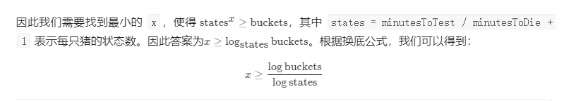

# 0 两数 问题

## 1 大数相加 [415. 字符串相加](https://leetcode-cn.com/problems/add-strings/)

https://www.nowcoder.com/practice/11ae12e8c6fe48f883cad618c2e81475?tpId=190&tqId=36034&rp=1&ru=%2Factivity%2Foj&qru=%2Fta%2Fjob-code-high-rd%2Fquestion-ranking&tab=answerKey

给定两个字符串形式的非负整数 num1 和num2 ，计算它们的和。

 

提示：

num1 和num2 的长度都小于 5100
num1 和num2 都只包含数字 0-9
num1 和num2 都不包含任何前导零
你不能使用任何內建 BigInteger 库， 也不能直接将输入的字符串转换为整数形式

 ```java
class Solution {
    public String addStrings(String num1, String num2) {
      
      StringBuilder sb = new StringBuilder();
      int len1 = num1.length()-1;  
      int len2 = num2.length()-1; 
      
      int index =0;
      int curry =0;
      while(len1-index>=0 && len2-index>=0 ) {
          int sum =  num1.charAt(len1-index) -'0' +num2.charAt(len2-index) -'0' + curry;
          curry = sum/10;
          sb.append(sum%10); 
          index++;
      }
      while(len1-index>=0   ) {
          int sum =  num1.charAt(len1-index) -'0'  + curry;
          curry = sum/10;
          sb.append(sum%10); 
          index++;
      }
      while(  len2-index>=0 ) {
          int sum =    num2.charAt(len2-index) -'0' + curry;
          curry = sum/10;
          sb.append(sum%10); 
          index++;
      }
      if(curry!=0) {
         sb.append(curry); 
      }
      sb.reverse();

      return sb.toString();

    }
}
 ```


## 2 大数相乘 [43. 字符串相乘](https://leetcode-cn.com/problems/multiply-strings/)

 

给定两个以字符串形式表示的非负整数 `num1` 和 `num2`，返回 `num1` 和 `num2` 的乘积，它们的乘积也表示为字符串形式。

**示例 1:**

```
输入: num1 = "2", num2 = "3"
输出: "6"
```

**示例 2:**

```
输入: num1 = "123", num2 = "456"
输出: "56088"
```

**说明：**

1. `num1` 和 `num2` 的长度小于110。
2. `num1` 和 `num2` 只包含数字 `0-9`。
3. `num1` 和 `num2` 均不以零开头，除非是数字 0 本身。
4. **不能使用任何标准库的大数类型（比如 BigInteger）**或**直接将输入转换为整数来处理**。

关键点 1 不能用给一个变量，而是数组 int nums [] = new int [m+n]

​           2         

​          sum =x*y + nums[i+j+1];
​         nums[i+j+1] = sum%10;
​         nums[i+j] += sum/10;

```java
class Solution {
    public String multiply(String num1, String num2) {

      if(num1==null || num1.length() ==0 || num1=="0"||num2==null || num2.length() ==0 || num2=="0") {
          return "0";
      }

      int m = num1.length();
      int n = num2.length();
      int nums [] = new int [m+n];
      int x= 0;
      int y =0;
      int sum =0;
      for(int i =m-1;i>=0;i--) {
          x = num1.charAt(i) -'0'; 
         for(int j = n-1;j>=0;j--) {
          y = num2.charAt(j) -'0'; 
         sum =x*y + nums[i+j+1];
         nums[i+j+1] = sum%10;
         nums[i+j] += sum/10;
         }
      } 
      StringBuilder sb = new StringBuilder();
      int index =-1;
      for(int i =0;i<m+n;i++) {
          if (nums[i] != 0) {
              index =i;
              break;
          }
             
      }

      if(index ==-1) {
          return "0";
      }
      for(int i =index;i<m+n;i++) {
         sb.append(nums[i]);
      }


      return  sb.toString();

    }
}
```


## 3  29	两数相除 

## 4 371. 两整数之和 

 

**不使用**运算符 `+` 和 `-` ，计算两整数 `a` 、`b` 之和。

**示例 1:**

```
输入: a = 1, b = 2
输出: 3
```

**示例 2:**

```
输入: a = -2, b = 3
输出: 1
```

```java
class Solution {
    //https://leetcode-cn.com/problems/sum-of-two-integers/solution/li-yong-wei-cao-zuo-shi-xian-liang-shu-qiu-he-by-p/
    public int getSum(int a, int b) {
      while(b!=0){
        int temp = a^b;
        b= (a&b)<<1;
        a = temp;

      }
      return a;

    }
}
```


# 1、[189. 旋转数组](https://leetcode-cn.com/problems/rotate-array/)

给定一个数组，将数组中的元素向右移动 *k* 个位置，其中 *k* 是非负数。

**示例 1:**

```
输入: [1,2,3,4,5,6,7] 和 k = 3
输出: [5,6,7,1,2,3,4]
解释:
向右旋转 1 步: [7,1,2,3,4,5,6]
向右旋转 2 步: [6,7,1,2,3,4,5]
向右旋转 3 步: [5,6,7,1,2,3,4]
```

**示例 2:**

```
输入: [-1,-100,3,99] 和 k = 2
输出: [3,99,-1,-100]
解释: 
向右旋转 1 步: [99,-1,-100,3]
向右旋转 2 步: [3,99,-1,-100]
```

# 2 238 [ 除自身以外数组的乘积](https://leetcode-cn.com/problems/product-of-array-except-self/)


# 一 区间问题

#### [56. 合并区间](https://leetcode-cn.com/problems/merge-intervals/)

https://www.nowcoder.com/practice/69f4e5b7ad284a478777cb2a17fb5e6a?tpId=190&tqId=35348&rp=1&ru=%2Factivity%2Foj&qru=%2Fta%2Fjob-code-high-rd%2Fquestion-ranking&tab=answerKey

以数组 intervals 表示若干个区间的集合，其中单个区间为 intervals[i] = [starti, endi] 。请你合并所有重叠的区间，并返回一个不重叠的区间数组，该数组需恰好覆盖输入中的所有区间。

 

示例 1：

输入：intervals = [[1,3],[2,6],[8,10],[15,18]]
输出：[[1,6],[8,10],[15,18]]
解释：区间 [1,3] 和 [2,6] 重叠, 将它们合并为 [1,6].
示例 2：

输入：intervals = [[1,4],[4,5]]
输出：[[1,5]]
解释：区间 [1,4] 和 [4,5] 可被视为重叠区间。

```java

```


#### [228. 汇总区间](https://leetcode-cn.com/problems/summary-ranges/)

 

给定一个无重复元素的有序整数数组 `nums` 。

返回 **恰好覆盖数组中所有数字** 的 **最小有序** 区间范围列表。也就是说，`nums` 的每个元素都恰好被某个区间范围所覆盖，并且不存在属于某个范围但不属于 `nums` 的数字 `x` 。

列表中的每个区间范围 `[a,b]` 应该按如下格式输出：

- `"a->b"` ，如果 `a != b`
- `"a"` ，如果 `a == b`

 

**示例 1：**

```
输入：nums = [0,1,2,4,5,7]
输出：["0->2","4->5","7"]
解释：区间范围是：
[0,2] --> "0->2"
[4,5] --> "4->5"
[7,7] --> "7"
```

**示例 2：**

```
输入：nums = [0,2,3,4,6,8,9]
输出：["0","2->4","6","8->9"]
解释：区间范围是：
[0,0] --> "0"
[2,4] --> "2->4"
[6,6] --> "6"
[8,9] --> "8->9"
```

**示例 3：**

```
输入：nums = []
输出：[]
```

**示例 4：**

```
输入：nums = [-1]
输出：["-1"]
```

**示例 5：**

```
输入：nums = [0]
输出：["0"]
```

```java
class Solution {
    public List<String> summaryRanges(int[] nums) {

     List<String> res = new ArrayList<>();
     int len = nums.length;
     if(len==0) {
         return res;
     }
     int start =nums[0];
     int end =nums[0];
     for(int i =1;i<nums.length;i++) {
        if(nums[i]==end+1){
          end = nums[i];
        }else{

         if(start==end) {
             res.add(""+start);
         }else {
             res.add(start+"->"+end);
         }  

         start =nums[i];
         end =nums[i]; 
        }     

     } 

        if(start==end) {
            res.add(""+start);
        }else {
            res.add(start+"->"+end);
        }   

     return res; 
    }
}
```

#### [327. 区间和的个数](https://leetcode-cn.com/problems/count-of-range-sum/)

给定一个整数数组 nums，返回区间和在 [lower, upper] 之间的个数，包含 lower 和 upper。
区间和 S(i, j) 表示在 nums 中，位置从 i 到 j 的元素之和，包含 i 和 j (i ≤ j)。

说明:
最直观的算法复杂度是 O(n2) ，请在此基础上优化你的算法。

示例:

输入: nums = [-2,5,-1], lower = -2, upper = 2,
输出: 3 
解释: 3个区间分别是: [0,0], [2,2], [0,2]，它们表示的和分别为: -2, -1, 2。

```java

```

#### [436. 寻找右区间](https://leetcode-cn.com/problems/find-right-interval/)


 


# 二 数组的partition（初级2）

#  [75. 颜色分类](https://leetcode-cn.com/problems/sort-colors/) 荷兰旗问题 和数组的partition调整


**核心思想快排** 初级班第二节

给定一个包含红色、白色和蓝色，一共 n 个元素的数组，原地对它们进行排序，使得相同颜色的元素相邻，并按照红色、白色、蓝色顺序排列。

此题中，我们使用整数 0、 1 和 2 分别表示红色、白色和蓝色。

注意:
不能使用代码库中的排序函数来解决这道题。

示例:

输入: [2,0,2,1,1,0]
输出: [0,0,1,1,2,2]

 本问题被称为 [荷兰国旗问题](https://en.wikipedia.org/wiki/Dutch_national_flag_problem) ，重点在双指针排序上面,注意当前指针，只有0或等于1才移动，

```java
class Solution {
  /*
  荷兰三色旗问题解
  */
  public void sortColors(int[] nums) {
    // 对于所有 idx < i : nums[idx < i] = 0
    // j是当前考虑元素的下标
    int p0 = 0, curr = 0;
    // 对于所有 idx > k : nums[idx > k] = 2
    int p2 = nums.length - 1;

    int tmp;
    while (curr <= p2) {
      if (nums[curr] == 0) {
        // 交换第 p0个和第curr个元素
        // i++，j++
        tmp = nums[p0];
        nums[p0++] = nums[curr];
        nums[curr++] = tmp;
      }
      else if (nums[curr] == 2) {
        // 交换第k个和第curr个元素
        // p2--
        tmp = nums[curr];
        nums[curr] = nums[p2];
        nums[p2--] = tmp;
      }
      else curr++;
    }
  }
}
```

2. 给定一个数组arr， 和一个数num， 请把小于等于num的数放在数
   组的左边， 大于num的数放在数组的右边。
   要求额外空间复杂度O(1)， 时间复杂度O(N  ）

#### [324. 摆动排序 II](https://leetcode-cn.com/problems/wiggle-sort-ii/)

给定一个无序的数组 nums，将它重新排列成 nums[0] < nums[1] > nums[2] < nums[3]... 的顺序。

示例 1:

输入: nums = [1, 5, 1, 1, 6, 4]
输出: 一个可能的答案是 [1, 4, 1, 5, 1, 6]
示例 2:

输入: nums = [1, 3, 2, 2, 3, 1]
输出: 一个可能的答案是 [2, 3, 1, 3, 1, 2]
说明:
你可以假设所有输入都会得到有效的结果。

进阶:
你能用 O(n) 时间复杂度和 / 或原地 O(1) 额外空间来实现吗？

```java
class Solution {
    private void swap(int[] nums, int i, int j) {
        int tmp = nums[i];
        nums[i] = nums[j];
        nums[j] = tmp;
    }

    private void quickSelct(int[] nums, int start, int end, int n) {
        int t = nums[end - 1];
        int i = start, j = start;
        while (j < end) {
            if (nums[j] <= t) {
                swap(nums, i++, j++);
            } else {
                j++;
            }
        }
        if (i - 1 > n) {
            quickSelct(nums, start, i - 1, n);
        } else if (i < n) {
            quickSelct(nums, i, end, n);
        }
    }

    public void wiggleSort(int[] nums) {
        int len = nums.length;
        int mid = len / 2;
        quickSelct(nums, 0, len, mid);

        // 3-way-patition
        int i = 0, j = 0, k = len - 1;
        int midVal = nums[mid];
        while ( j < k) {
            if (nums[j] > midVal) {
                swap(nums, j, k);
                k--;
            } else if (nums[j] < midVal) {
                swap(nums, i, j);
                i++;
                j++;
            } else {
                j++;
            }
        }

        int[] tmpNums = new int[len];
        System.arraycopy(nums, 0, tmpNums, 0, len);
        int partitionIndex = mid;
        if (len % 2 == 1) {
            partitionIndex++;
        }
        for (int index = partitionIndex - 1, indexRes = 0; index >= 0; index--, indexRes += 2) {
            nums[indexRes] = tmpNums[index];
        }
        for (int index = len - 1, indexRes = 1; index >= partitionIndex; index--, indexRes += 2) {
            nums[indexRes] = tmpNums[index];
        }
    }
}
```


#  [179. 最大数](https://leetcode-cn.com/problems/largest-number/)


# 三 堆排序问题(初级2)

大根堆，完全二叉树。


**Top" k 题型总结：**

## 347 前 K 个高频元素

给定一个非空的整数数组，返回其中出现频率前 k （大于K的）高的元素。

示例 1:

输入: nums = [1,1,1,2,2,3], k = 2
输出: [1,2]
示例 2:

输入: nums = [1], k = 1
输出: [1]


提示：

你可以假设给定的 k 总是合理的，且 1 ≤ k ≤ 数组中不相同的元素的个数。
你的算法的时间复杂度必须优于 O(n log n) , n 是数组的大小。
题目数据保证答案唯一，换句话说，数组中前 k 个高频元素的集合是唯一的。
你可以按任意顺序返回答案。

```java
class Solution {
    public int[] topKFrequent(int[] nums, int k) {

        Map<Integer,Integer> map = new HashMap<>();

        for (int i=0;i<nums.length;i++){
            map.put(nums[i],map.getOrDefault(nums[i],0)+1);
        }
        //小根堆
        Queue<Integer> q= new PriorityQueue<Integer>((a,b)-> map.get(a)- map.get( b));


        for (Integer integer : map.keySet()){
            q.add(integer);
            //大于K就poll
            if (q.size()>k){
                q.poll();
            }
        }
       int [] res = new int[q.size()];

        int i=0;
        while (!q.isEmpty()){
            res[i++] = q.poll();
        }
        return  res;
    }
}
```

## 215. 数组中的第K个最大元素

在未排序的数组中找到第 k 个最大的元素。请注意，你需要找的是数组排序后的第 k 个最大的元素，而不是第 k 个不同的元素。

示例 1:

输入: [3,2,1,5,6,4] 和 k = 2
输出: 5
示例 2:

输入: [3,2,3,1,2,4,5,5,6] 和 k = 4
输出: 4

```java
class Solution {
    public int findKthLargest(int[] nums, int k) {
        //小根堆
    PriorityQueue<Integer> p = new PriorityQueue<>((a,b)->a-b);
    for(int num : nums) {
        p.offer(num);
        if(p.size()>k){
            p.poll();
        }
    }  

    return p.peek();   

    }
}
```


## 295 数据流的中位数

中位数是有序列表中间的数。如果列表长度是偶数，中位数则是中间两个数的平均值。

例如，

[2,3,4] 的中位数是 3

[2,3] 的中位数是 (2 + 3) / 2 = 2.5

设计一个支持以下两种操作的数据结构：

void addNum(int num) - 从数据流中添加一个整数到数据结构中。
double findMedian() - 返回目前所有元素的中位数。
示例：

addNum(1)
addNum(2)
findMedian() -> 1.5
addNum(3) 
findMedian() -> 2


## [373. 查找和最小的K对数字](https://leetcode-cn.com/problems/find-k-pairs-with-smallest-sums/) 

给定两个以升序排列的整形数组 nums1 和 nums2, 以及一个整数 k。

定义一对值 (u,v)，其中第一个元素来自 nums1，第二个元素来自 nums2。

找到和最小的 k 对数字 (u1,v1), (u2,v2) ... (uk,vk)。

示例 1:

输入: nums1 = [1,7,11], nums2 = [2,4,6], k = 3
输出: [1,2],[1,4],[1,6]
解释: 返回序列中的前 3 对数：
     [1,2],[1,4],[1,6],[7,2],[7,4],[11,2],[7,6],[11,4],[11,6]
示例 2:

输入: nums1 = [1,1,2], nums2 = [1,2,3], k = 2
输出: [1,1],[1,1]
解释: 返回序列中的前 2 对数：
     [1,1],[1,1],[1,2],[2,1],[1,2],[2,2],[1,3],[1,3],[2,3]
示例 3:

输入: nums1 = [1,2], nums2 = [3], k = 3 
输出: [1,3],[2,3]
解释: 也可能序列中所有的数对都被返回:[1,3],[2,3]

```java
class Solution {
    public List<List<Integer>> kSmallestPairs(int[] nums1, int[] nums2, int k) {
        // 大顶堆，比较器使用lambda表达式，更简洁
        PriorityQueue<List<Integer>> queue = new PriorityQueue<>(k, (o1, o2)->{
            return (o2.get(0) + o2.get(1)) - (o1.get(0) + o1.get(1));
        });
        
        // 遍历所有可能的集合
        for(int i = 0; i < Math.min(nums1.length, k); i++){
            for(int j = 0; j < Math.min(nums2.length, k); j++){
                // 剪枝，如果当前的两个数之和超过了堆顶元素，由于数组已经排序，后面的元素只会更大，因此无需继续遍历
                if(queue.size() == k && nums1[i]+nums2[j] > queue.peek().get(0) + queue.peek().get(1)){
                    break;
                }

                // 若比堆顶小，则弹出堆顶元素，把当前数对加入
                if(queue.size() == k){
                    queue.poll();
                }
                List<Integer> pair = new ArrayList<>();
                pair.add(nums1[i]);
                pair.add(nums2[j]);
                queue.add(pair);
            }
        }

        // 最后将元素弹出，倒序插入数组即可
        List<List<Integer>> res = new LinkedList<>();
        for(int i =0; i < k && !queue.isEmpty(); i++){
            res.add(0, queue.poll());
        }
        return res;
    }
}
```

## 973 [最接近原点的 K 个点](https://leetcode-cn.com/problems/k-closest-points-to-origin/)

我们有一个由平面上的点组成的列表 points。需要从中找出 K 个距离原点 (0, 0) 最近的点。

（这里，平面上两点之间的距离是欧几里德距离。）

你可以按任何顺序返回答案。除了点坐标的顺序之外，答案确保是唯一的。

示例 1：

输入：points = [[1,3],[-2,2]], K = 1
输出：[[-2,2]]
解释： 
(1, 3) 和原点之间的距离为 sqrt(10)，
(-2, 2) 和原点之间的距离为 sqrt(8)，
由于 sqrt(8) < sqrt(10)，(-2, 2) 离原点更近。
我们只需要距离原点最近的 K = 1 个点，所以答案就是 [[-2,2]]。
示例 2：

输入：points = [[3,3],[5,-1],[-2,4]], K = 2
输出：[[3,3],[-2,4]]
（答案 [[-2,4],[3,3]] 也会被接受。）


提示：

1 <= K <= points.length <= 10000
-10000 < points[i][0] < 10000
-10000 < points[i][1] < 10000

```java

```


"Top" k - 4: leetcode 1167

## 面试题 17.14. 最小K个数

设计一个算法，找出数组中最小的k个数。以任意顺序返回这k个数均可。

示例：

输入： arr = [1,3,5,7,2,4,6,8], k = 4
输出： [1,2,3,4]
提示：

0 <= len(arr) <= 100000
0 <= k <= min(100000, len(arr))

```java
class Solution {
    public int[] smallestK(int[] arr, int k) {

      PriorityQueue<Integer> q = new PriorityQueue<>((a,b)->b-a);

      for(int num:arr) {
         q.offer(num);
         if(q.size()>k){
             q.poll();
         }
      } 
      int ans[] = new int [q.size()];
      int index =0;
      while(!q.isEmpty()) {
         ans[index++] = q.poll();
      }
      return ans;

    }
}
```


## 386 字典序排数

给定一个非负整数 n，计算各位数字都不同的数字 x 的个数，其中 0 ≤ x < 10n 。

示例:

输入: 2
输出: 91 
解释: 答案应为除去 11,22,33,44,55,66,77,88,99 外，在 [0,100) 区间内的所有数字。

```java
//排序nlogn 不使用
//1. dfs
class Solution {
    public List<Integer> lexicalOrder(int n) {
            List<Integer> res = new ArrayList<>();
            dfs(res,0,n,0);  
            return res;
        }
        private void dfs(List<Integer> res,int num,int n,int level) {
         if(num>n) {
             return;
         }
         if(num>0){
            res.add(num); 
         }
         for(int i = level > 0 ? 0 : 1;i<10;i++) {
              dfs(res,num*10+i,n,level+1);  
         } 
        } 
}

//2 先序遍历10叉树
class Solution {
    public List<Integer> lexicalOrder(int n) {
            List<Integer> res = new ArrayList<>();
            Deque<Integer> stack = new LinkedList<>();
            if(n<=9) {
               for(int i =n;i>0;i--){
                 stack.push(i);
               } 
            } else {
               for(int i =9;i>0;i--){
                 stack.push(i);
               }  
            }
            
            while(!stack.isEmpty()) {
                int tem = stack.pop();
                res.add(tem);
                if(tem*10>n) {
                    continue;
                }
                for(int i =Math.min(n,tem*10 +9);i>=tem*10;i--) {
                 stack.push(i);
                }
            }
            return res;
        }
    
}


```


## 440. 字典序的第K小数字（字节跳动常考）

给定整数 n 和 k，找到 1 到 n 中字典序第 k 小的数字。

注意：1 ≤ k ≤ n ≤ 109。

示例 :

输入:
n: 13   k: 2

输出:
10

解释:
字典序的排列是 [1, 10, 11, 12, 13, 2, 3, 4, 5, 6, 7, 8, 9]，所以第二小的数字是 10。

```java
//方法一 ：堆排序//超时

class Solution {
    public int findKthNumber(int n, int k) {


            PriorityQueue<Integer> q = new PriorityQueue<>((a, b)->{
                String str1 = String.valueOf(a);
                String str2 = String.valueOf(b);
                return str2.compareTo(str1);
            });

            for(int i =1;i<=n;i++) {
                q.offer(i);
                if(q.size()>k) {
                    q.poll();
                }
            }
            return q.isEmpty()?-1:q.poll();
        }
}
//方法二 ：树形数组


```

 https://leetcode-cn.com/problems/k-th-smallest-in-lexicographical-order/solution/yi-tu-sheng-qian-yan-by-pianpianboy/ 

 https://leetcode-cn.com/problems/k-th-smallest-in-lexicographical-order/solution/ju-ran-shuang-100chu-hu-yi-liao-can-kao-liao-bie-r/ 

```java
class Solution {
    public int findKthNumber(int n, int k) {
        //把k看成还有多少距离可以“消耗”
        int rest = k-1;//倒数第1个，就是从1开始
        int result = 1;//从1开始
        while(rest>0){//消耗到0为止
            int branchLength=getBranch(n, result, result+1);//获取当前分支长度
            if(rest>=branchLength){
                //当前分支困不住
                //消耗当前分支距离
                rest-=branchLength;
                result+=1;//结果+1（隐含了后面应有的0）
            }else{
                //是当前分支了
                result*=10;//进入新分支，十叉树深度+1
                rest-=1;//进入新的节点
            }
        }
        return result;
    }

    /**
    * 求当前分支的数量
    * @param first 分支区间的第一个数[first, last).而且因为是*10，要考虑溢出
    * @param last 分支区间的最后一个数[first, last).而且因为是*10，要考虑溢出
    **/
    private int getBranch(int n, long first, long last){
        int count = 0;
        while(n>=first){//仍然大于first，first可以激进地进一位试试
            count+=Math.min(n+1, last)-first;//例如n=685，first传参为3，last为4。那么经过几轮十进，first会在3000时退出迭代，count经过三轮不同位的迭代，返回111，符合逻辑预期。如果first为6，last为7，那么count最后那一轮会额外+（n+1）即86，因为600到685有86个数。
            first*=10;//激进地进十。也就是十叉树深度+1
            last*=10;

        }
        return count;
    }
}

```


"Top" k - 2: 面试题17.14


# 四 宏观数组问题

## [6. Z 字形变换](https://leetcode-cn.com/problems/zigzag-conversion/)

##  [48. 旋转图像](https://leetcode-cn.com/problems/rotate-image/) [面试题 01.07. 旋转矩阵](https://leetcode-cn.com/problems/rotate-matrix-lcci/)

给定 matrix =
[
  [ 5, 1, 9,11],
  [ 2, 4, 8,10],
  [13, 3, 6, 7],
  [15,14,12,16]
], 

原地旋转输入矩阵，使其变为:
[
  [15,13, 2, 5],
  [14, 3, 4, 1],
  [12, 6, 8, 9],
  [16, 7,10,11]
]

```java
class Solution {
    public void rotate(int[][] matrix) {
    int tR =0;
    int tC =0;
    int dR =matrix.length-1;
    int dC =matrix[0].length-1;
     //旋转边界，转化为顶点问题
    while(tC<dC){
         rotate(matrix,tR++,tC++,dR--,dC--);
    }
    }
    private void rotate(int [][] matrix,int tR,int tC,int dR,int dC){
        int time = dR - tR;
        
        for(int i =0;i<time;i++){

        int temp = matrix[tR][tC+i];
        matrix[tR][tC+i] = matrix[dR-i][tC];
        matrix[dR-i][tC] = matrix[dR][dC-i];
        matrix[dR][dC-i] = matrix[tC+i][dC];
        matrix[tC+i][dC] =temp;
        }
    }

}
```

## [54. 螺旋矩阵](https://leetcode-cn.com/problems/spiral-matrix/)  

给定一个包含 m x n 个元素的矩阵（m 行, n 列），请按照顺时针螺旋顺序，返回矩阵中的所有元素。

示例 1:

输入:
[
 [ 1, 2, 3 ],
 [ 4, 5, 6 ],
 [ 7, 8, 9 ]
]
输出: [1,2,3,6,9,8,7,4,5]

```java
class Solution {
    public List<Integer> spiralOrder(int[][] matrix) {
      List<Integer> res = new ArrayList<>();
      int m = matrix.length;
      if(m==0){
          return res;
      }
      int n = matrix[0].length;
      
      int tR =0;
      int tC =0;
      int dR= m-1;
      int dC = n-1;

      while(tR<=dR && tC<=dC){
        res.addAll(print(matrix,tR,tC,dR,dC));
        tC++;
        tR++;
        dR--;
        dC--;
      }
      return res;
    }

    private List<Integer> print(int[][] matrix,int tR,int tC,int dR,int dC){
      List<Integer> res = new ArrayList<>();

      if(tR == dR) {
        for(int i = tC;i<=dC;i++){
        res.add(matrix[tR][i]);
        }
        return res;
      } else if (tC == dC){
          for(int i = tR;i<=dR;i++){
           res.add(matrix[i][tC]);
          }       
          return res;
      } 
      for(int i =tC;i<dC;i++){
          res.add(matrix[tR][i]);
      }
      for(int j =tR;j<dR;j++){
          res.add(matrix[j][dC]);
      }
      for(int i =dC;i>tC;i--){
          res.add(matrix[dR][i]);
      }
      for(int j =dR;j>tR;j--){
          res.add(matrix[j][tC]);
      }
      return res;
    }
}
```


##  [59. 螺旋矩阵 II](https://leetcode-cn.com/problems/spiral-matrix-ii/)

##  [498. 对角线遍历](https://leetcode-cn.com/problems/diagonal-traverse/)

 请以对角线遍历的顺序返回这个矩阵中的所有元素，对角线遍历如下图所示。 

输入:
[
 [ 1, 2, 3 ],
 [ 4, 5, 6 ],
 [ 7, 8, 9 ]
]

输出:  [1,2,4,7,5,3,6,8,9]

  

```java
class Solution {
    public int[] findDiagonalOrder(int[][] matrix) {

     int m = matrix.length;
     if (m==0) return new int[0];
     int n = matrix[0].length;
     int tR =0;
     int tC=0;
     int dR =0;
     int dC =0;
     int ans[] = new int[m*n];
     List<Integer> res = new ArrayList<>();

     int flag =0;
     for(;dC<=n;){
       flag = flag%2;
        res.addAll(print(matrix,tR,tC,dR,dC,flag==0));
       if(tC<n-1){
         tC = tC+1;
       }else{
         tR = tR +1;
       }  
       if(dR<m-1){
         dR = dR +1;
       }else{
         dC = dC +1; 
       }
       flag ++;
     } 

     for(int i =0;i<m*n;i++){
        ans[i] = res.get(i);
     }
     return ans;
    }

    private List<Integer> print(int [][]matrix,int tR,int tC,int dR,int dC,boolean flag){

      List<Integer> res = new ArrayList<>();  
      if(flag){
       while(dR>=tR){
         res.add(matrix[dR--][dC++]);
       }
      }else{
        while(dR>=tR){
         res.add(matrix[tR++][tC--]);
       }     
      }
      return res;
    }
}
```


# 五 归并排序 

```java
    public static void mergeSort(int[] data) {  
        sort(data, 0, data.length - 1);  
    }  
  
    public static void sort(int[] data, int left, int right) {  
        if (left >= right)  
            return;  
        // 找出中间索引  
        int center = (left + right) / 2;  
        // 对左边数组进行递归  
        sort(data, left, center);  
        // 对右边数组进行递归  
        sort(data, center + 1, right);  
        // 合并  
        merge(data, left, center, right);  
        print(data);  
    }  
  
    /** 
     * 将两个数组进行归并，归并前面2个数组已有序，归并后依然有序 
     *  
     * @param data 
     *            数组对象 
     * @param left 
     *            左数组的第一个元素的索引 
     * @param center 
     *            左数组的最后一个元素的索引，center+1是右数组第一个元素的索引 
     * @param right 
     *            右数组最后一个元素的索引 
     */  
    public static void merge(int[] data, int left, int center, int right) {  
        // 临时数组  
        int[] tmpArr = new int[data.length];  
        // 右数组第一个元素索引  
        int mid = center + 1;  
        // third 记录临时数组的索引  
        int third = left;  
        // 缓存左数组第一个元素的索引  
        int tmp = left;  
        while (left <= center && mid <= right) {  
            // 从两个数组中取出最小的放入临时数组  
            if (data[left] <= data[mid]) {  
                tmpArr[third++] = data[left++];  
            } else {  
                tmpArr[third++] = data[mid++];  
            }  
        }  
        // 剩余部分依次放入临时数组（实际上两个while只会执行其中一个）  
        while (mid <= right) {  
            tmpArr[third++] = data[mid++];  
        }  
        while (left <= center) {  
            tmpArr[third++] = data[left++];  
        }  
        // 将临时数组中的内容拷贝回原数组中  
        // （原left-right范围的内容被复制回原数组）  
        while (tmp <= right) {  
            data[tmp] = tmpArr[tmp++];  
        }  
    }  
 
```


## 88归并两个有序数组

给你两个有序整数数组 nums1 和 nums2，请你将 nums2 合并到 nums1 中，使 nums1 成为一个有序数组。

说明:

初始化 nums1 和 nums2 的元素数量分别为 m 和 n 。
你可以假设 nums1 有足够的空间（空间大小大于或等于 m + n）来保存 nums2 中的元素。


示例:

输入:
nums1 = [1,2,3,0,0,0], m = 3
nums2 = [2,5,6],       n = 3

输出: [1,2,2,3,5,6]

```java
class Solution {
    public int[] findDiagonalOrder(int[][] matrix) {

     int m = matrix.length;
     if (m==0) return new int[0];


     int n = matrix[0].length;

     int tR =0;
     int tC=0;

     int dR =0;
     int dC =0;

     int ans[] = new int[m*n];
     List<Integer> res = new ArrayList<>();

     int flag =0;
     for(;dC<=n;){

       flag = flag%2;
        res.addAll(print(matrix,tR,tC,dR,dC,flag==0));
       if(tC<n-1){
         tC = tC+1;
       }else{
         tR = tR +1;
       }  
       if(dR<m-1){
         dR = dR +1;
       }else{
         dC = dC +1; 
       }
       
       flag ++;
     } 

     for(int i =0;i<m*n;i++){
        ans[i] = res.get(i);
     }
     return ans;
    }

    private List<Integer> print(int [][]matrix,int tR,int tC,int dR,int dC,boolean flag){

      List<Integer> res = new ArrayList<>();  
      if(flag){
       while(dR>=tR){
         res.add(matrix[dR--][dC++]);
       }
      }else{
        while(dR>=tR){
         res.add(matrix[tR++][tC--]);
       }     
      }

      return res;
    }


}
```

# 逆序对和  小和问题  （高频）

**核心是归并排序**

 **小和问题**
在一个数组中， 每一个数左边比当前数小的数累加起来， 叫做这个数组的小和。 求一个数组
的小和。
例子：
[1,3,4,2,5]
1左边比1小的数， 没有；
3左边比3小的数， 1；
4左边比4小的数， 1、 3；
2左边比2小的数， 1；
5左边比5小的数， 1、 3、 4、 2；
所以小和为1+1+3+1+1+3+4+2=16  

## 315. 计算右侧小于当前元素的个数

```java
class Solution {
    public List<Integer> countSmaller(int[] nums) {
         int n = nums.length;
         //构建index数组，对index排序，不对数组排序
         int index[] = new int [n];
         int res[] = new int [n];
         Arrays.fill(res,0);
         for(int i=0;i<n;i++){
             index[i] =i;
         }
         mergeSort(nums,index,0,n-1,res);

         List<Integer> ans = new ArrayList<>(); 
         for(int i =0;i<n;i++){
             ans.add(res[i]);
         }
          return ans;
         
    }
    private void mergeSort(int [] nums,int index[],int left,int right,int []res){
          if(left <right){
           int mid = left + (right-left)/2;
           mergeSort(nums,index,left,mid,res);
           mergeSort(nums,index,mid+1,right,res);
           mergeTwo(nums,index,left,mid,right,res);
          }

    }
    private void mergeTwo(int [] nums,int[] index,int left,int mid,int right,int [] res){

      int tmp[] = new int [right-left+1];
      

      int i =left;
      int j = mid +1;
      int k=0;

    while(i<=mid && j<=right){
        if(nums[index[i]]<=nums[index[j]]){
            tmp[k] = index[i];
            res[tmp[k]] += (j - mid - 1);
            i++;
        }else{
           tmp[k] = index[j];
            j++;
        }
        k++;
    }
    while(i<=mid){
        tmp[k] = index[i];
        res[tmp[k]] += (j - mid - 1);
        i++;
        k++;
    }
    while( j<=right) {
        tmp[k] = index[j];
        j++;
        k++;
    }
    System.arraycopy(tmp,0,index,left,right-left+1);

    } 

```


## 629 逆序对数组

## 剑指 Offer 51. 数组中的逆序对

```java
class Solution {
    public int reversePairs(int[] nums) {
     
     return mergeSort(nums,0,nums.length-1);
    }
    int mergeSort(int [] nums,int left,int right){
        int cunt =0;
        if(left<right){
           int mid = left + (right-left)/2;
           cunt = cunt + mergeSort(nums,left,mid);
           cunt = cunt + mergeSort(nums,mid+1,right);
           cunt= cunt + merge(nums,left,mid,right);
        }
        return cunt;
    }
    int merge(int [] nums,int left,int mid,int right){

      int tem[] = new int [right-left+1];
      
      int i = left;
      int j = mid +1;
      int k =0;
      int cunt =0;
      while(i<=mid && j<=right){
          //必须有等号  归并必须稳定不然对逆序对有影响
          if(nums[i]<=nums[j]){
              //i只要移动 必然新产生j- (mid + 1)个逆序对
              cunt = cunt+j- (mid + 1);
              tem[k++] = nums[i]; 
              i++;
          }else{     
            tem[k++] = nums[j]; 
              j++;
          }
      }
      
      while(i<=mid){
            //i只要移动 必然新产生j- (mid + 1)个逆序对
            cunt = cunt+j- (mid + 1);
            tem[k++] = nums[i]; 
              i++;
      }
      while(j<=right){   
        tem[k++] = nums[j]; 
        j++;
      }
       System.arraycopy(tem, 0, nums, left, right - left + 1);
       return cunt;
    }
}
```


# 23 [384. 打乱数组](https://leetcode-cn.com/problems/shuffle-an-array/)


# 26存在重复元素问题

#### [217. 存在重复元素](https://leetcode-cn.com/problems/contains-duplicate/)

给定一个整数数组，判断是否存在重复元素。

如果任意一值在数组中出现至少两次，函数返回 true 。如果数组中每个元素都不相同，则返回 false 。

 

示例 1:

输入: [1,2,3,1]
输出: true
示例 2:

输入: [1,2,3,4]
输出: false
示例 3:

输入: [1,1,1,3,3,4,3,2,4,2]
输出: true

```java
class Solution {
    public boolean containsDuplicate(int[] nums) {
       Map<Integer,Integer> map = new HashMap<>();
       for(int i =0;i<nums.length;i++){

          int cunt =  map.getOrDefault(nums[i],0);
           if(cunt>=1){
               return true;
           } 
           map.put(nums[i],cunt+1);
       }
       return false;
    }
}
```


#### [219. 存在重复元素 II](https://leetcode-cn.com/problems/contains-duplicate-ii/)

给定一个整数数组和一个整数 k，判断数组中是否存在两个不同的索引 i 和 j，使得 nums [i] = nums [j]，并且 i 和 j 的差的 绝对值 至多为 k。

 

示例 1:

输入: nums = [1,2,3,1], k = 3
输出: true

```java
class Solution {
    public boolean containsNearbyDuplicate(int[] nums, int k) {
        Map<Integer,Integer> map = new HashMap<>();
        for(int i =0;i<nums.length;i++) {
         if(map.containsKey(nums[i]) && i-map.get(nums[i])<=k) {
             return true;
         }else{
            map.put(nums[i],i);
         }
        }
        return false; 


    }
}
```


# 六 缺失数字问题（必考）

## 41[缺失的第一个正数](https://leetcode-cn.com/problems/first-missing-positive/)（无序，可能重复 必考）448很像

给你一个未排序的整数数组，请你找出其中没有出现的最小的正整数。

示例 1:

输入: [1,2,0]
输出: 3
示例 2:

输入: [3,4,-1,1]
输出: 2
示例 3:

输入: [7,8,9,11,12]
输出: 1

```java
class Solution {
    public int firstMissingPositive(int[] nums) {

     //负数和 零 和谐掉
     int n = nums.length; 
      for(int i =0;i<n;i++) {
         if( nums[i]<=0){
            nums[i] = n+1;
         }
     }   
     // 构建新的指针  index = index = Math.abs(nums[i])-1
     for(int i =0;i<n;i++) {
            index = Math.abs(nums[i])-1;
            if (index < n) {
                nums[index ] = -Math.abs(nums[index]);
            }
     }
     for(int i = 0;i<n;i++) {
         if(nums[i]>0){
             return i+1;
         }
     }

     return n+1; 
    }
}
```


## [268. 缺失数字](https://leetcode-cn.com/problems/missing-number/)（只有一个没出现，且无重复）

给定一个包含 `0, 1, 2, ..., n` 中 *n* 个数的序列，找出 0 .. *n* 中没有出现在序列中的那个数。

**示例 1:**

```
输入: [3,0,1]
输出: 2
```

**示例 2:**

```
输入: [9,6,4,2,3,5,7,0,1]
输出: 8
```

```java
class Solution {
    public int missingNumber(int[] nums) {
      int ans=0;
      for(int i = 1;i<=nums.length;i++){
          ans = ans ^ i ^ nums[i-1];
      }
      return ans;       
    }
}
```

## 448. 找到所有数组中消失的数字（无序）

给定一个范围在 1 ≤ a[i] ≤ *n* ( *n* = 数组大小 ) 的 整型数组，数组中的元素一些出现了两次，另一些只出现一次。

找到所有在 [1, *n*] 范围之间没有出现在数组中的数字。

您能在不使用额外空间且时间复杂度为*O(n)*的情况下完成这个任务吗? 你可以假定返回的数组不算在额外空间内。

**示例:**

```
输入:
[4,3,2,7,8,2,3,1]

输出:
[5,6]
```

```java
class Solution {
    public List<Integer> findDisappearedNumbers(int[] nums) {
        
        for (int i = 0; i < nums.length; i++) {    
            // -1的作用是为了不大于等于N 类似hash表
            int newIndex = Math.abs(nums[i]) - 1;
            // 防止出现偶数次，导致统计出错 
            if (nums[newIndex] > 0) {
                nums[newIndex] *= -1;
            }
        }
        
   
        List<Integer> result = new LinkedList<Integer>();
        

        for (int i = 1; i <= nums.length; i++) {
            //找出大于0的 索引小于数值1
            if (nums[i - 1] > 0) {
                result.add(i);
            }
        }
        
        return result;
    }
}

```

#### [442. 数组中重复的数据](https://leetcode-cn.com/problems/find-all-duplicates-in-an-array/)

```java
class Solution {
    public List<Integer> findDuplicates(int[] nums) {
       List<Integer> res = new ArrayList<>();
       int len = nums.length; 
       for(int i =0;i<nums.length;i++) { 
          if(nums[Math.abs(nums[i])-1]>0) {
            nums[Math.abs(nums[i])-1] = -1*nums[Math.abs(nums[i])-1];
          } 
       }
       for(int i =0;i<nums.length;i++) { 
            nums[Math.abs(nums[i])-1] = -1*nums[Math.abs(nums[i])-1];  
       }


       for(int i =0;i<nums.length;i++) {
         if(nums[i]<0) {
             res.add(i+1);
         }  
       }

       return res; 
    }
}


class Solution {
    public List<Integer> findDuplicates(int[] nums) {
       List<Integer> res = new ArrayList<>();
       int len = nums.length; 
       for(int i =0;i<nums.length;i++) { 
          if(nums[Math.abs(nums[i])-1]>0) {
            nums[Math.abs(nums[i])-1] = -1*nums[Math.abs(nums[i])-1];
          } else{
            res.add(Math.abs(nums[i]));   
          } 
       }
   
       return res; 
    }
}


```


##  [剑指 Offer 53 - II. 0～n-1中缺失的数字](https://leetcode-cn.com/problems/que-shi-de-shu-zi-lcof/)(有序)

一个**长度为n-1的递增排序数组中的所有数字都是唯一**的，并且每个数字都在范围0～n-1之内。在范围0～n-1内的n个数字中有且只有一个数字不在该数组中，请找出这个数字。

示例 1:

输入: [0,1,3]
输出: 2
示例 2:

输入: [0,1,2,3,4,5,6,7,9]
输出: 8

```java
class Solution {
    public int missingNumber(int[] nums) {
       
       int left =0;
       int right = nums.length-1;
       while(left<=right) {

       int mid = left +(right-left)/2;
       if(mid == nums[mid]){
           left = mid +1;

       } else if (nums[mid]>mid){
           right = mid-1;   
       } else{
           left = mid +1;
       }
       }
       return left;
    }
}
```

# 七 n数之和（必考）

# 15  三数之和（必考  减子  双指针

关键点： 1 减支

​                2 用双指针 减少循环  start<end

```java
class Solution {
    public List<List<Integer>> threeSum(int[] nums) {
        List<List<Integer>> ans = new ArrayList<>();
        int len = nums.length;
        if(len <3) {
            return ans;
        }
        Arrays.sort(nums); 
        for(int a = 0;a<len-2;a++) {
           if(a>0&&nums[a]==nums[a-1]) {
               continue;
           }
           int start = a+1;
           int end = len -1;
           while(start<end) {
            int sum = nums[a]+nums[start]+nums[end];   
            if(sum==0) {
               List<Integer> res = new ArrayList<>();
               res.add(nums[a]);
               res.add(nums[start]);
               res.add(nums[end]); 
               ans.add(res);
                while(start<end && nums[start]==nums[start+1]) {
                  start++;
                }
                while(start<end && nums[end]==nums[end-1]) {
                  end--;
                }
               start++;
               end--;
            } else if (sum>0){
              end--;
            } else {
              start++;
            }

           }
        }
        return ans;  
    }
}


```

#### [16. 最接近的三数之和](https://leetcode-cn.com/problems/3sum-closest/)

 

给定一个包括 *n* 个整数的数组 `nums` 和 一个目标值 `target`。找出 `nums` 中的三个整数，使得它们的和与 `target` 最接近。返回这三个数的和。假定每组输入只存在唯一答案。

 

**示例：**

```
输入：nums = [-1,2,1,-4], target = 1
输出：2
解释：与 target 最接近的和是 2 (-1 + 2 + 1 = 2) 。
```

 

**提示：**

- `3 <= nums.length <= 10^3`
- `-10^3 <= nums[i] <= 10^3`
- `-10^4 <= target <= 10^4`

```java
class Solution {


    public int threeSumClosest(int[] nums, int target) {
     
     int len = nums.length;
     int min = Integer.MAX_VALUE/2 ;
     if(len<3) {
         return -1;
     }

     Arrays.sort(nums); 


     for(int i=0;i<len-2;i++) {
       if(i>0&& nums[i]==nums[i-1]) {
           continue;
       }  

       int start =i+1;
       int end = len-1; 

     


       while(start<end) {
         int sum = nums[i] + nums[start] + nums[end];

         if(Math.abs(sum-target)< Math.abs(target-min)) {
             min = sum;
         }
         
         if(sum==target) {
           return target;
  
         }  
         else if (sum>target){
           while(start<end && nums[end]==nums[end-1]) {
               end--;
           } 


            end--;
         }else{
           while(start<end && nums[start]==nums[start+1]) {
               start++;
           }  
            start++;
         }


       } 


     }


      return min;


    }


}
```


#### 923. 三数之和的多种可能](https://leetcode-cn.com/problems/3sum-with-multiplicity/)

难度中等61收藏分享切换为英文接收动态反馈

给定一个整数数组 `A`，以及一个整数 `target` 作为目标值，返回满足 `i < j < k` 且 `A[i] + A[j] + A[k] == target` 的元组 `i, j, k` 的数量。

由于结果会非常大，请返回 `结果除以 10^9 + 7 的余数`。

 

**示例 1：**

```
输入：A = [1,1,2,2,3,3,4,4,5,5], target = 8
输出：20
解释：
按值枚举（A[i]，A[j]，A[k]）：
(1, 2, 5) 出现 8 次；
(1, 3, 4) 出现 8 次；
(2, 2, 4) 出现 2 次；
(2, 3, 3) 出现 2 次。
```

**示例 2：**

```
输入：A = [1,1,2,2,2,2], target = 5
输出：12
解释：
A[i] = 1，A[j] = A[k] = 2 出现 12 次：
我们从 [1,1] 中选择一个 1，有 2 种情况，
从 [2,2,2,2] 中选出两个 2，有 6 种情况。


class Solution {
    public int threeSumMulti(int[] A, int target) {
        int MOD = 1_000_000_007;
        long[] count = new long[101];
        for (int x: A)
            count[x]++;

        long ans = 0;

        // All different
        for (int x = 0; x <= 100; ++x)
            for (int y = x+1; y <= 100; ++y) {
                int z = target - x - y;
                if (y < z && z <= 100) {
                    ans += count[x] * count[y] * count[z];
                    ans %= MOD;
                }
            }

        // x == y != z
        for (int x = 0; x <= 100; ++x) {
            int z = target - 2*x;
            if (x < z && z <= 100) {
                ans += count[x] * (count[x] - 1) / 2 * count[z];
                ans %= MOD;
            }
        }

        // x != y == z
        for (int x = 0; x <= 100; ++x) {
            if (target % 2 == x % 2) {
                int y = (target - x) / 2;
                if (x < y && y <= 100) {
                    ans += count[x] * count[y] * (count[y] - 1) / 2;
                    ans %= MOD;
                }
            }
        }

        // x == y == z
        if (target % 3 == 0) {
            int x = target / 3;
            if (0 <= x && x <= 100) {
                ans += count[x] * (count[x] - 1) * (count[x] - 2) / 6;
                ans %= MOD;
            }
        }

        return (int) ans;
    }
}


```

# 18 四数之和

给定一个包含 n 个整数的数组 nums 和一个目标值 target，判断 nums 中是否存在四个元素 a，b，c 和 d ，使得 a + b + c + d 的值与 target 相等？找出所有满足条件且不重复的四元组。

注意：

答案中不可以包含重复的四元组。

示例：

给定数组 nums = [1, 0, -1, 0, -2, 2]，和 target = 0。

满足要求的四元组集合为：
[
  [-1,  0, 0, 1],
  [-2, -1, 1, 2],
  [-2,  0, 0, 2]
]

```java
class Solution {
    public List<List<Integer>> fourSum(int[] nums, int target) {

      Map<Integer,Integer> map = new HashMap<>();

      List<List<Integer>> ans = new ArrayList<>();
      Arrays.sort(nums);
      int len = nums.length;
      if(len<4) {
          return ans;
      }
      for(int a =0;a<len-3;a++) {
         if(a>0 &&nums[a]==nums[a-1]) {
             continue;
         }
         for(int b =a+1;b<len-2;b++) {
           if(b>a+1 &&nums[b]==nums[b-1]) {
            continue;
           }  
           int start = b+1;
           int end = len-1;
           while (start<end) {
           int sum = nums[a] +nums[b] + nums[start] +nums[end];    
           if(sum ==target) {
             List<Integer> res = new ArrayList<>();  
             res.add(nums[a]); 
             res.add(nums[b]);
             res.add(nums[start]);
             res.add(nums[end]);

             ans.add(res);
             while(start<end &&nums[start]==nums[start+1]) {
                start++;
             }
             while(start<end && nums[end]==nums[end-1]) {
                 end--;
             }  
             start++;
             end--;
           } else if (sum>target) {
              end--;
           } else{
              start++;
           } 
           }  
         }
      }
      return ans;
    }
}
```


#### [454. 四数相加 II](https://leetcode-cn.com/problems/4sum-ii/)

给定四个包含整数的数组列表 A , B , C , D ,计算有多少个元组 `(i, j, k, l)` ，使得 `A[i] + B[j] + C[k] + D[l] = 0`。

为了使问题简单化，所有的 A, B, C, D 具有相同的长度 N，且 0 ≤ N ≤ 500 。所有整数的范围在 -228 到 228 - 1 之间，最终结果不会超过 231 - 1 。

**例如:**

```java
输入:
A = [ 1, 2]
B = [-2,-1]
C = [-1, 2]
D = [ 0, 2]

输出:
2

解释:
两个元组如下:
1. (0, 0, 0, 1) -> A[0] + B[0] + C[0] + D[1] = 1 + (-2) + (-1) + 2 = 0
2. (1, 1, 0, 0) -> A[1] + B[1] + C[0] + D[0] = 2 + (-1) + (-1) + 0 = 0
```

#### [611. 有效三角形的个数](https://leetcode-cn.com/problems/valid-triangle-number/)

给定一个包含非负整数的数组，你的任务是统计其中可以组成三角形三条边的三元组个数。

**示例 1:**

```
输入: [2,2,3,4]
输出: 3
解释:
有效的组合是: 
2,3,4 (使用第一个 2)
2,3,4 (使用第二个 2)
2,2,3
```

**注意:**

1. 数组长度不超过1000。
2. 数组里整数的范围为 [0, 1000]。

我们先将整个数组升序排序，那么在枚举 a, b, c 时，我们一定有 a <= b <= c，因此对于方法一中的三个不等式，a + c > b 和 b + c > a 一定都满足，只需要判断是否有 a + b > c（只有一种特殊情况，那就是 a 和 b 中至少有一个 0，那么此时无论 c 的值是多少，a + b > c 一定都不满足，因此我们只需要判断这个不等式即可）。

```java
class Solution {
    public int triangleNumber(int[] nums) {
     int len = nums.length;
     if(len<3)  {
         return 0;
     }   
     Arrays.sort(nums);
     int cunt =0;
     
     for(int i =0;i<nums.length-2;i++) {
        int k = i+2;
        for(int j = i+1;j<nums.length-1 && nums[i] != 0;j++) {
                while (k < nums.length && nums[i] + nums[j] > nums[k])
                    k++;
                cunt += k - j - 1;
        }
     }
     return cunt;
    }
}
```


# 八 字典序问题


#    [179. 最大数](https://leetcode-cn.com/problems/largest-number/)（必考）

给定一组非负整数，重新排列它们的顺序使之组成一个最大的整数。

示例 1:

输入: [10,2]
输出: 210
示例 2:

输入: [3,30,34,5,9]
输出: 9534330

```java
class Solution {
    public String largestNumber(int[] nums) {

     int len = nums.length;
     
     String [] numsStr = new String[len];

     for(int i=0;i<len;i++) {
          numsStr[i] = String.valueOf(nums[i]);
     }
     Arrays.sort(numsStr,new Compare());
      //本题边界问题
     if(numsStr[0].equals("0")){
         return "0";
     }

     String ans ="";

     for(int i =0;i<numsStr.length;i++){
         ans += numsStr[i]; 
     }

     return ans;


    }
    //本题关键
    public class Compare implements  Comparator<String> {

        @Override
        public int compare(String a, String b) {
            String order1 = a + b;
            String order2 = b + a;
           return order2.compareTo(order1);
        }

    }
}
```


# 九 最大异或和

#  [421. 数组中两个数的最大异或值](https://leetcode-cn.com/problems/maximum-xor-of-two-numbers-in-an-array/)（进阶7）必考

给定一个非空数组，数组中元素为 a0, a1, a2, … , an-1，其中 0 ≤ ai < 231 。

找到 ai 和aj 最大的异或 (XOR) 运算结果，其中0 ≤ i,  j < n 。

你能在O(n)的时间解决这个问题吗？

示例:

输入: [3, 10, 5, 25, 2, 8]

输出: 28

解释: 最大的结果是 5 ^ 25 = 28.

  


```java
class Solution {
    public int findMaximumXOR(int[] nums) {
    Tire tire = new Tire();
    for(int num:nums) {
        tire.add(num);
    }    
    return cacul(nums,tire); 
    }

    private int cacul(int [] nums, Tire tire){
      int max = Integer.MIN_VALUE;
      for(int num:nums) {
         max = Math.max(tire.cacul(num),max);
       } 
      return max;
    }

    class Tire {
     TireNode root;
     public Tire(){
       root = new TireNode();
     }
     public void add(int num){
      TireNode cur = root;
      for(int i =31;i>=0;i--) {
         int bit = ((num>>i) &1); 
         if(cur.nexts[bit]==null) {
            cur.nexts[bit] = new TireNode();  
         }
         cur = cur.nexts[bit];
      }
     }
     public int cacul(int num){
      int ans = 0;
      TireNode cur = root;   
      for(int i =31;i>=0;i--) {
         int bit = ((num>>i) &1); 
         int path = (bit^1);
         if(cur.nexts[path]==null){
            cur = cur.nexts[bit];
         }else{
            cur = cur.nexts[path];
            ans = ans + (1<<i);   
         }
     } 
      return ans;
     }
    }
    class TireNode {
        TireNode [] nexts;
        public TireNode(){
         nexts = new TireNode[2];   
        }
    } 


}
```


# 扩展问题 ：数组中子数组最大异或值（进阶7）


# 39 [218. 天际线问题](https://leetcode-cn.com/problems/the-skyline-problem/)

# 十 桶排序问题

## 164. 最大间距

给定一个无序的数组，找出数组在排序之后，相邻元素之间最大的差值。

如果数组元素个数小于 2，则返回 0。

示例 1:

输入: [3,6,9,1]
输出: 3
解释: 排序后的数组是 [1,3,6,9], 其中相邻元素 (3,6) 和 (6,9) 之间都存在最大差值 3。
示例 2:

输入: [10]
输出: 0
解释: 数组元素个数小于 2，因此返回 0。

## 220 [ 存在重复元素 III](https://leetcode-cn.com/problems/contains-duplicate-iii/)

在整数数组 nums 中，是否存在两个下标 i 和 j，使得 nums [i] 和 nums [j] 的差的绝对值小于等于 t ，且满足 i 和 j 的差的绝对值也小于等于 ķ 。

如果存在则返回 true，不存在返回 false。

 

示例 1:

输入: nums = [1,2,3,1], k = 3, t = 0
输出: true
示例 2:

输入: nums = [1,0,1,1], k = 1, t = 2
输出: true
示例 3:

输入: nums = [1,5,9,1,5,9], k = 2, t = 3
输出: false

# 十一 二分查找问题

https://leetcode-cn.com/leetbook/read/binary-search/x9fnv6/


```java
    public int baniry_search(int [] nums,int target){
          int left =0;
          int right = nums.length-1;
           if(left<=right){
              int mid = left + (right-left)/2;
              if(nums[mid] == target){
                  return mid;
              } else if (nums[mid]<target){
                  left = mid + 1;
              } else if (nums[mid]>target){
                  right = mid -1;
              }
           }
           return -1;
    }
```


## 4. 寻找两个正序数组的中位数（必考）

####  https://www.nowcoder.com/practice/6fbe70f3a51d44fa9395cfc49694404f?tpId=190&tqId=35216&rp=1&ru=%2Factivity%2Foj&qru=%2Fta%2Fjob-code-high-rd%2Fquestion-ranking&tab=answerKey


给定两个大小分别为 `m` 和 `n` 的正序（从小到大）数组 `nums1` 和 `nums2`。请你找出并返回这两个正序数组的 **中位数** 。

 

**示例 1：**

```
输入：nums1 = [1,3], nums2 = [2]
输出：2.00000
解释：合并数组 = [1,2,3] ，中位数 2
```

**示例 2：**

```
输入：nums1 = [1,2], nums2 = [3,4]
输出：2.50000
解释：合并数组 = [1,2,3,4] ，中位数 (2 + 3) / 2 = 2.5
```

**示例 3：**

```
输入：nums1 = [0,0], nums2 = [0,0]
输出：0.00000
```

**示例 4：**

```
输入：nums1 = [], nums2 = [1]
输出：1.00000
```

**示例 5：**

```
输入：nums1 = [2], nums2 = []
输出：2.00000
```


## 69. x 的平方根（必考）

实现 int sqrt(int x) 函数。

计算并返回 x 的平方根，其中 x 是非负整数。

由于返回类型是整数，结果只保留整数的部分，小数部分将被舍去。

示例 1:

输入: 4
输出: 2
示例 2:

输入: 8
输出: 2
说明: 8 的平方根是 2.82842..., 
     由于返回类型是整数，小数部分将被舍去。

```java
class Solution {
    public int mySqrt(int x) {

     if(x==0) {
         return 0;
     }
     long left =1;
     long ringt = x/2;

     while(left<ringt) {
       long mid = (ringt +left+1)>>1;
       long squre = mid*mid;
       if(squre ==x){
           return (int) mid;
       } else if (squre>x){
           ringt = mid-1;
       } else{
           left = mid;
       }
     } 
     return (int) left; 
    }
}
```


## [74. 搜索二维矩阵](https://leetcode-cn.com/problems/search-a-2d-matrix/)（必考）

编写一个高效的算法来判断 m x n 矩阵中，是否存在一个目标值。该矩阵具有如下特性：

每行中的整数从左到右按升序排列。
每行的第一个整数大于前一行的最后一个整数。
示例 1:

输入:
matrix = [
  [1,   3,  5,  7],
  [10, 11, 16, 20],
  [23, 30, 34, 50]
]
target = 3
输出: true
示例 2:

输入:
matrix = [
  [1,   3,  5,  7],
  [10, 11, 16, 20],
  [23, 30, 34, 50]
]
target = 13
输出: false

```java
class Solution {
    public boolean searchMatrix(int[][] matrix, int target) {
      int m = matrix.length;
      if(m == 0){
          return false;
      }
      int n = matrix[0].length;
      int left = 0;
      int right = m *n -1;
      //精确查找
      while(left<=right) {
      int mid = left + (right -left)/2;
      
      int i = mid/n;
      int j = mid%n;

      if(matrix[i][j] == target){
          return true;
      }
      if(matrix[i][j] > target){
          right = mid -1;
      } else if (matrix[i][j] <target){
          left = mid + 1;
      }
    }
    return left<=right;
    }
}
```


## [240. 搜索二维矩阵 II](https://leetcode-cn.com/problems/search-a-2d-matrix-ii/)（必考）

编写一个高效的算法来搜索 m x n 矩阵 matrix 中的一个目标值 target。该矩阵具有以下特性：

每行的元素从左到右升序排列。
每列的元素从上到下升序排列。
示例:

现有矩阵 matrix 如下：

[
  [1,   4,  7, 11, 15],
  [2,   5,  8, 12, 19],
  [3,   6,  9, 16, 22],
  [10, 13, 14, 17, 24],
  [18, 21, 23, 26, 30]
]

```java
class Solution {
    public boolean searchMatrix(int[][] matrix, int target) {
        int m = matrix.length;
        if(m==0) {
            return false;
        }
        int n = matrix[0].length;
        int i = m-1;
        int j =0;
        while(i>=0&&j<n){
          if(matrix[i][j]>target) {
            i--;
          } else if(matrix[i][j]<target){
            j++;
          } else{
              return true;
          }
        } 
       return false;

    }
}
```


## [33. 搜索旋转排序数组](https://leetcode-cn.com/problems/search-in-rotated-sorted-array/)

假设按照升序排序的数组在预先未知的某个点上进行了旋转。

( 例如，数组 [0,1,2,4,5,6,7] 可能变为 [4,5,6,7,0,1,2] )。

搜索一个给定的目标值，如果数组中存在这个目标值，则返回它的索引，否则返回 -1 。

你可以假设数组中不存在重复的元素。

你的算法时间复杂度必须是 O(log n) 级别。

示例 1:

输入: nums = [4,5,6,7,0,1,2], target = 0
输出: 4
示例 2:

输入: nums = [4,5,6,7,0,1,2], target = 3
输出: -1

```java
class Solution {
    public int search(int[] nums, int target) {

    int start =0;
    int end  = nums.length -1;
       while (start <= end) {
            int mid = start + (end - start) / 2;
            if (nums[mid] == target) {
                return mid;
            }
            //前半部分有序,注意此处用小于等于
            if (nums[start] <= nums[mid]) {
                //target在前半部分
                if (target >= nums[start] && target < nums[mid]) {
                    end = mid - 1;
                } else {
                    start = mid + 1;
                }
            } else {
                if (target <= nums[end] && target > nums[mid]) {
                    start = mid + 1;
                } else {
                    end = mid - 1;
                }
            }

        }
        return -1;

    }
}
```

## [81. 搜索旋转排序数组 II](https://leetcode-cn.com/problems/search-in-rotated-sorted-array-ii/)

假设按照升序排序的数组在预先未知的某个点上进行了旋转。

( 例如，数组 [0,0,1,2,2,5,6] 可能变为 [2,5,6,0,0,1,2] )。

编写一个函数来判断给定的目标值是否存在于数组中。若存在返回 true，否则返回 false。

示例 1:

输入: nums = [2,5,6,0,0,1,2], target = 0
输出: true
示例 2:

输入: nums = [2,5,6,0,0,1,2], target = 3
输出: false

```java

```


## [162. 寻找峰值](https://leetcode-cn.com/problems/find-peak-element/)

给定一个输入数组 nums，其中 nums[i] ≠ nums[i+1]，找到峰值元素并返回其索引。

数组可能包含多个峰值，在这种情况下，返回任何一个峰值所在位置即可。

你可以假设 nums[-1] = nums[n] = -∞。 *O*(*logN*) 时间复杂度的。 

示例 1:

输入: nums = [1,2,3,1]
输出: 2
解释: 3 是峰值元素，你的函数应该返回其索引 2。

```java
// 为什么可以使用二分查找？，因为只要返回任意峰值就行
class Solution {
    public int findPeakElement(int[] nums) {

      return serach(nums,0,nums.length-1);
    }
    private int serach(int []nums,int left,int right){
        if(left ==right){
            return left;
        }
        int mid = left + (right-left)/2;

        if(nums[mid]>nums[mid+1]){
          return serach(nums,left,mid);
        }else{
          return serach(nums,mid+1,right);
        }
    }


}
```

## 34. 在排序数组中查找元素的第一个和最后一个位置（必考）

https://www.nowcoder.com/practice/70610bf967994b22bb1c26f9ae901fa2?tpId=190&tqId=35372&rp=1&ru=%2Factivity%2Foj&qru=%2Fta%2Fjob-code-high-rd%2Fquestion-ranking&tab=answerKey


给定一个按照升序排列的整数数组 nums，和一个目标值 target。找出给定目标值在数组中的开始位置和结束位置。

你的算法时间复杂度必须是 O(log n) 级别。

如果数组中不存在目标值，返回 [-1, -1]。

示例 1:

输入: nums = [5,7,7,8,8,10], target = 8
输出: [3,4]
示例 2:

输入: nums = [5,7,7,8,8,10], target = 6
输出: [-1,-1]

```java
class Solution {

    //https://leetcode-cn.com/problems/find-first-and-last-position-of-element-in-sorted-array/solution/er-fen-cha-zhao-suan-fa-xi-jie-xiang-jie-by-labula/
    public int[] searchRange(int[] nums, int target) {

        return new int []{leftSearch(nums,target),rightSearch(nums,target)};
    }


    public int baniry_search(int [] nums,int target){
          int left =0;
          int right = nums.length-1;
           if(left<=right){
              int mid = left + (right-left)/2;
              if(nums[mid] == target){
                  return mid;
              } else if (nums[mid]<target){
                  left = mid + 1;
              } else if (nums[mid]>target){
                  right = mid -1;
              }
           }
           return -1;
    }
    public int leftSearch(int [] nums,int target){
          int left =0;
          int right = nums.length-1;
          while (left<=right){
           int mid = left + (right-left)/2;
           if(nums[mid]>target){
               right = mid -1;
           }else if(nums[mid]<target){
               left = mid +1;
           } else if(nums[mid] == target){
               right = mid -1;
           }
          }

          if(left>=nums.length || nums[left] != target){
              return -1;
          }

          return left;

    }
    public int rightSearch(int [] nums, int target){
          int left =0;
          int right = nums.length-1;
          while (left<=right){
           int mid = left + (right-left)/2;
           if(nums[mid]>target){
               right = mid -1;
           }else if(nums[mid]<target){
               left = mid +1;
           } else if(nums[mid] == target){
               left = mid +1;
           }
          }

          if(right<0  || nums[right] != target){
              return -1;
          }

          return right;

    }

}
```

简化写法 

```java
    public int rightSearch(int [] nums, int target){
          int left =0;
          int right = nums.length-1;
          while (left<=right){
           int mid = left + (right-left)/2;
           if(nums[mid]>target){
               right = mid -1;
           }else (nums[mid]<=target){
               left = mid +1;
           } 
          }

          if(right<0  || nums[right] != target){
              return -1;
          }

          return right;

    }
}
```

## [287. 寻找重复数](https://leetcode-cn.com/problems/find-the-duplicate-number/)

给定一个包含 *n* + 1 个整数的数组 *nums*，其数字都在 1 到 *n* 之间（包括 1 和 *n*），可知至少存在一个重复的整数。假设只有一个重复的整数，找出这个重复的数。

**示例 1:**

```
输入: [1,3,4,2,2]
输出: 2
```

**示例 2:**

```
输入: [3,1,3,4,2]
输出: 3
```

   抽屉原理 https://leetcode-cn.com/problems/find-the-duplicate-number/solution/er-fen-fa-si-lu-ji-dai-ma-python-by-liweiwei1419/ 

public class Solution {

```java
public int findDuplicate(int[] nums) {
    int len = nums.length;
    int left = 1;
    int right = len - 1;
    while (left < right) {
        // 在 Java 里可以这么用，当 left + right 溢出的时候，无符号右移保证结果依然正确
        int mid = (left + right) >>> 1;
        
        int cnt = 0;
        for (int num : nums) {
            if (num <= mid) {
                cnt += 1;
            }
        }

        // 根据抽屉原理，小于等于 4 的个数如果严格大于 4 个
        // 此时重复元素一定出现在 [1, 4] 区间里
        if (cnt > mid) {
            // 重复元素位于区间 [left, mid]
            right = mid;
        } else {
            // if 分析正确了以后，else 搜索的区间就是 if 的反面
            // [mid + 1, right]
            left = mid + 1;
        }
    }
    return left;
}}
```

## 153. 寻找旋转排序数组中的最小值（字节）

假设按照升序排序的数组在预先未知的某个点上进行了旋转。

( 例如，数组 [0,1,2,4,5,6,7] 可能变为 [4,5,6,7,0,1,2] )。

请找出其中最小的元素。

你可以假设数组中不存在重复元素。

示例 1:

输入: [3,4,5,1,2]
输出: 1
示例 2:

输入: [4,5,6,7,0,1,2]
输出: 0


关键点 1  只比较右值

​            2 right = mid

​           3 while（lef t <right）

```java
class Solution {
    public int findMin(int[] nums) {
      int length = nums.length;
      int left =0;
      int right = length -1;
      
      while(left<right) {
         int mid = left + (right -left)/2;
         //nums[mid]>nums[left] 考虑的范围不全
         //如nums[mid] == nums[right] 的时候
         if(nums[mid]>nums[right]) {
            left = mid +1; 
         } //mid可能就是拐点的时候,不能取right = mid-1;
         else{
            right = mid; 
         }    
      } 

      return nums[left];  
    }
}
```

## 154. 寻找旋转排序数组中的最小值 II（字节）

与153不同 数组有重复

- 这道题是 [寻找旋转排序数组中的最小值](https://leetcode-cn.com/problems/find-minimum-in-rotated-sorted-array/description/) 的延伸题目。
- 允许重复会影响算法的时间复杂度吗？会如何影响，为什么？

```java
class Solution {
    public int findMin(int[] nums) {
        int left = 0, right = nums.length - 1;
        while (left < right) {
            int mid = left +(right - left) / 2;
            if (nums[mid] > nums[right]) left = mid + 1;
            else if (nums[mid] < nums[right]) right = mid;
            //重复只移动有指针就行
            else right = right - 1;
        }
        return nums[left];
    }
}
```

## [1095. 山脉数组中查找目标值](https://leetcode-cn.com/problems/find-in-mountain-array/)


# 十二 众数问题（必考）

## 169. 多数元素（众数问题）

给定一个大小为 n 的数组，找到其中的多数元素。多数元素是指在数组中出现次数大于 ⌊ n/2 ⌋ 的元素。

你可以假设数组是非空的，并且给定的数组总是存在多数元素。

示例 1:

输入: [3,2,3]
输出: 3
示例 2:

输入: [2,2,1,1,1,2,2]
输出: 2

```java
class Solution {
    public int majorityElement(int[] nums) {
     
     int cunt = 0;
     
     Integer con = null;

     for(int num : nums){
        if(cunt ==0){
            con = num;
        }
        cunt  = cunt + (con == num? 1:-1);
     }
     return con;


    }
}
```


# 十三 技巧类型


## [229. 求众数 II](https://leetcode-cn.com/problems/majority-element-ii/)


给定一个大小为 *n* 的数组，找出其中所有出现超过 `⌊ n/3 ⌋` 次的元素。

**进阶：**尝试设计时间复杂度为 O(n)、空间复杂度为 O(1)的算法解决此问题。

 

**示例 1：**

```
输入：[3,2,3]
输出：[3]
```

**示例 2：**

```
输入：nums = [1]
输出：[1]
```

**示例 3：**

```
输入：[1,1,1,3,3,2,2,2]
输出：[1,2]
```

首先我们得明确，n/k的众数最多只有k-1个，为什么呢？假设有k个众数，n/k * k=n,这k个元素都是众数，还要不同，怎么可能啊。**那么对于这个题，超过n/3的数最多只能有3-1 = 2 个**

```java
class Solution {
    public List<Integer> majorityElement(int[] nums) {
      
      if(nums==null||nums.length==0) {
          return null;
      }
      List<Integer> ans = new ArrayList<>(); 
      int num1 = nums[0];
      int num2 = nums[0];
      int cunt1 = 0;
      int cunt2 = 0;
      
      for(int num:nums) {
         if(num==num1) {
             cunt1++;
             continue;
         }
         if(num ==num2) {
             cunt2++;
             continue;
         }
         if(cunt1==0) {
             num1 = num;
             cunt1++;
             continue;
         }
         if(cunt2==0) {
             num2 = num;
             cunt2++;
             continue;
         }
         cunt1--;
         cunt2--; 
      } 
      cunt1 =0;
      cunt2 =0;

      for(int num:nums) {
         if(num==num1) {
             cunt1++;
         }
         else if(num==num2) {
             cunt2++;
         }  
      }
      if(cunt1>nums.length/3) {
          ans.add(num1);
      }
      if(cunt2>nums.length/3) {
          ans.add(num2);
      }
      return ans;
    }
}
```


## [172. 阶乘后的零](https://leetcode-cn.com/problems/factorial-trailing-zeroes/)

给定一个整数 n，返回 n! 结果尾数中零的数量。

示例 1:

输入: 3
输出: 0
解释: 3! = 6, 尾数中没有零。
示例 2:

输入: 5
输出: 1
解释: 5! = 120, 尾数中有 1 个零.

```java
class Solution {
public int trailingZeroes(int n) {
        
    int zeroCount = 0;
    for (int i = 5; i <= n; i += 5) {
        int currentFactor = i;
        while (currentFactor % 5 == 0) {
            zeroCount++;
            currentFactor /= 5;
        }
    }
    return zeroCount;
}

}
```

# [202. 快乐数](https://leetcode-cn.com/problems/happy-number/)

编写一个算法来判断一个数 n 是不是快乐数。

「快乐数」定义为：对于一个正整数，每一次将该数替换为它每个位置上的数字的平方和，然后重复这个过程直到这个数变为 1，也可能是 无限循环 但始终变不到 1。如果 可以变为  1，那么这个数就是快乐数。

如果 n 是快乐数就返回 True ；不是，则返回 False 。

```java
输入：19
输出：true
解释：
12 + 92 = 82
82 + 22 = 68
62 + 82 = 100
12 + 02 + 02 = 1
```

快慢指针

```java
class Solution {
    public boolean isHappy(int n) {

        int n2 =n;
        while(true){
            n = compute(n);
            if(n==1){
                return true;
            }
            n2= compute(compute(n2));
            if(n==n2){
                break;
            }
        }
        return false;

    }
    private int compute(int n){
        int sum =0;
        while(n!=0){
            int tem = n%10;
            n =n/10;
            sum = sum + tem * tem;
        }
        return sum;
    }

```

#  [204. 计数质数](https://leetcode-cn.com/problems/count-primes/)（必考，如何加速）

统计所有小于非负整数 *n* 的质数的数量。

**示例:**

```
输入: 10
输出: 4
解释: 小于 10 的质数一共有 4 个, 它们是 2, 3, 5, 7 。
```


 素数计数的算法就高效实现了，其实这个算法有一个名字，叫做 Sieve of Eratosthene 

```java
class Solution {
    public int countPrimes(int n) {
       boolean prime[] = new boolean[n];   
       Arrays.fill(prime,true);
       for(int i =2;i<n;i++){
          if(prime[i]){
            for(int j = 2*i;j<n;j=j+i){
                prime[j] = false;
            }
          }       
       }
       int cunt =0;
       for(int i =2;i<n;i++){
           if(prime[i]){
            cunt++;
           }
       }
       return cunt;
    }
}
```


```java
class Solution {
    public int countPrimes(int n) {
       boolean prime[] = new boolean[n];   
       Arrays.fill(prime,true);
       for(int i =2;i*i<n;i++){
          if(prime[i]){
            for(int j = i*i;j<n;j=j+i){
                prime[j] = false;
            }
          }       
       }
       int cunt =0;
       for(int i =2;i<n;i++){
           if(prime[i]){
            cunt++;
           }
       }
       return cunt;
    }
}
```

# 400. 第N个数字

在无限的整数序列 1, 2, 3, 4, 5, 6, 7, 8, 9, 10, 11, ...中找到第 n 个数字。

注意:
n 是正数且在32位整数范围内 ( n < 231)。

示例 1:

输入:
3

输出:
3
示例 2:

输入:
11

输出:
0

说明:
第11个数字在序列 1, 2, 3, 4, 5, 6, 7, 8, 9, 10, 11, ... 里是0，它是10的一部分。

```java
class Solution {
    public int findNthDigit(int n) {
        if(n<=9)return n;
        long base=1; //由于输入是int所以n不爆，但是base*10是可能爆的
        int digit=1;
        n--;  //是因为n>=10的时候前面是一共0-9有10个数，10对应于base第0个数的第0位，如果不减接下去循环就变成base的第0个数第1位
        while(n>9*base*digit){
            n-=9*base*digit;
            base*=10;
            digit++;
        }
        return String.valueOf(base+n/digit).charAt(n%digit)-'0';
    }
}
```

## 390. 消除游戏

给定一个从1 到 n 排序的整数列表。
首先，从左到右，从第一个数字开始，每隔一个数字进行删除，直到列表的末尾。
第二步，在剩下的数字中，从右到左，从倒数第一个数字开始，每隔一个数字进行删除，直到列表开头。
我们不断重复这两步，从左到右和从右到左交替进行，直到只剩下一个数字。
返回长度为 n 的列表中，最后剩下的数字。

示例：

输入:
n = 9,
1 2 3 4 5 6 7 8 9
2 4 6 8
2 6
6

输出:
6

解题思路

**设n个数时，从左到右开始执行剩下的数为f1(n)，将n个数反转后(即：n,n-1,...,1)，从左到右执行剩下的数为f2(n)**
**则，f1(n)和f2(n)剩下的数，在他们在各自原数组中的下标一定一样，即两者剩余的数都是下标i位置处的元素。1,...,n和n,...,1两个相同下标的元素相加为n+1**
那么f2(n)的元素怎么得到？对于2n个元素，执行一次从左到右之后，剩余的元素除以2，可以得到1,...,n的元素。
如果继续执行，相当于对1,...,n的元素从右到左开始执行(因为第一次已经从左到右执行了)，等价于：对于1,...,n元素从右到左执行的结果*2，即：f1(2n) = 2 * f2(n)
所有得到递推式：f1(n) + f2(n) = n + 1 又由于f2(n) * 2 = f1(2n) 所以：f1(n) + f1(2n) / 2 = n + 1;
用n/2替换n得到：f1(n/2) + f1(n) / 2 = n / 2 + 1 -----> f1(n) = 2 * (n / 2 + 1 - f1(n / 2))

#### [957. N 天后的牢房](https://leetcode-cn.com/problems/prison-cells-after-n-days/)


#### [1227. 飞机座位分配概率](https://leetcode-cn.com/problems/airplane-seat-assignment-probability/)

难度中等61收藏分享切换为英文接收动态反馈

有 `n` 位乘客即将登机，飞机正好有 `n` 个座位。第一位乘客的票丢了，他随便选了一个座位坐下。

剩下的乘客将会：

- 如果他们自己的座位还空着，就坐到自己的座位上，
- 当他们自己的座位被占用时，随机选择其他座位

第 `n` 位乘客坐在自己的座位上的概率是多少？

 

**示例 1：**

```
输入：n = 1
输出：1.00000
解释：第一个人只会坐在自己的位置上。
```

**示例 2：**

```
输入: n = 2
输出: 0.50000
解释：在第一个人选好座位坐下后，第二个人坐在自己的座位上的概率是 0.5。
```

假设共有n个座位，令f(i)表示第一个人选择第i个人的座位时，第n个座位被其他人（1到n-1）占用的概率.
显然f(n)=1，即如果第一个人选择第n个座位，那么第n个座位必然是被其他占用了。
f(n-1)=1/2，即如果1选择n-1，则2到n-2会对号入座，第n-1个人选择的时候有两种选择（1和n），选n的概率为1/2。
f(n-2)=1/3+1/3f(n-1)=1/2，即如果第一个人选择第n-2个座位，那么第n-2个人有三种选择（1，n-1，n），每个都是1/3。如果选择n，那么概率为1/3；如果选择n-1座位，则第n-1个人做选择时，和第1个人选择n-1情况是一样的，即f(n-1)。
以此类推：
f(n-3)=1/4+1/4f(n-1)+1/4f(n-2)=1/2
...
...
...
f(2)=1/2
f(1)=0
因此第n个座位被其他人占用的概率为1/n[f(2)+f(3)+...+f(n)]=1/2。


#### [781. 森林中的兔子](https://leetcode-cn.com/problems/rabbits-in-forest/)

难度中等45收藏分享切换为英文接收动态反馈

森林中，每个兔子都有颜色。其中一些兔子（可能是全部）告诉你还有多少其他的兔子和自己有相同的颜色。我们将这些回答放在 `answers` 数组里。

返回森林中兔子的最少数量。

```
示例:
输入: answers = [1, 1, 2]
输出: 5
解释:
两只回答了 "1" 的兔子可能有相同的颜色，设为红色。
之后回答了 "2" 的兔子不会是红色，否则他们的回答会相互矛盾。
设回答了 "2" 的兔子为蓝色。
此外，森林中还应有另外 2 只蓝色兔子的回答没有包含在数组中。
因此森林中兔子的最少数量是 5: 3 只回答的和 2 只没有回答的。

输入: answers = [10, 10, 10]
输出: 11

输入: answers = []
输出: 0
```

**说明:**

1. `answers` 的长度最大为`1000`。
2. `answers[i]` 是在 `[0, 999]` 范围内的整数。

```java
class Solution {
    public int numRabbits(int[] answers) {
        int[] count = new int[1000];
        for (int x: answers) count[x]++;

        int ans = 0;
        for (int k = 0; k < 1000; ++k)
            ans += Math.floorMod(-count[k], k+1) + count[k];
        return ans;
    }
}
```

# 腾讯笔试题：需要多少只小白鼠才能在24小时内找到毒药

***\*有1000瓶水，其中有一瓶有毒，小白鼠只要尝一点带毒的水24小时后就会死亡，至少要多少只小白鼠才能在24小时时鉴别出那瓶水有毒？\****

最容易想到的就是用1000只小白鼠，每只喝一瓶。但显然这不是最好答案。

既然每只小白鼠喝一瓶不是最好答案，那就应该每只小白鼠喝多瓶。那每只应该喝多少瓶呢？

首先让我们换种问法，如果有x只小白鼠，那么24小时内可以从多少瓶水中找出那瓶有毒的？

由于每只小白鼠都只有死或者活这两种结果，所以x只小白鼠最大可以表示2^x种结果。如果让每种结果都对应到某瓶水有毒，那么也就可以从2^x瓶水中找到有毒的那瓶水。那如何来实现这种对应关系呢？

现在回到原题，老鼠会在24小时后死亡，这样的化就不能跟去前一次的结果作出决策。但是可以覆盖二分的所有支路，在24小时后，一次性作出判断。

相当于将串行的二分法，改为并行的二分法。

具体如下：

第一只： 喝 1-500

第二只 1-250  500-725

第三只  1-125  250-375  500-625  725-850

....

因为2^10>1000 2^9<1000

所以最少需要10只老鼠。


#### [458. 可怜的小猪](https://leetcode-cn.com/problems/poor-pigs/)

有` buckets` 桶液体，其中 **正好** 有一桶含有毒药，其余装的都是水。它们从外观看起来都一样。为了弄清楚哪只水桶含有毒药，你可以喂一些猪喝，通过观察猪是否会死进行判断。不幸的是，你只有 `minutesToTest` 分钟时间来确定哪桶液体是有毒的。

喂猪的规则如下：

1. 选择若干活猪进行喂养
2. 可以允许小猪同时饮用任意数量的桶中的水，并且该过程不需要时间。
3. 小猪喝完水后，必须有 `minutesToDie` 分钟的冷却时间。在这段时间里，你只能观察，而不允许继续喂猪。
4. 过了 `minutesToDie` 分钟后，所有喝到毒药的猪都会死去，其他所有猪都会活下来。
5. 重复这一过程，直到时间用完。

给你桶的数目 `buckets` ，`minutesToDie` 和 `minutesToTest` ，返回在规定时间内判断哪个桶有毒所需的 **最小** 猪数。

 

**示例 1：**

```
输入：buckets = 1000, minutesToDie = 15, minutesToTest = 60
输出：5
```

**示例 2：**

```
输入：buckets = 4, minutesToDie = 15, minutesToTest = 15
输出：2
```

**示例 3：**

```
输入：buckets = 4, minutesToDie = 15, minutesToTest = 30
输出：2
```

- 分析：每一只猪有多少种状态

  如果 minutesToTest / minutesToDie = 0，那么每一只猪只有一种状态，即存活。

  如果 minutesToTest / minutesToDie = 1，那么每一只猪有两种状态，存活或者死亡。

  进一步而言，如果 minutesToTest / minutesToDie = 2，那么每一只猪有三种状态，存活、在第一次测试后死亡、在第二次测试后死亡。

  
  https://leetcode-cn.com/problems/poor-pigs/solution/ke-lian-de-xiao-zhu-by-leetcode/
  

  

```java
class Solution {
    public int poorPigs(int buckets, int minutesToDie, int minutesToTest) {
        int states = minutesToTest / minutesToDie + 1;
        return (int) Math.ceil(Math.log(buckets) / Math.log(states));
    }
}

```


# 十三 山脉

# 941 有效的山脉数组

- - 给定一个整数数组 A，如果它是有效的山脉数组就返回 true，否则返回 false。

    让我们回顾一下，如果 A 满足下述条件，那么它是一个山脉数组：

    A.length >= 3
    在 0 < i < A.length - 1 条件下，存在 i 使得：
    A[0] < A[1] < ... A[i-1] < A[i]
    A[i] > A[i+1] > ... > A[A.length - 1]

      

    


    示例 1：
    
    输入：[2,1]
    输出：false
    示例 2：
    
    输入：[3,5,5]
    输出：false
    示例 3：
    
    输入：[0,3,2,1]
    输出：true


    提示：
    
    0 <= A.length <= 10000
    0 <= A[i] <= 10000 
    
    ```java
    class Solution {
        public boolean validMountainArray(int[] A) {
           int len = A.length;
           if(len <3) {
               return false;
           }
           int index = 0;
    
           for(int i=0;i<len-1;i++) {
              if(A[i]>=A[i+1]) {
                index =i;  
                break;   
              }
           } 
           if(index==0|| index ==len-1) {
               return false;
           }  
           while(index<len-1) {
               
               if(A[index]<=A[index+1]){
                   break;
               }
               index++;
    
           }
           return index == len-1;
    
        }
    }


​    
​    
​    ```


​    

~


# 845 数组中的最长山脉

我们把数组 A 中符合下列属性的任意连续子数组 B 称为 “山脉”：

B.length >= 3
存在 0 < i < B.length - 1 使得 B[0] < B[1] < ... B[i-1] < B[i] > B[i+1] > ... > B[B.length - 1]
（注意：B 可以是 A 的任意子数组，包括整个数组 A。）

给出一个整数数组 A，返回最长 “山脉” 的长度。

如果不含有 “山脉” 则返回 0。

 

示例 1：

输入：[2,1,4,7,3,2,5]
输出：5
解释：最长的 “山脉” 是 [1,4,7,3,2]，长度为 5。
示例 2：

输入：[2,2,2]
输出：0
解释：不含 “山脉”。


# 852  山脉数组的峰顶索引(二分查找)

我们把符合下列属性的数组 `A` 称作山脉：

- `A.length >= 3`
- 存在 `0 < i < A.length - 1` 使得`A[0] < A[1] < ... A[i-1] < A[i] > A[i+1] > ... > A[A.length - 1]`

给定一个确定为山脉的数组，返回任何满足 `A[0] < A[1] < ... A[i-1] < A[i] > A[i+1] > ... > A[A.length - 1]` 的 `i` 的值。

 

**示例 1：**

```
输入：[0,1,0]
输出：1
```

**示例 2：**

```
输入：[0,2,1,0]
输出：1
```

 

**提示：**

1. `3 <= A.length <= 10000`
2. 0 <= A[i] <= 10^6
3. A 是如上定义的山脉

 ```java
class Solution {
    public int peakIndexInMountainArray(int[] arr) {
     
     int len = arr.length;
     if(len<3) {
         return -1;
     }
     int left =0;;
     int right =len-1;
     while(left<right) {
         int mid = left +(right-left)/2;
         if(arr[mid]<arr[mid+1]) {
             left = mid +1; 
         } else {
             right =mid;
         } 
     }
     return right;
    }
}
 ```

# 1095 山脉数组中查找目标值(二分查找)


（这是一个 **交互式问题** ）

给你一个 **山脉数组** `mountainArr`，请你返回能够使得 `mountainArr.get(index)` **等于** `target` **最小** 的下标 `index` 值。

如果不存在这样的下标 `index`，就请返回 `-1`。

 

何为山脉数组？如果数组 `A` 是一个山脉数组的话，那它满足如下条件：

**首先**，`A.length >= 3`

**其次**，在 `0 < i < A.length - 1` 条件下，存在 `i` 使得：

- `A[0] < A[1] < ... A[i-1] < A[i]`
- `A[i] > A[i+1] > ... > A[A.length - 1]`

 

你将 **不能直接访问该山脉数组**，必须通过 `MountainArray` 接口来获取数据：

- `MountainArray.get(k)` - 会返回数组中索引为`k` 的元素（下标从 0 开始）
- `MountainArray.length()` - 会返回该数组的长度

 

**注意：**

对 `MountainArray.get` 发起超过 `100` 次调用的提交将被视为错误答案。此外，任何试图规避判题系统的解决方案都将会导致比赛资格被取消。

为了帮助大家更好地理解交互式问题，我们准备了一个样例 “**答案**”：https://leetcode-cn.com/playground/RKhe3ave，请注意这 **不是一个正确答案**。


 

**示例 1：**

```
输入：array = [1,2,3,4,5,3,1], target = 3
输出：2
解释：3 在数组中出现了两次，下标分别为 2 和 5，我们返回最小的下标 2。
```

**示例 2：**

```
输入：array = [0,1,2,4,2,1], target = 3
输出：-1
解释：3 在数组中没有出现，返回 -1。
```

 

**提示：**

- `3 <= mountain_arr.length() <= 10000`
- `0 <= target <= 10^9`
- `0 <= mountain_arr.get(index) <= 10^9`

```java

与852题目很像

/**
 * // This is MountainArray's API interface.
 * // You should not implement it, or speculate about its implementation
 * interface MountainArray {
 *     public int get(int index) {}
 *     public int length() {}
 * }
 */
 
class Solution {
    public int findInMountainArray(int target, MountainArray mountainArr) {
        int l = 0, r = mountainArr.length() - 1;
        while (l < r) {
            int mid = (l + r) / 2;
            if (mountainArr.get(mid) < mountainArr.get(mid + 1)) {
                l = mid + 1;
            } else {
                r = mid;
            }
        }
        int peak = l;
        int index = binarySearch(mountainArr, target, 0, peak, true);
        if (index != -1) {
            return index;
        }
        return binarySearch(mountainArr, target, peak + 1, mountainArr.length() - 1, false);
    }

    public int binarySearch(MountainArray mountainArr, int target, int l, int r, boolean flag) {
        if (!flag) {
            target *= -1;
        }
        while (l <= r) {
            int mid = (l + r) / 2;
            int cur = mountainArr.get(mid) * (flag ? 1 : -1);
            if (cur == target) {
                return mid;
            } else if (cur < target) {
                l = mid + 1;
            } else {
                r = mid - 1;
            }
        }
        return -1;
    }
}

```

# 十四 下一个排列问题


# [31. 下一个排列](https://leetcode-cn.com/problems/next-permutation/)

```java
class Solution {


    //58743
    //先找到5 在找到7  对换
    //逆转5后面的字符串
    public void nextPermutation(int[] nums) {

      int i = nums.length-2;

      while(i>=0 && nums[i+1]<=nums[i]) {
          i--;
      }
      if(i>=0) {
         int j = nums.length-1;
         while(nums[j]<=nums[i]) {
          j--;
         }
         swap(nums,i,j);
      }

      reverse(i+1,nums);
    
    }

    private void reverse(int i,int [] nums) {
      int j = nums.length-1;
      while(i<j) {
         swap(nums,i,j);
         i++;
         j--;  
      }
    }
    private void swap (int []nums,int i,int j) {
         int tem = nums[i];    
         nums[i] = nums[j];
         nums[j] = tem; 
    } 

}
```

#### [面试题 05.04. 下一个数](https://leetcode-cn.com/problems/closed-number-lcci/)

下一个数。给定一个正整数，找出与其二进制表达式中1的个数相同且大小最接近的那两个数（一个略大，一个略小）。

示例1:

 输入：num = 2（或者0b10）
 输出：[4, 1] 或者（[0b100, 0b1]）
示例2:

 输入：num = 1
 输出：[2, -1]

```java


```

#### [738. 单调递增的数字](https://leetcode-cn.com/problems/monotone-increasing-digits/)

难度中等166收藏分享切换为英文接收动态反馈

给定一个非负整数 `N`，找出小于或等于 `N` 的最大的整数，同时这个整数需要满足其各个位数上的数字是单调递增。

（当且仅当每个相邻位数上的数字 `x` 和 `y` 满足 `x <= y` 时，我们称这个整数是单调递增的。）

**示例 1:**

```
输入: N = 10
输出: 9
```

**示例 2:**

```
输入: N = 1234
输出: 1234
```

**示例 3:**

```
输入: N = 332
输出: 299
```

**说明:** `N` 是在 `[0, 10^9]` 范围内的一个整数。


```java
class Solution {
    public int monotoneIncreasingDigits(int N) {
        char[] strN = Integer.toString(N).toCharArray();
        int i = 1;
        while (i < strN.length && strN[i - 1] <= strN[i]) {
            i += 1;
        }
        if (i < strN.length) {
            while (i > 0 && strN[i - 1] > strN[i]) {
                strN[i - 1] -= 1;
                i -= 1;
            }
            for (i += 1; i < strN.length; ++i) {
                strN[i] = '9';
            }
        }
        return Integer.parseInt(new String(strN));
    }
}
```


# 十五 不用运算符实现运算

# [面试题 08.05. 递归乘法](https://leetcode-cn.com/problems/recursive-mulitply-lcci/)

递归乘法。 写一个递归函数，不使用 * 运算符， 实现两个正整数的相乘。可以使用加号、减号、位移，但要吝啬一些。

示例1:

 输入：A = 1, B = 10
 输出：10
示例2:

 输入：A = 3, B = 4
 输出：12
提示:

保证乘法范围不会溢出

```java
class Solution {
    public int multiply(int A, int B) {
       int min = Math.min(A,B);
       int max = Math.max(A,B);
       int ans =0;
       for(int i=0;min!=0;i++) {
           if((min&1)==1) {
               ans += (max<<i);
           } 
           min = min>>1;
       }
       return ans;  
    }
}
//2递归


```

# 十六 [667. 优美的排列 II](https://leetcode-cn.com/problems/beautiful-arrangement-ii/)


# 十七 状态循环问题

## 1 957. N 天后的牢房

8 间牢房排成一排，每间牢房不是有人住就是空着。

每天，无论牢房是被占用或空置，都会根据以下规则进行更改：

如果一间牢房的两个相邻的房间都被占用或都是空的，那么该牢房就会被占用。
否则，它就会被空置。
（请注意，由于监狱中的牢房排成一行，所以行中的第一个和最后一个房间无法有两个相邻的房间。）

我们用以下方式描述监狱的当前状态：如果第 i 间牢房被占用，则 cell[i]==1，否则 cell[i]==0。

根据监狱的初始状态，在 N 天后返回监狱的状况（和上述 N 种变化）。

 

示例 1：

输入：cells = [0,1,0,1,1,0,0,1], N = 7
输出：[0,0,1,1,0,0,0,0]
解释：
下表概述了监狱每天的状况：
Day 0: [0, 1, 0, 1, 1, 0, 0, 1]
Day 1: [0, 1, 1, 0, 0, 0, 0, 0]
Day 2: [0, 0, 0, 0, 1, 1, 1, 0]
Day 3: [0, 1, 1, 0, 0, 1, 0, 0]
Day 4: [0, 0, 0, 0, 0, 1, 0, 0]
Day 5: [0, 1, 1, 1, 0, 1, 0, 0]
Day 6: [0, 0, 1, 0, 1, 1, 0, 0]
Day 7: [0, 0, 1, 1, 0, 0, 0, 0]

示例 2：

输入：cells = [1,0,0,1,0,0,1,0], N = 1000000000
输出：[0,0,1,1,1,1,1,0]


提示：

cells.length == 8
cells[i] 的值为 0 或 1 
1 <= N <= 10^9

如何证明14是一个循环呢，


```java

class Solution {
    public int[] prisonAfterNDays(int[] cells, int N) {
        N = (N - 1) % 14 + 1;
        for (int i = 0; i < N; i++) {
            cells = cal(cells);
        }
        return cells;
    }

    public int[] cal(int[] cells) {
        int[] array = new int[cells.length];
        for (int i = 1; i < cells.length - 1; i++) {
            if (cells[i - 1] == cells[i + 1]) {
                array[i] = 1;
            } else {
                array[i] = 0;
            }
        }
        return array;
    }
}


```


