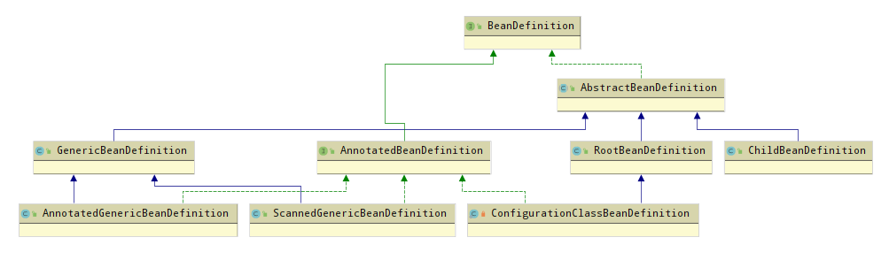
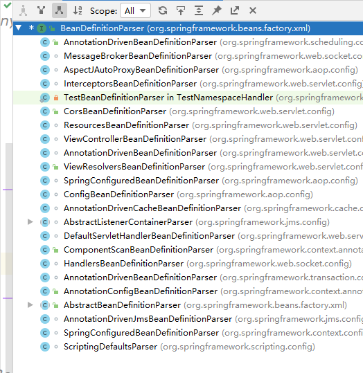
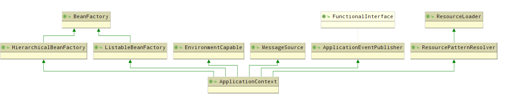
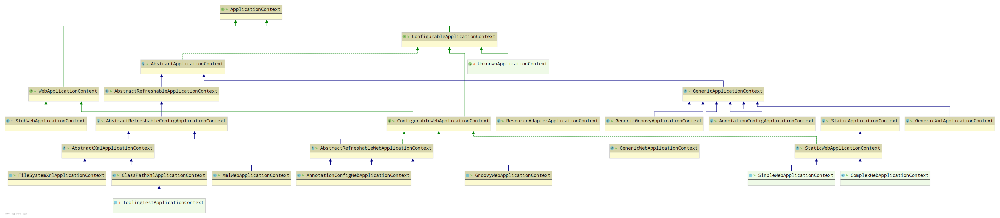
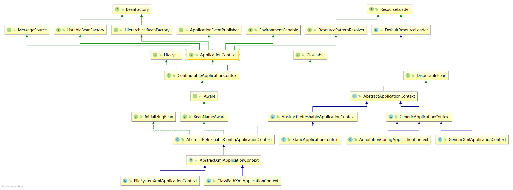
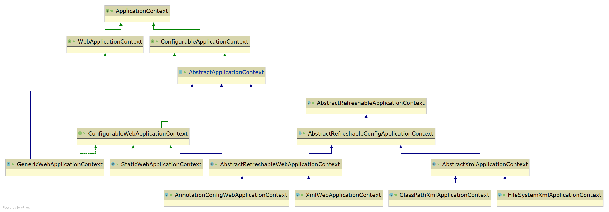
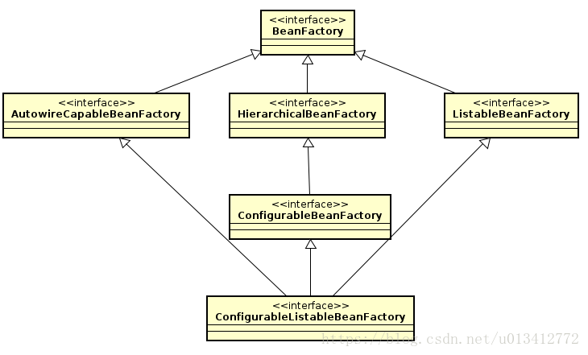
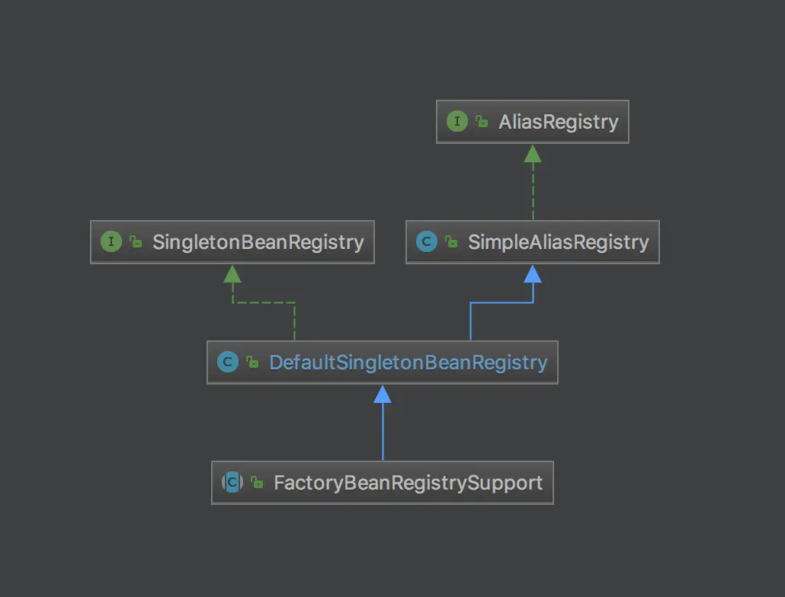
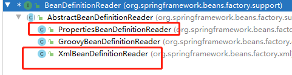
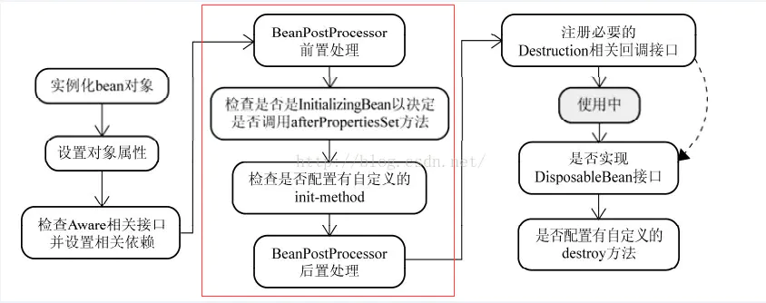

# 0 官网API与博客

 https://docs.spring.io/spring/docs/5.3.0-SNAPSHOT/spring-framework-reference/core.html#beans 

 https://docs.spring.io/spring/docs/5.3.0-SNAPSHOT/javadoc-api/ 


 https://blog.csdn.net/u010013573/category_8624428.html 

 https://blog.csdn.net/f641385712 

# 1.基础

## 1.1BeanDefiniton数据结构

BeanDefiniton数据结构如下图:




### 1.1.2 AbstractBeanDefinition

```java
    @Nullable
	private volatile Object beanClass;

	//bean的作用域
	@Nullable
	private String scope = SCOPE_DEFAULT;

	//bean是否为抽象的
	private boolean abstractFlag = false;

	//是否懒加载
	@Nullable
	private Boolean lazyInit;
	//自动注入模式
	private int autowireMode = AUTOWIRE_NO;
    //bean的依赖检查
	private int dependencyCheck = DEPENDENCY_CHECK_NONE;
	//bean的实例化依赖另一个bean实例化，depend-on标签
	@Nullable
	private String[] dependsOn;
    //设置为false不做作为其他bean的候选bean，该bean本身是可以使用其他bean自动装配自己
	private boolean autowireCandidate = true;
    //自动装配出现多个候选者，将作为首的bean的prinary属性设置为true
	private boolean primary = false;
    //用于记录子Qualifier标签
	private final Map<String, AutowireCandidateQualifier> qualifiers = new LinkedHashMap<>();

	@Nullable
	private Supplier<?> instanceSupplier;

	//允许访问非public属性的bean的构造器，程序设置
	private boolean nonPublicAccessAllowed = true;

	//是否已一种宽松的模式来解析构造函数，默认为true
	//如果设置为false
	//interface ITest{}
	//class ITestIpm implements ITest{}
	// Class Main{
	//  Main(ITest i){}
	//  Main(ITestIpm i){}
	// }
	// spring无法确定调用哪个构造函数，将抛出异常  程序设置
	private boolean lenientConstructorResolution = true;

	//对应factoryBeanName标签
	@Nullable
	private String factoryBeanName;
	//对应factoryMethodName标签
	@Nullable
	private String factoryMethodName;

	@Nullable
	private ConstructorArgumentValues constructorArgumentValues;

	//普通的属性集合
	@Nullable
	private MutablePropertyValues propertyValues;

	//方法重写的repacle-method 和 look-up方法
	private MethodOverrides methodOverrides = new MethodOverrides();

	//初始化方法 init-method标签
	@Nullable
	private String initMethodName;
	//销毁方法 destroy-Method标签
	@Nullable
	private String destroyMethodName;
	//是否执行初始化方法 程序设置
	private boolean enforceInitMethod = true;
	//是否执行销毁方法 程序设置
	private boolean enforceDestroyMethod = true;

	//是否是用户指定的，而不是程序本身设置的 创建AOP时为true，程序设定
	private boolean synthetic = false;

	//定义bean的应用，APPLICATION用户，ROLE_INFRASTRUCTURE完全内部使用，ROLE_SUPPORT某些复杂配置的一部分
	//由程序设定
	private int role = BeanDefinition.ROLE_APPLICATION;

	//bean描述
	@Nullable
	private String description;

	//bean定义的resource
	@Nullable
	private Resource resource;
```

### 1.1,3 RootBeanDefinition

父bean标签

### 1.1.4 ChildBeanDefinition

子bean标签

### 1.1.5  GenericBeanDefinition

2.5版本后一站式

## 1.2 BeanDefinitionParser



所有解析器都继承BeanDefinitionParser接口,


## 2 ApplicationContext

All Known Implementing Classes:

[AbstractApplicationContext](https://docs.spring.io/spring/docs/5.3.0-SNAPSHOT/javadoc-api/org/springframework/context/support/AbstractApplicationContext.html), [AbstractRefreshableApplicationContext](https://docs.spring.io/spring/docs/5.3.0-SNAPSHOT/javadoc-api/org/springframework/context/support/AbstractRefreshableApplicationContext.html), [AbstractRefreshableConfigApplicationContext](https://docs.spring.io/spring/docs/5.3.0-SNAPSHOT/javadoc-api/org/springframework/context/support/AbstractRefreshableConfigApplicationContext.html), [AbstractRefreshableWebApplicationContext](https://docs.spring.io/spring/docs/5.3.0-SNAPSHOT/javadoc-api/org/springframework/web/context/support/AbstractRefreshableWebApplicationContext.html), [AbstractXmlApplicationContext](https://docs.spring.io/spring/docs/5.3.0-SNAPSHOT/javadoc-api/org/springframework/context/support/AbstractXmlApplicationContext.html), [AnnotationConfigApplicationContext](https://docs.spring.io/spring/docs/5.3.0-SNAPSHOT/javadoc-api/org/springframework/context/annotation/AnnotationConfigApplicationContext.html), [AnnotationConfigWebApplicationContext](https://docs.spring.io/spring/docs/5.3.0-SNAPSHOT/javadoc-api/org/springframework/web/context/support/AnnotationConfigWebApplicationContext.html), [ClassPathXmlApplicationContext](https://docs.spring.io/spring/docs/5.3.0-SNAPSHOT/javadoc-api/org/springframework/context/support/ClassPathXmlApplicationContext.html), [FileSystemXmlApplicationContext](https://docs.spring.io/spring/docs/5.3.0-SNAPSHOT/javadoc-api/org/springframework/context/support/FileSystemXmlApplicationContext.html), [GenericApplicationContext](https://docs.spring.io/spring/docs/5.3.0-SNAPSHOT/javadoc-api/org/springframework/context/support/GenericApplicationContext.html), [GenericGroovyApplicationContext](https://docs.spring.io/spring/docs/5.3.0-SNAPSHOT/javadoc-api/org/springframework/context/support/GenericGroovyApplicationContext.html), [GenericWebApplicationContext](https://docs.spring.io/spring/docs/5.3.0-SNAPSHOT/javadoc-api/org/springframework/web/context/support/GenericWebApplicationContext.html), [GenericXmlApplicationContext](https://docs.spring.io/spring/docs/5.3.0-SNAPSHOT/javadoc-api/org/springframework/context/support/GenericXmlApplicationContext.html), [GroovyWebApplicationContext](https://docs.spring.io/spring/docs/5.3.0-SNAPSHOT/javadoc-api/org/springframework/web/context/support/GroovyWebApplicationContext.html), [ResourceAdapterApplicationContext](https://docs.spring.io/spring/docs/5.3.0-SNAPSHOT/javadoc-api/org/springframework/jca/context/ResourceAdapterApplicationContext.html), [StaticApplicationContext](https://docs.spring.io/spring/docs/5.3.0-SNAPSHOT/javadoc-api/org/springframework/context/support/StaticApplicationContext.html), [StaticWebApplicationContext](https://docs.spring.io/spring/docs/5.3.0-SNAPSHOT/javadoc-api/org/springframework/web/context/support/StaticWebApplicationContext.html), [XmlWebApplicationContext](https://docs.spring.io/spring/docs/5.3.0-SNAPSHOT/javadoc-api/org/springframework/web/context/support/XmlWebApplicationContext.html)



```java
public interface ApplicationContext extends EnvironmentCapable, ListableBeanFactory, HierarchicalBeanFactory,
		MessageSource, ApplicationEventPublisher, ResourcePatternResolve
```

最顶层接口，通过继承BeanFactory接口的方法，定义了与BeanFactory的关联绑定，以及其他功能组件，

如

1 ApplicationContext是bean容器的一个运行环境，而实际的bean容器为内部绑定的BeanFactory，由BeanFactory来存放bean的元数据beanDefinitions，具体存放在BeanFactory的实现类的一个类型为ConcurrentHashMap的map中，其中key为beanName，value为BeanDefinition；以及bean实例的创建。用于访问应用程序组件的Bean工厂方法。继承自ListableBeanFactory。

2 EnvironmentCapable，-D 获得参数能力。

3 ListableBeanFactory

4 HierarchicalBeanFactory

5 MessageSource 能够解析消息，支持国际化。从MessageSource接口继承。

6 ApplicationEventPublisher向注册的侦听器发布事件的能力。从ApplicationEventPublisher接口继承

7 以通用方式加载文件资源的能力。从ResourceLoader接口继承。

 从父上下文继承。子代上下文中的定义始终优先。例如，这意味着单个父上下文可以被整个web应用程序使用，而每个servlet都有自己的子上下文，独立于任何其他servlet。




  





### 1.2.1 ConfigurableApplicationContext

从ApplicationContext接口额外派生这个接口，而不是直接在ApplicationContext接口声明这些的原因：这些组件都是ApplicationContext接口的实现类在内部自身使用的，而ApplicationContext接口主要是定义对外的功能和方法声明，故在ConfigurableApplicationContext接口中声明这些方法，保证接口的清晰和职责的明确。SPI接口将由大多数（如果不是所有）应用程序上下文实现。除了application context接口中的应用程序上下文客户端方法之外，还提供配置应用程序上下文的工具。这里封装了配置和生命周期方法，以避免让ApplicationContext客户端代码看到它们。当前方法只能由启动和关闭代码使用。


### 1.2.2 AbstractApplicationContext抽象类

ApplicationContext接口的抽象实现.不强制指定用于配置的存储类型；只实现公共上下文功能。使用模板方法设计模式，需要具体的子类来实现抽象方法。

与普通bean factory不同，ApplicationContext应该检测在其内部bean工厂中定义的特殊bean：因此，该类自动注册在上下文中定义为bean的BeanFactoryPostProcessors, BeanPostProcessors, and ApplicationListeners 。

消息源也可以作为上下文中的bean提供，名称为“MessageSource”；否则，消息解析将委托给父上下文。此外，应用程序事件的多主机可以作为上下文中applicationEventMulticaster类型的“applicationEventMulticaster”be an提供；否则，将使用SimpleApplicationEventMulticaster类型的默认多主机。

通过扩展DefaultResourceLoader实现资源加载。因此，将非URL资源路径视为类路径资源（支持包含包路径的完整类路径资源名称，例如“mypackage/我的资源.dat，除非DefaultResourceLoader.getResourceByPath(java.lang.String语言)方法在子类中被重写。

refresh方法：容器启动的骨架实现，使用了模板设计模式。提供对ConfigurableApplicationContext接口的refresh方法的模板实现，即定义了ApplicationContext的启动步骤，但是不提供具体每步的实现，由子类提供。
成员变量定义：定义了applicationListener，environment，beanFactoryProcessor等相关的成员变量。

### 1.2.3  AbstractRefreshableApplicationContext和和AbstractRefreshableConfigApplicationContext

主要提供可多次重复调用refresh方法，刷新容器，销毁之前的beanFactory和beans，重新创建beanFactory和beans，如在对xml配置文件修改过了之后重新加载。ConfigurableApplicationContext接口的定义，默认是不支持多次调用refresh方法的，多次调用则抛IllegalStateException异常。

AbstractRefreshableConfigApplicationContext提够了

### 1.2.4 AbstractXmlApplicationContext

```java
	protected void loadBeanDefinitions(DefaultListableBeanFactory beanFactory) throws BeansException, IOException {
		// Create a new XmlBeanDefinitionReader for the given BeanFactory.
		XmlBeanDefinitionReader beanDefinitionReader = new XmlBeanDefinitionReader(beanFactory);

		// Configure the bean definition reader with this context's
		// resource loading environment.
		beanDefinitionReader.setEnvironment(this.getEnvironment());
		beanDefinitionReader.setResourceLoader(this);
		beanDefinitionReader.setEntityResolver(new ResourceEntityResolver(this));

		// Allow a subclass to provide custom initialization of the reader,
		// then proceed with actually loading the bean definitions.
		initBeanDefinitionReader(beanDefinitionReader);
		loadBeanDefinitions(beanDefinitionReader);
	}

```

继承于AbstractRefreshableConfigApplicationContext，指定使用xml文件保存配置。
**ClassPathXmlApplicationContext**：具体实现类，继承于AbstractXmlApplicationContext抽象类，指定从类路径下加载xml配置文件。
**FileSystemXmlApplicationContext**：具体实现类，继承于AbstractXmlApplicationContext，指定从文件系统加载xml配置文件。

### 1.2.5GenericApplicationContext 

继承于AbstractApplicationContext抽象类，故不具备上面的Config，Refreshable功能。而Bean的注册，是通过实现BeanDefinitionRegistry接口来提供往内部的beanFactory注入beanDefinitions，而beanDefinitions的来源则是通过BeanDefinitionParser解析，如xml文件来获取的。不支持重复调用refresh。 **这是一个通用的Spring上下文了它基本什么都得靠自己手动来处理**： 例子如下

```java
GenericApplicationContext ctx = new GenericApplicationContext();
 XmlBeanDefinitionReader xmlReader = new XmlBeanDefinitionReader(ctx);
 xmlReader.loadBeanDefinitions(new ClassPathResource("applicationContext.xml"));
 PropertiesBeanDefinitionReader propReader = new PropertiesBeanDefinitionReader(ctx);
 propReader.loadBeanDefinitions(new ClassPathResource("otherBeans.properties"));
 ctx.refresh();

 MyBean myBean = (MyBean) ctx.getBean("myBean");
```

**GenericXmlApplicationContext：**继承与GenericApplicationContext，比ClassPathXmlApplicationContext，FileSystemXmlApplicationContext更加通用的基于xml配置文件的ApplicationContext。即可以在构造函数中指定配置数来源，使用的Resource类型的数组参数。而前两者都是使用String类型的configLocations数组，即路径数组。

### 1.2.6 AnnotationConfigApplicationContext：注解驱动的实现类

继承于 GenericApplicationContext  ，独立的应用程序上下文，接受组件类作为输入-特别是@Configuration注释的类，还接受普通的@component类型和JSR-330兼容的类，使用javax.inject注入注解。

允许使用register（Class…）逐个注册类，以及使用scan（String…）扫描类路径。

如果有多个@Configuration类，则在后面的类中定义的@Bean方法将覆盖在前面的类中定义的方法。这可以用来通过额外的@Configuration类故意重写某些bean定义。

### 1.2.7 spring-web包 Web应用的IOC容器上下文

spring-web包提供了一个ApplicationContext的继承接口：WebApplicationContext的类体系设计与ApplicationContext的基本一致，不同之处为：在ApplicationContext的基础上，添加web应用运行相关的一些性质。主要与web容器、servlet相关，核心性质包括：

1. Web容器被IOC容器感知：ServletContext
即该应用在web容器的中运行环境类，ServletContext的启动，触发spring容器WebApplicationContext的启动，即spring容器的创建。
将ServletContext中的context-param的键值对数据，放到WebApplicationContext的environment中。servlet相关的则是servletConfig的init-param的键值对数据。
2. IOC容器被Web容器感知
WebApplicationContext关联到ServletContext：Spring容器WebApplicationContext对象，作为ServletContext的一个属性关联到ServletContext，属性key为：
root WebApplicationContext：即包含ROOT

## 1.3 BeanFactory

 而ApplicationContext内部最重要的组件，就是BeanFactory体系结构，ApplicationContext通过BeanFactory来维护Spring容器所管理的类对应的BeanDefintions，通过BeanFactory来获取类对象bean。与BeanFactory配套的就是ApplicationContext维护多个BeanFactoryPostProcessor，BeanPostProcessor来对BeanFactory进行拓展，对BeanFactory自身或所创建的bean对象实例进行加工、功能拓展，实现整体设计的高拓展性。

  

### 1.3.1BeanFactory

SpringBean容器的根接口，bean容器的基本客户机视图；其他接口（如ListableBeanFactory和configurablebanfactory）可用于特定目的。这个接口是由包含许多bean定义的对象实现的，每个bean定义都由一个字符串名称唯一标识。根据bean定义，工厂将返回包含对象的独立实例（原型设计模式）或单个共享实例（单例设计模式的高级替代方案，其中实例是工厂范围内的单例）。返回哪种类型的实例取决于bean工厂配置：API是相同的。自Spring2.0以来，根据具体的应用程序上下文（例如web环境中的“请求”和“会话”作用域），可以使用更多的作用域。这种方法的要点是BeanFactory是应用程序组件的中心注册中心，它集中了应用程序组件的配置（例如，单个对象不再需要读取属性文件）。请参阅“专家一对一J2EE设计和开发”的第4章和第11章，以了解此方法的好处。

注意，通常最好依赖依赖注入（“推”配置）通过setter或构造函数配置应用程序对象，而不是像BeanFactory查找那样使用任何形式的“拉”配置。Spring的依赖注入功能是使用这个BeanFactory接口及其子接口实现的。


通常，BeanFactory将加载存储在配置源（如XML文档）中的bean定义，并使用org.springframework.beans网站包来配置bean。然而，一个实现可以直接在Java代码中返回它创建的Java对象。对于如何存储定义没有任何限制：LDAP、RDBMS、XML、属性文件等。鼓励实现支持bean之间的引用（依赖注入）。


与ListableBeanFactory中的方法相反，如果这是HierarchicalBeanFactory，则此接口中的所有操作也将检查父工厂。如果在此工厂实例中找不到bean，则会询问直接父工厂。这个工厂实例中的bean应该重写任何父工厂中同名的bean。

  

### 1.3.2 ListableBeanFactory

Spring 鼓励使用这个接口定义的api. 还有个`Beanfactory`方便使用.其他的4个接口都是不鼓励使用的.<font color=FF000>列表形式的，获得beanName是，beans 集合的</font>。

提供容器中bean迭代的功能,不再需要一个个bean地查找.比如可以一次获取全部的bean(太暴力了),根据类型获取bean.在看**SpringMVC时,扫描包路径下的具体实现策略就是使用的这种方式(那边使用的是`BeanFactoryUtils`封装的api).**

如果同时实现了`HierarchicalBeanFactory`,返回值不会考虑父类`BeanFactory`,只考虑当前factory定义的类.当然也可以使用`BeanFactoryUtils`辅助类来查找祖先工厂中的类. <font color=FF000>**即`ListableBeanFactory`是`beanFactory`接口的扩展接口，它可以枚举所有的bean实例，而不是客户端通过名称一个一个的查询得出所有的实例。要预加载所有的bean定义的`beanfactory`可以实现这个接口来。该 接口定义了访问容器中Bean基本信息的若干方法，如查看Bean的个数、获取某一类型Bean的配置名、查看容器中是否包括某一Bean等方法.**</font>

这个接口中的方法只会考虑本factory定义的bean.这些方法会忽略`ConfigurableBeanFactory`的`registerSingleton`注册的单例bean(getBeanNamesOfType和getBeansOfType是例外,一样会考虑手动注册的单例).当然`BeanFactory`的getBean一样可以透明访问这些特殊bean.当然在典型情况下,所有的bean都是由external bean定义,所以应用不需要顾虑这些差别.

注意:`getBeanDefinitionCount`和`containsBeanDefinition`的实现方法因为效率比较低,还是少用为好.

ListableBeanFactory源码具体：

　　1、3个跟BeanDefinition有关的总体操作。包括BeanDefinition的总数、名字的集合、指定类型的名字的集合。（这里指出，BeanDefinition是Spring中非常重要的一个类，每个BeanDefinition实例都包含一个类在Spring工厂中所有属性。）

　　2、2个getBeanNamesForType重载方法。根据指定类型（包括子类）获取其对应的所有Bean名字。

　　3、2个getBeansOfType重载方法。根据类型（包括子类）返回指定Bean名和Bean的Map。

　　4、2个跟注解查找有关的方法。根据注解类型，查找Bean名和Bean的Map。以及根据指定Bean名和注解类型查找指定的Bean。

正如这个工厂接口的名字所示，这个工厂接口最大的特点就是可以列出工厂可以生产的所有实例。当然，工厂并没有直接提供返回所有实例的方法，也没这个必要。它可以返回指定类型的所有的实例。而且你可以通过getBeanDefinitionNames()得到工厂所有bean的名字，然后根据这些名字得到所有的Bean。这个工厂接口扩展了BeanFactory的功能，作为上文指出的BeanFactory二级接口，有9个独有的方法，扩展了跟BeanDefinition的功能，提供了BeanDefinition、BeanName、注解有关的各种操作。它可以根据条件返回Bean的集合，这就是它名字的由来——ListableBeanFactory

### 1.3.3  HierarchicalBeanFactory

**`HierarchicalBeanFactory` 提供父容器的访问功能**.至于父容器的设置,需要找`ConfigurableBeanFactory`的`setParentBeanFactory`(接口把设置跟获取给拆开了!).

------

HierarchicalBeanFactory源码具体：

　　1、第一个方法返回本Bean工厂的父工厂。这个方法实现了工厂的分层。

　　2、第二个方法判断本地工厂是否包含这个Bean（忽略其他所有父工厂）。这也是分层思想的体现。

总结：这个工厂接口非常简单，实现了Bean工厂的分层。这个工厂接口也是继承自BeanFacotory，也是一个二级接口，相对于父接口，它只扩展了一个重要的功能——工厂分层。

### 1.3.4 ConfigurableBeanFactory

- 继承于HierarchicalBeanFactory接口，**主要提供对BeanFactory进行相关配置的接口，如类加载器classLoader，beanPostProcessor，类型转换器，属性编辑器等在加载、创建和初始化bean实例时，需要用到的一些功能组件；**

`ConfigurableBeanFactory`定义`BeanFactory`的配置.`ConfigurableBeanFactory`中定义了太多太多的api,比如类加载器,类型转化,属性编辑器,`BeanPostProcessor`,作用域,bean定义,处理bean依赖关系,合并其他`ConfigurableBeanFactory`,bean如何销毁.

------

ConfigurableBeanFactory同时继承了HierarchicalBeanFactory 和 SingletonBeanRegistry 这两个接口，即同时继承了分层和单例类注册的功能。

具体：

　　1、2个静态不可变常量分别代表单例类和原型类。

　　2、1个设置父工厂的方法，跟HierarchicalBeanFactory接口的getParentBeanFactory方法互补。

　　3、4个跟类加载器有关的方法：get/set工厂类加载器和get/set临时类加载器。

　　4、2个设置、是否缓存元数据的方法（热加载开关）。

　　5、11个处理Bean注册、加载等细节的方法，包括：Bean表达式分解器、转换服务、属性编辑登记员、属性编辑器、属性编辑注册器、类型转换器、嵌入式的字符串分解器

　　6、2个处理Bean后处理器的方法。

　　7、3个跟注册范围相关的方法。

　　8、1个返回安全访问上下文的方法、1个从其他的工厂复制相关的所有配置的方法。

　　9、2个跟Bean别名相关的方法、1个返回合并后的Bean定义的方法。

　　10、1个判断是否为工厂Bean的方法、2个跟当前Bean创建时机相关的方法。

　　11、3个跟Bean依赖相关的方法、3个销毁Bean相关的方法。

总结：这个巨大的工厂接口，继承自HierarchicalBeanFactory 和 SingletonBeanRegistry 这两个接口，并额外独有37个方法！！！这37个方法包含了工厂创建、注册一个Bean的众多细节。这个工厂名为ConfigurableBeanFactory，真是名不虚传！统计一下此时的ConfigurableBeanFactory的方法数吧。自有的37个方法、HierarchicalBeanFactory的2个方法、SingletonBeanRegistry的5个方法、爷爷接口BeanFactory的10个方法，共有54个方法！虽然方法繁多，还算井井有条！

### 1.3.5AutowireCapableBeanFactory

 https://www.jianshu.com/p/14dd69b5c516 

**比较重要的，与其他框架集成。**

 AutowireCapableBeanFactory是在BeanFactory的基础上实现对已存在实例的管理。**可以使用这个接口集成其他框架，捆绑并填充并不由Spring管理生命周期并已存在的实例。 比如 serletContext，filter，等等web容器相关的。**

### 1.3.6 DefaultListableBeanFactory

默认实现了**ListableBeanFactory和BeanDefinitionRegistry接口，基于bean definition对象，是一个对立，可以直接使用的的bean factroy。BeanFactory接口体系的默认实现类，实现以上接口的功能，提供BeanDefinition的存储map，Bean对象对象的存储map。**

其中Bean对象实例的存储map，定义在FactoryBeanRegistrySupport，FactoryBeanRegistrySupport实现了SingletonBeanRegistry接口，而DefaultListableBeanFactory的基类AbstractBeanFactory，继承于FactoryBeanRegistrySupport。

最典型的应用是：在访问bean前，先注册所有的definition（可能从bean definition配置文件中）。使用预先建立的bean定义元数据对象，从本地的bean definition表中查询bean definition因而将不会花费太多成本。

DefaultListableBeanFactory既可以作为一个单独的beanFactory，也可以作为自定义beanFactory的父类。

注意：特定格式bean definition的解析器可以自己实现，也可以使用原有的解析器，如：PropertiesBeanDefinitionReader和XmLBeanDefinitionReader。 

```java
public class DefaultListableBeanFactory extends AbstractAutowireCapableBeanFactory
		implements ConfigurableListableBeanFactory, BeanDefinitionRegistry, Serializable {
	...
	/** Map of bean definition objects, keyed by bean name */
	private final Map<String, BeanDefinition> beanDefinitionMap = new ConcurrentHashMap<>(256);
	// 保存所有的Bean名称
	/** List of bean definition names, in registration order */
	private volatile List<String> beanDefinitionNames = new ArrayList<>(256);

	// 注册Bean定义信息~~
	@Override
	public void registerBeanDefinition(String beanName, BeanDefinition beanDefinition)
			throws BeanDefinitionStoreException {
		...
		BeanDefinition oldBeanDefinition = this.beanDefinitionMap.get(beanName);
		// 如果不为null，说明这个beanName对应的Bean定义信息已经存在了~~~~~
		if (oldBeanDefinition != null) {
			// 是否允许覆盖（默认是true 表示允许的）
			if (!isAllowBeanDefinitionOverriding()) {
				// 抛异常
			}
			// 若允许覆盖  那还得比较下role  如果新进来的这个Bean的role更大			
			// 比如老的是ROLE_APPLICATION（0）  新的是ROLE_INFRASTRUCTURE(2) 
			// 最终会执行到put，但是此处输出一个warn日志，告知你的bean被覆盖啦~~~~~~~（我们自己覆盖Spring框架内的bean显然就不需要warn提示了）
			else if (oldBeanDefinition.getRole() < beanDefinition.getRole()) {
				// 仅仅输出一个logger.warn
			}
			// 最终会执行put，但是内容还不相同  那就提醒一个info信息吧
			else if (!beanDefinition.equals(oldBeanDefinition)) {
				// 输出一个info信息
			}
			else {
				// 输出一个debug信息
			}
			// 最终添加进去 （哪怕已经存在了~） 
			// 从这里能看出Spring对日志输出的一个优秀处理，方便我们定位问题~~~
			this.beanDefinitionMap.put(beanName, beanDefinition);
			// 请注意：这里beanName并没有再add了，因为已经存在了  没必要了嘛
		}
		else {
			// hasBeanCreationStarted:表示已经存在bean开始创建了（开始getBean()了吧~~~）
			if (hasBeanCreationStarted()) {
				// 注册过程需要synchronized，保证数据的一致性	synchronized (this.beanDefinitionMap) {
					this.beanDefinitionMap.put(beanName, beanDefinition); // 放进去
					List<String> updatedDefinitions = new ArrayList<>(this.beanDefinitionNames.size() + 1);
					updatedDefinitions.addAll(this.beanDefinitionNames);
					updatedDefinitions.add(beanName);
					this.beanDefinitionNames = updatedDefinitions;
			
					// 
					if (this.manualSingletonNames.contains(beanName)) {
						Set<String> updatedSingletons = new LinkedHashSet<>(this.manualSingletonNames);
						updatedSingletons.remove(beanName);
						this.manualSingletonNames = updatedSingletons;
					}
				}
			}
			else {
				// Still in startup registration phase
				// 表示仍然在启动  注册的状态~~~就很好处理了 put仅需，名字add进去
				this.beanDefinitionMap.put(beanName, beanDefinition);
				this.beanDefinitionNames.add(beanName);
				
				// 手动注册的BeanNames里面移除~~~ 因为有Bean定义信息了，所以现在不是手动直接注册的Bean单例~~~~
				this.manualSingletonNames.remove(beanName);
			}

			// 这里的意思是：但凡你新增了一个新的Bean定义信息，之前已经冻结的就清空呗~~~
			this.frozenBeanDefinitionNames = null;
		}
		
		// 最后异步很有意思：老的bean定义信息不为null（beanName已经存在了）,或者这个beanName直接是一个单例Bean了~
		if (oldBeanDefinition != null || containsSingleton(beanName)) {
			// 做清理工作：
			// clearMergedBeanDefinition(beanName)
			// destroySingleton(beanName);  销毁这个单例Bean  因为有了该bean定义信息  最终还是会创建的
			// Reset all bean definitions that have the given bean as parent (recursively).  处理该Bean定义的getParentName  有相同的也得做清楚  所以这里是个递归
			resetBeanDefinition(beanName);
		}
	}

	@Override
	public void removeBeanDefinition(String beanName) throws 		NoSuchBeanDefinitionException {
		// 移除整体上比较简单：beanDefinitionMap.remove
		// beanDefinitionNames.remove
		// resetBeanDefinition(beanName);

		BeanDefinition bd = this.beanDefinitionMap.remove(beanName);
		// 这里发现移除，若这个Bean定义本来就不存在，事抛异常，而不是返回null 需要注意~~~~
		if (bd == null) {
			throw new NoSuchBeanDefinitionException(beanName);
		}

		if (hasBeanCreationStarted()) {
			synchronized (this.beanDefinitionMap) {
				List<String> updatedDefinitions = new ArrayList<>(this.beanDefinitionNames);
				updatedDefinitions.remove(beanName);
				this.beanDefinitionNames = updatedDefinitions;
			}
		} else {
			this.beanDefinitionNames.remove(beanName);
		}
		this.frozenBeanDefinitionNames = null;
		resetBeanDefinition(beanName);
	}

	// 这个实现非常的简单，直接从map里拿
	@Override
	public BeanDefinition getBeanDefinition(String beanName) throws NoSuchBeanDefinitionException {
		BeanDefinition bd = this.beanDefinitionMap.get(beanName);
		if (bd == null) {
			throw new NoSuchBeanDefinitionException(beanName);
		}
		return bd;
	}

@Override
	public boolean containsBeanDefinition(String beanName) {
		return this.beanDefinitionMap.containsKey(beanName);
	}
	@Override
	public int getBeanDefinitionCount() {
		return this.beanDefinitionMap.size();
	}
	@Override
	public String[] getBeanDefinitionNames() {
		String[] frozenNames = this.frozenBeanDefinitionNames;
		if (frozenNames != null) {
			return frozenNames.clone();
		}
		else {
			return StringUtils.toStringArray(this.beanDefinitionNames);
		}
	}
	
	// ==========这个方法非常有意思：它是间接的实现的===============
	// 因为BeanDefinitionRegistry有这个方法，而它的父类AbstractBeanFactory也有这个方法，所以一步小心，就间接的实现了这个接口方法
	public boolean isBeanNameInUse(String beanName) {
		// 增加了一个hasDependentBean(beanName);  或者这个BeanName是依赖的Bean 也会让位被使用了
		return isAlias(beanName) || containsLocalBean(beanName) || hasDependentBean(beanName);
	}
}

```


### 1.3.7 BeanDefinitionRegistry

注册BeanDefinitions。提供registerBeanDefinition，removeBeanDefinition等方法，用来从BeanFactory注册或移除BeanDefinition。通常BeanFactory接口的实现类需要实现这个接口。
实现类（通常为BeanFactory接口实现类）的对象实例，被DefinitionReader接口实现类引用，DefinitionReader将BeanDefintion注册到该对象实例中。

1. 以Map<String, BeanDefinition>的形式注册bean
2. 根据beanName 删除和获取 beanDefiniation
3. 得到持有的beanDefiniation的数目
4. 根据beanName 判断是否包含beanDefiniation

```java
// 它继承自 AliasRegistry 
public interface BeanDefinitionRegistry extends AliasRegistry {

	// 关键 -> 往注册表中注册一个新的 BeanDefinition 实例 
	void registerBeanDefinition(String beanName, BeanDefinition beanDefinition) throws BeanDefinitionStoreException;
	// 移除注册表中已注册的 BeanDefinition 实例
	void removeBeanDefinition(String beanName) throws NoSuchBeanDefinitionException;
	// 从注册中心取得指定的 BeanDefinition 实例
	BeanDefinition getBeanDefinition(String beanName) throws NoSuchBeanDefinitionException;
	// 判断 BeanDefinition 实例是否在注册表中（是否注册）
	boolean containsBeanDefinition(String beanName);
	
	// 取得注册表中所有 BeanDefinition 实例的 beanName（标识）
	String[] getBeanDefinitionNames();
	// 返回注册表中 BeanDefinition 实例的数量
	int getBeanDefinitionCount();
	// beanName（标识）是否被占用
	boolean isBeanNameInUse(String beanName);
}

```

### 1.3.8 SingletonBeanRegistry、DefaultSingletonBeanRegistry与FactoryBeanRegistrySupport

  


1.DefaultSingletonBeanRegistry实现了SingletonBeanRegistry接口

共享bean实例的通用注册表，实现了SingletonBeanRegistry. 允许注册表中注册的单例应该被所有调用者共享，通过bean名称获得。还支持登记的DisposableBean实例，（这可能会或不能正确的注册单例），关闭注册表时destroyed. 可以注册bean之间的依赖关系，执行适当的关闭顺序。这个类主要用作基类的BeanFactory实现， 提供基本的**管理 singleton bean 实例功能**。

- 负责管理singlenton对象，
- 负责管理ObjectFactory对象
- 负责管理singleanton对象与ObjectFactory对象的 beanName
- 负责管理signleton状态中需要执行销毁流程的对象
- 负责需要管理@Dependent注解以及spring boot里面的功能相同的注解产生的依赖关系与被依赖关系
- 负责控制并发情况下销毁beanfactory
- 负责控制并发情况下只有一个线程注册同一个bean。

 用于注册单例Bean对象实例，实现类定义存储Bean对象实例的map，BeanFactory的类层次结构中需要实现这个接口，来提供Bean对象的注册和从Bean对象实例的map获取bean对象。

```java

@since 2.5.1
public abstract class FactoryBeanRegistrySupport extends DefaultSingletonBeanRegistry {

	/** Cache of singleton objects created by FactoryBeans: FactoryBean name to object. */
	private final Map<String, Object> factoryBeanObjectCache = new ConcurrentHashMap<>(16);
	
	...
	
}

```

### 1.3.9 bean元数据解析主入口：BeanDefinitionReader




```java
public interface BeanDefinitionReader {


	BeanDefinitionRegistry getRegistry();


	@Nullable
	ResourceLoader getResourceLoader();


	@Nullable
	ClassLoader getBeanClassLoader();

	BeanNameGenerator getBeanNameGenerator();

	int loadBeanDefinitions(Resource resource) throws BeanDefinitionStoreException;


	int loadBeanDefinitions(Resource... resources) throws BeanDefinitionStoreException;


	int loadBeanDefinitions(String location) throws BeanDefinitionStoreException;

	int loadBeanDefinitions(String... locations) throws BeanDefinitionStoreException;

}
```

依赖的resource 和 BeanDefinitionRegistry

**xml文件、属性文件，groovy文件，类路径下使用了@Component系列注解的类、或者从@Configuration注解的配置类**，获取BeanDefintiions，然后注册到BeanFactory中。

1. **XmlBeanDefinitionReader：**基于XML文件
读取解析xml文件，通过Parser解析xml文件的标签。
针对beans标签，生成对应的BeanDefintions，然后注册到BeanFactory中。
针对其他有特殊功能的标签，如context:component-scan，context:anotation-config，还可以生成BeanFactoryPostProcessor，BeanPostProcessor接口实现类的bean等；除了可以生成BeanDefinitions之外，还可以实现其他功能。
2. **AnnotatedBeanDefinitionReader：**注册指定的类列表annotatedClasses
可以使用编程方法，显示指定将哪些类需要注册到BeanFactory。
主要是被AnnotationConfigApplicationContext使用，即基于注解配置的ApplicationContext，这是SpringBoot的默认ApplicationContext。典型使用为：先获取所有使用了@Configuration注解的类，然后通过AnnotatedBeanDefinitionReader生成与这些类对应的BeanDefinitions，并注册到BeanFactory。
3. **ClassPathBeanDefinitionScanner：**注册指定的basePackages下面的类
    扫描指定类路径（包）下面的类，检测是否存在@Component注解及其子注解，从而生成BeanDefinition，然后注册到BeanFactory。
    没有实现BeanDefinitionReader接口，但基于相同的设计思路：BeanDefinitionReader。
    与AnnotatedBeanDefinitionReader一样，都是获取指定类，生成该类的BeanDefinition注册到BeanFactory，而不是像xml文件一样已经通过bean标签显示说明这个就是bean。
    也是主要是被AnnotationConfigApplicationContext使用。与其他两种也是基于basePackages类路径扫描的方式不同之处为：
    context:component-scan标签：基于XML的ApplicationContext，实现类路径扫描，底层使用ComponentScanBeanDefinitionParser这个parser来处理。
    @ComponentScan：对于处理@Configuration配置类上面的@ComponentScan注解，则是通过**ComponentScanAnnotationParser**来处理的。
4. ConfigurationClassBeanDefinitionReader：基于@Configuration注解的类配置
    处理@Configuration注解的配置类，加在这些配置类上面的注解，即与@Configuration一起使用的注解，如@ComponentScan，@PropertySource，@Import，@Profile等。
    ConfigurationClassBeanDefinitionReader主要被ConfigurationClassPostProcessor调用，ConfigurationClassPostProcessor为BeanFactoryPostProcessor。

### 1.3.10 bean元数据解析执行者：BeanDefinitionParser

xml文件的标签的解析处理器，通过实现 BeanDefinitionParser接口，来针对每个标签进行特定。
典型用途包括：生成BeanDefintion对象，或BeanFactoryPostProcessor对象，或BeanPostProcessor对象，或者为针对标签定义特定的功能，自定义该标签的用途。
Parser可以同时生成这三种类型中的一个或多个。如ComponentScanBeanDefinitionParser既生成BeanDefinitions，又生成ConfigurationClassPostProcessor（BeanFactoryPostProcessor接口实现类）。AnnotationConfigBeanDefinitionParser既生成BeanPostProcessor，又生成ConfigurationClassPostProcessor。

1. 直接创建BeanDefintion
DefaultBeanDefinitionDocumentReader：xml文件解析
本身不是BeanDefinitionParser接口的实现类，而是利用BeanDefinitionParser接口的实现类，解析xml文件的beans标签，及其里边嵌套的bean标签，获取BeanDefinitions。
ComponentScanBeanDefinitionParser
处理xml文件的context:component-scan标签，扫描basePackages属性指定的路径下面的类，检测并获取使用了@Component注解及其子注解的类，生成对应的BeanDefinitions。
ComponentScanAnnotationParser
处理@ComponentScan注解，与ComponentScanBeanDefinitionParser功能一样，一般是与@Configuration注解一起使用。在ConfigurationClassParser中创建ComponentScanAnnotationParser对象实例并在parse方法中调用，ConfigurationClassParser为处理@Configuration注解的类。
2. 创建BeanFactoryPostProcessor
    ConfigurationClassPostProcessor：间接创建BeanDefinition
    ConfigurationClassPostProcessor是一个BeanFactoryPostProcessor接口的实现类。

在ComponentScanBeanDefinitionParser和AnnotationConfigBeanDefinitionParser中会创建ConfigurationClassPostProcessor对象实例：这样由这些parser创建的BeanDefinitions，就可以被ConfigurationClassPostProcessor进一步处理，创建更多的BeanDefintions。

1、ComponentScanBeanDefinitionParser：对应context:component-scan，在parse方法调用；
2、AnnotationConfigBeanDefinitionParser：对应context:annotation-config，在parse方法调用；
3、ClassPathBeanDefinitionScanner：在scan方法调用，该类在AnnotationConfigApplicationContext中使用；
4、AnnotatedBeanDefinitionReader：在构造函数调用，该类在AnnotationConfigApplicationContext中使用。

从BeanFactory的BeanDefintions集合，过滤获取使用了@Configuration注解的类，然后从这些类的@Bean方法获取BeanDefintions。

3. 创建BeanPostProcessor
AnnotationConfigBeanDefinitionParser：处理context:annotation-config标签，产生相关的BeanPostProcessor：

ComponentScanBeanDefinitionParser：处理xml文件的context:component-scan标签。

以上两个parser都会产生以下两个BeanPostProcessor：
1、CommonAnnotationBeanPostProcessor：处理bean对象及其方法中的JDK自身的注解；
2、AutowiredAnnotationBeanPostProcessor：bean对象的依赖注入处理，如@Autowired。

4. 自定义功能拓展
可以通过自定义标签和自定义Parser接口的实现类，并结合NamespaceHandler来实现自动融入spring框架。如dubbo框架就利用了这个特性来实现自动融入spring框架。Spring源码分析：XML标签名称空间处理器-NamespaceHandler

### 1.3.11  bean工厂后置处理器： BeanFactoryPostProcessor

BeanFactory后置处理器：bean元数据注册的拓展

在BeanFactory创建好，加载好其所包含的所有beanDefinitions，但是还没有实例化bean之前，执行，具体为调用postProcessBeanFactory方法。

ApplicationContext会自动检测当前存在的BeanFactoryPostProcessors，并在创建bean实例之前执行。除此之外也可以对BeanFactory进行其他拓展实现。

典型用实现类和用途：

1. 加载更多的bean元数据
ConfigurationClassPostProcessor，用于从BeanFactory中检测使用了@Configuration注解的类，对于这些类对应的BeanDefinitions集合，遍历并依次交给ConfigurationClassParser，ConfigurationClassBeanDefinitionReader处理，分别是处理与@Configuration同时使用的其他注解和将类内部的使用@Bean注解的方法，生成BeanDefinition，注册到BeanFactory。
2. 对bean元数据进行加工处理
BeanDefinition属性填充、修改：在postProcessBeanFactory方法中，可以对beanFactory所包含的beanDefinitions的propertyValues和构造函数参数值进行修改，如使用PropertyPlaceHolderConfigurer来对BeanDefinition的propertyValues的占位符进行填充、赋值。或者使用PropertyResourceConfigurer获取config文件中属性，对BeanDefinitions的相关属性进行赋值或者值覆盖。

### 1.3.12 BeanDefinitionRegistry后置处理器 ： BeanDefinitionRegistryPostProcessor


BeanDefinitionRegistryPostProcessor继承于BeanFactoryPostProcessor

```
BeanDefinitionRegistryPostProcessor extends BeanFactoryPostProcessor
```


### 1.3.13 bean对象后置处理器：BeanPostProcessor

Bean后置处理器：负责对已创建好的bean对象进行加工处理。

主要是可以对新创建的bean实例进行修改，提供了一个类似于hook机制，对创建好的bean对象实例进行修改。 另外，不**要将BeanPostProcessor标记为延迟初始化**。因为如果这样做，Spring容器将不会注册它们，自定义逻辑也就无法得到应用。假如你在<beans />元素的定义中使用了'default-lazy-init'属性，请确信你的各个BeanPostProcessor标记为'lazy-init="false"'。 

 BeanPostProcessor是Spring IOC容器给我们提供的一个扩展接口。接口声明如下 ：

```java
public interface BeanPostProcessor {
    //bean初始化方法调用前被调用 在创建好bean实例，但是在任何初始化回调执行之前，如InitializingBean的afterPropertiesSet，先执行该方法。
    Object postProcessBeforeInitialization(Object bean, String beanName) throws BeansException;
    //bean初始化方法调用后被调用 在创建好bean实例，并且所有的初始化回调都执行完了，如InitializingBean的afterPropertiesSet，再执行该方法
    Object postProcessAfterInitialization(Object bean, String beanName) throws BeansException;
}
```

  


ApplicationContext会自动检测当前存在的beanPostProcessors，并应用在创建的bean实例上。


注解处理相关的BeanPostProcessor
通常用于在创建好bean对象实例后，处理这个bean上面的注解。同时也可以对bean对象进行其他功能拓展。
BeanPostProcessor的注册
定义：在注解配置工具类AnnotationConfigUtils的静态方法registerAnnotationConfigProcessors方法中，定义注解的处理器的注册逻辑。
调用：在BeanFactoryPostProcessor中调用这个静态方法来完成将特定的BeanPostProcessor实现类，注册到ApplicationContext的BeanPostProcessor列表。
AutowiredAnnotationBeanPostProcessor：处理bean对象的依赖注入关系，即从BeanFactory获取该bean所依赖的bean，然后注入到该bean对应的成员变量中。

CommonAnnotationBeanPostProcessor：该bean中所使用了的JDK定义的注解的处理，如方法中的@PostConstruct，@PreDestroy，成员变量上的@Resource等。

PersistenceAnnotationBeanPostProcessor（JPA时添加）：JPA相关bean的持久化处理。


## 1.4 Spring Aop

### 1.41.Target Source

TargetSource(目标源)是被代理的target(目标对象)实例的来源。TargetSource被用于获取当前MethodInvocation(方法调用)所需要的target(目标对象),这个target通过反射的方式被调用(如:method.invode(target,args))。换句话说,**proxy(代理对象)代理的不是target,而是TargetSource**,这点非常重要!!!

那么问题来了:为什么SpringAOP代理不直接代理target,而需要通过代理TargetSource(target的来源,其内部持有target),间接代理target呢?

 **通常情况下,一个proxy(代理对象)只能代理一个target,每次方法调用的目标也是唯一固定的target。**但是,如果让**proxy代理TargetSource,可以使得每次方法调用的target实例都不同(当然也可以相同,这取决于TargetSource实现)**。这种机制使得方法调用变得灵活,可以扩展出很多高级功能,如:target pool(目标对象池)、hot swap(运行时目标对象热替换),等等 

接下来要说的另外一点,可能会颠覆你的既有认知:**TargetSource组件本身与SpringIoC容器无关,换句话说,target的生命周期不一定是受spring容器管理的**,我们以往的XML中的AOP配置,只是对受容器管理的bean而言的,我们当然可以手动创建一个target,同时使用Spring的AOP框架(而不使用IoC容器)。Demo如下:


// 首先定义一个被代理的目标类 
public class TargetBean { 
// 此方法演示使用 
public void show() { 
System.out.println("show"); 
} 
} 
// 接下来是创建代理对象的过程 
public class AOPDemo { 
public static void main(String[] args) { 
TargetBean target = new TargetBean(); 
TargetSource targetSource = new SingletonTargetSource(target); 
// 使用SpringAOP框架的代理工厂直接创建代理对象 
TargetBean proxy = (TargetBean) ProxyFactory.getProxy(targetSource); 
// 这里会在控制台打印:com.lixin.aopdemo.TargetBean

EnhancerBySpringCGLIBEnhancerBySpringCGLIB

767606b3 


这个demo只是创建target的代理对象,并没有添加任何增强逻辑。,从输出可以看到该目标类已经被CGLIB增强。整个代理过程十分简单,没有使用任何BeanFactory或ApplicationContext一样可以完成代理。

 

**例如：在HotSwappableTargetSource的swap中**

@Override
   public synchronized Object **getTarget**() {
     return this.target;
   }


   public **synchronized** Object swap(Object newTarget) throws IllegalArgumentException {
     Assert.notNull(newTarget, "Target object must not be null");
     Object old = this.target;
     this.target = newTarget;
     return old;
   }

**TargetSource功能定义如下:**


public interface TargetSource extends TargetClassAware { 
/** 
\* 返回当前目标源的目标类型。 
\* 可以返回null值,如:EmptyTargetSource(未知类会使用这个目标源) 
*/ 
@Override 
Class<?> getTargetClass(); /** 
\* 当前目标源是否是静态的。 
\* 如果为false,则每次方法调用结束后会调用releaseTarget()释放目标对象. 
\* 如果为true,则目标对象不可变,也就没必要释放了。 
\* @return 
*/ 
boolean isStatic(); 
/** 
\* 获取一个目标对象。 
\* 在每次MethodInvocation方法调用执行之前获取。 
\* @return 
\* @throws Exception 
*/ 
Object getTarget() throws Exception; 
/** 
\* 释放指定的目标对象。 
\* @param target 
\* @throws Exception 
*/ 
void releaseTarget(Object target) throws Exception; 
} 

TargetSource包含4个简单实现和3大类实现。

 

四个简单实现包括:

EmptyTargetSource: 静态目标源,当不存在target目标对象,或者甚至连targetClass目标类都不存在(或未知)时,使用此类实例。 
HotSwappableTargetSource: 动态目标源,支持热替换的目标源,支持spring应用运行时替换目标对象。 
JndiObjectTargetSource: spring对JNDI管理bean的支持,static属性可配置。 
SingletonTargetSource: 静态目标源,单例目标源。Spring的AOP框架默认为受IoC容器管理的bean创建此目标源。换句话说,SingletonTargetSource、proxy与目标bean三者的声明周期均相同。如果bean被配置为prototype,则spring会在每次getBean时创建新的SingletonTargetSource实例。

三大类实现包括:

AbstractBeanFactoryBasedTargetSource: 此类目标源基于IoC容器实现,也就是说target目标对象可以通过beanName从容器中获取。此类又扩展出: (1)SimpleBeanTargetSource:简单实现,直接调用getBean从容器获取目标对象; (2)LazyInitTargetSource:延迟初始化目标源,子类可重写postProcessTargetObject方法后置处理目标对象; (3)AbstractPrototypeBasedTargetSource:原型bean目标源,此抽象类可确保beanName对应的bean的scope属性为prototype。其子类做了简单原型、池化原型、线程隔离原型这3种实现。 
AbstractRefreshableTargetSource: 可刷新的目标源。此类实现可根据配置的刷新延迟时间,在每次获取目标对象时自动刷新目标对象。 
AbstractLazyCreationTargetSource: 此类实现在调用getTarget()获取时才创建目标对象。

总结一下,本文详解了什么是TargetSource,它的作用是什么,以及该接口的各种实现。最后提醒一下:SpringAOP的自动代理(*AutoProxyCreator),只会为受SpringIoC容器管理的bean创建SingletonTargetSource。


 https://blog.csdn.net/weixin_33912453/article/details/92608558 

 https://blog.csdn.net/qq_33296156/article/details/82384383?utm_medium=distribute.pc_relevant.none-task-blog-BlogCommendFromMachineLearnPai2-1.nonecase&depth_1-utm_source=distribute.pc_relevant.none-task-blog-BlogCommendFromMachineLearnPai2-1.nonecase 

