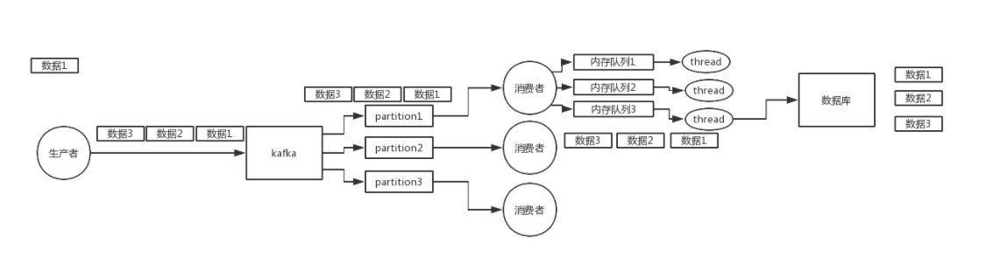

# 1 MQ作用

1 异步

2 解耦

3 消峰

4 冗余

5 顺序保证

6 缓存

7 可扩展

8 可恢复性

# 2 引入消息队列之后如何保证高可用性？

RabbitMQ的镜像集群模式。kafak本身

# 3 如何保证消息不被重复消费呢？

**一、kafka自带的消费机制**

　　kafka有个offset的概念，当每个消息被写进去后，都有一个offset，代表他的序号，然后consumer消费该数据之后，隔一段时间，会把自己消费过的消息的offset提交一下，代表我已经消费过了。下次我要是重启，就会继续从上次消费到的offset来继续消费。

　　但是当我们直接kill进程了，再重启。这会导致consumer有些消息处理了，但是没来得及提交offset。等重启之后，少数消息就会再次消费一次。

　　其他MQ也会有这种重复消费的问题，那么针对这种问题，我们需要从业务角度，考虑它的幂等性。

 

**二、通过保证消息队列消费的幂等性来保证**

　　举个例子，当消费一条消息时就往数据库插入一条数据。如何保证重复消费也插入一条数据呢？

　　那么我们就需要从幂等性角度考虑了。幂等性，我通俗点说，就一个数据，或者一个请求，无论来多次，对应的数据都不会改变的，不能出错。

 

**怎么保证消息队列消费的幂等性？**

我们需要结合业务来思考，比如下面的例子：

　　1.比如某个数据要写库，你先根据主键查一下，如果数据有了，就别插入了，update一下好吧

　　2.比如你是写redis，那没问题了，反正每次都是set，天然幂等性

　　3.对于消息，我们可以建个表（专门存储消息消费记录）

　　　　生产者，发送消息前判断库中是否有记录（有记录说明已发送），没有记录，先入库，状态为待消费，然后发送消息并把主键id带上。

　　　　消费者，接收消息，通过主键ID查询记录表，判断消息状态是否已消费。若没消费过，则处理消息，处理完后，更新消息记录的状态为已消费。

# 4 消息丢失的问题

**一、RabbitMQ**

**1）生产者弄丢了数据**

　　生产者将数据发送到rabbitmq的时候，可能因为网络问题导致数据就在半路给搞丢了。

 

1.可以选择用rabbitmq提供的事务功能，在生产者发送数据之前开启rabbitmq事务（channel.txSelect），然后发送消息，如果消息没有成功被rabbitmq接收到，那么生产者会收到异常报错，此时就可以回滚事务（channel.txRollback），然后重试发送消息；如果收到了消息，那么可以提交事务（channel.txCommit）。但是问题是，开始rabbitmq事务机制，基本上吞吐量会下来，因为太耗性能。

2.（推荐）可以开启confirm模式，在生产者那里设置开启confirm模式之后，你每次写的消息都会分配一个唯一的id，然后如果写入了rabbitmq中，rabbitmq会给你回传一个ack消息，告诉你说这个消息ok了。如果rabbitmq没能处理这个消息，会回调你一个nack接口，告诉你这个消息接收失败，你可以重试。而且你可以结合这个机制自己在内存里维护每个消息id的状态，如果超过一定时间还没接收到这个消息的回调，那么你可以重发。

　　

　　事务机制和cnofirm机制最大的不同在于，事务机制是同步的，你提交一个事务之后会阻塞在那儿，但是confirm机制是异步的，你发送个消息之后就可以发送下一个消息，然后那个消息rabbitmq接收了之后会异步回调你一个接口通知你这个消息接收到了。

所以一般在生产者这块避免数据丢失，都是用confirm机制的。

 

**2）rabbitmq弄丢了数据**

　　为了防止rabbitmq自己弄丢了数据，这个你必须**开启rabbitmq的持久化**，就是消息写入之后会持久化到磁盘，哪怕是rabbitmq自己挂了，恢复之后会自动读取之前存储的数据，一般数据不会丢。除非极其罕见的是，rabbitmq还没持久化，自己就挂了，可能导致少量数据会丢失的，但是这个概率较小。

　　**设置持久化有两个步骤**，第一个是创建queue的时候将其设置为持久化的，这样就可以保证rabbitmq持久化queue的元数据，但是不会持久化queue里的数据；第二个是发送消息的时候将消息的deliveryMode设置为2，就是将消息设置为持久化的，此时rabbitmq就会将消息持久化到磁盘上去。必须要同时设置这两个持久化才行，rabbitmq哪怕是挂了，再次重启，也会从磁盘上重启恢复queue，恢复这个queue里的数据。

　　而且持久化可以跟生产者那边的confirm机制配合起来，只有消息被持久化到磁盘之后，才会通知生产者ack了，所以哪怕是在持久化到磁盘之前，rabbitmq挂了，数据丢了，生产者收不到ack，你也是可以自己重发的。

　　若生产者那边的confirm机制未开启的情况下，哪怕是你给rabbitmq开启了持久化机制，也有一种可能，就是这个消息写到了rabbitmq中，但是还没来得及持久化到磁盘上，结果不巧，此时rabbitmq挂了，就会导致内存里的一点点数据会丢失。

**3）消费端弄丢了数据**

　　主要是因为你消费的时候，刚消费到，还没处理，结果进程挂了，比如重启了，那么就尴尬了，rabbitmq认为你都消费了，这数据就丢了。

　　这个时候得用rabbitmq提供的ack机制，简单来说，就是你关闭rabbitmq自动ack，可以通过一个api来调用就行，然后每次你自己代码里确保处理完的时候，再程序里ack一把。这样的话，如果你还没处理完，不就没有ack？那rabbitmq就认为你还没处理完，这个时候rabbitmq会把这个消费分配给别的consumer去处理，消息是不会丢的。

 

**二、Kafka**

1）消费者弄丢了数据

　　唯一可能导致消费者弄丢数据的情况，就是说，你那个消费到了这个消息，然后消费者那边自动提交了offset，让kafka以为你已经消费好了这个消息，其实你刚准备处理这个消息，你还没处理，你自己就挂了，此时这条消息就丢咯。

　　大家都知道kafka会自动提交offset，那么只要关闭自动提交offset，在处理完之后自己手动提交offset，就可以保证数据不会丢。但是此时确实还是会重复消费，比如你刚处理完，还没提交offset，结果自己挂了，此时肯定会重复消费一次，自己保证幂等性就好了。

 

**2）Kafka弄丢了数据**

　　比较常见的一个场景，就是kafka某个broker宕机，然后重新选举partiton的leader时。大家想想，要是此时其他的follower刚好还有些数据没有同步，结果此时leader挂了，然后选举某个follower成leader之后，他不就少了一些数据？这就丢了一些数据啊。

所以此时一般是要求起码设置如下4个参数：

1.给这个topic设置replication.factor参数：这个值必须大于1，要求每个partition必须有至少2个副本

2.在kafka服务端设置min.insync.replicas参数：这个值必须大于1，这个是要求一个leader至少感知到有至少一个follower还跟自己保持联系，没掉队，这样才能确保leader挂了还有一个follower吧

3.在producer端设置acks=all：这个是要求每条数据，必须是写入所有replica之后，才能认为是写成功了

4.在producer端设置retries=MAX（很大很大很大的一个值，无限次重试的意思）：这个是要求一旦写入失败，就无限重试，卡在这里了

　　生产环境就按照上述要求配置的，这样配置之后，至少在kafka broker端就可以保证在leader所在broker发生故障，进行leader切换时，数据不会丢失

# 5 我该怎么保证从消息队列里拿到的数据按顺序执行？

# 6消息积压问题？

　　1、broker

　　其实不用太关注消息队列，因为消息队列本身的处理能力要远远大于业务系统的处理能力。主流消息队列的单个节点，消息收发的性能可以达到每秒钟处理几万至几十万条消息的水平，还可以通过水平扩展 Broker 的实例数成倍地提升处理能力。

 

　　2、producer端性能优化

　　producer端对消息积压的影响不大，但是对producer端发送消息的性能有要求。一般是先执行自己的业务逻辑，最后再发送消息。如果说，你的代码发送消息的性能上不去，你需要优先检查一下，是不是发消息之前的业务逻辑耗时太多导致的。

　　对于发送消息的业务逻辑来说，设置批量发送及批量发送的大小可以提高发送端的发送性能

　　 Producer 发送消息的过程，Producer 发消息给 Broker，Broker 收到消息后返回确认响应，这是一次完整的交互。假设这一次交互的平均时延是 1ms，我们把这 1ms 的时间分解开，它包括了下面这些步骤的耗时：发送端准备数据、序列化消息、构造请求等逻辑的时间，也就是发送端在发送网络请求之前的耗时；发送消息和返回响应在网络传输中的耗时；Broker 处理消息的时延。如果是单线程发送，每次只发送 1 条消息，那么每秒只能发送 1000ms / 1ms * 1 条 /ms = 1000 条 消息，这种情况下并不能发挥出消息队列的全部实力。

　　无论是增加每次发送消息的批量大小，还是增加并发，都能成倍地提升发送性能。至于到底是选择批量发送还是增加并发，主要取决于发送端程序的业务性质。

　　发生消息积压后，producer端服务降级，关闭一些非核心业务，减少消息的产生。

 

　　3、consumer端性能优化 临时扩容

　　发生消息积压，主要原因就是消费端的消费能力跟不上生产端的生产速度。

　　扩容方案：利用临时消费者，消费原来积压队列中的消息。该消费者不做任何耗时的操作，将消息均匀写入新创建的队列里。*将更多consumer部署到更多的机器上消费新创建队列上的消息。*

​        场景：原来topicA 有3个partition
​        思路：扩展机器数量，创建新的topicB ，设定10个partition，之前A的消费者逻辑改为获取到topicA的消息之后，发topicB的消息，然后新的10台机器来处理topicB的数据，这样效率是以前的3倍 

# 7 如果让你来开发一个消息队列中间件，你会怎么设计架构？