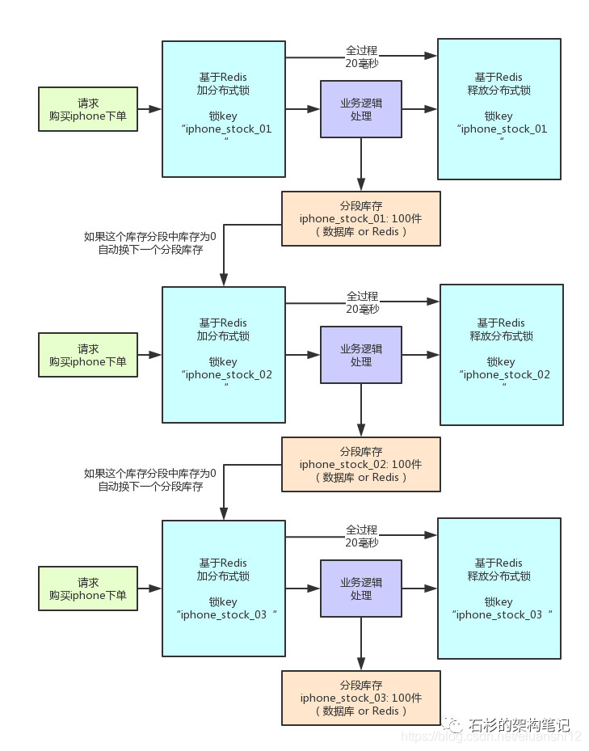

# 分布式锁调优

大规模并发，分布式锁如何调优。

# 0 在高并发场景下的问题

分布式锁一旦加了之后，对同一个商品的下单请求，会导致所有客户端都必须对同一个商品的库存锁key进行加锁。

比如，对iphone这个商品的下单，都必对“iphone_stock”这个锁key来加锁。这样会导致对同一个商品的下单请求，**就必须串行化，一个接一个的处理**。

假设加锁之后，释放锁之前，查库存 -> 创建订单 -> 扣减库存，这个过程性能很高吧，算他全过程20毫秒，这应该不错了。

那么1秒是1000毫秒，只能容纳50个对这个商品的请求依次串行完成处理。

缺陷：同一个商品多用户同时下单的时候，会基于分布式锁串行化处理，导致没法同时处理同一个商品的大量下单的请求。

这种方案，要是应对那种低并发、无秒杀场景的普通小电商系统，可能还可以接受

# 1 锁分段

把数据分成很多个段，每个段是一个单独的锁，所以多个线程过来并发修改数据的时候，可以并发的修改不同段的数据。不至于说，同一时间只能有一个线程独占修改ConcurrentHashMap中的数据。

另外，Java 8中新增了一个LongAdder类，也是针对Java 7以前的AtomicLong进行的优化，解决的是CAS类操作在高并发场景下，使用乐观锁思路，会导致大量线程长时间重复循环。

LongAdder中也是采用了类似的分段CAS操作，失败则自动迁移到下一个分段进行CAS的思路。

其实分布式锁的优化思路也是类似的，之前我们是在另外一个业务场景下落地了这个方案到生产中，不是在库存超卖问题里用的。

但是库存超卖这个业务场景不错，很容易理解，所以我们就用这个场景来说一下。

**`分段加锁思想`**。假如你现在iphone有1000个库存，那么你完全可以给拆成20个库存段，要是你愿意，可以在数据库的表里建20个库存字段，每个库存段是50件库存，比如stock_01对应50件库存，stock_02对应50件库存。类似这样的，也可以在redis之类的地方放20个库存key。

接着，1000个/s 请求，用一个简单的随机算法，每个请求都是随机在20个分段库存里，选择一个进行加锁。

每个下单请求锁了一个库存分段，然后在业务逻辑里面，就对数据库或者是Redis中的那个分段库存进行操作即可，包括查库存 -> 判断库存是否充足 -> 扣减库存。

相当于一个20毫秒，可以并发处理掉20个下单请求，那么1秒，也就可以依次处理掉20 * 50 = 1000个对iphone的下单请求了。

一旦对某个数据做了分段处理之后，**`有一个坑一定要注意：就是如果某个下单请求，咔嚓加锁，然后发现这个分段库存里的库存不足了，此时咋办？`**
这时你得**自动释放锁，然后立马换下一个分段库存，再次尝试加锁后尝试处理。** 这个过程一定要实现。

## 方案的不足

最大的不足，很不方便，实现太复杂。

- 首先，你得对一个数据分段存储，一个库存字段本来好好的，现在要分为20个分段库存字段；
- 其次，你在每次处理库存的时候，还得自己写随机算法，随机挑选一个分段来处理；
- 最后，如果某个分段中的数据不足了，你还得自动切换到下一个分段数据去处理。

这个过程都是要手动写代码实现的，还是有点工作量，挺麻烦的。

不过我们确实在一些业务场景里，因为用到了分布式锁，然后又必须要进行锁并发的优化，又进一步用到了分段加锁的技术方案，效果当然是很好的了，一下子并发性能可以增长几十倍

# 2 