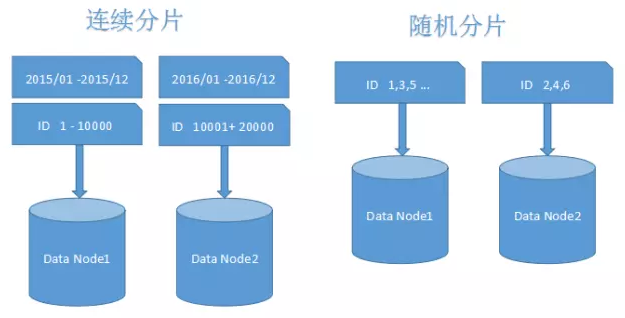
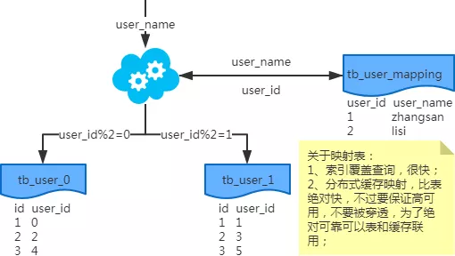
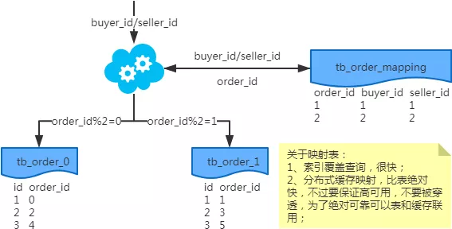
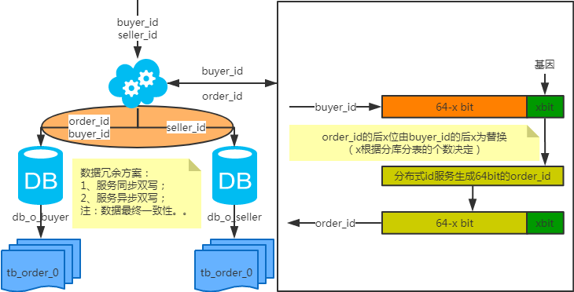
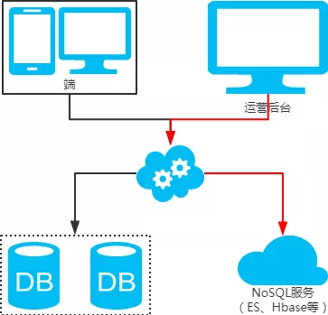
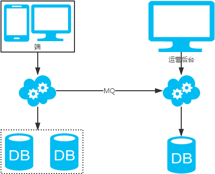
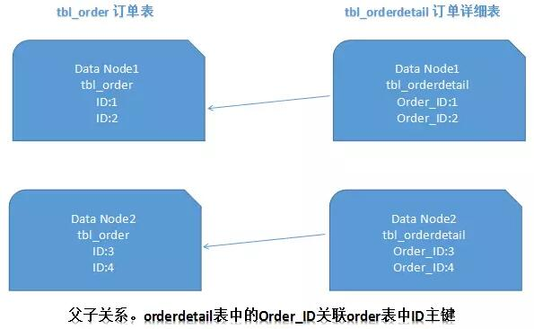
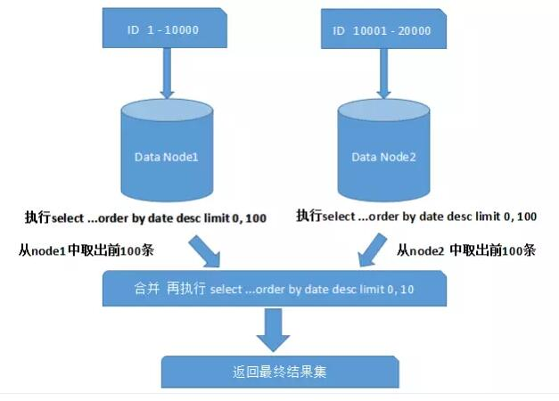
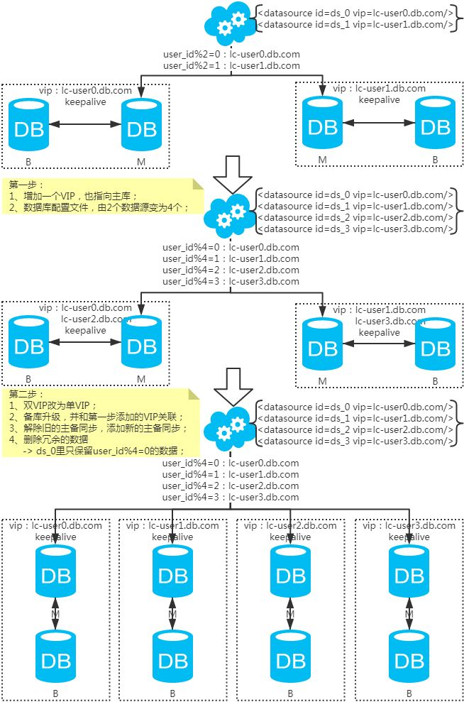
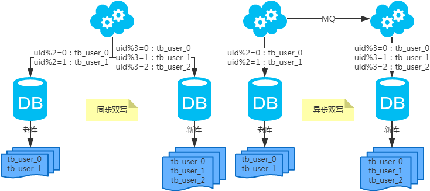

# sharding

# 2 数据分片

我们的系统是否需要分库分表吗？

一般MySQL单表1000W左右的数据是没有问题的（前提是应用系统和数据库等层面设计和优化的比较好）。当然，除了考虑当前的数据量和性能情况时，作为架构师，我们需要提前考虑系统半年到一年左右的业务增长情况，对数据库服务器的QPS、连接数、容量等做合理评估和规划，并提前做好相应的准备工作。如果单机无法满足，且很难再从其他方面优化，那么说明是需要考虑分片的。这种情况可以先去掉数据库中自增ID，为分片和后面的数据迁移工作提前做准备。

很多人觉得“分库分表”是宜早不宜迟，应该尽早进行。

基于水平分库分表，拆分策略为常用的一致性hash法。

## 2.1 整体方案

### 2.1.0 水平分表、水平分库、垂直分库分表

垂直分库：把不同的表分到不同的数据库里。

垂直分表：把一张表的不同字段，放在不同的数据库，冷热隔离。

水平分库: 把一个大表拆分成多个小表（user分为user_1， user_2），不在同一个数据库内

水平分表:把一个大表拆分成多个小表（user分为user_1， user_2），在同一个数据库内。

### 2.1.1水平切分，到底是分库还是分表？

强烈建议分库，而不是分表，因为：

- 分表依然公用一个数据库文件，仍然有磁盘IO的竞争
- 分库能够很容易的将数据迁移到不同数据库实例，甚至数据库机器上，扩展性更好

### 2.1.2 为什么不分区？

所有数据逻辑上还在一个表中，但物理上，可以根据一定的规则放在不同的文件中。这是MySQL5.1之后支持的功能，业务代码无需改动。

**分区表看上去很帅气，为什么大部分互联网公司不使用，而更多的选择分库分表来进行水平切分呢？**

分区表的一些缺点，是大数据量，高并发量的业务难以接受的：

（1）如果SQL不走分区键，很容易出现全表锁；

（2）在分区表实施关联查询，就是一个灾难；

（3）分库分表，自己掌控业务场景与访问模式，可控；分区表，工程师写了一个SQL，自己无法确定MySQL是怎么玩的，不可控；

*画外音：类似于，不要把业务逻辑实现在存储过程，用户自定义函数，触发器里，而要实现在业务代码里一样。*

（4）DBA给OP埋坑，容易大打出手，造成同事矛盾；

（5）…

当然，在数据量和并发量不太大，或者按照时间来存储冷热数据或归档数据的一些特定场景下，分区表还是有上场机会的

## 2.2 分片规则和策略

### 2.2 .1分片字段该如何选择

在开始分片之前，我们首先要确定分片字段（也可称为“片键”）。很多常见的例子和场景中是采用ID或者时间字段进行拆分。这也并不绝对的，我的建议是结合实际业务，通过对系统中执行的sql语句进行统计分析，选择出需要分片的那个表中最频繁被使用，或者最重要的字段来作为分片字段。

### 2.2 .2常见分片规则

常见的分片策略有**随机分片**和**连续分片**这两种，如下图所示：

  

1 当需要使用分片字段进行范围查找时，连续分片可以快速定位分片进行高效查询，大多数情况下可以有效避免跨分片查询的问题。后期如果想对整个分片集群扩容时，只需要添加节点即可，无需对其他分片的数据进行迁移。但是，连续分片也有可能存在数据热点的问题，就像图中按时间字段分片的例子，有些节点可能会被频繁查询压力较大，热数据节点就成为了整个集群的瓶颈。而有些节点可能存的是历史数据，很少需要被查询到。

2 随机分片其实并不是随机的，也遵循一定规则。通常，我们会采用Hash取模的方式进行分片拆分，所以有些时候也被称为离散分片。随机分片的数据相对比较均匀，不容易出现**热点和并发访问**的瓶颈。但是，后期分片集群扩容起来需要迁移旧的数据。**使用一致性Hash算法能够很大程度的避免这个问题，**所以很多中间件的**分片集群都会采用一致性Hash算**法。离散分片也很容易面临跨分片查询的复杂问题。

### 2.2 .3数据迁移，容量规划，扩容等问题

很少有项目会在初期就开始考虑分片设计的，一般都是在业务高速发展面临性能和存储的瓶颈时才会提前准备。因此，不可避免的就需要考虑历史数据迁移的问题。一般做法就是通过程序先读出历史数据，然后按照指定的分片规则再将数据写入到各个分片节点中。

此外，我们需要根据当前的数据量和QPS等进行容量规划，综合成本因素，推算出大概需要多少分片（一般建议单个分片上的单表数据量不要超过1000W）。

如果是采用随机分片，则需要考虑后期的扩容问题，相对会比较麻烦。如果是采用的范围分片，只需要添加节点就可以自动扩容。

### 2.2.X 美团的方案 https://tech.meituan.com/2016/11/18/dianping-order-db-sharding.html 

## 2.4 分割后的sql

### 2.4.1禁止使用：

a）各种联合查询

b）子查询

c）触发器

d）用户自定义函数

e）“事务”都用的很少

原因：对数据库性能影响极大

### 2.4.2 IN查询

### 2.4.3 非Partition key的查询

**1 端上除了partition key只有一个非partition key作为条件查询**

（1）映射法

key与查询时段的 redis缓存关系，做一次映射。

基因法

> 注：写入时，基因法生成user_id，如图。关于xbit基因，例如要分8张表，23=8，故x取3，即3bit基因。根据user_id查询时可直接取模路由到对应的分库或分表。
>
> 
>
> 根据user_name查询时，先通过user_name_code生成函数生成user_name_code再对其取模路由到对应的分库或分表。id生成常用snowflake算法。

**端上除了partition key不止一个非partition key作为条件查询**

映射法

冗余法

> 注：按照order_id或buyer_id查询时路由到db_o_buyer库中，按照seller_id查询时路由到db_o_seller库中。感觉有点本末倒置！有其他好的办法吗？改变技术栈呢？

**后台除了partition key还有各种非partition key组合条件查询**

NoSQL法

冗余法

 非partition key跨库跨表分页查询问题

> 注：用NoSQL法解决（ES等）。

### 2.4.4 夸库分页怎么玩？

### 2.4.5. ORDER BY xxx OFFSET xxx LIMIT xxx

分库后的难题：如何确认全局偏移量

分库后传统解决方案：查询改写+内存排序

a）ORDER BY time OFFSET 0 LIMIT 10000+100

b）对20200条记录进行排序

c）返回第10000至10100条记录

优化方案一：增加辅助id，以减少查询量

优化方案二：模糊查询

a）业务上：禁止查询XX页之后的数据

b）业务上：允许模糊返回 => 第100页数据的精确性真这么重要么？

最后的大招！！！（由于时间问题，只在DTCC2015上分享了哟）

**优化方案三：终极方案，业务无损，查询改写与两段查询**

需求：ORDER BY x OFFSET 10000 LIMIT 4; 如何在分库下实现（假设分3库）

**步骤一、查询改写**： ORDER BY x OFFSET **3333** LIMIT 4

[4,7,9,10] <= 1库返回

[3,5,6,7] <= 2库返回

[6,8,9,11] <= 3库返回

**步骤二、找到步骤一返回的min和max**，即3和11

**步骤三、通过min和max二次查询**：ORDER BY x WHERE x **BETWEEN** 3 AND 11

[3,4,7,9,10] <= 1库返回，4在1库offset是3333，于是3在1库的offset是3332

[3,5,6,7,11] <= 2库返回，3在2库offset是3333

[3,5,6,8,9,11] <= 3库返回，6在3库offset是3333，于是3在3库的offset是3331

**步骤四、找出全局OFFSET**

3是全局offset3332+3333+3331=9996

当当当当，跳过3,3,3,4，于是全局OFFSET 10000 LIMIT 4是[5,5,6,6]

## 2.5 分片后的问题

### 2.5 .1跨分片join

Join是关系型数据库中最常用的特性，但是在分片集群中，join也变得非常复杂。应该尽量避免跨分片的join查询（这种场景，比上面的跨分片分页更加复杂，而且对性能的影响很大）。通常有以下几种方式来避免：

### 1.全局表

全局表的概念之前在“垂直分库”时提过。基本思想一致，就是把一些类似数据字典又可能会产生join查询的表信息放到各分片中，从而避免跨分片的join。

### 2.ER分片

在关系型数据库中，表之间往往存在一些关联的关系。如果我们可以先确定好关联关系，并将那些存在关联关系的表记录存放在同一个分片上，那么就能很好的避免跨分片join问题。在一对多关系的情况下，我们通常会选择按照数据较多的那一方进行拆分。如下图所示：

  

这样一来，Data Node1上面的订单表与订单详细表就可以直接关联，进行局部的join查询了，Data Node2上也一样。基于ER分片的这种方式，能够有效避免大多数业务场景中的跨分片join问题。

### 3.内存计算

随着spark内存计算的兴起，理论上来讲，很多跨数据源的操作问题看起来似乎都能够得到解决。可以将数据丢给spark集群进行内存计算，最后将计算结果返回。

### 2.5.2 跨分片的排序分页

一般来讲，分页时需要按照指定字段进行排序。当排序字段就是分片字段的时候，我们通过分片规则可以比较容易定位到指定的分片，而当排序字段非分片字段的时候，情况就会变得比较复杂了。为了最终结果的准确性，我们需要在不同的分片节点中将数据进行排序并返回，并将不同分片返回的结果集进行汇总和再次排序，最后再返回给用户。如下图所示：

  

上面图中所描述的只是最简单的一种情况（取第一页数据），看起来对性能的影响并不大。但是，如果想取出第10页数据，情况又将变得复杂很多，如下图所示：

  

有些读者可能并不太理解，为什么不能像获取第一页数据那样简单处理（排序取出前10条再合并、排序）。其实并不难理解，因为各分片节点中的数据可能是随机的，为了排序的准确性，必须把所有分片节点的前N页数据都排序好后做合并，最后再进行整体的排序。很显然，这样的操作是比较消耗资源的，用户越往后翻页，系统性能将会越差

### 2.5.3 跨分片的函数处理

 在使用Max、Min、Sum、Count之类的函数进行统计和计算的时候，需要先在每个分片数据源上执行相应的函数处理，然后再将各个结果集进行二次处理，最终再将处理结果返回。如下图所示： 

  

### 2.5.4 跨分片事务问题

### 2.5.5 扩容问题

**水平扩容库（升级从库法）**

****

> 注：扩容是成倍的。

**水平扩容表（双写迁移法）**

****

- 第一步：（同步双写）修改应用配置和代码，加上双写，部署；
- 第二步：（同步双写）将老库中的老数据复制到新库中；
- 第三步：（同步双写）以老库为准校对新库中的老数据；
- 第四步：（同步双写）修改应用配置和代码，去掉双写，部署；

> 注：双写是通用方案。

一、数据的垂直切分
概念：数据的垂直切分，也可以称之为纵向切分。将不同的表分散到不同的数据库主机中。
一个应用系统，总体功能肯定是由很多个功能模块所组成的，而每一个功能模块所需要的数据对应到数据库中就是一个或者多个表。
在架构设计中，各个功能模块相互之间的交互点越统一越少，系统的耦合度就越低，系统各个模块的维护性以及扩展性也就越好。
这样的系统，实现数据的垂直切分也就越容易。

1）可以根据功能模块来进行数据的切分，不同功能模块的数据存放于不同的数据库主机中，可以很容易就避免掉跨数据库的Join存在，同时系统架构也非常的清晰。
2）很难有系统能够做到所有功能模块所使用的表完全独立，完全不需要访问对方的表或者需要两个模块的表进行Join操作。根据实际的应用场景进行评估权衡。
1.迁就应用程序，将需要Join的表的相关某快都存放在同一个数据库中。
2.让应用程序做更多的事情，程序完全通过模块接口取得不同数据库中的数据，然后在程序中完成Join操作。

通过这样的垂直切分之后，之前只能通过一个数据库来提供的服务，就被分拆成四个数据库来提供服务，服务能力自然是增加几倍了。

垂直切分的优点

◆ 数据库的拆分简单明了，拆分规则明确；

◆ 应用程序模块清晰明确，整合容易；

◆ 数据维护方便易行，容易定位；

垂直切分的缺点

◆ 部分表关联无法在数据库级别完成，需要在程序中完成；

◆ 对于访问极其频繁且数据量超大的表仍然存在性能平静，不一定能满足要求；

◆ 事务处理相对更为复杂；

◆ 切分达到一定程度之后，扩展性会遇到限制；

◆ 过读切分可能会带来系统过渡复杂而难以维护。

Notice：在数据库进行垂直切分的时候，如何切分，切分到什么样的程度，是一个比较考验人的难题。只能在实际的应用场景中通过平衡各方面的成本和收益，才能分析出一个真正适合自己的拆分方案。
可能在某些操作的单次响应时间会稍有增加，但是系统的整体性能很可能反而会有一定的提升。

 

二、数据的水平切分
概念：水平切分主要是将某个访问极其平凡的表再按照某个字段的某种规则来分散到多个表之中，每个表中包含一部分数据。
就是按照数据行的切分，就是将表中的某些行切分到一个数据库，而另外的某些行又切分到其他的数据库中。

1）按照某种特定的规则来进行切分。
1.某个数字类型字段基于特定数目取模
2.某个时间类型字段的范围
3.某个字符类型字段的hash值。
2）使相关的数据进行切分之后尽量存放在相同的数据库中，即使是需要join查询，也可以非常简单的关联上，在数据库层面上就可以进行关联查询。

水平切分的优点

◆ 表关联基本能够在数据库端全部完成；

◆ 不会存在某些超大型数据量和高负载的表遇到瓶颈的问题；

◆ 应用程序端整体架构改动相对较少；

◆ 事务处理相对简单；

◆ 只要切分规则能够定义好，基本上较难遇到扩展性限制；

水平切分的缺点

◆ 切分规则相对更为复杂，很难抽象出一个能够满足整个数据库的切分规则；

◆ 后期数据的维护难度有所增加，人为手工定位数据更困难；

◆ 应用系统各模块耦合度较高，可能会对后面数据的迁移拆分造成一定的困难。

三、垂直与水平切分的联合使用
每一个应用系统的负载都是一步一步增长上来的，在开始遇到性能瓶颈的时候，大多数架构师和DBA都会选择先进行数据的垂直拆分，因为这样的成本最先，最符合这个时期所追求的最大投入产出比。然而，随着业务的不断扩张，系统负载的持续增长，在系统稳定一段时期之后，经过了垂直拆分之后的数据库集群可能又再一次不堪重负，遇到了性能瓶颈。这时就需要进行水平切分。

实际上，在很多大型的应用系统中，垂直切分和水平切这两种数据的切分方法基本上都是并存的，而且经常在不断的交替进行，以不断的增加系统的扩展能力。我们在应对不同的应用场景的时候，也需要充分考虑到这两种切分方法各自的局限，以及各自的优势，在不同的时期（负载压力）使用不同的结合方式。

联合切分的优点

◆ 可以充分利用垂直切分和水平切分各自的优势而避免各自的缺陷；

◆ 让系统扩展性得到最大化提升；

联合切分的缺点

◆ 数据库系统架构比较复杂，维护难度更大；

◆ 应用程序架构也相对更复杂；

四、数据切分及整合方案

数据库中的数据在经过垂直和（或）水平切分被存放在不同的数据库主机之后，应用系统面临的最大问题就是如何来让这些数据源得到较好的整合

总的来说，存在两种解决思路：

\1. 在每个应用程序模块中配置管理自己需要的一个（或者多个）数据源，直接访问各个数据库，在模块内完成数据的整合；

\2. 通过中间代理层来统一管理所有的数据源，后端数据库集群对前端应用程序透明；

可能90%以上的人在面对上面这两种解决思路的时候都会倾向于选择第二种，尤其是系统不断变得庞大复杂的时候。确实，这是一个非常正确的选择，虽然短期内需要付出的成本可能会相对更大一些，但是对整个系统的扩展性来说，是非常有帮助的。

五、数据切分与整合可能存在的问题

在实施数据切分方案之前，有些可能存在的问题我们还是需要做一些分析的。一般来说，我们可能遇到的问题主要会有以下几点：

◆ 引入分布式事务的问题；

◆ 跨节点Join的问题；

◆ 跨节点合并排序分页问题；

\1. 引入分布式事务的问题

一旦数据进行切分被分别存放在多个MySQLServer中之后，不管我们的切分规则设计的多么的完美（实际上并不存在完美的切分规则），都可能造成之前的某些事务所涉及到的数据已经不在同一个MySQLServer中了。

在这样的场景下，如果我们的应用程序仍然按照老的解决方案，那么势必需要引入分布式事务来解决。而在MySQL各个版本中，只有从MySQL5.0开始以后的各个版本才开始对分布式事务提供支持，而且目前仅有Innodb提供分布式事务支持。不仅如此，即使我们刚好使用了支持分布式事务的MySQL版本，同时也是使用的Innodb存储引擎，分布式事务本身对于系统资源的消耗就是很大的，性能本身也并不是太高。而且引入分布式事务本身在异常处理方面就会带来较多比较难控制的因素。

怎么办？其实我们可以可以通过一个变通的方法来解决这种问题，首先需要考虑的一件事情就是：是否数据库是唯一一个能够解决事务的地方呢？其实并不是这样的，我们完全可以结合数据库以及应用程序两者来共同解决。各个数据库解决自己身上的事务，然后通过应用程序来控制多个数据库上面的事务。

也就是说，只要我们愿意，完全可以将一个跨多个数据库的分布式事务分拆成多个仅处于单个数据库上面的小事务，并通过应用程序来总控各个小事务。当然，这样作的要求就是我们的应用程序必须要有足够的健壮性，当然也会给应用程序带来一些技术难度。

2.跨节点Join的问题

上面介绍了可能引入分布式事务的问题，现在我们再看看需要跨节点Join的问题。数据切分之后，可能会造成有些老的Join语句无法继续使用，因为Join使用的数据源可能被切分到多个MySQLServer中了。

怎么办？这个问题从MySQL数据库角度来看，如果非得在数据库端来直接解决的话，恐怕只能通过MySQL一种特殊的存储引擎Federated来解决了。Federated存储引擎是MySQL解决类似于Oracle的DBLink之类问题的解决方案。和OracleDBLink的主要区别在于Federated会保存一份远端表结构的定义信息在本地。咋一看，Federated确实是解决跨节点Join非常好的解决方案。但是我们还应该清楚一点，那就似乎如果远端的表结构发生了变更，本地的表定义信息是不会跟着发生相应变化的。如果在更新远端表结构的时候并没有更新本地的Federated表定义信息，就很可能造成Query运行出错，无法得到正确的结果。

对待这类问题，我还是推荐通过应用程序来进行处理，先在驱动表所在的MySQLServer中取出相应的驱动结果集，然后根据驱动结果集再到被驱动表所在的MySQLServer中取出相应的数据。可能很多读者朋友会认为这样做对性能会产生一定的影响，是的，确实是会对性能有一定的负面影响，但是除了此法，基本上没有太多其他更好的解决办法了。而且，由于数据库通过较好的扩展之后，每台MySQLServer的负载就可以得到较好的控制，单纯针对单条Query来说，其响应时间可能比不切分之前要提高一些，所以性能方面所带来的负面影响也并不是太大。更何况，类似于这种需要跨节点Join的需求也并不是太多，相对于总体性能而言，可能也只是很小一部分而已。所以为了整体性能的考虑，偶尔牺牲那么一点点，其实是值得的，毕竟系统优化本身就是存在很多取舍和平衡的过程。

\3. 跨节点合并排序分页问题

一旦进行了数据的水平切分之后，可能就并不仅仅只有跨节点Join无法正常运行，有些排序分页的Query语句的数据源可能也会被切分到多个节点，这样造成的直接后果就是这些排序分页Query无法继续正常运行。其实这和跨节点Join是一个道理，数据源存在于多个节点上，要通过一个Query来解决，就和跨节点Join是一样的操作。同样Federated也可以部分解决，当然存在的风险也一样。

还是同样的问题，怎么办？我同样仍然继续建议通过应用程序来解决。

如何解决？解决的思路大体上和跨节点Join的解决类似，但是有一点和跨节点Join不太一样，Join很多时候都有一个驱动与被驱动的关系，所以Join本身涉及到的多个表之间的数据读取一般都会存在一个顺序关系。但是排序分页就不太一样了，排序分页的数据源基本上可以说是一个表（或者一个结果集），本身并不存在一个顺序关系，所以在从多个数据源取数据的过程是完全可以并行的。这样，排序分页数据的取数效率我们可以做的比跨库Join更高，所以带来的性能损失相对的要更小，在有些情况下可能比在原来未进行数据切分的数据库中效率更高了。当然，不论是跨节点Join还是跨节点排序分页，都会使我们的应用服务器消耗更多的资源，尤其是内存资源，因为我们在读取访问以及合并结果集的这个过程需要比原来处理更多的数据。

**1、应用限制**

 

1. Sharding 后对应用和 SQL 的侵入都很大，需要 SQL 足够简单，这种简单的应用导致 DB 弱化为存储。
2. SQL 不能跨维度 join、聚合、子查询等。
3. 每个分片只能实现 Local index，不能实现诸如唯一键、外键等全局约束。

 

**2、Sharding 业务维度选择**

 

1. 有些业务没有天然的业务维度，本身选择一个维度就是个问题。
2. 大部分业务需要多维度的支持，多维度的情况下。

 

1. 哪个业务维度为主？
2. 其它业务维度产生了数据冗余，如果没有全局事务的话，很难保证一致性，全局事务本身实现很难，并且响应时间大幅度下降，业务相互依赖存在重大隐患，于是经常发生“风控把支付给阻塞了”的问题。
3. 多维度实现方式，数据库同步还是异步？同步依赖应用端实现双写，异步存在实效性问题，对业务有限制，会发生“先让订单飞一会的问题”。
4. 多维度数据关系表（mapping）维护。

 

**3****、Sharding key 选择（非业务维度选择）**

 

1. 非业务维度选择，会存在“我要的数据到底在那个集群上”的问题。
2. 业务维度列如何选择 Sharding key ？
3. 热点如何均摊，数据分布可能有长尾效应。

 

**4****、Sharding 算法选择**

 

1. Hash 算法可以比较好的分散的热点数据，但对范围查询需要访问多个分片。反之 Range 算法又存在热点问题。所以要求在设计之初就要清楚自己的业务常用读写类型。
2. 转换算法成本很高。

 

**5****、高可用问题**

 

1. 高可用的扩散问题（一个集群不可用，整个业务“不可用”）。
2. 如何应对脑裂的情况？
3. MGR 多主模式数据冲突解决方案不成熟，基本上还没公司接入生产系统。
4. PXC 未解决写入容量，存在木桶原则，降低了写入容量。
5. 第三方依赖，MHA（判断主库真死、新路由信息广播都需要一定的时间成本） 最快也需要 15s。
6. 虽然有 GTID，仍然需要手工恢复。

 

**6****、数据一致性（其实这个严格上不属于分库分表的问题，但这个太重要了，不得不说）**

 

1. MySQL 双一方案( redo、binlog 提交持久化) 严重影响了写入性能。
2. 即使双一方案，主库硬盘挂了，由于异步复制，数据还是会丢。
3. 强一致场景需求，比如金融行业，MySQL 目前只能做到双一＋半同步复制，既然是半同步，随时可能延迟为异步复制，还是会丢数据。
4. MGR ？上面说过，多写模式问题很多，距离接入生产系统还很远。
5. InnoDB Cluster ？先搞出来再说吧。

 

**7****、DB Proxy**

 

1. 依赖网络层（LVS）实现负载均衡，跨 IDC 依赖 DNS，DNS + LVS + DBproxy + MySQL 网络链路过长，延迟增加、最重要的是存在全公司层面网络单点。
2. 部分产品对 Prepare 不友好，需要绑定 connection。

 

**8****、JDBC Proxy**

 

1. 语言限制，需要单独对某语言写 Driver，应用不友好。
2. 并未实现 DB 层的透明使用。

 

**9****、全局 ID**

 

1. 很简单的应用变成了很复杂的实现。
2. 采用 MySQL 自增 ID，写入扩大，单机容量有限。
3. 利用数据库集群并设置相应的步长，绝对埋坑的方案。
4. 依赖第三方组件，Redis Sequence、Twitter Snowflake ，复杂度增加，还引入了单点。
5. Guid、Random 算法，说好的连续性呢？还有一定比例冲突。
6. 业务属性字段 + 时间戳 + 随机数，冲突比例很高，依赖 NTP 等时间一致服务。

 

**10****、Double resource for AP**

 

1. 同样的数据需要双倍的人力和产品。
2. 产品的重复，Hadoop、Hive、Hbase、Phoenix。
3. 人力的重复。
4. 数据迁移的复杂实现，Canal、databus、puma、dataX ？
5. 实时查询？普遍 T+1 查询。
6. TP 业务表变更导致 AP 业务统计失败，“老板问为啥报表显示昨天订单下降这么多，因为做个了 DDL。”

 

**11****、运维友好度 (DDL、扩容等)**

 

1. 运维的复杂性是随着机器数量指数级增长的，Google 在 F1 之前维护了一个 100 多个节点的 MySQL sharding 就痛得不行了，不惜重新写了一个 Spanner 和 F1 搞定这个问题。
2. 传统 RDBMS 上 DDL 锁表的问题，对于数据量较大的业务来说，锁定的时间会很长，如果使用 pt-osc、gh-ost 这样第三方工具来实现非阻塞 DDL，额外的空间开销会比较大，另外仍然需要人工的介入确保数据的一致性，最后切换的过程系统可能会有抖动，pt-osc 还需要两次获取 metalock，虽然这个操作本事很轻量，可糟糕的是如果它被诸如 DDL的锁阻塞，它会阻塞所有的 DML，于是悲剧了。

 

**12****、与原有业务的兼容性**

 

1. 时间成本，如果业务一开始设计时没有考虑分库分表或者中间件这类的方案，在应对数据量暴增的情况下匆忙重构是很麻烦的事情。
2. 技术成本，如果没有强有力和有经验的架构师，很难在业务早期做出良好的设计，另外对于大多数非互联网行业的开发者来说更是不熟悉。

 

**13****、Sharding 容量管理**

 

1. 拆分不足，需要再次拆分的问题，工作量巨大。
2. 拆分充足，大部分业务增长往往比预期低很多，经常发生“又被 PM 妹纸骗了，说好的百万级流量呢”的问题，即时业务增长得比较好，往往需要一个很长的周期，机器资源浪费严重。

 

**14****、运维成本，人力成本**

 

不解释，SRE、DBA 兄弟们懂的。

