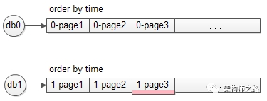
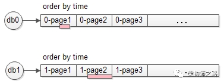
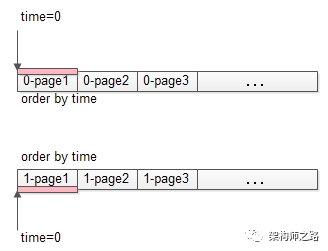
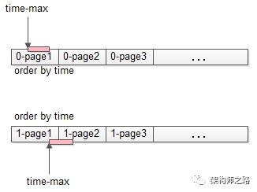
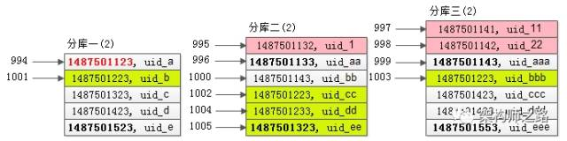

## 2.0 分片产生的所有问题


**1、应用限制**

 

1. Sharding 后对应用和 SQL 的侵入都很大，需要 SQL 足够简单，这种简单的应用导致 DB 弱化为存储。
2. SQL 不能跨维度 join、聚合、子查询等。
3. 每个分片只能实现 Local index，不能实现诸如唯一键、外键等全局约束。

 

**2、Sharding 业务维度选择**

 

1. 有些业务没有天然的业务维度，本身选择一个维度就是个问题。
2. 大部分业务需要多维度的支持，多维度的情况下。

 

1. 哪个业务维度为主？
2. 其它业务维度产生了数据冗余，如果没有全局事务的话，很难保证一致性，全局事务本身实现很难，并且响应时间大幅度下降，业务相互依赖存在重大隐患，于是经常发生“风控把支付给阻塞了”的问题。
3. 多维度实现方式，数据库同步还是异步？同步依赖应用端实现双写，异步存在实效性问题，对业务有限制，会发生“先让订单飞一会的问题”。
4. 多维度数据关系表（mapping）维护。

 

**3****、Sharding key 选择（非业务维度选择）**

 

1. 非业务维度选择，会存在“我要的数据到底在那个集群上”的问题。
2. 业务维度列如何选择 Sharding key ？
3. 热点如何均摊，数据分布可能有长尾效应。

 

**4****、Sharding 算法选择**

 

1. Hash 算法可以比较好的分散的热点数据，但对范围查询需要访问多个分片。反之 Range 算法又存在热点问题。所以要求在设计之初就要清楚自己的业务常用读写类型。
2. 转换算法成本很高。

 

**5****、高可用问题**

 

1. 高可用的扩散问题（一个集群不可用，整个业务“不可用”）。
2. 如何应对脑裂的情况？
3. MGR 多主模式数据冲突解决方案不成熟，基本上还没公司接入生产系统。
4. PXC 未解决写入容量，存在木桶原则，降低了写入容量。
5. 第三方依赖，MHA（判断主库真死、新路由信息广播都需要一定的时间成本） 最快也需要 15s。
6. 虽然有 GTID，仍然需要手工恢复。

 

**6****、数据一致性（其实这个严格上不属于分库分表的问题，但这个太重要了，不得不说）**

 

1. MySQL 双一方案( redo、binlog 提交持久化) 严重影响了写入性能。
2. 即使双一方案，主库硬盘挂了，由于异步复制，数据还是会丢。
3. 强一致场景需求，比如金融行业，MySQL 目前只能做到双一＋半同步复制，既然是半同步，随时可能延迟为异步复制，还是会丢数据。
4. MGR ？上面说过，多写模式问题很多，距离接入生产系统还很远。
5. InnoDB Cluster ？先搞出来再说吧。

 

**7****、DB Proxy**

 

1. 依赖网络层（LVS）实现负载均衡，跨 IDC 依赖 DNS，DNS + LVS + DBproxy + MySQL 网络链路过长，延迟增加、最重要的是存在全公司层面网络单点。
2. 部分产品对 Prepare 不友好，需要绑定 connection。

 

**8****、JDBC Proxy**

 

1. 语言限制，需要单独对某语言写 Driver，应用不友好。
2. 并未实现 DB 层的透明使用。

 

**9****、全局 ID**

 

1. 很简单的应用变成了很复杂的实现。
2. 采用 MySQL 自增 ID，写入扩大，单机容量有限。
3. 利用数据库集群并设置相应的步长，绝对埋坑的方案。
4. 依赖第三方组件，Redis Sequence、Twitter Snowflake ，复杂度增加，还引入了单点。
5. Guid、Random 算法，说好的连续性呢？还有一定比例冲突。
6. 业务属性字段 + 时间戳 + 随机数，冲突比例很高，依赖 NTP 等时间一致服务。

 

**10****、Double resource for AP**

 

1. 同样的数据需要双倍的人力和产品。
2. 产品的重复，Hadoop、Hive、Hbase、Phoenix。
3. 人力的重复。
4. 数据迁移的复杂实现，Canal、databus、puma、dataX ？
5. 实时查询？普遍 T+1 查询。
6. TP 业务表变更导致 AP 业务统计失败，“老板问为啥报表显示昨天订单下降这么多，因为做个了 DDL。”

 

**11****、运维友好度 (DDL、扩容等)**

 

1. 运维的复杂性是随着机器数量指数级增长的，Google 在 F1 之前维护了一个 100 多个节点的 MySQL sharding 就痛得不行了，不惜重新写了一个 Spanner 和 F1 搞定这个问题。
2. 传统 RDBMS 上 DDL 锁表的问题，对于数据量较大的业务来说，锁定的时间会很长，如果使用 pt-osc、gh-ost 这样第三方工具来实现非阻塞 DDL，额外的空间开销会比较大，另外仍然需要人工的介入确保数据的一致性，最后切换的过程系统可能会有抖动，pt-osc 还需要两次获取 metalock，虽然这个操作本事很轻量，可糟糕的是如果它被诸如 DDL的锁阻塞，它会阻塞所有的 DML，于是悲剧了。

 

**12****、与原有业务的兼容性**

 

1. 时间成本，如果业务一开始设计时没有考虑分库分表或者中间件这类的方案，在应对数据量暴增的情况下匆忙重构是很麻烦的事情。
2. 技术成本，如果没有强有力和有经验的架构师，很难在业务早期做出良好的设计，另外对于大多数非互联网行业的开发者来说更是不熟悉。

 

**13****、Sharding 容量管理**

 

1. 拆分不足，需要再次拆分的问题，工作量巨大。
2. 拆分充足，大部分业务增长往往比预期低很多，经常发生“又被 PM 妹纸骗了，说好的百万级流量呢”的问题，即时业务增长得比较好，往往需要一个很长的周期，机器资源浪费严重。

 

**14****、运维成本，人力成本**

**15  数据分片

我们的系统是否需要分库分表吗？

一般MySQL单表1000W左右的数据是没有问题的（前提是应用系统和数据库等层面设计和优化的比较好）。当然，除了考虑当前的数据量和性能情况时，作为架构师，我们需要提前考虑系统半年到一年左右的业务增长情况，对数据库服务器的QPS、连接数、容量等做合理评估和规划，并提前做好相应的准备工作。如果单机无法满足，且很难再从其他方面优化，那么说明是需要考虑分片的。这种情况可以先去掉数据库中自增ID，为分片和后面的数据迁移工作提前做准备。

很多人觉得“分库分表”是宜早不宜迟，应该尽早进行。

基于水平分库分表，拆分策略为常用的一致性hash法。

垂直与水平切分的联合使用
每一个应用系统的负载都是一步一步增长上来的，在开始遇到性能瓶颈的时候，大多数架构师和DBA都会选择先进行数据的垂直拆分，因为这样的成本最先，最符合这个时期所追求的最大投入产出比。然而，随着业务的不断扩张，系统负载的持续增长，在系统稳定一段时期之后，经过了垂直拆分之后的数据库集群可能又再一次不堪重负，遇到了性能瓶颈。这时就需要进行水平切分。

实际上，在很多大型的应用系统中，垂直切分和水平切这两种数据的切分方法基本上都是并存的，而且经常在不断的交替进行，以不断的增加系统的扩展能力。我们在应对不同的应用场景的时候，也需要充分考虑到这两种切分方法各自的局限，以及各自的优势，在不同的时期（负载压力）使用不同的结合方式。

**16 联合切分的优点

◆ 可以充分利用垂直切分和水平切分各自的优势而避免各自的缺陷；

◆ 让系统扩展性得到最大化提升；

联合切分的缺点

◆ 数据库系统架构比较复杂，维护难度更大；

◆ 应用程序架构也相对更复杂；


16 中间件的选择：

总的来说，存在两种解决思路：

 在每个应用程序模块中配置管理自己需要的一个（或者多个）数据源，直接访问各个数据库，在模块内完成数据的整合；

 通过中间代理层来统一管理所有的数据源，后端数据库集群对前端应用程序透明；

可能90%以上的人在面对上面这两种解决思路的时候都会倾向于选择第二种，尤其是系统不断变得庞大复杂的时候。确实，这是一个非常正确的选择，虽然短期内需要付出的成本可能会相对更大一些，但是对整个系统的扩展性来说，是非常有帮助的。

## 2.1 整体方案

### 2.1.0 水平分表、水平分库、垂直分库分表

垂直分库：把不同的表分到不同的数据库里。

垂直分表：把一张表的不同字段，放在不同的数据库，冷热隔离。

水平分库: 把一个大表拆分成多个小表（user分为user_1， user_2），不在同一个数据库内

水平分表:把一个大表拆分成多个小表（user分为user_1， user_2），在同一个数据库内。

### 2.1.1水平切分，到底是分库还是分表？

强烈建议分库，而不是分表，因为：

- 分表依然公用一个数据库文件，仍然有磁盘IO的竞争
- 分库能够很容易的将数据迁移到不同数据库实例，甚至数据库机器上，扩展性更好

### 2.1.2 为什么不分区？

所有数据逻辑上还在一个表中，但物理上，可以根据一定的规则放在不同的文件中。这是MySQL5.1之后支持的功能，业务代码无需改动。

**分区表看上去很帅气，为什么大部分互联网公司不使用，而更多的选择分库分表来进行水平切分呢？**

分区表的一些缺点，是大数据量，高并发量的业务难以接受的：

（1）如果SQL不走分区键，很容易出现全表锁；

（2）在分区表实施关联查询，就是一个灾难；

（3）分库分表，自己掌控业务场景与访问模式，可控；分区表，工程师写了一个SQL，自己无法确定MySQL是怎么玩的，不可控；

*画外音：类似于，不要把业务逻辑实现在存储过程，用户自定义函数，触发器里，而要实现在业务代码里一样。*

（4）DBA给OP埋坑，容易大打出手，造成同事矛盾；

（5）…

当然，在数据量和并发量不太大，或者按照时间来存储冷热数据或归档数据的一些特定场景下，分区表还是有上场机会的

## 2.2 分片规则和策略

### 2.2 .1分片字段该如何选择

在开始分片之前，我们首先要确定分片字段（也可称为“片键”）。很多常见的例子和场景中是采用ID或者时间字段进行拆分。这也并不绝对的，我的建议是结合实际业务，通过对系统中执行的sql语句进行统计分析，选择出需要分片的那个表中最频繁被使用，或者最重要的字段来作为分片字段。

### 2.2 .2常见分片规则

常见的分片策略有**随机分片**和**连续分片**这两种，如下图所示：

  

1 当需要使用分片字段进行范围查找时，连续分片可以快速定位分片进行高效查询，大多数情况下可以有效避免跨分片查询的问题。后期如果想对整个分片集群扩容时，只需要添加节点即可，无需对其他分片的数据进行迁移。但是，连续分片也有可能存在数据热点的问题，就像图中按时间字段分片的例子，有些节点可能会被频繁查询压力较大，热数据节点就成为了整个集群的瓶颈。而有些节点可能存的是历史数据，很少需要被查询到。

2 随机分片其实并不是随机的，也遵循一定规则。通常，我们会采用Hash取模的方式进行分片拆分，所以有些时候也被称为离散分片。随机分片的数据相对比较均匀，不容易出现**热点和并发访问**的瓶颈。但是，后期分片集群扩容起来需要迁移旧的数据。**使用一致性Hash算法能够很大程度的避免这个问题，**所以很多中间件的**分片集群都会采用一致性Hash算**法。离散分片也很容易面临跨分片查询的复杂问题。

### 2.2 .3数据迁移，容量规划，扩容等问题

很少有项目会在初期就开始考虑分片设计的，一般都是在业务高速发展面临性能和存储的瓶颈时才会提前准备。因此，不可避免的就需要考虑历史数据迁移的问题。一般做法就是通过程序先读出历史数据，然后按照指定的分片规则再将数据写入到各个分片节点中。

此外，我们需要根据当前的数据量和QPS等进行容量规划，综合成本因素，推算出大概需要多少分片（一般建议单个分片上的单表数据量不要超过1000W）。

如果是采用随机分片，则需要考虑后期的扩容问题，相对会比较麻烦。如果是采用的范围分片，只需要添加节点就可以自动扩容。

### 2.2.X 美团的方案 https://tech.meituan.com/2016/11/18/dianping-order-db-sharding.html 


## 2.4 分割后的sql

### 2.4.1禁止使用：

a）各种联合查询

b）子查询

c）触发器

d）用户自定义函数

e）“事务”都用的很少

原因：对数据库性能影响极大

### 2.4.2 IN查询、等笛卡尔积问题

**sharding JDBC 使用绑定表**

指分片规则一致的主表和子表。例如：`t_order` 表和 `t_order_item` 表，均按照 `order_id` 分片，则此两张表互为绑定表关系。绑定表之间的多表关联查询不会出现笛卡尔积关联，关联查询效率将大大提升。举例说明，如果 SQL 为：

```sql
SELECT i.* FROM t_order o JOIN t_order_item i ON o.order_id=i.order_id WHERE o.order_id in (10, 11);
```

在不配置绑定表关系时，假设分片键 `order_id` 将数值 10 路由至第 0 片，将数值 11 路由至第 1 片，那么路由后的 SQL 应该为 4 条，它们呈现为笛卡尔积：

```sql
SELECT i.* FROM t_order_0 o JOIN t_order_item_0 i ON o.order_id=i.order_id WHERE o.order_id in (10, 11);

SELECT i.* FROM t_order_0 o JOIN t_order_item_1 i ON o.order_id=i.order_id WHERE o.order_id in (10, 11);

SELECT i.* FROM t_order_1 o JOIN t_order_item_0 i ON o.order_id=i.order_id WHERE o.order_id in (10, 11);

SELECT i.* FROM t_order_1 o JOIN t_order_item_1 i ON o.order_id=i.order_id WHERE o.order_id in (10, 11);
```

在配置绑定表关系后，路由的 SQL 应该为 2 条：

```sql
SELECT i.* FROM t_order_0 o JOIN t_order_item_0 i ON o.order_id=i.order_id WHERE o.order_id in (10, 11);

SELECT i.* FROM t_order_1 o JOIN t_order_item_1 i ON o.order_id=i.order_id WHERE o.order_id in (10, 11);
```

其中 `t_order` 在 FROM 的最左侧，ShardingSphere 将会以它作为整个绑定表的主表。 所有路由计算将会只使用主表的策略，那么 `t_order_item` 表的分片计算将会使用 `t_order` 的条件。故绑定表之间的分区键要完全相同。


### 2.4.3 非Partition key的查询

#### 1 端上除了partition key只有一个非partition key作为条件查询

（1）映射法

key与查询时段的 redis缓存关系，做一次映射。如userName与useId的映射。


（2）基因法


> 注：写入时，基因法生成user_id，如图。关于xbit基因，例如要分8张表，23=8，故x取3，即3bit基因。根据user_id查询时可直接取模路由到对应的分库或分表。
>
> 根据user_name查询时，先通过user_name_code生成函数生成user_name_code再对其取模路由到对应的分库或分表。id生成常用snowflake算法。

这时只能算出走哪一个库，再利用中间件的强制路由走那个库。

#### 2 端上除了partition key不止一个非partition key作为条件查询

(1)映射法 （新建映射表，或redis)


(2)冗余法


> 注：按照order_id或buyer_id查询时路由到db_o_buyer库中，按照seller_id查询时路由到db_o_seller库中。感觉有点本末倒置！有其他好的办法吗？改变技术栈呢？

#### 3后台除了partition key还有各种非partition key组合条件查询

NoSQL法


冗余法


 非partition key跨库跨表分页查询问题


> 注：用NoSQL法解决（ES等）。


### 2.4.4 夸库分页 "难题"

https://mp.weixin.qq.com/s?__biz=MjM5ODYxMDA5OQ==&mid=2651959942&idx=1&sn=e9d3fe111b8a1d44335f798bbb6b9eea&chksm=bd2d075a8a5a8e4cad985b847778aa83056e22931767bb835132c04571b66d5434020fd4147f&scene=21#wechat_redirect

#### 1全局视野法


如上图所述，服务层通过uid取模将数据分布到两个库上去之后，每个数据库都失去了全局视野，数据按照time局部排序之后，不管哪个分库的第3页数据，都不一定是全局排序的第3页数据。

 

那到底哪些数据才是全局排序的第3页数据呢，暂且分三种情况讨论。

 

（1）**极端情况**，两个库的数据完全一样


如果两个库的数据完全相同，只需要每个库offset一半，再取半页，就是最终想要的数据（如上图中粉色部分数据）。

 

（2）**极端情况**，结果数据来自一个库



也可能两个库的数据分布及其不均衡，例如db0的所有数据的time都大于db1的所有数据的time，则可能出现：一个库的第3页数据，就是全局排序后的第3页数据（如上图中粉色部分数据）。

 

（3）**一般情况**，每个库数据各包含一部分



正常情况下，全局排序的第3页数据，每个库都会包含一部分（如上图中粉色部分数据）。

由于不清楚到底是哪种情况，所以必须每个库都返回3页数据，所得到的6页数据在服务层进行内存排序，得到数据全局视野，再取第3页数据，便能够得到想要的全局分页数据。

再总结一下这个方案的步骤：

（1）将order by time offset X limit Y，改写成order by time offset 0 limit X+Y

（2）服务层将改写后的SQL语句发往各个分库：即例子中的各取3页数据

（3）假设共分为N个库，服务层将得到N*(X+Y)条数据：即例子中的6页数据

（4）服务层对得到的N*(X+Y)条数据进行内存排序，内存排序后再取偏移量X后的Y条记录，就是全局视野所需的一页数据

**方案优点**：通过服务层修改SQL语句，扩大数据召回量，能够得到全局视野，业务无损，精准返回所需数据。

**方案缺点**（显而易见）：

（1）每个分库需要返回更多的数据，增大了网络传输量（耗网络）；

（2）除了数据库按照time进行排序，服务层还需要进行二次排序，增大了服务层的计算量（耗CPU）；

（3）最致命的，这个算法随着页码的增大，性能会急剧下降，这是因为SQL改写后每个分库要返回X+Y行数据：返回第3页，offset中的X=200；假如要返回第100页，offset中的X=9900，即每个分库要返回100页数据，数据量和排序量都将大增，性能平方级下降。

#### 2 业务折衷法

“全局视野法”虽然性能较差，但其业务无损，数据精准，不失为一种方案，有没有性能更优的方案呢？

“**任何脱离业务的架构设计都是耍流氓**”，技术方案需要折衷，在技术难度较大的情况下，业务需求的折衷能够极大的简化技术方案。

**业务折衷一：禁止跳页查询**

在数据量很大，翻页数很多的时候，很多产品并不提供“直接跳到指定页面”的功能，而只提供“下一页”的功能，这一个小小的业务折衷，就能极大的降低技术方案的复杂度。



如上图，不够跳页，那么第一次只能够查第一页：

（1）将查询order by time offset 0 limit 100，改写成order by time where time>0 limit 100

（2）上述改写和offset 0 limit 100的效果相同，都是每个分库返回了一页数据（上图中粉色部分）；


（3）服务层得到2页数据，内存排序，取出前100条数据，作为最终的第一页数据，这个全局的第一页数据，一般来说每个分库都包含一部分数据（如上图粉色部分）；

 

咦，这个方案也需要服务器内存排序，岂不是和“全局视野法”一样么？第一页数据的拉取确实一样，但每一次“下一页”拉取的方案就不一样了。

 

点击“下一页”时，需要拉取第二页数据，在第一页数据的基础之上，能够找到第一页数据time的最大值：


这个上一页记录的time_max，会作为第二页数据拉取的查询条件：

（1）将查询order by time offset 100 limit 100，改写成order by time where time>$time_max limit 100


（2）这下不是返回2页数据了（“全局视野法，会改写成offset 0 limit 200”），每个分库还是返回一页数据（如上图中粉色部分）；



（3）服务层得到2页数据，内存排序，取出前100条数据，作为最终的第2页数据，这个全局的第2页数据，一般来说也是每个分库都包含一部分数据（如上图粉色部分）；

 

如此往复，查询全局视野第100页数据时，不是将查询条件改写为offset 0 limit 9900+100（**返回100页数据**），而是改写为time>$time_max99 limit 100（**仍返回一页数据**），以保证数据的传输量和排序的数据量不会随着不断翻页而导致性能下降。

 

**业务折衷二：允许数据精度损失**

“全局视野法”能够返回业务无损的精确数据，在查询页数较大，例如第100页时，会有性能问题，此时业务上是否能够接受，返回的100页不是精准的数据，而允许有一些数据偏差呢？

 

**数据库分库-** **数据均衡原理**

使用patition key进行分库，在数据量较大，数据分布足够随机的情况下，各分库所有非patition key属性，在各个分库上的数据分布，统计概率情况是一致的。 

例如，在uid随机的情况下，使用uid取模分两库，db0和db1：

（1）**性别**属性，如果db0库上的男性用户占比70%，则db1上男性用户占比也应为70%

（2）**年龄**属性，如果db0库上18-28岁少女用户比例占比15%，则db1上少女用户比例也应为15%

（3）**时间**属性，如果db0库上每天10:00之前登录的用户占比为20%，则db1上应该是相同的统计规律

…

 


利用这一原理，要查询全局100页数据，offset 9900 limit 100改写为offset 4950 limit 50，每个分库偏移4950（一半），获取50条数据（半页），得到的数据集的并集，基本能够认为，是全局数据的offset 9900 limit 100的数据，当然，这一页数据的精度，并不是精准的。

 

根据实际业务经验，用户都要查询第100页网页、帖子、邮件的数据了，这一页数据的精准性损失，业务上往往是可以接受的，但此时技术方案的复杂度便大大降低了，既不需要返回更多的数据，也不需要进行服务内存排序了。

#### 3 终极武器-二次查询法

有没有一种技术方案，即能够满足业务的精确需要，无需业务折衷，又高性能的方法呢？这就是接下来要介绍的终极武器：“二次查询法”。

为了方便举例，假设一页只有5条数据，查询第200页的SQL语句为select * from T order by time offset 1000 limit 5;

**步骤一：查询改写**

将select * from T order by time offset 1000 limit 5

改写为select * from T order by time offset 500 limit 5

并投递给所有的分库，注意，这个offset的500，来自于全局offset的总偏移量1000，除以水平切分数据库个数2。


如果是3个分库，则可以改写为select * from T order by time offset 333 limit 5

假设这三个分库返回的数据(time, uid)如下：


可以看到，每个分库都是返回的按照time排序的一页数据。

 

**步骤二：找到所返回3页全部数据的最小值**

第一个库，5条数据的time最小值是1487501123

第二个库，5条数据的time最小值是1487501133

第三个库，5条数据的time最小值是1487501143


故，三页数据中，time最小值来自第一个库，time_min=1487501123，这个过程只需要比较各个分库第一条数据，时间复杂度很低

 

**步骤三：查询二次改写**

第一次改写的SQL语句是select * from T order by time offset 333 limit 5

第二次要改写成一个between语句，between的起点是time_min，between的终点是原来每个分库各自返回数据的最大值：

第一个分库，第一次返回数据的最大值是1487501523

所以查询改写为select * from T order by time where time between time_min and 1487501523

 

第二个分库，第一次返回数据的最大值是1487501323

所以查询改写为select * from T order by time where time between time_min and 1487501323

 

第三个分库，第一次返回数据的最大值是1487501553

所以查询改写为select * from T order by time where time between time_min and 1487501553

 

相对第一次查询，第二次查询条件放宽了，故第二次查询会返回比第一次查询结果集更多的数据，假设这三个分库返回的数据(time, uid)如下：


可以看到：

由于time_min来自原来的分库一，所以分库一的返回结果集和第一次查询相同（所以其实这次访问是可以省略的）；

分库二的结果集，比第一次多返回了1条数据，头部的1条记录（time最小的记录）是新的（上图中粉色记录）；

分库三的结果集，比第一次多返回了2条数据，头部的2条记录（time最小的2条记录）是新的（上图中粉色记录）；

 

**步骤四：在每个结果集中虚拟一个time_min记录，找到time_min在全局的offset**


在第一个库中，time_min在第一个库的offset是333

在第二个库中，(1487501133, uid_aa)的offset是333（根据第一次查询条件得出的），故虚拟time_min在第二个库的offset是331

在第三个库中，(1487501143, uid_aaa)的offset是333（根据第一次查询条件得出的），故虚拟time_min在第三个库的offset是330

 

综上，time_min在全局的offset是333+331+330=994

 

**步骤五：既然得到了time_min在全局的offset，就相当于有了全局视野，根据第二次的结果集，就能够得到全局offset 1000 limit 5的记录**



第二次查询在各个分库返回的结果集是有序的，又知道了time_min在全局的offset是994，一路排下来，容易知道全局offset 1000 limit 5的一页记录（上图中黄色记录）。

 

是不是非常巧妙？这种方法的**优点**是：可以精确的返回业务所需数据，每次返回的数据量都非常小，不会随着翻页增加数据的返回量。


**不足是**：需要进行两次数据库查询。

 

#### 4 总结

“跨N库分页”这一难题的四种方法：

**方法一：全局视野法**

（1）将order by time offset X limit Y，改写成order by time offset 0 limit X+Y

（2）服务层对得到的N*(X+Y)条数据进行内存排序，内存排序后再取偏移量X后的Y条记录

这种方法随着翻页的进行，性能越来越低。

**方法二：业务折衷法-禁止跳页查询**

（1）用正常的方法取得第一页数据，并得到第一页记录的time_max

（2）每次翻页，将order by time offset X limit Y，改写成order by time where time>$time_max limit Y

以保证每次只返回一页数据，性能为常量。

**方法三：业务折衷法-允许模糊数据**

（1）将order by time offset X limit Y，改写成order by time offset X/N limit Y/N 

**方法四：二次查询法**

（1）将order by time offset X limit Y，改写成order by time offset X/N limit Y

（2）找到最小值time_min

（3）between二次查询，order by time between $time_min and $time_i_max

（4）设置虚拟time_min，找到time_min在各个分库的offset，从而得到time_min在全局的offset

（5）得到了time_min在全局的offset，自然得到了全局的offset X limit Y

### 2.4.5. ORDER BY xxx OFFSET xxx LIMIT xxx

分库后的难题：如何确认全局偏移量

分库后传统解决方案：查询改写+内存排序

a）ORDER BY time OFFSET 0 LIMIT 10000+100

b）对20200条记录进行排序

c）返回第10000至10100条记录

优化方案一：增加辅助id，以减少查询量

优化方案二：模糊查询

a）业务上：禁止查询XX页之后的数据

b）业务上：允许模糊返回 => 第100页数据的精确性真这么重要么？

最后的大招！！！（由于时间问题，只在DTCC2015上分享了哟）

**优化方案三：终极方案，业务无损，查询改写与两段查询**

需求：ORDER BY x OFFSET 10000 LIMIT 4; 如何在分库下实现（假设分3库）

**步骤一、查询改写**： ORDER BY x OFFSET **3333** LIMIT 4

[4,7,9,10] <= 1库返回

[3,5,6,7] <= 2库返回

[6,8,9,11] <= 3库返回

**步骤二、找到步骤一返回的min和max**，即3和11

**步骤三、通过min和max二次查询**：ORDER BY x WHERE x **BETWEEN** 3 AND 11

[3,4,7,9,10] <= 1库返回，4在1库offset是3333，于是3在1库的offset是3332

[3,5,6,7,11] <= 2库返回，3在2库offset是3333

[3,5,6,8,9,11] <= 3库返回，6在3库offset是3333，于是3在3库的offset是3331

**步骤四、找出全局OFFSET**

3是全局offset3332+3333+3331=9996

当当当当，跳过3,3,3,4，于是全局OFFSET 10000 LIMIT 4是[5,5,6,6]

### 2.4.6 Sharding jdbc 分页归并（提倡不使用Limit）

分页也是追加在其他归并类型之上的装饰器，ShardingSphere 通过装饰者模式来增加对数据结果集进行分页的能力。 分页归并负责将无需获取的数据过滤掉。

ShardingSphere 的分页功能比较容易让使用者误解，用户通常认为分页归并会占用大量内存。 在分布式的场景中，将 `LIMIT 10000000, 10` 改写为 `LIMIT 0, 10000010`，才能保证其数据的正确性。 用户非常容易产生 ShardingSphere 会将大量无意义的数据加载至内存中，造成内存溢出风险的错觉。 其实，通过流式归并的原理可知，会将数据全部加载到内存中的只有内存分组归并这一种情况。 而通常来说，进行 OLAP 的分组 SQL，不会产生大量的结果数据，它更多的用于大量的计算，以及少量结果产出的场景。 除了内存分组归并这种情况之外，其他情况都通过流式归并获取数据结果集，因此 ShardingSphere 会通过结果集的 next 方法将无需取出的数据全部跳过，并不会将其存入内存。

但同时需要注意的是，由于排序的需要，大量的数据仍然需要传输到 ShardingSphere 的内存空间。 因此，采用 LIMIT 这种方式分页，并非最佳实践。 由于 LIMIT 并不能通过索引查询数据，因此如果可以保证 ID 的连续性，通过 ID 进行分页是比较好的解决方案，例如：

```sql
SELECT * FROM t_order WHERE id > 100000 AND id <= 100010 ORDER BY id;
```

或通过记录上次查询结果的最后一条记录的 ID 进行下一页的查询，例如：

```sql
SELECT * FROM t_order WHERE id > 10000000 LIMIT 10;
```

## 2.5 分片后的问题

### 2.5.1 跨分片join

Join是关系型数据库中最常用的特性，但是在分片集群中，join也变得非常复杂。应该尽量避免跨分片的join查询（这种场景，比上面的跨分片分页更加复杂，而且对性能的影响很大）。通常有以下几种方式来避免：

#### 1.全局表(sharding jdbc叫做广播表)

全局表的概念之前在“垂直分库”时提过。基本思想一致，就是把一些类似数据字典又可能会产生join查询的表信息放到各分片中，从而避免跨分片的join。

#### 2.ER分片（一行映射多行，冗余消除join）

在关系型数据库中，表之间往往存在一些关联的关系。如果我们可以先确定好关联关系，并将**那些存在关联关系的表记录存放在同一个分片上，那么就能很好的避免跨分片join问题**。在一对多关系的情况下，我们通常会选择按照数据较多的那一方进行拆分。如下图所示：

  

这样一来，Data Node1上面的订单表与订单详细表就可以直接关联，进行局部的join查询了，Data Node2上也一样。基于ER分片的这种方式，能够有效避免大多数业务场景中的跨分片join问题。

#### 3.内存计算

随着spark内存计算的兴起，理论上来讲，很多**跨数据源的操作问题看起来似乎都能够得到解决。可以将数据丢给spark集群进行内存计算，最后将计算结果返回**。

### 2.5.2 跨分片的排序分页

一般来讲，分页时需要按照指定字段进行排序。当排序字段就是分片字段的时候，我们通过分片规则可以比较容易定位到指定的分片，而当排序字段非分片字段的时候，情况就会变得比较复杂了。为了最终结果的准确性，我们需要在不同的分片节点中将数据进行排序并返回，并将不同分片返回的结果集进行汇总和再次排序，最后再返回给用户。如下图所示：

  

上面图中所描述的只是最简单的一种情况（取第一页数据），看起来对性能的影响并不大。但是，如果想取出第10页数据，情况又将变得复杂很多，如下图所示：

  

有些读者可能并不太理解，为什么不能像获取第一页数据那样简单处理（排序取出前10条再合并、排序）。其实并不难理解，因为各分片节点中的数据可能是随机的，为了排序的准确性，必须把所有分片节点的前N页数据都排序好后做合并，最后再进行整体的排序。很显然，这样的操作是比较消耗资源的，用户越往后翻页，系统性能将会越差

### 2.5.3 跨分片的函数处理

 在使用Max、Min、Sum、Count之类的函数进行统计和计算的时候，需要先在每个分片数据源上执行相应的函数处理，然后再将各个结果集进行二次处理，最终再将处理结果返回。如下图所示： 

  

### 2.5.4 跨分片事务问题

### 2.5.5 扩容问题


**水平扩容库（升级从库法）**

****

> 注：扩容是成倍的。

**水平扩容表（双写迁移法）**

****

- 第一步：（同步双写）修改应用配置和代码，加上双写，部署；
- 第二步：（同步双写）将老库中的老数据复制到新库中；
- 第三步：（同步双写）以老库为准校对新库中的老数据；
- 第四步：（同步双写）修改应用配置和代码，去掉双写，部署；

> 注：双写是通用方案。

一、数据的垂直切分
概念：数据的垂直切分，也可以称之为纵向切分。将不同的表分散到不同的数据库主机中。
一个应用系统，总体功能肯定是由很多个功能模块所组成的，而每一个功能模块所需要的数据对应到数据库中就是一个或者多个表。
在架构设计中，各个功能模块相互之间的交互点越统一越少，系统的耦合度就越低，系统各个模块的维护性以及扩展性也就越好。
这样的系统，实现数据的垂直切分也就越容易。

1）可以根据功能模块来进行数据的切分，不同功能模块的数据存放于不同的数据库主机中，可以很容易就避免掉跨数据库的Join存在，同时系统架构也非常的清晰。
2）很难有系统能够做到所有功能模块所使用的表完全独立，完全不需要访问对方的表或者需要两个模块的表进行Join操作。根据实际的应用场景进行评估权衡。
1.迁就应用程序，将需要Join的表的相关某快都存放在同一个数据库中。
2.让应用程序做更多的事情，程序完全通过模块接口取得不同数据库中的数据，然后在程序中完成Join操作。

通过这样的垂直切分之后，之前只能通过一个数据库来提供的服务，就被分拆成四个数据库来提供服务，服务能力自然是增加几倍了。

垂直切分的优点

◆ 数据库的拆分简单明了，拆分规则明确；

◆ 应用程序模块清晰明确，整合容易；

◆ 数据维护方便易行，容易定位；

垂直切分的缺点

◆ 部分表关联无法在数据库级别完成，需要在程序中完成；

◆ 对于访问极其频繁且数据量超大的表仍然存在性能平静，不一定能满足要求；

◆ 事务处理相对更为复杂；

◆ 切分达到一定程度之后，扩展性会遇到限制；

◆ 过读切分可能会带来系统过渡复杂而难以维护。

Notice：在数据库进行垂直切分的时候，如何切分，切分到什么样的程度，是一个比较考验人的难题。只能在实际的应用场景中通过平衡各方面的成本和收益，才能分析出一个真正适合自己的拆分方案。
可能在某些操作的单次响应时间会稍有增加，但是系统的整体性能很可能反而会有一定的提升。

 

二、数据的水平切分
概念：水平切分主要是将某个访问极其平凡的表再按照某个字段的某种规则来分散到多个表之中，每个表中包含一部分数据。
就是按照数据行的切分，就是将表中的某些行切分到一个数据库，而另外的某些行又切分到其他的数据库中。

1）按照某种特定的规则来进行切分。
1.某个数字类型字段基于特定数目取模
2.某个时间类型字段的范围
3.某个字符类型字段的hash值。
2）使相关的数据进行切分之后尽量存放在相同的数据库中，即使是需要join查询，也可以非常简单的关联上，在数据库层面上就可以进行关联查询。

水平切分的优点

◆ 表关联基本能够在数据库端全部完成；

◆ 不会存在某些超大型数据量和高负载的表遇到瓶颈的问题；

◆ 应用程序端整体架构改动相对较少；

◆ 事务处理相对简单；

◆ 只要切分规则能够定义好，基本上较难遇到扩展性限制；

水平切分的缺点

◆ 切分规则相对更为复杂，很难抽象出一个能够满足整个数据库的切分规则；

◆ 后期数据的维护难度有所增加，人为手工定位数据更困难；

◆ 应用系统各模块耦合度较高，可能会对后面数据的迁移拆分造成一定的困难。

三、垂直与水平切分的联合使用
每一个应用系统的负载都是一步一步增长上来的，在开始遇到性能瓶颈的时候，大多数架构师和DBA都会选择先进行数据的垂直拆分，因为这样的成本最先，最符合这个时期所追求的最大投入产出比。然而，随着业务的不断扩张，系统负载的持续增长，在系统稳定一段时期之后，经过了垂直拆分之后的数据库集群可能又再一次不堪重负，遇到了性能瓶颈。这时就需要进行水平切分。

实际上，在很多大型的应用系统中，垂直切分和水平切这两种数据的切分方法基本上都是并存的，而且经常在不断的交替进行，以不断的增加系统的扩展能力。我们在应对不同的应用场景的时候，也需要充分考虑到这两种切分方法各自的局限，以及各自的优势，在不同的时期（负载压力）使用不同的结合方式。

联合切分的优点

◆ 可以充分利用垂直切分和水平切分各自的优势而避免各自的缺陷；

◆ 让系统扩展性得到最大化提升；

联合切分的缺点

◆ 数据库系统架构比较复杂，维护难度更大；

◆ 应用程序架构也相对更复杂；


四、数据切分及整合方案

数据库中的数据在经过垂直和（或）水平切分被存放在不同的数据库主机之后，应用系统面临的最大问题就是如何来让这些数据源得到较好的整合


## 2.6 主从一致问题

可以靠考虑强制走主库

## 2.7 读写分离问题

## 2.8 查询结构聚合问题

## 2.9 强制路由

## 实现动机

通过解析 SQL 语句提取分片键列与值并进行分片是 Apache ShardingSphere 对 SQL 零侵入的实现方式。若 SQL 语句中没有分片条件，则无法进行分片，需要全路由。

在一些应用场景中，分片条件并不存在于 SQL，而存在于外部业务逻辑。因此需要提供一种通过外部指定分片结果的方式，在 Apache ShardingSphere 中叫做 Hint。

## 实现机制

Apache ShardingSphere 使用 `ThreadLocal` 管理分片键值。可以通过编程的方式向 `HintManager` 中添加分片条件，该分片条件仅在当前线程内生效。

除了通过编程的方式使用强制分片路由，Apache ShardingSphere 还计划通过 SQL 中的特殊注释的方式引用 Hint，使开发者可以采用更加透明的方式使用该功能。

指定了强制分片路由的 SQL 将会无视原有的分片逻辑，直接路由至指定的真实数据节点。

## 2.10 归并引擎


https://shardingsphere.apache.org/document/current/cn/features/sharding/principle/merge/

  