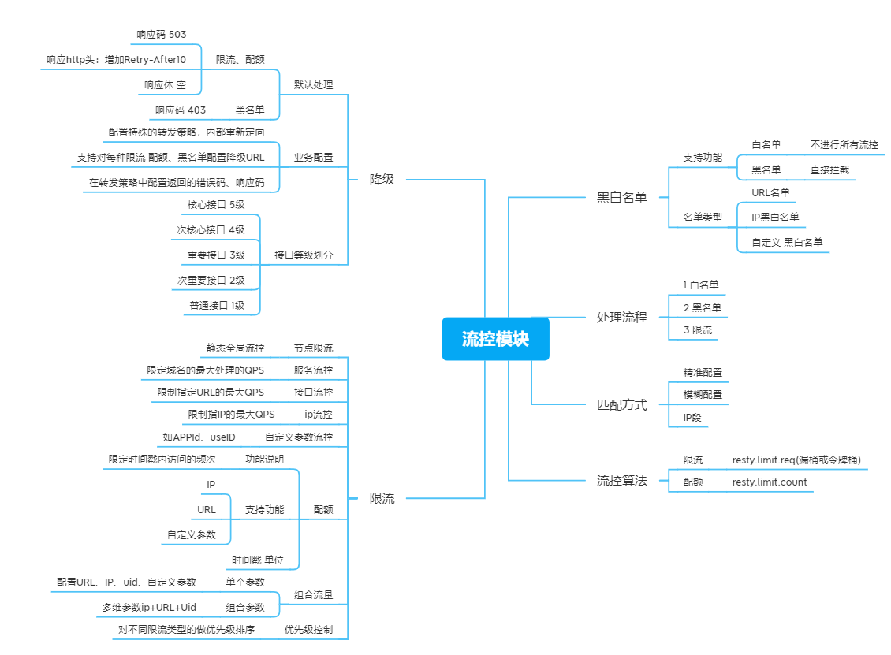

# 流量限流

一般需要多级限流控制


# 0 常用算法

## 3.1计数器算法（固定窗口）

计数器算法是使用计数器在周期内累加访问次数，当达到设定的限流值时，触发限流策略，下一个周期开始时，进行清零，重新计数，实现简单。计数器算法方式限流对于周期比较长的限流，存在很大的弊端，有严重的临界问题。

**致命缺点：**没有处理好边界，边界最后一秒和下一个窗口第一秒，承受2倍QPS.

**不是一无是 最大连接数、线程池大小、秒杀并发，一段时间内总请求量都是用这一简单粗暴的方法。**


## 3.2滑动窗口算法：

**致命缺点：**一样2倍QPS.问题，1个后半段和2的前半段。

将时间周期分为N个小周期，分别记录每个小周期内访问次数，并且根据时间滑动删除过期的小周期，当滑动窗口的格子划分的越多，那么滑动窗口的滚动就越平滑，限流的统计就会越精确。此算法可以很好的解决固定窗口算法的临界问题

所谓的滑动时间算法指的是以当前时间为截止时间，往前取一定的时间，比如往前取 60s 的时间，在这 60s 之内运行最大的访问数为 100，此时算法的执行逻辑为，先清除 60s 之前的所有请求记录，再计算当前集合内请求数量是否大于设定的最大请求数 100，如果大于则执行限流拒绝策略，否则插入本次请求记录并返回可以正常执行的标识给客户端。

滑动时间窗口如下图所示：


其中每一小个表示 10s，被红色虚线包围的时间段则为需要判断的时间间隔，比如 60s 秒允许 100 次请求，那么红色虚线部分则为 60s。

我们可以借助 Redis 的有序集合 ZSet 来实现时间窗口算法限流，实现的过程是先使用 ZSet 的 key 存储限流的 ID，score 用来存储请求的时间，每次有请求访问来了之后，先清空之前时间窗口的访问量，统计现在时间窗口的个数和最大允许访问量对比，如果大于等于最大访问量则返回 false 执行限流操作，负责允许执行业务逻辑，并且在 ZSet 中添加一条有效的访问记录，具体实现代码如下。

我们借助 Jedis 包来操作 Redis，实现在 pom.xml 添加 Jedis 框架的引用，配置如下：

```text
<!-- https://mvnrepository.com/artifact/redis.clients/jedis -->
<dependency>
    <groupId>redis.clients</groupId>
    <artifactId>jedis</artifactId>
    <version>3.3.0</version>
</dependency>
```

具体的 Java 实现代码如下：

```text
import redis.clients.jedis.Jedis;

public class RedisLimit {
    // Redis 操作客户端
    static Jedis jedis = new Jedis("127.0.0.1", 6379);

    public static void main(String[] args) throws InterruptedException {
        for (int i = 0; i < 15; i++) {
            boolean res = isPeriodLimiting("java", 3, 10);
            if (res) {
                System.out.println("正常执行请求：" + i);
            } else {
                System.out.println("被限流：" + i);
            }
        }
        // 休眠 4s
        Thread.sleep(4000);
        // 超过最大执行时间之后，再从发起请求
        boolean res = isPeriodLimiting("java", 3, 10);
        if (res) {
            System.out.println("休眠后，正常执行请求");
        } else {
            System.out.println("休眠后，被限流");
        }
    }

    /**
     * 限流方法（滑动时间算法）
     * @param key      限流标识
     * @param period   限流时间范围（单位：秒）
     * @param maxCount 最大运行访问次数
     * @return
     */
    private static boolean isPeriodLimiting(String key, int period, int maxCount) {
        long nowTs = System.currentTimeMillis(); // 当前时间戳
        // 删除非时间段内的请求数据（清除老访问数据，比如 period=60 时，标识清除 60s 以前的请求记录）
        jedis.zremrangeByScore(key, 0, nowTs - period * 1000);
        long currCount = jedis.zcard(key); // 当前请求次数
        if (currCount >= maxCount) {
            // 超过最大请求次数，执行限流
            return false;
        }
        // 未达到最大请求数，正常执行业务
        jedis.zadd(key, nowTs, "" + nowTs); // 请求记录 +1
        return true;
    }
}
```


## 3.2 漏桶法

**优点：可以强行限制数据的传输速率**

滑动时间算法有一个问题就是在一定范围内，比如 60s 内只能有 10 个请求，当第一秒时就到达了 10 个请求，那么剩下的 59s 只能把所有的请求都给拒绝掉，而漏桶算法可以解决这个问题。

漏桶算法类似于生活中的漏斗，无论上面的水流倒入漏斗有多大，也就是无论请求有多少，它都是以均匀的速度慢慢流出的。当上面的水流速度大于下面的流出速度时，漏斗会慢慢变满，当漏斗满了之后就会丢弃新来的请求;当上面的水流速度小于下面流出的速度的话，漏斗永远不会被装满，并且可以一直流出。

漏桶算法的实现步骤是，先声明一个队列用来保存请求，这个队列相当于漏斗，当队列容量满了之后就放弃新来的请求，然后重新声明一个线程定期从任务队列中获取一个或多个任务进行执行，这样就实现了漏桶算法。

上面我们演示 Nginx 的控制速率其实使用的就是漏桶算法，当然我们也可以借助 Redis 很方便的实现漏桶算法。

我们可以使用 Redis 4.0 版本中提供的 Redis-Cell 模块，该模块使用的是漏斗算法，并且提供了原子的限流指令，而且依靠 Redis 这个天生的分布式程序就可以实现比较完美的限流了。

## 3.3令牌桶法

**优点：除了可以控制流量还允许一定量的突发。**

  对于很多应用场景来说，除了要求能够限制数据的平均传输速率外，还要求允许某种程度的突发传输。这时候漏桶算法可能就不合适了，令牌桶算法更为适合。如图2所示，令牌桶算法的原理是系统会以一个恒定的速度往桶里放入令牌，而如果请求需要被处理，则需要先从桶里获取一个令牌，当桶里没有令牌可取时，则拒绝服务。  漏桶算法不能够有效地使用网络资源。因为漏桶的漏出速率是固定的，所以即使网络中没有发生拥塞 

在令牌桶算法中有**一个程序以某种恒定的速度生成令牌，并存入令牌桶中，而每个请求需要先获取令牌才能执行，如果没有获取到令牌的请求可以选择等待或者放弃执行**，如下图所示：

假如用户配置的**平均发送速率为r**，则每隔1/r秒一个令牌被加入到桶中；

假设桶最多可以存发b个令牌。如果令牌到达时令牌桶已经满了，那么这个令牌会被丢弃；

当一个n个字节的[数据包](https://baike.baidu.com/item/数据包)到达时，就从令牌桶中删除n个令牌，并且数据包被发送到网络；

如果令牌桶中少于n个令牌，那么不会删除令牌，并且认为这个数据包在流量限制之外；

算法允许最长b个字节的突发，但从长期运行结果看，**数据包的速率被限制成常量r**。对于在流量限制外的数据包可以以不同的方式处理：


>  并不能说明令牌桶一定比漏洞好，她们使用场景不一样。令牌桶可以用来保护自己，主要用来对调用者频率进行限流，为的是让自己不被打垮。所以如果自己本身有处理能力的时候，如果流量突发（实际消费能力强于配置的流量限制），那么实际处理速率可以超过配置的限制。而漏桶算法，这是用来保护他人，也就是保护他所调用的系统。主要场景是，当调用的第三方系统本身没有保护机制，或者有流量限制的时候，我们的调用速度不能超过他的限制，由于我们不能更改第三方系统，所以只有在主调方控制。这个时候，即使流量突发，也必须舍弃。因为消费能力是第三方决定的。
>
>  
>
>  
>
>  总结起来：如果要让自己的系统不被打垮，用令牌桶。如果保证被别人的系统不被打垮，用漏桶算法 


# 1 4层限流（tcp/ip）

并发连接数，新建连接限流。。

## 1.1 实现手段

1 nginx自带模块：

ngx_http_limit_conn_module（连接数限制）
ngx_http_limit_req_module （漏桶）

2   OpenRestry的 Lua限流模块lua-resty-limit-traffic 限流 

## 1.2 具体实现 

### 1.2.1 ngx_http_limit_conn_module

ngx_http_limit_conn_module模块可以根据定义的键来限制每个键值的连接数，如同一个IP来源的连接数。当然了，并不是所有的连接都会被该模块计数，只有那些正在被处理的请求（这些请求的头信息已被完全读入）所在的连接才会被计数。
我们可以在nginx_conf的http{}中加上如下配置实现限制：

```java
#限制每个用户的并发连接数，取名oneip
limit_conn_zone $binary_remote_addr zone=oneip:10m;
#配置记录被限流后的日志级别，默认error级别
limit_conn_log_level error;
#配置被限流后返回的状态码，默认返回503
limit_conn_status 503;
123456
```

然后在server{}里加上如下代码：

```java
#限制用户并发连接数为1
limit_conn oneip 1;
12
```

### 1.2.2 ngx_http_limit_req_module

ngx_http_limit_req_module模块用来限制请求数量，即请求处理的频率。
值得一提的是，该模块可以限制单个IP地址的请求的处理频率。限制的方法采用**漏斗算法**，每秒固定处理请求数，推迟过多请求。如果请求的频率超过了限制域配置的值，请求处理会被延迟或被丢弃，所以所有的请求都是以定义的频率被处理的。

在http{}中配置

```java
#区域名称为one，大小为10m，平均处理的请求频率不能超过每秒一次。

limit_req_zone $binary_remote_addr zone=one:10m rate=1r/s;
123
```

在server{}中配置

```java
#设置每个IP桶的数量为5
limit_req zone=one burst=5;
12
```

上面设置定义了每个IP的请求处理只能限制在每秒1个。并且服务端可以为每个IP缓存5个请求，如果操作了5个请求，请求就会被丢弃

### 1.2.3 OpenRestry的 Lua限流模块lua-resty-limit-traffic

https://blog.csdn.net/chenyixin121738/article/details/109913783


如果动态修改限流策略，上述两种方法就不行了。有平滑模式和突发流量模式。


1  限制接口总并发数  按照 ip 限制其并发连接数 

2 


## 1.3 节流


# 2 7层限流(http)

接口来源限流，接口降级，黑白名单，优先流控，配额等。一般基于漏桶法实现。


# 3 服务端限流（应用级）

接口参数限流，接口降级，黑白名单、服务降级、熔断，动态流控、全局流控。令牌桶法法实现

## 3.1限流总并发 连接 请求数

对于一个应用系统来说一定会有极限并发/请求数，即总有一个TPS/QPS阀值，如果超了阀值则系统就会不响应用户请求或响应的非常慢，因此我们最好进行过载保护，防止大量请求涌入击垮系统。

如果你使用过Tomcat，其Connector 其中一种配置有如下几个参数：

acceptCount：如果Tomcat的线程都忙于响应，**新来的连接会进入队列排队，如果超出排队大小，则拒绝连接**；

maxConnections： 瞬时最大连接数，超出的会排队等待；

maxThreads：Tomcat能启动用来处理请求的最大线程数，如果请求处理量一直远远大于**最大线程数则可能会僵死**。

详细的配置请参考官方文档。另外如Mysql（如max_connections）、Redis（如tcp-backlog）都会有类似的限制连接数的配置。

 ## 3.2 限流总资源数


如果有的资源是稀缺资源（如数据库连接、线程），而且可能有多个系统都会去使用它，那么需要限制应用；可以使用池化技术来限制总资源数：连接池、线程池。比如分配给每个应用的数据库连接是100，那么本应用最多可以使用100个资源，超出了可以等待或者抛异常。

## 3.3   限流某个接口的总并发 请求数 

 

如果接口可能会有突发访问情况，但又担心访问量太大造成崩溃，如抢购业务；这个时候就需要限制这个接口的总并发/请求数总请求数了；因为粒度比较细，可以为每个接口都设置相应的阀值。可以使用Java中的AtomicLong进行限流：

=================================

```
try {
    if(atomic.incrementAndGet() > 限流数) {
        //拒绝请求
    }
    //处理请求
} finally {
    atomic.decrementAndGet();
}
```

=================================

适合对业务无损的服务或者需要过载保护的服务进行限流，如抢购业务，超出了大小要么让用户排队，要么告诉用户没货了，对用户来说是可以接受的。而一些开放平台也会限制用户调用某个接口的试用请求量，也可以用这种计数器方式实现。这种方式也是简单粗暴的限流，没有平滑处理，需要根据实际情况选择使用；

 

## 3.4 限流某个接口的时间窗请求数

即一个时间窗口内的请求数，如想限制某个接口/服务每秒/每分钟/每天的请求数/调用量。如一些基础服务会被很多其他系统调用，比如商品详情页服务会调用基础商品服务调用，但是怕因为更新量比较大将基础服务打挂，这时我们要对每秒/每分钟的调用量进行限速；一种实现方式如下所示：

 

=================================

 

```
LoadingCache<Long, AtomicLong> counter =
        CacheBuilder.newBuilder()
                .expireAfterWrite(2, TimeUnit.SECONDS)
                .build(new CacheLoader<Long, AtomicLong>() {
                    @Override
                    public AtomicLong load(Long seconds) throws Exception {
                        return new AtomicLong(0);
                    }
                });
long limit = 1000;
while(true) {
    //得到当前秒
    long currentSeconds = System.currentTimeMillis() / 1000;
    if(counter.get(currentSeconds).incrementAndGet() > limit) {
        System.out.println("限流了:" + currentSeconds);
        continue;
    }
    //业务处理
}
```

 

 

=================================

我们使用Guava的Cache来存储计数器，过期时间设置为2秒（保证1秒内的计数器是有的），然后我们获取当前时间戳然后取秒数来作为KEY进行计数统计和限流，这种方式也是简单粗暴，刚才说的场景够用了。

 

**平滑限流某个接口的请求数**

之前的限流方式都不能很好地应对突发请求，即瞬间请求可能都被允许从而导致一些问题；因此在一些场景中需要对突发请求进行整形，整形为平均速率请求处理（比如5r/s，则每隔200毫秒处理一个请求，平滑了速率）。这个时候有两种算法满足我们的场景：令牌桶和漏桶算法。Guava框架提供了令牌桶算法实现，可直接拿来使用。

Guava RateLimiter提供了令牌桶算法实现：平滑突发限流(SmoothBursty)和平滑预热限流(SmoothWarmingUp)实现。

 

**SmoothBursty**

=================================

```
RateLimiter limiter = RateLimiter.create(5);
System.out.println(limiter.acquire());
System.out.println(limiter.acquire());
System.out.println(limiter.acquire());
System.out.println(limiter.acquire());
System.out.println(limiter.acquire());
System.out.println(limiter.acquire());
```

 

 将得到类似如下的输出：

 0.0

 0.198239

 0.196083

 0.200609

 0.199599

 0.19961

=================================

1、RateLimiter.create(5) 表示桶容量为5且每秒新增5个令牌，即每隔200毫秒新增一个令牌；

2、limiter.acquire()表示消费一个令牌，如果当前桶中有足够令牌则成功（返回值为0），如果桶中没有令牌则暂停一段时间，比如发令牌间隔是200毫秒，则等待200毫秒后再去消费令牌（如上测试用例返回的为0.198239，差不多等待了200毫秒桶中才有令牌可用），这种实现将突发请求速率平均为了固定请求速率。

 

再看一个突发示例：

=================================

 

RateLimiter limiter = RateLimiter.*create*(5);
System.***out\***.println(limiter.acquire(5));
System.***out\***.println(limiter.acquire(1));
System.***out\***.println(limiter.acquire(1))

 

将得到类似如下的输出：

0.0

0.98745

0.183553

0.199909

=================================

limiter.acquire(5)表示桶的容量为5且每秒新增5个令牌，令牌桶算法允许一定程度的突发，所以可以一次性消费5个令牌，但接下来的limiter.acquire(1)将等待差不多1秒桶中才能有令牌，且接下来的请求也整形为固定速率了。

 

=================================

RateLimiter limiter = RateLimiter.*create*(5);
System.***out\***.println(limiter.acquire(10));
System.***out\***.println(limiter.acquire(1));
System.***out\***.println(limiter.acquire(1));

 

将得到类似如下的输出：

0.0

1.997428

0.192273

0.200616

=================================

同上边的例子类似，第一秒突发了10个请求，令牌桶算法也允许了这种突发（允许消费未来的令牌），但接下来的limiter.acquire(1)将等待差不多2秒桶中才能有令牌，且接下来的请求也整形为固定速率了。


接下来再看一个突发的例子：

=================================

RateLimiter limiter = RateLimiter.*create*(2);

System.***out\***.println(limiter.acquire());
Thread.*sleep*(2000L);
System.***out\***.println(limiter.acquire());
System.***out\***.println(limiter.acquire());
System.***out\***.println(limiter.acquire());
System.***out\***.println(limiter.acquire());
System.***out\***.println(limiter.acquire());

 

将得到类似如下的输出：

0.0

0.0

0.0

0.0

0.499876

0.495799

=================================

1、创建了一个桶容量为2且每秒新增2个令牌；

2、首先调用limiter.acquire()消费一个令牌，此时令牌桶可以满足（返回值为0）；

3、然后线程暂停2秒，接下来的两个limiter.acquire()都能消费到令牌，第三个limiter.acquire()也同样消费到了令牌，到第四个时就需要等待500毫秒了。

此处可以看到我们设置的桶容量为2（即允许的突发量），这是因为SmoothBursty中有一个参数：最大突发秒数（maxBurstSeconds）默认值是1s，突发量/桶容量=速率*maxBurstSeconds，所以本示例桶容量/突发量为2，例子中前两个是消费了之前积攒的突发量，而第三个开始就是正常计算的了。令牌桶算法允许将一段时间内没有消费的令牌暂存到令牌桶中，留待未来使用，并允许未来请求的这种突发。

 

SmoothBursty通过平均速率和最后一次新增令牌的时间计算出下次新增令牌的时间的，另外需要一个桶暂存一段时间内没有使用的令牌（即可以突发的令牌数）。另外RateLimiter还提供了tryAcquire方法来进行无阻塞或可超时的令牌消费。

 

 

因为SmoothBursty允许一定程度的突发，会有人担心如果允许这种突发，假设突然间来了很大的流量，那么系统很可能扛不住这种突发。因此需要一种平滑速率的限流工具，从而系统冷启动后慢慢的趋于平均固定速率（即刚开始速率小一些，然后慢慢趋于我们设置的固定速率）。Guava也提供了SmoothWarmingUp来实现这种需求，其可以认为是漏桶算法，但是在某些特殊场景又不太一样。

 

SmoothWarmingUp创建方式：RateLimiter.create(doublepermitsPerSecond, long warmupPeriod, TimeUnit unit)

permitsPerSecond表示每秒新增的令牌数，warmupPeriod表示在从冷启动速率过渡到平均速率的时间间隔。

 

示例如下：

=================================

 

RateLimiter limiter = RateLimiter.*create*(5, 1000, TimeUnit.***MILLISECONDS\***);
**for**(**int** i = 1; i < 5;i++) {
  System.***out\***.println(limiter.acquire());
}
Thread.*sleep*(1000L);
**for**(**int** i = 1; i < 5;i++) {
  System.***out\***.println(limiter.acquire());
}

 

将得到类似如下的输出：

0.0

0.51767

0.357814

0.219992

0.199984

0.0

0.360826

0.220166

0.199723

0.199555

=================================

速率是梯形上升速率的，也就是说冷启动时会以一个比较大的速率慢慢到平均速率；然后趋于平均速率（梯形下降到平均速率）。可以通过调节warmupPeriod参数实现一开始就是平滑固定速率。

 

到此应用级限流的一些方法就介绍完了。假设将应用部署到多台机器，应用级限流方式只是单应用内的请求限流，不能进行全局限流。因此我们需要分布式限流和接入层限流来解决这个问题。


# 4 分布式限流


分布式限流最关键的是要将限流服务做成原子化，而解决方案可以使使用redis+lua或者nginx+lua技术进行实现，通过这两种技术可以实现的高并发和高性能。

首先我们来使用redis+lua实现时间窗内某个接口的请求数限流，实现了该功能后可以改造为限流总并发/请求数和限制总资源数。Lua本身就是一种编程语言，也可以使用它实现复杂的令牌桶或漏桶算法。

 

## 1 redis+lua实现中的lua脚本

=================================

local key = KEYS[1] --限流KEY（一秒一个）
local limit = tonumber(ARGV[1])    --限流大小
local current = tonumber(redis.call("INCRBY", key, "1")) --请求数+1
if current > limit then --如果超出限流大小
  return 0
elseif current == 1 then --只有第一次访问需要设置2秒的过期时间
  redis.call("expire", key,"2")
end
return 1

=================================

如上操作因是在一个lua脚本中，又因Redis是单线程模型，因此是线程安全的。如上方式有一个缺点就是当达到限流大小后还是会递增的，可以改造成如下方式实现：

=================================

 

local key = KEYS[1] --限流KEY（一秒一个）
local limit = tonumber(ARGV[1])    --限流大小
local current = tonumber(redis.call('get', key) or "0")
if current + 1 > limit then --如果超出限流大小
  return 0
else --请求数+1，并设置2秒过期
  redis.call("INCRBY", key,"1")
  redis.call("expire", key,"2")
  return 1
end

=================================

 

如下是Java中判断是否需要限流的代码：

=================================

**public static boolean** acquire() **throws** Exception {
  String luaScript = Files.*toString*(**new** File(**"limit.lua"**), Charset.*defaultCharset*());
  Jedis jedis = **new** Jedis(**"192.168.147.52"**, 6379);
  String key = **"ip:"** + System.*currentTimeMillis*()/ 1000; *//**此处将当前时间戳取秒数
\*  Stringlimit = **"3"**; *//**限流大小
\*  **return** (Long)jedis.eval(luaScript,Lists.*newArrayList*(key), Lists.*newArrayList*(limit)) == 1;
}

=================================

因为Redis的限制（Lua中有写操作不能使用带随机性质的读操作，如TIME）不能在Redis Lua中使用TIME获取时间戳，因此只好从应用获取然后传入，在某些极端情况下（机器时钟不准的情况下），限流会存在一些小问题。

##  2 nginx +lua

**使用Nginx+Lua实现的Lua脚本：**

=================================

local locks = require "resty.lock"

local function acquire()
  local lock =locks:new("locks")
  local elapsed, err =lock:lock("limit_key") --互斥锁
  local limit_counter =ngx.shared.limit_counter --计数器

  local key = "ip:" ..os.time()
  local limit = 5 --限流大小
  local current =limit_counter:get(key)

  if current ~= nil and current + 1> limit then --如果超出限流大小
    lock:unlock()
    return 0
  end
  if current == nil then
    limit_counter:set(key, 1, 1) --第一次需要设置过期时间，设置key的值为1，过期时间为1秒
  else
    limit_counter:incr(key, 1) --第二次开始加1即可
  end
  lock:unlock()
  return 1
end
ngx.print(acquire())

=================================

实现中我们需要使用lua-resty-lock互斥锁模块来解决原子性问题(在实际工程中使用时请考虑获取锁的超时问题)，并使用ngx.shared.DICT共享字典来实现计数器。如果需要限流则返回0，否则返回1。使用时需要先定义两个共享字典（分别用来存放锁和计数器数据）：

=================================

http {

  ……

  lua_shared_dict locks 10m;

  lua_shared_dict limit_counter 10m;

}

=================================

有人会纠结如果应用并发量非常大那么redis或者nginx是不是能抗得住；不过这个问题要从多方面考虑：你的流量是不是真的有这么大，是不是可以通过一致性哈希将分布式限流进行分片，是不是可以当并发量太大降级为应用级限流；对策非常多，可以根据实际情况调节；像在**京东使用Redis+Lua来限流抢购流量，一般流量是没有问题的**。

 

# 5 分布式流控模块



# 6 启用流控算法

| 类型       | 流量维度         | 流控算法 | 限制     |
| ---------- | ---------------- | -------- | -------- |
| 节点流控   | 所有请求         | 令牌桶   | 请求速率 |
| 服务降级   | host             | 令牌桶   | 请求速率 |
| 接口降级   | URL              | 令牌桶   | 请求速率 |
| ip流量     | 得到的ip为维度   | 令牌桶   | 请求速率 |
| 自定义参数 | 以自定义单个参数 | 令牌桶   | 请求速率 |
| 多参数限流 | 多参数           | 令牌桶   | 请求速率 |
| 配额       | 多参数           | 令牌桶   | 请求量   |
| 并发连接数 | 以自定义多个参数 | NA       | 并发量   |
|            |                  |          |          |

