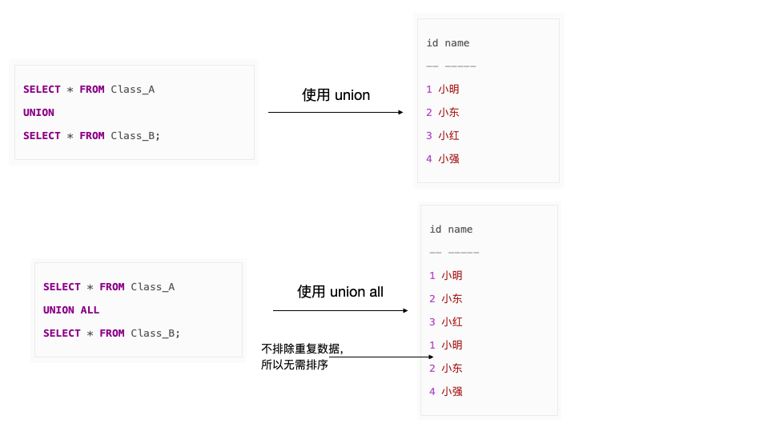

# 4 SQL优化与规范

 

**七、如何优化 count(\*)**

使用以下 sql 会导致慢查询

```
SELECT COUNT(*) FROM SomeTable SELECT COUNT(1) FROM SomeTable
```

原因是会造成全表扫描，有人说 **COUNT(\*)** 不是会利用主键索引去查找吗，怎么还会慢，这就要谈到 MySQL 中的聚簇索引和非聚簇索引了，聚簇索引叶子节点上存有主键值+整行数据，非聚簇索叶子节点上则存有辅助索引的列值 + 主键值，如下


所以就算对 COUNT(*) 使用主键查找，由于每次取出主键索引的叶子节点时，取的是一整行的数据，效率必然不高，但是非聚簇索引叶子节点只存储了「列值 + 主键值」,这也启发我们可以用非聚簇索引来优化，假设表有一列叫 status, 为其加上索引后，可以用以下语句优化:

```
SELECT COUNT(status) FROM SomeTable
```

有人曾经测过（见文末参考链接），假设有 100 万行数据，使用聚簇索引来查找行数的，比使用 COUNT(*) 查找速度快 10 几倍。不过需要注意的是通过这种方式无法计算出  status 值为 null 的那些行

如果主键是连续的，可以利用 MAX(id) 来查找，MAX 也利用到了索引，只需要定位到最大 id 即可，性能极好，如下，秒现结果

```
SELECT MAX(id) FROM SomeTable
```

说句题句话，有人说用 MyISAM 引擎调用 COUNT(*) 非常快，那是因为它提前把行数存在磁盘中了，直接拿，当然很快，不过如果有 WHERE 的限制,用 COUNT(*) 还是很慢!

 

**十二、 慢日志 SQL 定位**

前面我们多次说了 SQL 的慢查询，那么该怎么定位这些慢查询 SQL 呢，主要用到了以下几个参数


这几个参数一定要配好，再根据每条慢查询对症下药，像我司每天都会把这些慢查询提取出来通过邮件给形式发送给各个业务团队，以帮忙定位解决


**一、参数是子查询时，使用 EXISTS 代替 IN**

如果 IN 的参数是（1，2，3）这样的值列表时，没啥问题，但如果参数是子查询时，就需要注意了。比如，现在有如下两个表：



现在我们要查出同时存在于两个表的员工，即田中和铃木，则以下用 IN 和 EXISTS 返回的结果是一样，但是用 EXISTS 的 SQL 会更快:

```
-- 慢SELECT *   FROM Class_AWHERE id IN (SELECT id                FROM  CLASS_B);-- 快SELECT *  FROM Class_A A  WHERE EXISTS(SELECT *    FROM Class_B  B  WHERE A.id = B.id);
```

为啥使用 EXISTS 的 SQL 运行更快呢，有两个原因

1. 可以`用到索引，如果连接列 (id) 上建立了索引，那么查询 Class_B 时不用查实际的表，只需查索引就可以了。
2. 如果使用 EXISTS，那么只要查到一行数据满足条件就会终止查询， 不用像使用 IN 时一样扫描全表。在这一点上 NOT EXISTS 也一样

另外如果 IN 后面如果跟着的是子查询，由于 SQL 会先执行 IN 后面的子查询，会将子查询的结果保存在一张临时的工作表里（内联视图），然后扫描**整个视图**，显然扫描整个视图这个工作很多时候是非常耗时的，而用 EXISTS 不会生成临时表。

当然了，如果 IN 的参数是子查询时，也可以用连接来代替，如下：

```
-- 使用连接代替 IN SELECT A.id, A.nameFROM Class_A A INNER JOIN Class_B B ON A.id = B.id;
```

用到了 「id」列上的索引，而且由于没有子查询，也不会生成临时表

**二、避免排序**

SQL 是声明式语言，即对用户来说，只关心它能做什么，不用关心它怎么做。这样可能会产生潜在的性能问题：排序，会产生排序的代表性运算有下面这些

- GROUP BY 子句
- ORDER BY 子句
- 聚合函数(SUM、COUNT、AVG、MAX、MIN)
- DISTINCT
- 集合运算符(UNION、INTERSECT、EXCEPT)
- 窗口函数(RANK、ROW_NUMBER 等)

如果在内存中排序还好，但如果内存不够导致需要在硬盘上排序上的话，性能就会急剧下降，所以我们需要减少不必要的排序。怎样做可以减少排序呢。

1、 使用集合运算符的 ALL 可选项

SQL 中有 UNION，INTERSECT，EXCEPT 三个集合运算符，默认情况下，这些运算符会为了避免重复数据而进行排序，对比一下使用 UNION 运算符加和不加 ALL 的情况:


注意：加 ALL 是优化性能非常有效的手段，不过前提是不在乎结果是否有重复数据。

2、使用 EXISTS 代表 DISTINCT

为了排除重复数据， DISTINCT 也会对结果进行排序，如果需要对两张表的连接结果进行去重，可以考虑用 EXISTS 代替 DISTINCT，这样可以避免排序。


如何找出有销售记录的商品，使用如下 DISTINCT 可以：

```
SELECT DISTINCT I.item_noFROM Items I INNER JOIN SalesHistory SHON I. item_no = SH. item_no;
```

不过更好的方式是使用 EXISTS:

```
SELECT item_no FROM Items IWHERE EXISTS         (SELECT *           FROM SalesHistory SH          WHERE I.item_no = SH.item_no);
```

既用到了索引，又避免了排序对性能的损耗。

 

**三、能写在 WHERE 子句里的条件不要写在 HAVING 子句里**

下列 SQL 语句返回的结果是一样的:

```
-- 聚合后使用 HAVING 子句过滤SELECT sale_date, SUM(quantity)  FROM SalesHistory GROUP BY sale_dateHAVING sale_date = '2007-10-01';-- 聚合前使用 WHERE 子句过滤SELECT sale_date, SUM(quantity)  FROM SalesHistory WHERE sale_date = '2007-10-01'  GROUP BY sale_date;
```

使用第二条语句效率更高，原因主要有两点

1. 使用 GROUP BY 子句进行聚合时会进行排序，如果事先通过 WHERE 子句能筛选出一部分行，能减轻排序的负担
2. 在 WHERE 子句中可以使用索引，而 HAVING 子句是针对聚合后生成的视频进行筛选的，但很多时候聚合后生成的视图并没有保留原表的索引结构

**四、在 GROUP BY 子句和 ORDER BY 子句中使用索引**

GROUP BY 子句和 ORDER BY 子句一般都会进行排序，以对行进行排列和替换，不过如果指定带有索引的列作为这两者的参数列，由于用到了索引，可以实现高速查询，由于索引是有序的，排序本身都会被省略掉

 

 


 

**九、灵活使用 HAVING 子句**

这一点与上面第八条相呼应，对聚合结果指定筛选条件时，使用 HAVING 是基本的原则，可能一些工程师会倾向于使用下面这样的写法:

```
SELECT *  FROM (SELECT sale_date, MAX(quantity) AS max_qty          FROM SalesHistory          GROUP BY sale_date) TMP         WHERE max_qty >= 10;
```

虽然上面这样的写法能达到目的，但会生成 TMP 这张临时表，所以应该使用下面这样的写法:

```
SELECT sale_date, MAX(quantity)   FROM SalesHistory GROUP BY sale_dateHAVING MAX(quantity) >= 10;
```

HAVING 子句和聚合操作是同时执行的，所以比起生成中间表后再执行 HAVING 子句，效率会更高，代码也更简洁

**10、需要对多个字段使用 IN 谓词时，将它们汇总到一处**

一个表的多个字段可能都使用了 IN 谓词，如下:

```
SELECT id, state, city   FROM Addresses1 A1 WHERE state IN (SELECT state                   FROM Addresses2 A2                  WHERE A1.id = A2.id)     AND city IN (SELECT city                   FROM Addresses2 A2                   WHERE A1.id = A2.id);
```

这段代码用到了两个子查询，也就产生了两个中间表，可以像下面这样写

```
SELECT *  FROM Addresses1 A1 WHERE id || state || city IN (SELECT id || state|| city       FROM Addresses2 A2);
```

这样子查询不用考虑关联性，没有中间表产生，而且只执行一次即可。


#  


 

 


 


 

16  索引字段少于5个时，UNION 操作用 LIMIT，而不是 OR 

 

 

 

 

 


 
 


 

 


  

 

 


  


#  


  


 


 


 


 


9、： 


 


11、应尽可能的避免更新clustered索引数据列， 因为clustered索引数据列的顺序就是表记录的物理存储顺序，一旦该列值改变将导致整个表记录的顺序的调整，会耗费相当大的资源。若应用系统需要频繁更新clustered索引数据列，那么需要考虑是否应将该索引建为clustered索引。


 


 


 


 


 

 


18、一些SQL查询语句应加上nolock，读、写是会相互阻塞的，为了提高并发性能，对于一些查询，可以加上nolock，这样读的时候可以允许写，但缺点是可能读到未提交的脏数据。


使用nolock有3条原则：


- 查询的结果用于“插、删、改”的不能加nolock；
- 查询的表属于频繁发生页分裂的，慎用nolock ；
- 使用临时表一样可以保存“数据前影”，起到类似Oracle的undo表空间的功能，能采用临时表提高并发性能的，不要用nolock。


 


 


 。


 


24、当服务器的内存够多时，配制线程数量 = 最大连接数+5，这样能发挥最大的效率；否则使用 配制线程数量<最大连接数启用SQL SERVER的线程池来解决，如果还是数量 = 最大连接数+5，严重的损害服务器的性能。


25、查询的关联同写的顺序 ：


select a.personMemberID, * from chineseresume a,personmember b where personMemberID = b.referenceid and a.personMemberID = ‘JCNPRH39681’ （A = B ,B = ‘号码’） 


select a.personMemberID, * from chineseresume a,personmember b where a.personMemberID = b.referenceid and a.personMemberID = ‘JCNPRH39681’ and b.referenceid = ‘JCNPRH39681’ （A = B ,B = ‘号码’， A = ‘号码’） 


select a.personMemberID, * from chineseresume a,personmember b where b.referenceid = ‘JCNPRH39681’ and a.personMemberID = ‘JCNPRH39681’ （B = ‘号码’， A = ‘号码’）


26、。


 


28、索引的使用规范：


-  
- 尽可能的使用索引字段作为查询条件，尤其是聚簇索引，必要时可以通过index index_name来强制指定索引；
- 避免对大表查询时进行table scan，必要时考虑新建索引；
- 在使用索引字段作为条件时，如果该索引是联合索引，那么必须使用到该索引中的第一个字段作为条件时才能保证系统使用该索引，否则该索引将不会被使用；
-  　


29、下列SQL条件语句中的列都建有恰当的索引，但执行速度却非常慢： 


SELECT * FROM record WHERE substrINg(card_no,1,4)=’5378’ (13秒) 


SELECT * FROM record WHERE amount/30< 1000 （11秒） 


SELECT * FROM record WHERE convert(char(10),date,112)=’19991201’ （10秒） 


**分析：** 

WHERE子句中对列的任何操作结果都是在SQL运行时逐列计算得到的，因此它不得不进行表搜索，而没有使用该列上面的索引。


如果这些结果在查询编译时就能得到，那么就可以被SQL优化器优化，使用索引，避免表搜索，因此将SQL重写成下面这样： 


SELECT * FROM record WHERE card_no like ‘5378%’ （< 1秒） 


SELECT * FROM record WHERE amount< 1000*30 （< 1秒） 


SELECT * FROM record WHERE date= ‘1999/12/01’ （< 1秒）


 


31、在所有的存储过程中，能够用SQL语句的，我绝不会用循环去实现。

例如：列出上个月的每一天，我会用connect by去递归查询一下，绝不会去用循环从上个月第一天到最后一天。


32、选择最有效率的表名顺序（只在基于规则的优化器中有效）： 

Oracle的解析器按照从右到左的顺序处理FROM子句中的表名，FROM子句中写在最后的表（基础表 driving table）将被最先处理，在FROM子句中包含多个表的情况下，你必须选择记录条数最少的表作为基础表。


如果有3个以上的表连接查询，那就需要选择交叉表（intersection table）作为基础表，交叉表是指那个被其他表所引用的表。


 

 


 


39、索引创建规则： 


- 表的主键、外键必须有索引； 
- 数据量超过300的表应该有索引； 
- 经常与其他表进行连接的表，在连接字段上应该建立索引； 
- 经常出现在Where子句中的字段，特别是大表的字段，应该建立索引； 
- 索引应该建在选择性高的字段上； 
- 索引应该建在小字段上，对于大的文本字段甚至超长字段，不要建索引； 
- 复合索引的建立需要进行仔细分析，尽量考虑用单字段索引代替； 
- 正确选择复合索引中的主列字段，一般是选择性较好的字段； 
- 复合索引的几个字段是否经常同时以AND方式出现在Where子句中？单字段查询是否极少甚至没有？如果是，则可以建立复合索引；否则考虑单字段索引； 
- 如果复合索引中包含的字段经常单独出现在Where子句中，则分解为多个单字段索引； 
- 如果复合索引所包含的字段超过3个，那么仔细考虑其必要性，考虑减少复合的字段； 
- 如果既有单字段索引，又有这几个字段上的复合索引，一般可以删除复合索引； 
- 频繁进行数据操作的表，不要建立太多的索引； 
- 删除无用的索引，避免对执行计划造成负面影响； 
- 表上建立的每个索引都会增加存储开销，索引对于插入、删除、更新操作也会增加处理上的开销。另外，过多的复合索引，在有单字段索引的情况下，一般都是没有存在价值的；相反，还会降低数据增加删除时的性能，特别是对频繁更新的表来说，负面影响更大。 
- 尽量不要对数据库中某个含有大量重复的值的字段建立索引。


40、MySQL查询优化总结：


使用慢查询日志去发现慢查询，使用执行计划去判断查询是否正常运行，总是去测试你的查询看看是否他们运行在最佳状态下。


久而久之性能总会变化，避免在整个表上使用count(*)，它可能锁住整张表，使查询保持一致以便后续相似的查询可以使用查询缓存，在适当的情形下使用GROUP BY而不是DISTINCT，在WHERE、GROUP BY和ORDER BY子句中使用有索引的列，保持索引简单，不在多个索引中包含同一个列。


有时候MySQL会使用错误的索引，对于这种情况使用USE INDEX，检查使用SQL_MODE=STRICT的问题，对于记录数小于5的索引字段，在UNION的时候使用LIMIT不是是用OR。 


为了避免在更新前SELECT，使用INSERT ON DUPLICATE KEY或者INSERT IGNORE，不要用UPDATE去实现，不要使用MAX，使用索引字段和ORDER BY子句，LIMIT M，N实际上可以减缓查询在某些情况下，有节制地使用，在WHERE子句中使用UNION代替子查询，在重新启动的MySQL，记得来温暖你的数据库，以确保数据在内存和查询速度快，考虑持久连接，而不是多个连接，以减少开销。


基准查询，包括使用服务器上的负载，有时一个简单的查询可以影响其他查询，当负载增加在服务器上，使用SHOW PROCESSLIST查看慢的和有问题的查询，在开发环境中产生的镜像数据中测试的所有可疑的查询。


41、MySQL备份过程：


- 从二级复制服务器上进行备份；
- 在进行备份期间停止复制，以避免在数据依赖和外键约束上出现不一致；
- 彻底停止MySQL，从数据库文件进行备份；
- 如果使用MySQL dump进行备份，请同时备份二进制日志文件 – 确保复制没有中断；
- 不要信任LVM快照，这很可能产生数据不一致，将来会给你带来麻烦；
- 为了更容易进行单表恢复，以表为单位导出数据——如果数据是与其他表隔离的。 
- 当使用mysqldump时请使用–opt；
- 在备份之前检查和优化表；
- 为了更快的进行导入，在导入时临时禁用外键约束。；
- 为了更快的进行导入，在导入时临时禁用唯一性检测；
- 在每一次备份后计算数据库，表以及索引的尺寸，以便更够监控数据尺寸的增长；
- 通过自动调度脚本监控复制实例的错误和延迟；
- 定期执行备份。


42、查询缓冲并不自动处理空格，因此，在写SQL语句时，应尽量减少空格的使用，尤其是在SQL首和尾的空格（因为查询缓冲并不自动截取首尾空格）。


43、member用mid做标准进行分表方便查询么？一般的业务需求中基本上都是以username为查询依据，正常应当是username做hash取模来分表。


而分表的话MySQL的partition功能就是干这个的，对代码是透明的；在代码层面去实现貌似是不合理的。


44、我们应该为数据库里的每张表都设置一个ID做为其主键，而且最好的是一个INT型的（推荐使用UNSIGNED），并设置上自动增加的AUTO_INCREMENT标志。


45、在所有的存储过程和触发器的开始处设置SET NOCOUNT ON，在结束时设置SET NOCOUNT OFF。无需在执行存储过程和触发器的每个语句后向客户端发送DONE_IN_PROC消息。


 


 

 

-  

 

 


 

 


 


