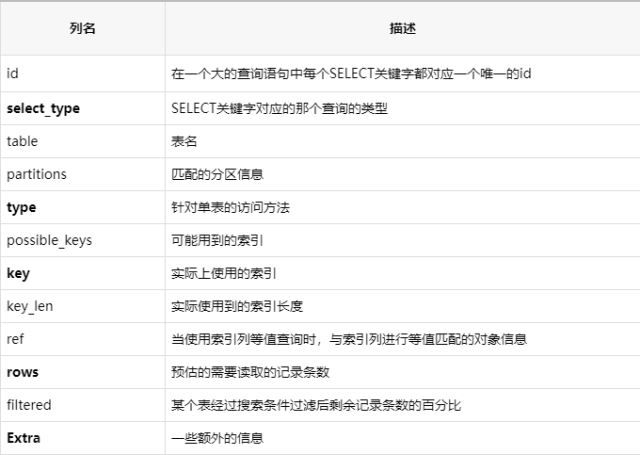
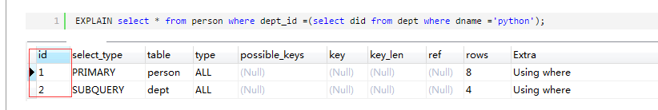

# sql语句优化工具

# 一 慢查询日志 

   一般分为四步：

## 1.开启慢查询日志（默认是关闭的

mysql> set global slow_query_log = on;

## 2 设置慢查询时间限制（查询时间只要大于这个值都将记录到慢查询日志中，单位：秒）

mysql> set global long_query_time = 1;

## 3 确定慢查询日志路径：

mysql> show global variables like "datadir";


# 4 确定慢查询日志文件名：

mysql> show global variables like "slow_query_log_file";


慢查询query time设置小技巧：线上业务一般建议把 long_query_time 设置为 1 秒，如果某个业务的 MySQL 要求比较高的 QPS，可设置慢查询为 0.1 秒。发现慢查询及时优化或者提醒开发改写。一般测试环境建议 long_query_time 设置的阀值比生产环境的小，比如生产环境是 1 秒，则测试环境建议配置成 0.5 秒。便于在测试环境及时发现一些效率低的 SQL。甚至某些重要业务测试环境 long_query_time 可以设置为 0，以便记录所有语句。并留意慢查询日志的输出，上线前的功能测试完成后，分析慢查询日志每类语句的输出，重点关注 Rows_examined（语句执行期间从存储引擎读取的行数），提前优化。

# 5 查看日志

可以通过：tail -n5 /data/mysql/mysql-slow.log 命令查看

执行结果

这里对上方的执行结果详细描述一下：

tail -n5：只查看慢查询文件的最后5行

**Time：慢查询发生的时间User@Host：客户端用户**

**IPQuery_time：查询时间**

**Lock_time：等待表锁的时间**

**Rows_sent：语句返回的行数**

**Rows_examined：语句执行期间从存储引擎扫描的行数。**

**具体执行的sql（优化后的）。**

 其他工具**：pt-query-digest 或者 mysqldumpslow(mysql自带的) 或 mysqlsla等工具对慢查询日志进行分析**，


```
mysql> show variables like 'slow_query%'; 
+---------------------+------------------------------+
| Variable_name       | Value                        |
+---------------------+------------------------------+
| slow_query_log      | ON                           |
| slow_query_log_file | mysql_slow.log |
+---------------------+------------------------------+
2 rows in set (0.00 sec)
　　运行以下命令我们可以看到我们设定的慢查询时间也生效了，此时只要查询时间大于1s，查询语句都将存入日志文件。

mysql> show variables like 'long_query_time'; 
+-----------------+----------+
| Variable_name   | Value    |
+-----------------+----------+
| long_query_time | 1.000000 |
+-----------------+----------+
1 row in set (0.00 sec)
　　现在我们运行一个查询时间超过1s的查询语句：　　

mysql> select * from emp where empno=413345;
+--------+--------+----------+-----+------------+---------+--------+--------+
| empno  | ename  | job      | mgr | hiredate   | sal     | comm   | deptno |
+--------+--------+----------+-----+------------+---------+--------+--------+
| 413345 | vvOHUB | SALESMAN |   1 | 2014-10-26 | 2000.00 | 400.00 |     11 |
+--------+--------+----------+-----+------------+---------+--------+--------+
1 row in set (6.55 sec)
　　然后查看mysql安装目录下的data目录，该目录会产生一个慢查询日志文件：mysql_slow.log，该文件内容如下：


/usr/local/mysql/bin/mysqld, Version: 5.1.73-log (MySQL Community Server (GPL)). started with:
Tcp port: 3306  Unix socket: /tmp/mysql.sock
Time                 Id Command    Argument
# Time: 141026 23:24:08
# User@Host: root[root] @ localhost []
# Query_time: 6.547536  Lock_time: 0.002936 Rows_sent: 1  Rows_examined: 10000000
use temp;
SET timestamp=1414337048;
select * from emp where empno=413345;
```

[](javascript:void(0);)

在该日志文件中，我们可以知道慢查询产生的时间，最终产生了几行结果，测试了几行结果，以及运行语句是什么。在这里我们可以看到，这条语句产生一个结果，但是检测了1000w行记录，是一个全表扫描。

# 二、Explain执行计划

​                                      

   慢查询日志可以帮助我们把所有查询时间过长的sql语句记录下来，在优化这些语句之前，我们应该使用explain命令查看mysql的执行计划，寻找其中的可优化点。

   explain命令的使用十分简单，只需要"explain + sql语句"即可，如下命令就是对我们刚刚的慢查询语句使用explain之后的结果：


## 0 explain命令的结果比较关键字段

**type, key,rows,Extra**




# 1 id：SELECT识别符。

 查询序号即为sql语句执行顺序 ，从 2 个表中查询，对应输出 2 行，每行对应一个表， id 列表示执行顺序，id 越大，越先执行，id 相同时，由上至下执行 



   # 2 select_type：查询类型

主要有PRIMARY(子查询中最外层查询）、SUBQUERY（子查询内层第一个SELECT）、UNION（UNION语句中第二个SELECT开始后面所有SELECT）、SIMPLE（除了子查询或者union之外的其他查询）；

#### 　2.1 simple 简单查询 (没有union和子查询)

　　对于不包含子查询和其他复杂语法的简单查询，这是一个常见的类型。

```
`EXPLAIN ``SELECT` `* ``FROM` `person;`
```


#### 　2.2 primary 最外层查询 (在存在子查询的语句中，最外面的select查询就是primary)

　　这是为更复杂的查询而创建的首要表(也就是最外层的表)。这个类型通常可以在DERIVED 和 UNION 类型混合使用时见到。

#### 　2.3 derived  子查询(**在FROM列表中包含的子查询**)

　　当一个表不是一个物理表时，那么这个就被叫做DERIVED

```
`EXPLAIN ``SELECT` `*``FROM` `(``SELECT``* ``FROM` `person LIMIT 5) ``AS` `s`
```


#### 　2.4 subquery  映射为子查询(**在SELECT或WHERE列表中包含了子查询**)

　　这个select-type 的值是为使用子查询而定义的.

```
`EXPLAIN ``SELECT` `person.*,(``select` `2 ``from` `person ``as` `p2) ``FROM` `person ``where` `dept_id = (``select` `did ``from` `dept ``where` `dname=``'python'``);`
```


####  2.5 union 联合

```
`EXPLAIN ``SELECT` `* ``FROM` `person ``union` `all` `select` `* ``from` `person ;`
```


#### 2.6 union result 使用联合的结果

```
`EXPLAIN ``SELECT` `* ``FROM` `person ``union` `select` `* ``from` `person ;`
```


    

## 3 table：所访问的数据库表明

## 4  type：对表的访问方式。

type 列代表表示 查询计划的连接类型, 有多个参数，先从最佳类型到最差类型介绍 **重要且困难**

　　**性能： null > system/const > eq_ref > ref > ref_or_null >index_merge > range > index > all** 

#### 4.1 type=NULL　在优化过程中就已得到结果，不用再访问表或索引。

```
`EXPLAIN ``SELECT` `max``(id) ``FROM` `person;`
```


#### 4.2 type=const/system 常量

　　在整个查询过程中这个表最多只会有一条匹配的行，比如主键 id=1 就肯定只有一行；

表最多有一个匹配行，const用于比较primary key 或者unique索引。因为只匹配一行数据，所以一定是用到primary key 或者unique 情况下才会是const,看下面这条语句。表只有一行记录(等于系统表), 这是const类型的特例, 平时不会出现。

```
`EXPLAIN ``SELECT` `* ``FROM` `person ``where` `id =2;`
```


所以说可以理解为const是最优化的。

 

#### 4.3 type=eq_ref **使用有唯一性 索引查找（主键或唯一性索引）**

　对于eq_ref的解释，mysql手册是这样说的:"对于每个来自于前面的表的行组合，从该表中读取一行。这可能是最好的联接类型，除了const类型。它用在一个索引的所有部分被联接使用并且索引是UNIQUE或PRIMARY KEY"。eq_ref可以用于使用=比较带索引的列。看下面的语句　

```
`EXPAIN ``select` `* ``from` `person,dept ``where` `person.id = dept.did;`
```

 得到的结果是下图所示。很明显，mysql使用eq_ref联接来处理 dept 表。　　


#### 4.4 type=ref　**非唯一性索引访问**

　　这是一种索引访问（有时也叫做索引查找），它返回所有匹配某个单个值的行，然而，它可能会找到多个符合条件的行。因此，它是查找和扫描的混合体，此类索引访问只有当使用非唯一性索引或者唯一性索引的非唯一性前缀时才会发生。把它叫做ref是因为索引要跟某个参考值相比较。这个参考值或者是一个常数，或者是来自多表查询前一个表里的结果值。

```
`EXPLAIN ``select` `* ``from` `person ``where` `name``=``'alex'``;`
```


 

#### 4.5 **ref_or_null** 该联接类型如同ref类似,结果包含空行.

上面这五种情况都是很理想的索引使用情况

#### 4.6 type=range

#### 　　索引范围扫描，常见于　<,<=,>,>=,between,in等操作符。　

```
`EXPLAIN ``select` `* ``from` `person ``where` `id ``BETWEEN` `1 ``and` `5;`
```


#### 4.7 **type=index**  

　　该联接类型与ALL相同都是扫描表，但**index只对索引树进行扫描**，而ALL是是对数据表文件的扫描。**这通常比ALL快，因为索引文件通常比数据文件小**。（也就是说虽然all和Index都是读全表，但index是从索引中读取的，而all是从硬盘中读的）主要优点是避免了排序，因为索引是排好序的。

Extra列中看到“Using index”，说明mysql正在使用覆盖索引，只扫描索引的数据。　

```
`EXPLAIN ``select` `id,``name` `from` `person;`
```


#### 4.8 type=ALL 

　　对于每个来自于先前的表的行组合，进行完整的表扫描。如果**表是第一个没标记const的表，这通常不好**，并且通常在它情况下***很\***差。通常可以增加更多的索引而不要使用ALL，使得行能基于前面的表中的常数值或列值被检索出。

```
`EXPLAIN ``select` `* ``from` `person;`
```


 查询性能从上到下依次是最好到最差

  


**一般来说, 要保证查询至少达到range级别, 最好能达到ref**

**ndex : Full Index Scan, index与ALL的区别为index类型只遍历索引树。这通常比ALL快, 因为索引文件通常比数据文件小。(也就是说虽然ALL和Index都是读全表, 但index是从索引中读取的, 而all是从硬盘中读取的)**

   ## 5、possible_keys：查询可能使用到的索引；

该 possible_keys列表示MySQL可以从中选择查找表中的行的索引。如果此列是NULL，则没有相关的索引。在这种情况下，您可以通过检查WHERE 子句来检查是否引用某些适合索引的列，从而提高查询的性能。如果是这样，请创建一个适当的索引并使用 EXPLAIN再次检查查询 。

另外如果这个**列出现大量可能被使用的索引(例如多于3 个), 那么这 意味着备选索引数量太多了，同时也可能提示存在无效的索引**。

  ## 6、key：最后选用的索引；

**该key 列指出mysql优化器决定选择使用哪个索引来优化对该表的访问**。一般来说SQL查询中的每个表都只会使用一个索引。但是也存在索引合并的少数例外情况，如给定表上用到了两个或者更多索引。查询过程中由优化器来决定实际使用的索引。如果possible_keys索引列表中没有适合查找行的索引，那么这个key可能会命名一个不存在于该possible_keys值中的索引 。简单且重要 

 ##  7、key_len：使用索引的最大长度；


   ## 8、ref：列出某个表的某个字段过滤；


  ## 9、rows：估算出的结果行数；

这一列是mysql评估 为了找到所需的行而要读取的行数。这个数字是内嵌循环关联计划里的循环数目，也就是说它不是mysql认为它最终要从表里读取出来的行数，而是mysql为了找到符合查询的每一点上标准的那些行而必须读取的行的平均数。

rows 列提供了试图分析所有存在于累计结果集中的行数目的MySQL 优化器估计值。执行计划很容易描述这个很困难的统计量。

查询中总的读操作数量是基于合并之前行的每一行的rows 值的连续积累而得出的。这是一种嵌套行算法。

简单且重要，数值越大越不好，说明没有用好索引

## 10、 **extra重点解读** ：

查询细节信息，可能是以下值：distinct、using filesort（order by操作）、using index（所查数据只需要在index中即可获取）、using temporary（使用临时表）、using where（如果包含where，且不是仅通过索引即可获取内容，就会包含此信息）。

####     10.1 Not exists : 不存在信息

#### 　10.2 range checked for each record :没有找到合适的索引

#### 　10.3 Using index condition :出现这个说明mysql使用了覆盖索引，避免访问了表的数据行，效率不错！

```
建表及插入数据：
create table a13 (id int primary key, age int);
insert into a13 value(1, 10),(2, 10);
mysql> explain select id from a13;
+----+-------------+-------+------------+-------+---------------+---------+---------+------+------+----------+-------------+
| id | select_type | table | partitions | type | possible_keys | key | key_len | ref | rows | Extra |
+----+-------------+-------+------------+-------+---------------+---------+---------+------+------+----------+-------------+
| 1  | SIMPLE        | a13   | NULL         | index | NULL            | PRIMARY | 4   | NULL|  2   | Using index |
+----+-------------+-------+------------+-------+---------------+---------+---------+------+------+----------+-------------+
因为 id 为主键索引，索引中直接包含了 id 的值，所以无需访问表，直接查找索引就能返回结果。

mysql> explain select age from a13;
+----+-------------+-------+------------+------+---------------+------+---------+------+------+----------+-------+
| id | select_type | table | partitions | type | possible_keys | key | key_len | ref | rows | Extra |
+----+-------------+-------+------------+------+---------------+------+---------+------+------+----------+-------+
| 1  | SIMPLE        | a13   | NULL         | ALL  | NULL            | NULL |  NULL  | NULL|  2   |  NULL |
+----+-------------+-------+------------+------+---------------+------+---------+------+------+----------+-------+
age 列没有索引，因此没有 Using index ，意即需要访问表。
为 age 列添加索引：
create table a14 (id int primary key, age int);
insert into a14 value(1, 10),(2, 10);
create index age on a14(id, age);
mysql> explain select age from a14;
+----+-------------+-------+------------+-------+---------------+------+---------+------+------+----------+-------------+
| id | select_type | table | partitions | type | possible_keys | key | key_len | ref | rows |  Extra |
+----+-------------+-------+------------+-------+---------------+------+---------+------+------+----------+-------------+
| 1  | SIMPLE      | a14   | NULL       | index|     NULL        | age |       9    | NULL| 2     |Using index |
+----+-------------+-------+------------+-------+---------------+------+---------+------+------+----------+-------------+
现在索引 age 中包含了 age 列的值，因此不用访问表便能返回结果了。
```

#### 　10.4 using temporary ：mysql对查询结果进行排序的时候使用了一张临时表。

```
mysql> EXPLAIN SELECT p.id,d.did from person p LEFT JOIN dept d ON p.dept_id = d.did group by p.dept_id ORDER BY p.dept_id;
+----+-------------+-------+--------+---------------+---------+---------+------------+------+---------------------------------+
| id | select_type | table | type   | possible_keys | key     | key_len | ref        | rows | Extra                           |
+----+-------------+-------+--------+---------------+---------+---------+------------+------+---------------------------------+
|  1 | SIMPLE      | p     | ALL    | NULL          | NULL    | NULL    | NULL       |    8 | Using temporary; Using filesort |
|  1 | SIMPLE      | d     | eq_ref | PRIMARY       | PRIMARY | 4       | test.p.dept_id| 1 | Using where; Using index        |

我们发现在执行这条SQL语句时出现了 using temporary,我们再来看看下面这条SQL语句,去掉 条件中 group by 分组

mysql> EXPLAIN SELECT p.id,d.did from person p LEFT JOIN dept d ON p.dept_id = d.did ORDER BY p.dept_id;
+----+-------------+-------+--------+---------------+---------+---------+------------+------+--------------------------+
| id | select_type | table | type   | possible_keys | key     | key_len | ref        | rows | Extra                    |
+----+-------------+-------+--------+---------------+---------+---------+------------+------+--------------------------+
|  1 | SIMPLE      | p     | ALL    | NULL          | NULL    | NULL    | NULL       |    8 | Using filesort           |
|  1 | SIMPLE      | d     | eq_ref | PRIMARY       | PRIMARY | 4       | test.p.dept_id|1  | Using where; Using index |
+----+-------------+-------+--------+---------------+---------+---------+------------+------+--------------------------+

而为什么第一个用了临时表，而第二个没有用呢？
因为如果有GROUP BY子句，或者如果GROUP BY中的字段都来自其他的表而非连接顺序中的第一个表的话，就会创建一个临时表了。

那么如何解决呢?
咱们为group by 字段添加一个索引 

mysql> alter table person add index did_idx(dept_id);
Query OK, 0 rows affected

mysql> EXPLAIN SELECT p.id,d.did from person p LEFT JOIN dept d ON p.dept_id = d.did group by p.dept_id ORDER BY p.dept_id;
+----+-------------+-------+--------+---------------+---------+---------+------------+------+--------------------------+
| id | select_type | table | type   | possible_keys | key     | key_len | ref        | rows | Extra                    |
+----+-------------+-------+--------+---------------+---------+---------+------------+------+--------------------------+
|  1 | SIMPLE      | p     | index  | NULL          | did_idx | 5       | NULL       |    8 | Using index              |
|  1 | SIMPLE      | d     | eq_ref | PRIMARY       | PRIMARY | 4       | test.p.dept_id| 1 | Using where; Using index |
+----+-------------+-------+--------+---------------+---------+---------+------------+------+--------------------------+

为什么添加个索引就不会创建临时表了呢? 原因就在于 SQL查询时优先在索引树中执行,如果索引树满足不了当前SQL,才会进行数据表查询,那么现在加了索引,已经可以满足查询条件了,就没有必要创建临时表了
```

#### 　10.5 using filesort： mysql对数据不是按照表内的索引顺序进行读取,而是使用了其他字段重新排序.

```
mysql> EXPLAIN select * from person ORDER BY id;
+----+-------------+--------+-------+---------------+---------+---------+------+------+-------+
| id | select_type | table  | type  | possible_keys | key     | key_len | ref  | rows | Extra |
+----+-------------+--------+-------+---------------+---------+---------+------+------+-------+
|  1 | SIMPLE      | person | index | NULL          | PRIMARY | 4       | NULL |    8 |       |
+----+-------------+--------+-------+---------------+---------+---------+------+------+-------+
如果我们用聚合主键进行排序,则Extra 为null,我们知道在innodb引擎中,主键为聚合索引,插入数据就会排好顺序.最后说明mysql是按照表内的索引顺序进行读的

再看下面的列子:
mysql> EXPLAIN select * from person ORDER BY salary;
+----+-------------+--------+------+---------------+------+---------+------+------+----------------+
| id | select_type | table  | type | possible_keys | key  | key_len | ref  | rows | Extra          |
+----+-------------+--------+------+---------------+------+---------+------+------+----------------+
|  1 | SIMPLE      | person | ALL  | NULL          | NULL | NULL    | NULL |    8 | Using filesort |
+----+-------------+--------+------+---------------+------+---------+------+------+----------------+
我们使用非主键字段进行排序,这是mysql就不能按照表内的索引顺序进行读了.需要读取数据行后再进行排序处理
```


#### 　10.6 using where: 表示 MySQL 服务器从存储引擎收到查询数据,再进行“后过滤”（Post-filter）。所谓“后过滤”，就是先读取整行数据，再检查此行是否符合 where 句的条件，符合就留下，不符合便丢弃。因为检查是在读取行后才进行的，所以称为“后过滤”。


```
建表及插入数据：
create table a16 (num_a int not null, num_b int not null, key(num_a));
insert into a16 value(1,1),(1,2),(2,1),(2,2);
mysql> explain select * from a16 where num_a=1;
+----+-------------+-------+------------+------+---------------+-------+---------+-------+------+----------+-------+
| id | select_type | table | partitions | type | possible_keys | key | key_len | ref | rows | Extra |
+----+-------------+-------+------------+------+---------------+-------+---------+-------+------+----------+-------+
| 1  | SIMPLE      | a16   | NULL       | ref  | num_a         | num_a | 4        | const| 2     |  NULL |
+----+-------------+-------+------------+------+---------------+-------+---------+-------+------+----------+-------+

虽然查询中有 where 子句，但只有 num_a=1 一个条件，且 num_a 列存在索引，通过索引便能确定返回的行，无需进行“后过滤”。
所以，并非带 WHERE 子句就会显示"Using where"的。
mysql> explain select * from a16 where num_a=1 and num_b=1;
+----+-------------+-------+------------+------+---------------+-------+---------+-------+------+----------+-------------+
| id | select_type | table | partitions | type | possible_keys | key | key_len | ref | rows | Extra |
+----+-------------+-------+------------+------+---------------+-------+---------+-------+------+----------+-------------+
| 1  | SIMPLE      | a16   | NULL       | ref  | num_a            | num_a | 4     | const | 2  | Using where |
+----+-------------+-------+------------+------+---------------+-------+---------+-------+------+----------+-------------+

此查询增加了条件 num_b=1 ，此列没有索引，但可以看到查询同样能使用 num_a 索引。 MySQL 先通过索引 num_a 找到 num_a=1 的行，然后读取整行数据，再检查 num_b 是否等于 1 ，执行过程看上去象这样：

num_a索引|num_b 没有索引，属于行数据
+-------+-------+
| num_a | num_b | where 子句(num_b=1)
+-------+-------+
| 1 | 1 | 符合
| 1 | 2 | 不符合
| ... | ... | ...
+-------+-------+
```

 

详情参考官方文档: https://dev.mysql.com/doc/refman/5.6/en/using-explain.html

## 11  EXPLAIN结果中哪些信息要引起关注

如果有下面几种情况，就需要特别关注下了：

　　首先看下 **type** 这列的结果，如果有类型是 ALL 时，表示预计会进行全表扫描（full table scan）。通常全表扫描的代价是比较大的，建议创建适当的索引，通过索引检索避免全表扫描。

　　再来看下 **Extra** 列的结果，如果有出现 **Using temporary** 或者 **Using filesort** 则要多加关注：

　　**Using temporary**，表示需要创建临时表以满足需求，通常是因为GROUP BY的列没有索引，或者GROUP BY和ORDER BY的列不一样，也需要创建临时表，建议添加适当的索引。

　　**Using filesort**，表示无法利用索引完成排序，也有可能是因为多表连接时，排序字段不是驱动表中的字段，因此也没办法利用索引完成排序，建议添加适当的索引。

　　**Using where**，通常是因为**全表扫描或全索引扫描**时（**type** 列显示为 **ALL** 或 **index**），又加上了WHERE条件，建议添加适当的索引。

其他状态例如：Using index、Using index condition、Using index for group-by 则都还好，不用紧张。

# 三、Profiling 的使用

​                                    

   mysql除了提供explain命令用于查看命令执行计划外**，还提供了profiling工具用于查看语句查询过程中的资源消耗情况。首先我们要使用以下命令开启Profiling功能**：

```
`set` `profiling = 1;`
```

　　接下来我们执行一条查询命令：

```
`mysql> ``select` `* ``from` `emp ``where` `empno=413345;``+--------+--------+----------+-----+------------+---------+--------+--------+``| empno | ename | job   | mgr | hiredate  | sal   | comm  | deptno |``+--------+--------+----------+-----+------------+---------+--------+--------+``| 413345 | vvOHUB | SALESMAN |  1 | 2014-10-26 | 2000.00 | 400.00 |   11 |``+--------+--------+----------+-----+------------+---------+--------+--------+``1 row ``in` `set` `(6.44 sec)`
```

　　在开启了Query Profiler功能之后,MySQL就会自动记录所有执行的Query的profile信息了。 然后我们通过以下命令获取系统中保存的所有 Query 的 profile 概要信息：

```
`mysql> show profiles;``+----------+------------+--------------------------------------+``| Query_ID | Duration  | Query                |``+----------+------------+--------------------------------------+``|    1 | 0.00053000 | show tables             |``|    2 | 0.07412700 | ``select` `* ``from` `dept          |``|    3 | 0.06743300 | ``select` `* ``from` `salgrade        |``|    4 | 6.44056000 | ``select` `* ``from` `emp ``where` `empno=413345 |``+----------+------------+--------------------------------------+``4 rows ``in` `set` `(0.00 sec)``　　然后我们可以通过以下命令查看具体的某一次查询的profile信息：` `mysql> show profile cpu, block io ``for` `query 4;``+--------------------+----------+----------+------------+--------------+---------------+``| Status       | Duration | CPU_user | CPU_system | Block_ops_in | Block_ops_out |``+--------------------+----------+----------+------------+--------------+---------------+``| starting      | 0.000107 | 0.000072 |  0.000025 |      0 |       0 |``| Opening tables   | 0.000021 | 0.000018 |  0.000003 |      0 |       0 |``| System ``lock`    `| 0.000006 | 0.000004 |  0.000001 |      0 |       0 |``| Table ``lock`     `| 0.000009 | 0.000008 |  0.000001 |      0 |       0 |``| init        | 0.000034 | 0.000033 |  0.000002 |      0 |       0 |``| optimizing     | 0.000012 | 0.000011 |  0.000001 |      0 |       0 |``| statistics     | 0.000014 | 0.000012 |  0.000001 |      0 |       0 |``| preparing     | 0.000013 | 0.000012 |  0.000002 |      0 |       0 |``| executing     | 0.000005 | 0.000005 |  0.000016 |      0 |       0 |``| Sending data    | 6.440260 | 7.818553 |  0.178155 |      0 |       0 |``| end        | 0.000008 | 0.000006 |  0.000011 |      0 |       0 |``| query end     | 0.000002 | 0.000002 |  0.000003 |      0 |       0 |``| freeing items   | 0.000030 | 0.000013 |  0.000017 |      0 |       0 |``| logging slow query | 0.000001 | 0.000000 |  0.000001 |      0 |       0 |``| logging slow query | 0.000035 | 0.000020 |  0.000015 |      0 |       0 |``| cleaning up    | 0.000003 | 0.000003 |  0.000000 |      0 |       0 |``+--------------------+----------+----------+------------+--------------+---------------+``16 rows ``in` `set` `(0.00 sec)``　　该profile显示了每一步操作的耗时以及cpu和Block IO的消耗，这样我们就可以更有针对性的优化查询语句了。可以看`
```