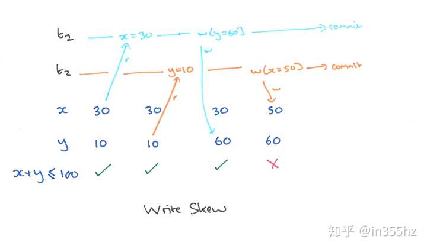
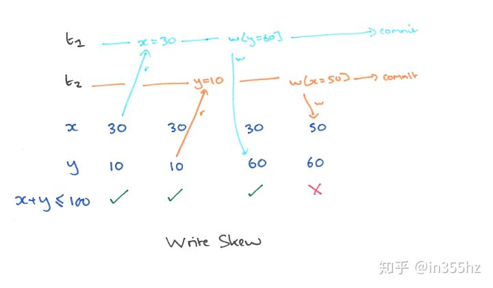

mysql-MVCC

   MVCC，全称Multi-Version Concurrency Control，即多版本并发控制。MVCC是一种并发控制的方法，一般在数据库管理系统中，实现对数据库的并发访问，在编程语言中实现事务内存。 

# MVCC 多版本并发控制（必考）

可以认为 MVCC 是行级锁的一个变种，典型的MVCC实现方式，分为**乐观（optimistic）并发控制和悲观（pressimistic）并发控制**。MVCC 只在 COMMITTED READ（读提交）和REPEATABLE READ（可重复读）两种隔离级别下工作。

在InnoDB中MVCC的实现通过两个重要的字段进行连接：`DB_TRX_ID`和`DB_ROLL_PT`，在多个事务并行操作某行数据的情况下，不同事务对该行数据的`UPDATE`会产生多个版本，数据库通过`DB_TRX_ID`来标记版本，然后用`DB_ROLL_PT`回滚指针将这些版本以先后顺序连接成一条 `Undo Log` 链。

对于一个没有指定`PRIMARY KEY`的表，每一条记录的组织大致如下：


column.png

 

1. **`DB_TRX_ID`: 事务id**，6byte，每处理一个事务，值自动加一。

   > InnoDB中每个事务有一个唯一的事务ID叫做 transaction id。在事务开始时向InnoDB事务系统申请得到，是按申请顺序严格递增的
   >
   > 每行数据是有多个版本的，每次事务更新数据时都会生成一个新的数据版本，并且把transaction id赋值给这个数据行的DB_TRX_ID

2. **`DB_ROLL_PT`: 回滚指针**，7byte，指向当前记录的`ROLLBACK SEGMENT` 的undolog记录，通过这个指针获得之前版本的数据。该行记录上所有旧版本在 `undolog` 中都通过链表的形式组织。

3. 还有一个`DB_ROW_ID(隐含id,6byte，由innodb自动产生)`，我们可能听说过InnoDB下聚簇索引B+Tree的构造规则:

   > 如果声明了主键，InnoDB以用户指定的主键构建B+Tree，如果未声明主键，InnoDB 会自动生成一个隐藏主键，说的就是`DB_ROW_ID`。另外，每条记录的头信息（record header）里都有一个专门的`bit`（deleted_flag）来表示当前记录是否已经被删除

我们通过图二的UPDATE(即操作2)来举例Undo log链的构建(假设第一行数据DB_ROW_ID=1)：

1. 事务A对DB_ROW_ID=1这一行加排它锁
2. 将修改行原本的值拷贝到Undo log中
3. 修改目标值产生一个新版本，将`DB_TRX_ID`设为当前事务ID即100，将`DB_ROLL_PT`指向拷贝到Undo log中的旧版本记录
4. 记录redo log， binlog

最终生成的Undo log链如下图所示:

 


 

相比与UPDATE，INSERT和DELETE都比较简单:

- INSERT: **产生一条新的记录，该记录的`DB_TRX_ID`为当前事务ID**
- DELETE: **特殊的UPDATE，在`DB_TRX_ID`上记录下当前事务的ID，同时将`delete_flag`设为true，在执行commit时才进行删除操作**

MVCC的规则大概就是以上所述，那么它是如何实现高并发下`RC`和`RR`的隔离性呢，这就是在MVCC机制下基于生成的Undo log链和一致性视图ReadView来实现的。

## 一致性视图的生成 ReadView

只有`RC`和`RR`这两个级别需要在MVCC机制下通过ReadView来实现。

InnoDB为每一个事务构造了一个数组`m_ids`用于保存一致性视图生成瞬间当前所有`活跃事务`(开始但未提交事务)的ID，将数组中事务ID最小值记为低水位`m_up_limit_id`，当前系统中已创建事务ID最大值+1记为高水位`m_low_limit_id`，构成如图所示:


一致性视图下查询操作的流程如下:

1. 当查询发生时根据以上条件生成ReadView，该查询操作遍历Undo log链，根据当前被访问版本(可以理解为Undo log链中每一个记录即一个版本，遍历都是从最新版本向老版本遍历)的`DB_TRX_ID`，如果`DB_TRX_ID`小于`m_up_limit_id`,则该版本在ReadView生成前就已经完成提交，该版本可以被当前事务访问。**`DB_TRX_ID`在绿色范围内的可以被访问**
2. 若被访问版本的`DB_TRX_ID`大于`m_up_limit_id`，说明该版本在ReadView生成之后才生成，因此该版本不能被访问，根据当前版本指向上一版本的指针`DB_ROLL_PT`访问上一个版本，继续判断。**`DB_TRX_ID`在蓝色范围内的都不允许被访问**
3. 若被访问版本的`DB_TRX_ID`在[m_up_limit_id, m_low_limit_id)区间内，则判断`DB_TRX_ID`是否等于当前事务ID，等于则证明是当前事务做的修改，可以被访问，否则不可被访问, 继续向上寻找。**只有`DB_TRX_ID`等于当前事务ID才允许访问橙色范围内的版本**
4. 最后，还要确保满足以上要求的可访问版本的数据的`delete_flag`不为true，否则查询到的就会是删除的数据。

所以以上总结就是**只有当前事务修改的未commit版本和所有已提交事务版本允许被访问**。

## 一致性读和当前读

前面说的都是查询相关，那么涉及到多个事务的查询同时还有更新操作时，MVCC机制如何保证在实现事务隔离级别的同时进行正确的数据更新操作，保证事务的正确性呢，我们可以看一个案例:

 

```
DROP TABLE IF EXISTS `mvccs`;CREATE TABLE `mvccs`( `field` INT)ENGINE=InnoDB;INSERT INTO `mvccs` VALUES(1); -- 插入一条数据
```


 

假设在所有事务开始前当前有一个活跃事务10，且这三个事务期间没有其他并发事务:

1. 在操作1开始SELECT语句时，需要创建一致性视图，此时当前事务的一致性视图为[10, 100, 200，301), 事务100开始查询Undo log链，第一个查询到的版本为为事务200的操作4的更新操作， `DB_TRX_ID`在`m_ids`数组但并不等于当前事务ID， 不可被访问；
2. 向上查询下一个即事务300在操作6时生成的版本，小于高水位`m_up_limit_id`，且不在`m_ids`中，处于已提交状态，因此可被访问；
3. 综上在`RR`和`RC`下得到操作1查询的结果都是2

那么操作5查询到的field的值是多少呢？

在`RR`下，我们可以明确操作2和操作3查询field的值都是1，在`RC`下操作2为1，操作3的值为2，那么操作5的值呢？

答案在`RR`和`RC`下都是是3，我一开始以为`RR`下是2，因为这里如果按照一致性读的规则，事务300在操作2时都未提交，对于事务200来说应该时不可见状态，你看我说的是不是好像很有道理的样子？

上面的问题在于UPDATE操作都是读取**当前读(current read)**数据进行更新的，而不是一致性视图ReadView，因为如果读取的是ReadView，那么事务300的操作会丢失。当前读会读取记录中的最新数据，从而解决以上情形下的并发更新丢失问题。


 https://www.cnblogs.com/stevenczp/p/8018986.html 


MySQL（innodb）的 RR 隔离级别实际上是 snapshot isolation，可以避免通常意义的幻读。

snapshot isolation 的问题是无法处理如下的 read-write conflict：

来源：A Critique of ANSI SQL Isolation Levels

由于 UPDATE 本身也是一种 read-write，如果执行 UPDATE 也会有 write skew 问题, 那对实际应用来说就太糟糕了。

MySQL（innodb）为了解决这个问题，强行把 read 分成了 *snapshot read*（快照读）和 *locking read* （当前读）。在 UPDATE 或者 SELECT ... FOR UPDATE 的时候，innodb 引擎实际执行的是当前读，在扫描过程中加上行锁和区间锁（*gap locks*，*next-key locks*），相当于变相提升到了 serializable 隔离级别，从而消除了 write skew 。

从实用角度看，这个解法还是很赞的。既解决了 UPDATE write-skew 问题，又保证了绝大多数场景 SELECT 的性能，特殊情况还可以用 SELECT ... FOR UPDATE，完美。

但是，，，，MySQL（innodb）当前读的机制本身和 snapshot 是矛盾的。加锁保护的一定是数据最新版本。例如，如果在快照读之后再执行一次当前读，则读到的数据内容不一定能保证一致，因此会有这样的现象：

```sql
mysql> SELECT * FROM char_encode WHERE glyph = 'a';
+-------+-----------+
| glyph | codepoint |
+-------+-----------+
| a     |        97 |
+-------+-----------+
1 row in set (0.03 sec)

mysql> UPDATE char_encode SET codepoint = codepoint + 1 WHERE glyph
    -> = 'a';
Query OK, 1 row affected (0.07 sec)
Rows matched: 1  Changed: 1  Warnings: 0

mysql> SELECT * FROM char_encode WHERE glyph = 'a';
+-------+-----------+
| glyph | codepoint |
+-------+-----------+
| a     |       101 |
+-------+-----------+
```

MySQL（innodb）的选择是允许在快照读之后执行当前读，并且更新 snapshot 镜像的版本。严格来说，这个结果违反了 repeatable read 隔离级别，，但是 who cares 呢，毕竟官方都说了：“*This is* ***not a bug\*** *but an intended and documented behavior.*”