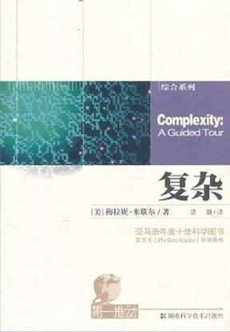

| [[软件架构设计\]+一线架构师实践指南（温昱）.pdf](http://www.ishare5.com/9790888/) |      | pdf文档 | 3.62MB |
| ------------------------------------------------------------ | ---- | ------- | ------ |
| [温昱_打通软件需求到架构设计之墙.pdf](http://www.ishare5.com/9356462/) |      | pdf文档 | 819KB  |
| [软件架构设计.pdf](http://www.ishare5.com/10274439/)         |      | pdf文档 | 1.4MB  |
| [软件架构设计.pdf](http://www.ishare5.com/11240170/)         |      | pdf文档 | 3.82MB |
| [[软件架构设计pdf电子书下载系列\]+一线架构师实践指南（温昱）.pdf](http://www.ishare5.com/10204848/) |      | pdf文档 | 3.62MB |
| [[软件架构设计pdf电子书下载系列\]+一线架构师实践指南（温昱）.pdf](http://www.ishare5.com/11328586/) |      |         |        |

《面向模式的软件体系结构》 全书貌似是5卷，或者翻译为这个名字《面向模式的软件架构》

《设计原本》 不用说了，经典

《架构之美》介绍了很多很经典的 软件 设计思想

 [《企业应用架构模式》](https://link.zhihu.com/?target=http%3A//www.amazon.cn/gp/product/B003LBSRDM/ref%3Das_li_ss_tl%3Fie%3DUTF8%26camp%3D536%26creative%3D3132%26creativeASIN%3DB003LBSRDM%26linkCode%3Das2%26tag%3Dflamingtop-23) 

 [97 Things Every Software Architect Should Know](https://link.zhihu.com/?target=http%3A//www.amazon.cn/gp/product/059652269X/ref%3Das_li_ss_tl%3Fie%3DUTF8%26camp%3D536%26creative%3D3132%26creativeASIN%3D059652269X%26linkCode%3Das2%26tag%3Dflamingtop-23) 

- 复杂 [https://book.douban.com/subject/6749832/](https://link.zhihu.com/?target=https%3A//book.douban.com/subject/6749832/)

  

 **《A Philosophy of Software Design》** 

- 分层模式（Layered pattern）
- 客户端-服务器模式（Client-server pattern）
- 主从模式（Master-slave pattern）
- 管道-过滤器模式（Pipe-filter pattern）
- 代理模式（Broker pattern）
- 点对点模式（Peer-to-peer pattern）
- 事件-总线模式（Event-bus pattern）
- 模型-视图-控制器模式（Model-view-controller pattern）
- 黑板模式（Blackboard pattern）
- 解释器模式（Interpreter pattern）

## 《数据密集型应用系统设计》

