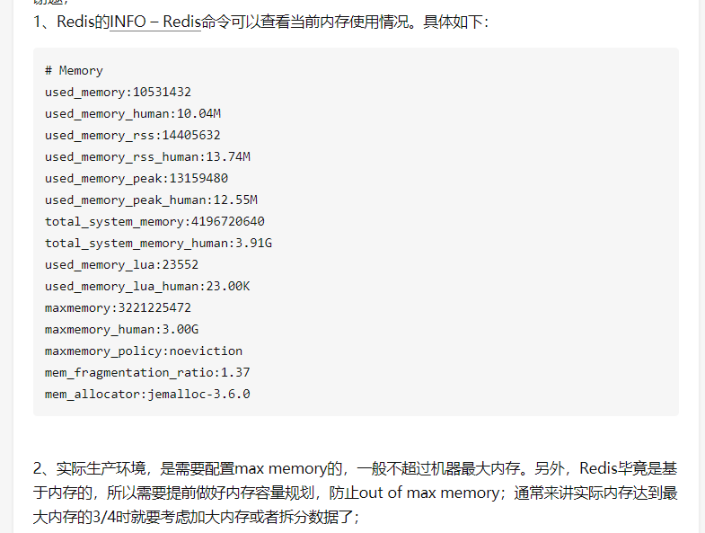

# 1 京东

## 1 一面

1 线程池
2 CAS
3 动态加载jar包
4 spring事物传播方式隔离
5 CPU高定位
6 springboot mvc如何执行的
7 aop过程

## 2 二面

# 2 有赞

## 2.1 一面

1. DDD的简介，充血模型、贫血还有个啥血来着区别；仓储的概念

2. Volatile怎么通知其他线程需要刷新数据

3. Rocketmq实现分布式事务时，B在消费失败时怎么去做最大努力通知

4. Raft、ZAB之paxos算法

5. Springboot怎么启动springmvc

6. Spi与原生java spi区别

7. 红包的组合计算，我回答用策略模式，然后问这些策略肯定会事先装配，怎么做，我答在spring容器得初始化完成后回调的onApplicationEvent里做。问，这个方法只会执行一次么，（记得在哪看过确实会调用多次），怎么保证只装配一次。。

8. Zk分布式锁与redis分布式锁  

      redis 安全性：1 脑裂 2 主节点宕机，一致性

     重入性、超时时间、守护线程刷新时间。

9. Redission的redlock算法和watchdog。

10. Redis缓存失效策略

11. 单例的实现

12. Lru怎么实现，答linkedhashmap，removeOldest，（可以怎么优化查找？）

13. 项目中用到的设计模式。除此之外还知道哪些设计模式，jdk代理和cglib代理哪个性能比较好，为什么。

    cglib, asm操作字节码

14. InitializingBean和BeanPostProcessor的区别

# 3 贝壳

## 1 一面

1 sychonized 、volatile、锁原理

2 Mysql MVCC

3 1500W行 offset limit慢怎么办

**1、采用主键的条件查询where 代替 limit 的 offset 偏移量功能 ，如： where id>offset order by id limit rows, 每页返回记录中最大id值为新offset值;**

**2、先查询主键索引，使用索引覆盖特性找出每页中id列表，然后子表 join下数据中，返回所需要的列。如：**

**select * from table_name inner join ( select id from table_name where (user = xxx) limit 10000,10)** 

4 spring 中设计模式

5 HashMap与concorentHashMap

6 Msql锁

7 kafka组成

8 单例

# 4 酷家乐

## 1 一面

1 分布式任务 失败了怎么办
2 延迟队列 kafka没有？
3 阻塞队列：几个方法 
4 mysql事物隔离机制 mvcc
5 放入 beanFactory
6 kakaf 为什么这么快 
7 生产消费者消费者
8 volatile

## 2 二面

1 二叉系列

https://blog.csdn.net/qq_40126996/article/details/105318125

2 kafka provder 三种，直接写到磁盘吗？

3 reids 集群，一共多大，多少key，多少个连接，多大。内存多大，整个集群总的内存大小。

  可以修改最大连接数配置，默认10000，可以在redis.conf配置文件中修改...

官方给出，理论值是 2 的 32 次方个，实际使用中单个 Redis 实例最小储存 2.5 亿个 key

 没有配置内存大小或配置为 0 的话，32 位系统上默认为 3G，64 位系统上无限制。所以一般都要配置一下，单位是 bytes 字节。推荐设置为物理内存的 3/4，类似 HashMap 的负载因子 

INFO命令可查，上面已经说了。

1. 使用swap危害：磁盘性能下降，持久化时间过长，可能出现暂停服务。
2. oom危害：暂停服务，意外Crash(windows版本上十分明显)

\# maxclients 10000

4   leetcode合并线段，二叉树

5 Arrays。sort原理。

6 排序 稳定性、时间复杂度、空间复杂的，

# 5 小米

## 5.1 RPC原理

## 5.2 调用链

## 5.3 序列化协议

# 6 网易

## 6.1 一面

1 redis 分片，

2 集成框架能力

3 

## 6.2 二面

1 spring 初始化

2 https 加密

3 生产者消费者

# 7 阿里

## 1 一面

1 数据量

2 并发量

3 项目

4 分库分表，没有分片键

5  分布式事务

6 redis 高可用方式 分片 事务

7 分布式锁

8 kafka有序 重复消费的原因

提交offset失败，发多次，

9 数据库 b+树、覆盖索引、指定指引

（A,B,C）查询A,C，BC能用索引吗

10 接口幂等

11 DDD 

# 8  美团 优选

## 一面

1 mysql主从复制原理。为什么产生延迟

2 spring 容器启动流程

3 spring 事物

4 Mybitas 如何与spring融合

5 Mybitas 一级 二级缓存的问题

7 redis 线程模型

8 mysql 线程大量并发插入，会产生死锁吗，自增Id会吗？

 insert会对插入成功的行加上排它锁，这个排它锁是个记录锁，而非next-key锁（当然更不是gap锁了），不会阻止其他并发的事务往这条记录之前插入记录。在插入之前，会先在插入记录所在的间隙加上一个插入意向gap锁（简称I锁吧），并发的事务可以对同一个gap加I锁。如果insert 的事务出现了duplicate-key error ，事务会对duplicate index record加共享锁。这个共享锁在并发的情况下是会产生死锁的，比如有两个并发的insert都对要对同一条记录加共享锁，而此时这条记录又被其他事务加上了排它锁，排它锁的事务提交或者回滚后，两个并发的insert操作是会发生死锁的 

9 编程题  层级访问二叉树（奇数从左到右，偶数从右到左）

# 9 滴滴

# 9.1  一面

1 分库分表

2 ddd

3 大表的 limit offset

4 手写 自旋锁

5 微信红包

 

# 4-26 总结

1 简单题打错  

redis线程 是串行的，不会阻塞。

mysql 主从不会

spring 事物的很水

题没有完全作对

2 有的不考8股文

3 

