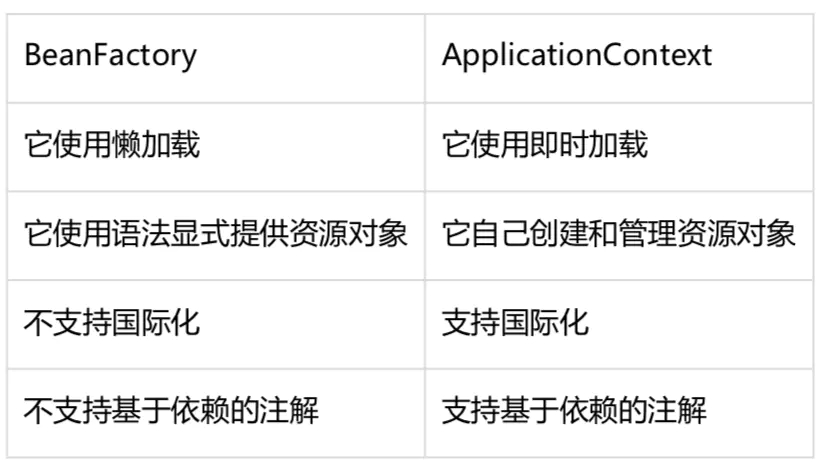
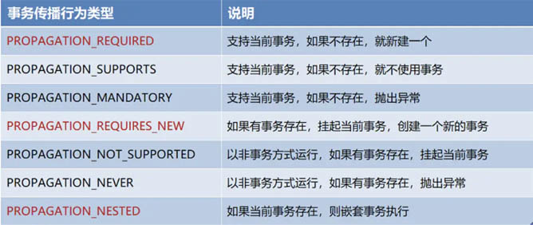

#  1 spring事物传播方式隔离

# 2 springboot mvc如何执行的

# 3 aop过程

# 4 Transactional 注解

# 5 mybatis 二级缓存底层实现，缓存 key 怎么构建

# 6 Springboot怎么启动springmvc

# 7 spring mvc和spring boot的区别

# 8 spring boot的自动配置

# 9 spring boot可以使用外部tomcat吗

# 10 除了tomcat，spring boot还可以使用什么容器

# 11 说下spring的核心模块

# 12 spring用到了哪些设计模式

 # 13 BeanFactory 和 ApplicationContext 区别联系

  

# 14 @Qualifier注解？

# 15**切面有几种类型的通知？分别是？**

前置通知(Before): 目标方法被调用之前调用通知功能。
后置通知(After): 目标方法完成之后调用通。
返回通知(After-returning): 目标方法成功执行之后调用通知。
异常通知(After-throwing): 目标方法抛出异常后调用通知。
环绕通知(Around): 在被通知的方法调用之前和调用之后执行自定义的行为。 

# 16  **Spring中的bean有几种scope?**

- singleton: 单例，每一个bean只创建一个对象实例。
- prototype，原型，每次对该bean请求调用都会生成各自的实例。
- request，请求，针对每次HTTP请求都会生成一个新的bean。表示在一次 HTTP 请求内有效。
- session，在一个http session中，一个bean定义对应一个bean实例。
- global session:在一个全局http session中，一个bean定义对应一个bean实例

# 17 .你能说几个Spring5的新特性吗？

- spring5整个框架基于java8
- 支持http/2
- Spring Web MVC支持最新API
- Spring WebFlux 响应式编程
- 支持Kotlin函数式编程

 # 18. **bean的生命周期?**

1.Spring 对bean进行实例化。
2.Spring将值和bean的引用注入到 bean对应的属性中。
3.如果bean实现了BeanNameAware接口，Spring将bean的ID传递给setBeanName()方法。
4.如果bean实现了BeanFactoryAware接口， Spring将调用setBeanFactory()方法，将 bean所在的应用引用传入进来。
5.如果bean实现了ApplicationContextAware接口，Spring将调用setApplicationContext()方法，将bean所在的应用引用传入进来。
6.如果bean实现了BeanPostProcessor 接口，Spring将调用他们的post-ProcessBeforeInitalization()方法。
7.如果bean实现了InitializingBean接口，Spring将调用他们的after-PropertiesSet()方法，类似地，如果bean使用init-method声明了初始化方法，该方法也会被调用。
8.如果bean实现了BeanPostProcessor接口，Spring将调用它们的post-ProcessAfterInitialization()方法。
9.此时， bean已经准备就绪，可以被应用程序使用了，他们将一直驻留在应用上下文中,直到该应用被销毁。
10.如果bean实现了DisposableBean接口，Spring将调用它的destory()接口方法，同样，如果bean使用destroy-method声明了销毁方法，该方法也会被调用。 

# 19. **什么是连接点 （Join point)?**

连接点是在应用执行过程中能够插入切面的一个点。这个点可以是调用方法时、抛出异常时、甚至修改一个字段时 

# 20.  **切点（Pointcut)?** 

切点的定义会匹配通知所要织入的一个或多个连接点。我们通常使用明确的类和方法名称，或是利用正则表达式定义所匹配的类和方法名称来指定这些切点。有些AOP框架允许我们创建动态的切点，可以根据运行时的决策(比如方法的参数值)来决定是否应用通知。 

# 21. **切面(Aspect)** 

 切面是通知和切点的结合。通知和切点共同定义了切面的全部内容。 

# 22 . **Spring事务传播行为有哪些** 

  

| ***\*传播行为\****                                    | ***\*含义\****                                               |
| ----------------------------------------------------- | ------------------------------------------------------------ |
| PROPAGATION_REQUIRED（XML文件中为REQUIRED)            | 表示当前方法必须在一个具有事务的上下文中运行，如有客户端有事务在进行，那么被调用端将在该事务中运行，否则的话重新开启一个事务。（如果被调用端发生异常，那么调用端和被调用端事务都将回滚） |
| PROPAGATION_SUPPORTS(XML文件中为SUPPORTS）            | 表示当前方法不必需要具有一个事务上下文，但是如果有一个事务的话，它也可以在这个事务中运行 |
| PROPAGATION_MANDATORY(XML文件中为MANDATORY）          | 表示当前方法必须在一个事务中运行，如果没有事务，将抛出异常   |
| PROPAGATION_NESTED(XML文件中为NESTED)                 | 表示如果当前方法正有一个事务在运行中，则该方法应该运行在一个嵌套事务中，被嵌套的事务可以独立于被封装的事务中进行提交或者回滚。如果封装事务存在，并且外层事务抛出异常回滚，那么内层事务必须回滚，反之，内层事务并不影响外层事务。如果封装事务不存在，则同PROPAGATION_REQUIRED的一样 |
| PROPAGATION_NEVER（XML文件中为NEVER)                  | 表示当方法务不应该在一个事务中运行，如果存在一个事务，则抛出异常 |
| PROPAGATION_REQUIRES_NEW(XML文件中为REQUIRES_NEW）    | 表示当前方法必须运行在它自己的事务中。一个**新的事务将启动，而且如果有一个现有的事务在运行的话，则这个方法将在运行期被挂起**，直到新的事务提交或者回滚才恢复执行。 |
| PROPAGATION_NOT_SUPPORTED（XML文件中为NOT_SUPPORTED） | 表示该方法不应该在一个事务中运行。如果有一个事务正在运行，他将在运行期被挂起，直到这个事务提交或者回滚才恢复执行 |

# 22 Spring 框架中用到了哪些设计模式？

工厂设计模式 : Spring使用工厂模式通过 BeanFactory、ApplicationContext 创建 bean 对象。
代理设计模式 : Spring AOP 功能的实现。
单例设计模式 : Spring 中的 Bean 默认都是单例的。
模板方法模式 : Spring 中 jdbcTemplate、hibernateTemplate 等以 Template 结尾的对数据库操作的类，它们就使用到了模板模式。
包装器设计模式 : 我们的项目需要连接多个数据库，而且不同的客户在每次访问中根据需要会去访问不同的数据库。这种模式让我们可以根据客户的需求能够动态切换不同的数据源。
观察者模式: Spring 事件驱动模型就是观察者模式很经典的一个应用。
适配器模式 :Spring AOP 的增强或通知(Advice)使用到了适配器模式、spring MVC 中也是用到了适配器模式适配Controller

# 23 AOP使用场景

AOP用来封装横切关注点，具体可以在下面的场景中使用:

Authentication 权限 licsens

Caching 缓存

Context passing 内容传递

Error handling 错误处理

Lazy loading　懒加载

Debugging　　调试

logging, tracing, profiling and monitoring　记录跟踪　优化　校准

Performance optimization　性能优化

Persistence　　持久化

Resource pooling　资源池

Synchronization　同步

Transactions 事务

 # 24 Spring 框架有哪些主要模块？

# 25、使用 Spring 框架能带来哪些好处？

# 26、什么是控制反转(IOC)？什么是依赖注入？

# 27、请解释下 Spring 框架中的 IoC？

# 28、BeanFactory 和 ApplicationContext 有什么区别？

# 29、Spring 有几种配置方式？

# 30、如何用基于 XML 配置的方式配置 Spring？

# 31、如何用基于 Java 配置的方式配置 Spring？

# 32、怎样用注解的方式配置 Spring？

# 33、请解释 Spring Bean 的生命周期？

# 34、Spring Bean 的作用域之间有什么区别？

# 35、什么是 Spring inner beans？

# 36、Spring 框架中的单例 Beans 是线程安全的么？

# 37、请举例说明如何在 Spring 中注入一个 Java Collection？

# 38、如何向 Spring Bean 中注入一个 Java.util.Properties？

# 39、请解释 Spring Bean 的自动装配？

# 40、请解释自动装配模式的区别？

# 41、如何开启基于注解的自动装配？

# 42、请举例解释@Required 注解？

# 43、请举例解释@Autowired 注解？

# 44、请举例说明@Qualifier 注解？

# 45、构造方法注入和设值注入有什么区别？

# 46、Spring 框架中有哪些不同类型的事件？

# 47、FileSystemResource 和 ClassPathResource 有何区别？

# 48、 ？ 

# 49 ExceptionHandler

# 50  @Controller+@ExceptionHandler、HandlerExceptionResolver接口形式、@ControllerAdvice+@ExceptionHandler优缺点说明： 

